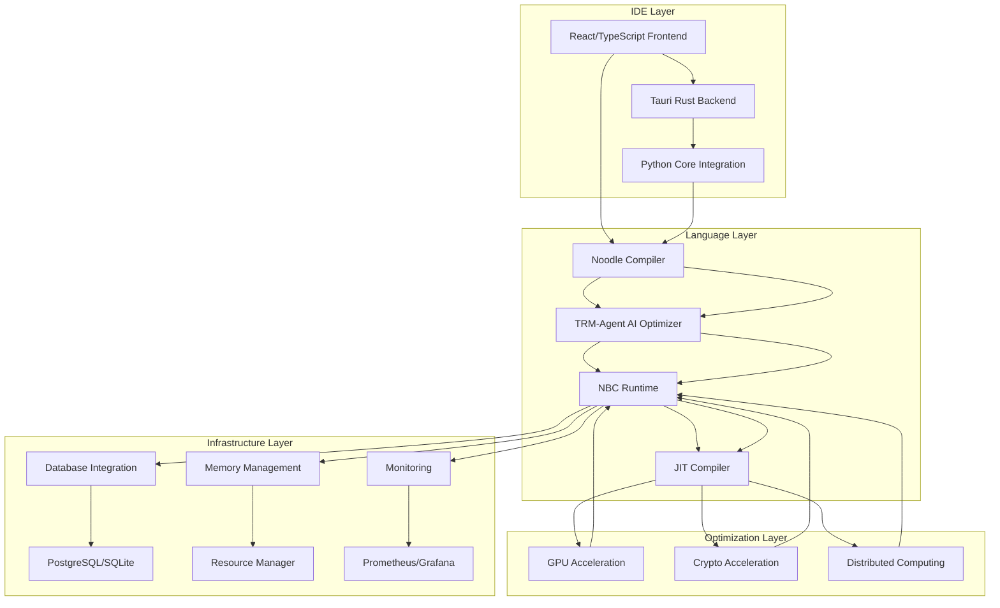

# Noodle Project - Technical Overview

## Project Overview

### Project Positioning
- **Project Name**: Noodle - Distributed AI Programming Language and Ecosystem
- **Project Type**: High-performance programming language and runtime system for distributed AI applications
- **Core Value**: Performance-optimized language with native support for matrix operations, GPU/parallelism, database integration, and security
- **Target Users**: AI developers, data scientists, distributed systems engineers, and high-performance computing professionals

### Technical Features
- **Architecture特点**: Modular mono-repo structure with clear separation of concerns
- **技术亮点**: 
  - AI-powered TRM-Agent for code optimization and translation
  - Distributed runtime with mesh-based networking
  - GPU acceleration and parallel processing capabilities
  - Database integration and mathematical object handling
  - Security-focused design with encryption support
- **创新点**: 
  - Tiny Recursive Model (TRM) based AI optimization agent
  - Self-learning compiler that improves from runtime feedback
  - Progressive quantization support (16-bit to 1-bit)
  - Hybrid mode combining AI and traditional compiler techniques
- **竞争优势**: 
  - Unique combination of high-performance language with AI-powered optimization
  - Comprehensive ecosystem including language, runtime, and IDE
  - Advanced distributed computing capabilities
  - Strong focus on performance and security

## Technology Stack Analysis

### Backend Technology Stack
| Technology Type | Technology Selection | Version | Purpose |
|----------------|---------------------|---------|---------|
| Programming Language | Python | 3.8+ | Main development language |
| Web Framework | aiohttp | 3.8.4+ | HTTP server and client |
| Math Library | numpy | 1.21.0+ | Matrix operations and numerical computing |
| Data Processing | pandas | 1.3.0+ | Data processing and analysis |
| AI/ML Framework | torch | 2.0.0+ | Deep learning and model training |
| Transformer Model | transformers | 4.20.0+ | Natural language processing |
| Compiler | Custom Compiler | - | Noodle language compiler |
| Runtime | NBC Runtime | - | Bytecode execution environment |
| System Integration | System Integration | - | Component coordination and management |

### Infrastructure Technology
| Technology Domain | Technology Selection | Function |
|------------------|---------------------|----------|
| Containerization | Docker | Application containerized deployment |
| Frontend Framework | React + TypeScript | IDE user interface |
| Desktop Application | Tauri | Cross-platform desktop IDE |
| Build Tools | Vite | Frontend build and development server |
| Code Quality | Black, flake8, mypy | Code formatting and static analysis |
| Testing Framework | pytest | Unit testing and integration testing |
| Documentation Generation | Sphinx | API documentation generation |
| Performance Monitoring | psutil, memory-profiler | System performance monitoring |

## Architecture Design

### System Architecture Diagram


### Layered Architecture
- **IDE Layer**: React/TypeScript frontend with Tauri backend providing user interface and development tools
- **Language Layer**: Noodle compiler with TRM-Agent AI optimizer and NBC runtime for language execution
- **Optimization Layer**: GPU acceleration, crypto acceleration, and distributed computing capabilities
- **Infrastructure Layer**: Database integration, memory management, and monitoring systems

## Development Standards

### Code Standards
- **Naming Conventions**: CamelCase naming, underscore separation, prefix standards
- **Code Style**: Black formatting, flake8 checking, mypy type checking
- **Error Handling**: Unified error codes, error messages, exception handling mechanisms
- **Logging Standards**: Structured logging, log levels, context information

### Engineering Practices
- **Testing Strategy**: Unit test coverage >80%, integration testing, E2E testing
- **Code Review**: Mandatory Code Review, automated checks, manual review
- **Version Management**: Git Flow, branch protection, tag management
- **Documentation Maintenance**: Code comments, API documentation, architecture documentation

## Project Features

### Technical Innovation
- **Architectural Innovation**:
  - TRM-Agent based AI-powered optimization system
  - Self-learning compiler that improves from runtime metrics
  - Modular architecture with clear separation of concerns
  - Distributed mesh-based networking for scalability
- **Performance Optimization**:
  - GPU acceleration for matrix operations
  - JIT compilation for dynamic optimization
  - Memory management with automatic resource cleanup
  - Progressive quantization for efficient deployment
- **Security Design**:
  - Built-in encryption support
  - Secure communication protocols
  - Input validation and sanitization
  - Access control and authentication
- **Scalability**:
  - Plugin architecture for IDE extensions
  - Modular runtime components
  - Distributed computing capabilities
  - Database integration flexibility

### Business Value
- **Efficiency Improvement**:
  - AI-powered code optimization reduces development time
  - Integrated IDE streamlines development workflow
  - Distributed computing enables processing of large datasets
  - GPU acceleration speeds up mathematical computations
- **Cost Optimization**:
  - Progressive quantization reduces memory footprint
  - Efficient resource management lowers operational costs
  - Self-learning system reduces maintenance overhead
  - Modular design allows for cost-effective scaling
- **User Experience**:
  - Intuitive IDE with AI-powered features
  - Real-time code optimization and feedback
  - Comprehensive debugging and profiling tools
  - Cross-platform compatibility
- **Technical Impact**:
  - Innovative combination of AI and compiler technology
  - Open-source contribution to developer tools ecosystem
  - Advancement in high-performance programming languages
  - Best practices for distributed AI systems

## Quick Start

### Environment Preparation
- **Development Environment**: Python 3.8+, Docker, Node.js 16+
- **Dependency Services**: PostgreSQL, Redis, PyTorch
- **Development Tools**: VSCode, Python plugin, Docker Desktop

### Build and Run
```bash
# Clone project
git clone https://github.com/noodlecore/noodle.git
cd noodle

# Install dependencies
pip install -r noodle-core/requirements.txt
cd noodle-ide && npm install

# Start Core system
python noodle-core/src/noodle/__init__.py

# Start IDE
cd noodle-ide && npm run tauri dev

# Or use startup scripts
scripts/start-noodle-ide.bat
```

## Contribution Guidelines

### Development Process
1. Fork the project repository
2. Create a feature branch
3. Make code changes and commit
4. Create Pull Request
5. Code review and merge

### Contact Information
- **Technical Communication**: Refer to shared/memory-bank/ for project updates
- **Issue Feedback**: Create issues in the project repository
- **Contribution Guidelines**: See shared/docs/overall/CONTRIBUTING.md