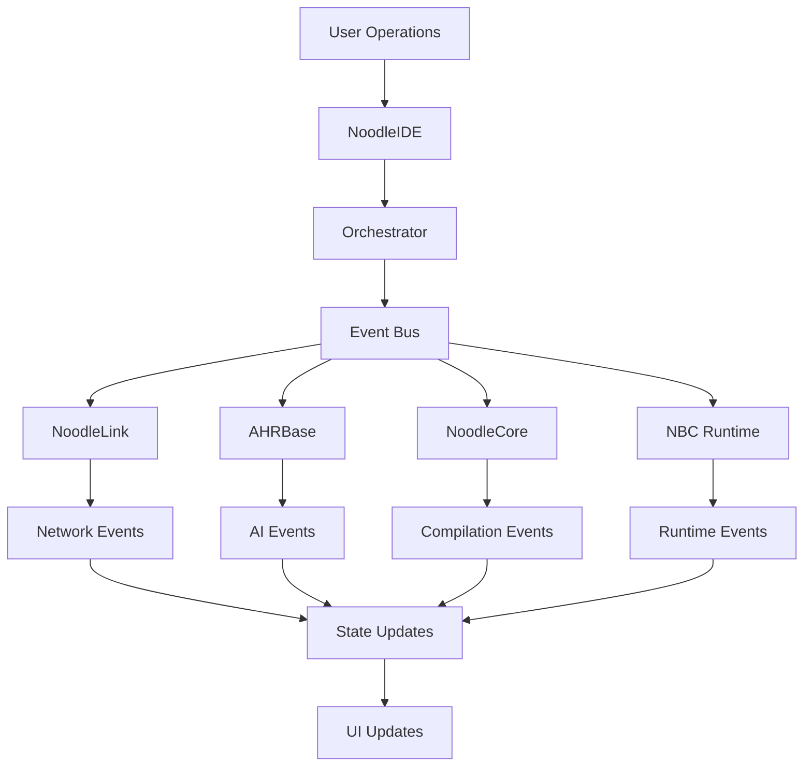
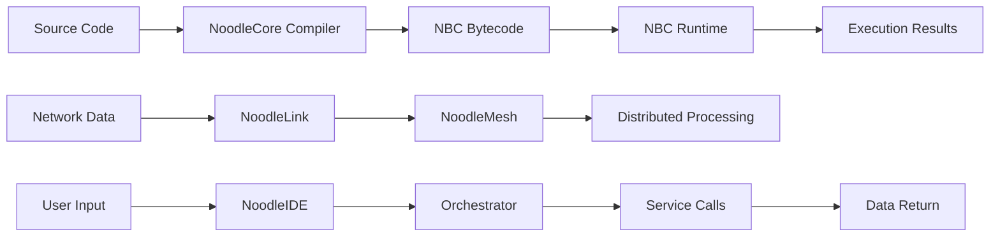
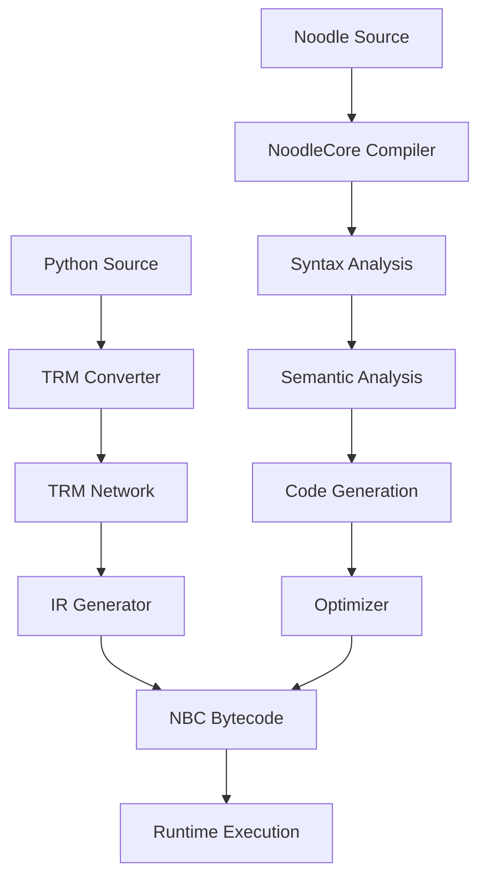
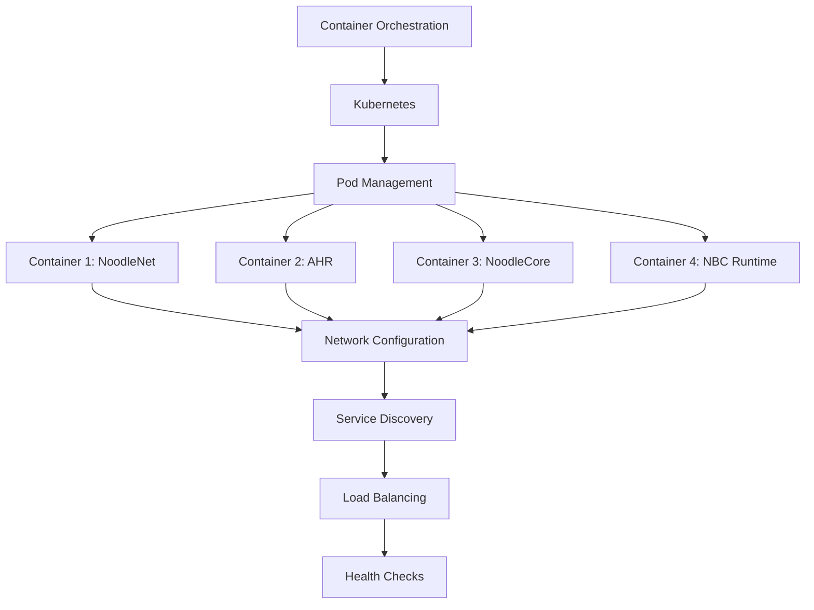
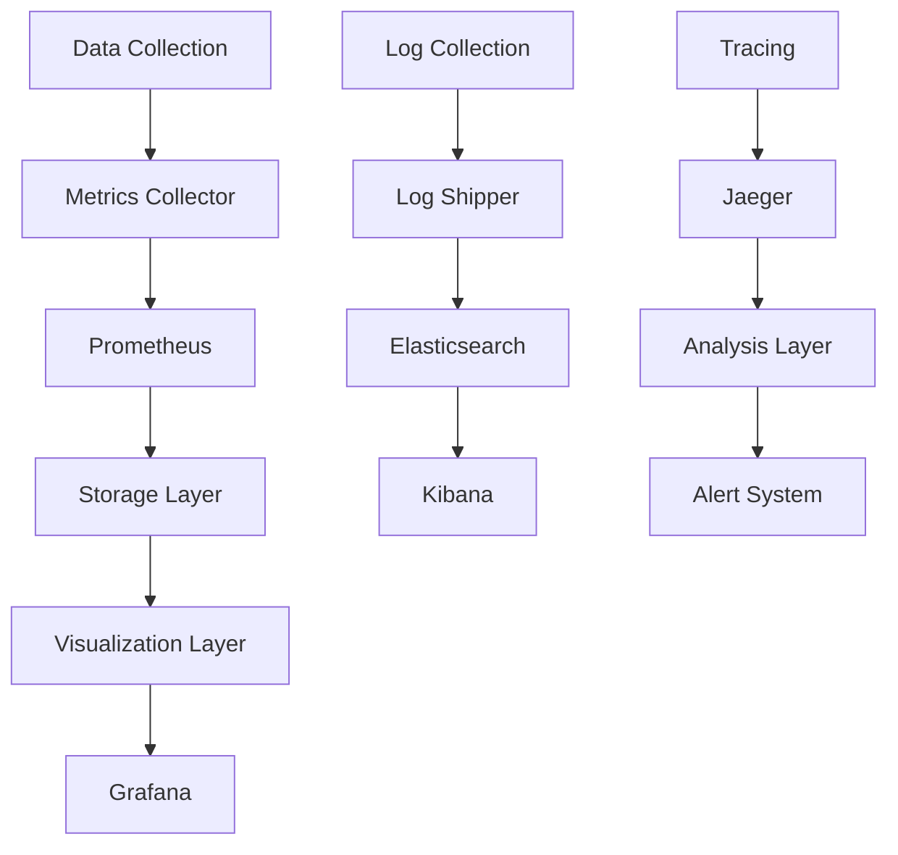

# 🏗️ Overall Architecture Analysis

## 📊 System Architecture Overview

### 🎯 Architecture Position
Noodle project adopts a **distributed AI programming language ecosystem** architecture, which is a highly modular mono-repo structure integrating compiler, runtime, network, IDE, and other core components.

### 📋 Architecture Features
- **Distributed Architecture**: Distributed computing framework based on mesh network
- **Modular Design**: Clear component separation and interface definitions
- **High Performance Optimization**: JIT compilation, GPU acceleration, progressive quantization
- **AI Native**: Programming language and runtime optimized for AI workloads
- **Cross-platform Support**: Tauri + React desktop IDE, multi-language FFI support

## 🏛️ System Architecture Patterns

### 1. Layered Architecture Pattern
```
┌─────────────────────────────────────────────────────────────┐
│                    Application Layer                         │
├─────────────────────────────────────────────────────────────┤
│                   IDE Layer                                │
│  ┌─────────────┐  ┌─────────────┐  ┌─────────────┐        │
│  │  NoodleIDE  │  │  NoodleNet  │  │  NoodleDev │        │
│  │  (Tauri+React)││  (Orchestrator)││  (Tools)   │        │
│  └─────────────┘  └─────────────┘  └─────────────┘        │
├─────────────────────────────────────────────────────────────┤
│                   Service Layer                            │
│  ┌─────────────┐  ┌─────────────┐  ┌─────────────┐        │
│  │   NoodleNet │  │     AHR     │  │  NoodleCore│        │
│  │  (Mesh/Link)││  (AI Agent) │  │ (Compiler)  │        │
│  └─────────────┘  └─────────────┘  └─────────────┘        │
├─────────────────────────────────────────────────────────────┤
│                   Runtime Layer                            │
│  ┌─────────────┐  ┌─────────────┐  ┌─────────────┐        │
│  │   NBC Runtime││  Matrix Runtime││  TRM Runtime│        │
│  │ (Bytecode VM)││ (GPU/ML)    ││ (AI Models) │        │
│  └─────────────┘  └─────────────┘  └─────────────┘        │
├─────────────────────────────────────────────────────────────┤
│                   Infrastructure Layer                      │
│  ┌─────────────┐  ┌─────────────┐  ┌─────────────┐        │
│  │   Database  │  │   Network   │  │   Storage   │        │
│  │ (PostgreSQL)││ (Mesh/UDP)  ││ (File/Cache)│        │
│  └─────────────┘  └─────────────┘  └─────────────┘        │
└─────────────────────────────────────────────────────────────┘
```

### 2. Microservices Architecture Pattern
NoodleNet adopts microservices architecture, with main services including:

| Service Name | Function Description | Technology Stack | Deployment Mode |
|-------------|---------------------|-----------------|-----------------|
| **NoodleLink** | Network communication layer | Python + asyncio | Distributed deployment |
| **NoodleDiscovery** | Service discovery | Python + multicast | Cluster deployment |
| **NoodleMesh** | Mesh topology management | Python + networkx | Distributed deployment |
| **AHRBase** | AI agent base | Python + ML | Containerized deployment |
| **NoodleCore** | Compiler core | Python + LLVM | Monolithic deployment |
| **NBC Runtime** | Bytecode runtime | Python + C extension | Monolithic deployment |

### 3. Event-Driven Architecture


## 🔗 Service Architecture Analysis

### Core Service Components

#### 1. NoodleNet Orchestrator
**Function**: System coordinator, managing lifecycle and interaction of all components
**Technical Features**:
- Asynchronous event-driven architecture
- Component state monitoring and management
- Performance metrics collection and analysis
- Automated decision optimization

**Key Methods**:
- `start()`: Start the entire ecosystem
- `stop()`: Stop all components
- `_monitoring_loop()`: System health monitoring
- `_optimization_loop()`: Performance optimization loop

#### 2. NoodleLink
**Function**: Network communication layer, responsible for message passing between nodes
**Technical Features**:
- UDP multicast communication
- Heartbeat detection mechanism
- Message queue management
- Connection pool management

#### 3. NoodleMesh
**Function**: Mesh topology management, building and maintaining distributed network
**Technical Features**:
- Self-organizing network topology
- Node quality assessment
- Route optimization
- Load balancing

#### 4. AHR (AI Agent)
**Function**: AI agent system, providing intelligent decision-making and optimization
**Technical Features**:
- Performance profiler
- Model compiler
- Decision optimizer
- Adaptive learning

#### 5. NoodleCore
**Function**: Compiler core, compiling Noodle language to bytecode
**Technical Features**:
- Lexical and syntactic analysis
- Semantic analysis
- Code generation
- Optimizer

#### 6. NBC Runtime
**Function**: Bytecode runtime, executing compiled Noodle programs
**Technical Features**:
- Virtual machine implementation
- Bytecode interpretation execution
- JIT compilation support
- FFI integration

## 📈 Data Architecture Analysis

### Data Flow Pattern


### Data Storage Architecture
| Storage Type | Purpose | Technology Stack | Access Mode |
|-------------|---------|-----------------|-------------|
| **PostgreSQL** | Structured data storage | psycopg2 | SQL queries |
| **DuckDB** | Analytical data processing | duckdb | SQL queries |
| **Redis** | Cache and session storage | redis-py | Key-value storage |
| **File System** | Code and model storage | Python os | File I/O |
| **Memory** | Runtime data | Python dict | Memory access |

### Data Consistency Strategy
- **Eventual Consistency**: Distributed systems adopt eventual consistency model
- **Transaction Support**: Database operations support ACID transactions
- **Cache Strategy**: Multi-level cache mechanism to improve access performance
- **Data Synchronization**: Asynchronous data synchronization to ensure data consistency

## ⚙️ Technical Architecture Analysis

### Compilation Architecture


### Runtime Architecture
**NBC Runtime Core Components**:
- **Virtual Machine**: Bytecode interpretation execution
- **JIT Compiler**: Dynamic compilation optimization
- **Memory Management**: Automatic memory allocation and garbage collection
- **FFI Integration**: Python and JavaScript interoperability

**Key Features**:
- Lazy loading mechanism, on-demand module import
- Asynchronous execution support
- Error handling and recovery mechanisms
- Performance monitoring and tuning

### Network Architecture
**Communication Protocols**:
- **UDP Multicast**: Service discovery and heartbeat detection
- **TCP**: Reliable data transmission
- **WebSocket**: Real-time bidirectional communication
- **gRPC**: High-performance RPC calls

**Network Topology**:
- **Mesh Network**: Self-organizing mesh topology
- **Hierarchical Structure**: Control plane and data plane separation
- **Load Balancing**: Intelligent request distribution
- **Failover**: Automatic fault detection and recovery

## 🚀 Deployment Architecture Analysis

### Deployment Modes
| Deployment Type | Use Case | Technology Stack | Features |
|----------------|----------|-----------------|----------|
| **Local Deployment** | Development and testing | Docker + docker-compose | Quick startup, easy debugging |
| **Cluster Deployment** | Production environment | Kubernetes + Helm | High availability, auto-scaling |
| **Edge Deployment** | Edge computing | Docker + systemd | Lightweight, low latency |
| **Cloud Deployment** | Cloud native | AWS/Azure/GCP | Elastic, scalable |

### Containerized Architecture


### Monitoring and Logging
**Monitoring Components**:
- **Prometheus**: Metrics collection and storage
- **Grafana**: Visualization display
- **Jaeger**: Distributed tracing
- **ELK Stack**: Log collection and analysis

**Key Metrics**:
- System performance metrics
- Service health status
- Resource usage
- Error rate and response time

## 🔒 Security Architecture Analysis

### Security Strategy
| Security Layer | Measures | Implementation |
|---------------|----------|----------------|
| **Network Security** | Encrypted communication | TLS/SSL, AES encryption |
| **Access Control** | Identity authentication | JWT, OAuth2.0 |
| **Permission Management** | Role control | RBAC model |
| **Data Security** | Data encryption | End-to-end encryption |
| **Application Security** | Code security | Static analysis, sandbox execution |

### Security Mechanisms
- **Service Authentication**: Certificate-based service-to-service authentication
- **Data Encryption**: Transmission and storage data encryption
- **Access Control**: Role-based access control
- **Security Audit**: Operation logs and anomaly detection
- **Vulnerability Protection**: Regular security scanning and fixing

## ⚡ Performance Architecture Analysis

### Performance Optimization Strategies
1. **Compile-time Optimization**
   - Static code analysis
   - Dead code elimination
   - Loop optimization
   - Function inlining

2. **Runtime Optimization**
   - JIT compilation
   - Caching mechanism
   - Parallel processing
   - Memory pool management

3. **Network Optimization**
   - Connection reuse
   - Compression transmission
   - Batch processing
   - Asynchronous I/O

### Performance Monitoring
**Monitoring Metrics**:
- CPU usage rate
- Memory consumption
- Network latency
- Throughput
- Error rate

**Tuning Tools**:
- Performance profiler
- Memory profiler
- Network profiler
- Code optimizer

## 📊 Monitoring Architecture Analysis

### Monitoring System Architecture


### Alert Mechanism
- **Threshold Alert**: Alert based on fixed thresholds
- **Trend Alert**: Alert based on trend changes
- **Anomaly Detection**: Machine learning-based anomaly detection
- **Failure Prediction**: Failure prediction based on historical data

## 🔄 Architecture Evolution Analysis

### Version Evolution Strategy
1. **Progressive Evolution**: Gradual component replacement and upgrade
2. **Backward Compatibility**: Maintain API compatibility
3. **Gray Release**: Gradual new feature release
4. **Rollback Mechanism**: Quick rollback to stable version

### Technology Evolution Roadmap
| Phase | Goal | Technology Stack | Timeline |
|-------|------|------------------|----------|
| **v1.0** | Basic functionality implementation | Python + Docker | 2024 Q1 |
| **v1.5** | Performance optimization | JIT + GPU | 2024 Q2 |
| **v2.0** | Distributed architecture | Kubernetes + Service Mesh | 2024 Q3 |
| **v2.5** | AI enhancement | ML + AutoML | 2024 Q4 |
| **v3.0** | Cloud native | Cloud Native | 2025 Q1 |

### Architecture Maturity Assessment
| Maturity Level | Characteristics | Status |
|---------------|-----------------|--------|
| **Initial Level** | Basic functionality implementation | ✅ Completed |
| **Repeatable Level** | Standardized processes | ✅ Completed |
| **Defined Level** | Architecture documentation | ✅ Completed |
| **Managed Level** | Quantitative management | 🔄 In Progress |
| **Optimization Level** | Continuous optimization | 📋 Planned |

## 🎯 Architecture Advantages and Challenges

### Architecture Advantages
1. **High Modularity**: Clear component responsibilities, easy maintenance and expansion
2. **Distributed Design**: Supports horizontal scaling, improves system availability
3. **Performance Optimization**: Multi-level optimization strategies ensure high-performance execution
4. **AI Native**: Deeply optimized for AI workloads
5. **Complete Ecosystem**: Complete toolchain from development to deployment

### Architecture Challenges
1. **Complexity Management**: High complexity of distributed systems
2. **Performance Tuning**: Multi-level optimization requires professional tuning
3. **Operation Cost**: High operation cost of distributed systems
4. **Technology Stack Diversity**: Multi-language technology stack increases maintenance difficulty
5. **Learning Curve**: New technology stack requires learning cost

## 📝 Summary

Noodle project adopts an advanced distributed AI programming language ecosystem architecture with the following core characteristics:

1. **Layered Architecture**: Clear layered design with clear separation of responsibilities
2. **Microservices Architecture**: Highly modular service components
3. **Event-Driven**: Asynchronous event-driven system interaction
4. **Performance Optimization**: Multi-level performance optimization strategies
5. **Security and Reliability**: Comprehensive security mechanisms and monitoring systems

This architecture provides a solid technical foundation for building high-performance, high-availability AI programming language ecosystems, supporting complete lifecycle management from development to deployment.

---

*Document Generation Time: 2025-10-13*
*Architecture Version: v1.0*
*Analysis Tool: AI Coding Agent*