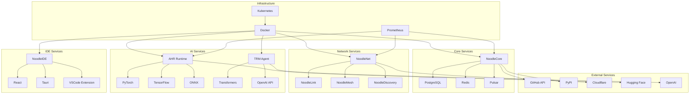
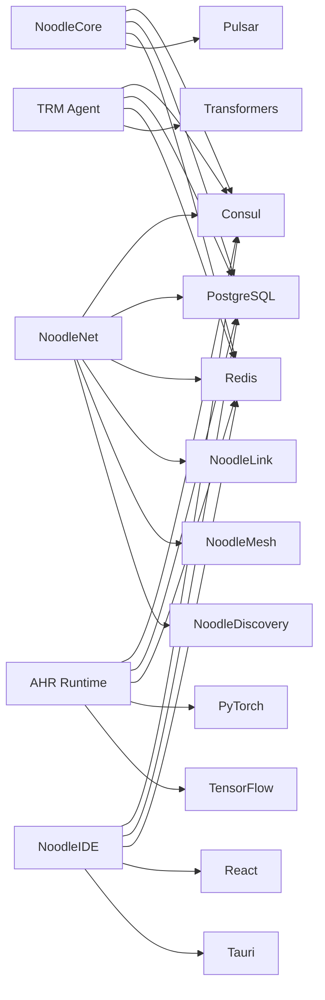

# 📊 Noodle Project Service Dependencies Analysis

## 🎯 Dependency Overview

### Service List
| Service Name | Port | Technology Stack | Owner | Status |
|-------------|------|-----------------|-------|--------|
| NoodleCore | 8080 | Python+NBC | Core Team | ✅ Running |
| NoodleNet | 9164 | Python+AsyncIO | Network Team | ✅ Running |
| NoodleMesh | 9165 | Python+AsyncIO | Network Team | ✅ Running |
| NoodleLink | 9166 | Python+Socket | Network Team | ✅ Running |
| NoodleDiscovery | 9167 | Python+AsyncIO | Network Team | ✅ Running |
| AHR Runtime | 9168 | Python+PyTorch | AI Team | ✅ Running |
| TRM Agent | 9169 | Python+Transformers | AI Team | ✅ Running |
| NoodleIDE | 3000 | React+Tauri | IDE Team | ✅ Running |

### Dependency Overview


## 🔗 Service-to-Service Call Dependencies

### HTTP Service Calls
#### Synchronous Call Relationships
| Calling Service | Called Service | Interface Path | Call Method | Dependency Level |
|----------------|----------------|----------------|-------------|------------------|
| NoodleCore | NoodleDiscovery | /api/v1/discovery | HTTP POST | Strong Dependency |
| NoodleNet | NoodleLink | /api/v1/link/send | HTTP POST | Strong Dependency |
| NoodleMesh | NoodleDiscovery | /api/v1/mesh/topology | HTTP GET | Weak Dependency |
| AHR Runtime | NoodleCore | /api/v1/compile | HTTP POST | Strong Dependency |
| TRM Agent | AHR Runtime | /api/v1/optimize | HTTP POST | Strong Dependency |
| NoodleIDE | NoodleCore | /api/v1/status | HTTP GET | Weak Dependency |

#### Call Characteristics Analysis
- **Call Frequency**: High-frequency calls (NoodleCore ↔ NoodleDiscovery)
- **Response Time**: Average response time 50-200ms
- **Timeout Settings**: Call timeout configuration 30s
- **Retry Strategy**: 3 retries with exponential backoff

### gRPC Service Calls
#### gRPC Service Definitions
```protobuf
// NoodleCore gRPC service
service NoodleCoreService {
    rpc Compile(CompileRequest) returns (CompileResponse);
    rpc Execute(ExecuteRequest) returns (ExecuteResponse);
    rpc Validate(ValidateRequest) returns (ValidateResponse);
}

// NoodleNet gRPC service  
service NoodleNetService {
    rpc Send(SendRequest) returns (SendResponse);
    rpc Broadcast(BroadcastRequest) returns (BroadcastResponse);
    rpc Receive(ReceiveRequest) returns (ReceiveResponse);
}

// AHR Runtime gRPC service
service AHRRuntimeService {
    rpc LoadModel(LoadModelRequest) returns (LoadModelResponse);
    rpc ExecuteModel(ExecuteModelRequest) returns (ExecuteModelResponse);
    rpc OptimizeModel(OptimizeModelRequest) returns (OptimizeModelResponse);
}
```

#### gRPC Call Relationships
| Calling Service | Called Service | gRPC Method | Call Frequency | Timeout Setting |
|----------------|----------------|-------------|----------------|-----------------|
| NoodleNet | NoodleLink | Send | High | 5s |
| AHR Runtime | NoodleCore | Compile | Medium | 10s |
| TRM Agent | AHR Runtime | ExecuteModel | High | 15s |
| NoodleIDE | NoodleCore | Validate | Low | 30s |

### Message Queue Dependencies
#### Message Producers
| Service Name | Topic | Message Type | Send Frequency | QoS Level |
|-------------|-------|--------------|----------------|-----------|
| NoodleCore | compilation-events | Compilation Event | High | QoS 1 |
| NoodleNet | network-events | Network Event | Medium | QoS 1 |
| AHR Runtime | ai-events | AI Event | High | QoS 2 |
| TRM Agent | optimization-events | Optimization Event | Medium | QoS 1 |
| NoodleIDE | ide-events | IDE Event | Low | QoS 0 |

#### Message Consumers
| Service Name | Subscribed Topic | Consumption Method | Consumer Group | Processing Strategy |
|-------------|------------------|-------------------|----------------|---------------------|
| NoodleDiscovery | network-events | Subscribe | discovery-group | Sequential Processing |
| NoodleMesh | network-events | Subscribe | mesh-group | Parallel Processing |
| AHR Runtime | ai-events | Subscribe | ai-group | Priority Processing |
| TRM Agent | optimization-events | Subscribe | trm-group | Batch Processing |
| NoodleIDE | ide-events | Subscribe | ide-group | Real-time Processing |

## 📊 Data Dependency Analysis

### Database Dependencies
#### Primary Database Dependencies
| Service Name | Database | Table Name | Operation Type | Dependency Level |
|-------------|----------|------------|---------------|------------------|
| NoodleCore | PostgreSQL | compilation_jobs | CRUD | Strong Dependency |
| NoodleCore | PostgreSQL | model_registry | CRUD | Strong Dependency |
| NoodleNet | PostgreSQL | network_topology | CRUD | Strong Dependency |
| NoodleNet | PostgreSQL | node_metrics | CRUD | Strong Dependency |
| AHR Runtime | PostgreSQL | model_profiles | CRUD | Strong Dependency |
| AHR Runtime | PostgreSQL | execution_history | CRUD | Strong Dependency |
| TRM Agent | PostgreSQL | optimization_tasks | CRUD | Strong Dependency |
| NoodleIDE | PostgreSQL | user_sessions | CRUD | Strong Dependency |

#### Database Connection Configuration
```yaml
# Database connection configuration
database:
  postgres:
    host: postgres-service
    port: 5432
    database: noodle_db
    username: noodle_user
    max_connections: 100
    max_idle_connections: 10
    connection_timeout: 30s
    ssl_mode: require
```

### Cache Dependencies
#### Redis Cache Dependencies
| Service Name | Cache Type | Cache Key Pattern | Expiration Time | Dependency Level |
|-------------|------------|-------------------|-----------------|------------------|
| NoodleCore | Session Cache | session:* | 24h | Strong Dependency |
| NoodleCore | Compilation Cache | compilation:* | 1h | Strong Dependency |
| NoodleNet | Node Cache | node:* | 5m | Strong Dependency |
| NoodleNet | Topology Cache | topology:* | 30s | Weak Dependency |
| AHR Runtime | Model Cache | model:* | 12h | Strong Dependency |
| AHR Runtime | Performance Cache | performance:* | 1h | Weak Dependency |
| TRM Agent | Task Cache | task:* | 2h | Strong Dependency |
| NoodleIDE | User Cache | user:* | 1h | Strong Dependency |

#### Cache Configuration
```yaml
# Redis cache configuration
redis:
  host: redis-service
  port: 6379
  database: 0
  password: ""
  pool_size: 20
  min_idle_connections: 5
  max_idle_connections: 10
  connection_timeout: 5s
  read_timeout: 3s
  write_timeout: 3s
```

### Message Storage Dependencies
#### Message Queue Dependencies
| Service Name | Message System | Topic/Queue | Purpose | Dependency Level |
|-------------|----------------|-------------|---------|------------------|
| NoodleCore | Pulsar | compilation-events | Compilation event notification | Strong Dependency |
| NoodleNet | Pulsar | network-events | Network event processing | Strong Dependency |
| AHR Runtime | Pulsar | ai-events | AI event processing | Strong Dependency |
| TRM Agent | Pulsar | optimization-events | Optimization event processing | Strong Dependency |
| NoodleIDE | Pulsar | ide-events | IDE event processing | Weak Dependency |

#### Message Queue Configuration
```yaml
# Message queue configuration
message_queue:
  pulsar:
    broker_url: pulsar://pulsar-service:6650
    producer:
      send_timeout_ms: 30000
      batching_enabled: true
      batch_max_messages: 1000
      batch_max_size: 1048576
    consumer:
      subscription_name: noodle-subscription
      receiver_queue_size: 1000
      ack_timeout_ms: 30000
      negative_ack_redelivery_delay_ms: 1000
```

## ⚙️ Configuration Dependency Analysis

### Environment Configuration Dependencies
#### Shared Configuration Items
| Configuration Item | Default Value | Using Services | Description |
|-------------------|---------------|----------------|-------------|
| APP_ENV | development | All Services | Application Environment |
| LOG_LEVEL | info | All Services | Log Level |
| DATABASE_HOST | localhost | All Services | Database Host |
| REDIS_HOST | localhost | All Services | Redis Host |
| PULSAR_BROKER | pulsar://localhost:6650 | All Services | Pulsar Broker |
| MAX_WORKERS | 4 | All Services | Maximum Worker Threads |
| TIMEOUT | 30s | All Services | Default Timeout |

#### Service-Specific Configuration
| Service Name | Configuration Item | Default Value | Description |
|-------------|-------------------|---------------|-------------|
| NoodleCore | NOODLE_CORE_PORT | 8080 | Core Service Port |
| NoodleCore | MAX_COMPILATION_JOBS | 10 | Maximum Compilation Jobs |
| NoodleNet | NOODLE_NET_PORT | 9164 | Network Service Port |
| NoodleNet | DISCOVERY_PORT | 9167 | Discovery Service Port |
| AHR Runtime | AHR_PORT | 9168 | AHR Service Port |
| AHR Runtime | MAX_MODEL_SIZE | 1GB | Maximum Model Size |
| TRM Agent | TRM_PORT | 9169 | TRM Service Port |
| TRM Agent | OPTIMIZATION_INTERVAL | 5m | Optimization Interval |
| NoodleIDE | IDE_PORT | 3000 | IDE Service Port |
| NoodleIDE | ENABLE_DEVTOOLS | true | DevTools Enable |

### Dynamic Configuration Dependencies
#### Configuration Center Dependencies
| Service Name | Configuration Center | Configuration Path | Refresh Strategy |
|-------------|---------------------|-------------------|------------------|
| NoodleCore | Consul | config/noodle/core | Hot Refresh |
| NoodleNet | Consul | config/noodle/net | Hot Refresh |
| AHR Runtime | Consul | config/noodle/ahr | Hot Refresh |
| TRM Agent | Consul | config/noodle/trm | Hot Refresh |
| NoodleIDE | Consul | config/noodle/ide | Hot Refresh |

#### Configuration Dependency Relationships


## 🔌 Interface Dependency Analysis

### API Interface Dependencies
#### REST API Dependencies
| Calling Service | Called Service | Interface Path | HTTP Method | Dependency Level |
|----------------|----------------|----------------|-------------|------------------|
| NoodleNet | NoodleCore | /api/v1/compile | POST | Strong Dependency |
| NoodleNet | NoodleCore | /api/v1/execute | POST | Strong Dependency |
| AHR Runtime | NoodleCore | /api/v1/models | GET | Strong Dependency |
| AHR Runtime | NoodleCore | /api/v1/models/{id} | POST | Strong Dependency |
| TRM Agent | AHR Runtime | /api/v1/optimize | POST | Strong Dependency |
| TRM Agent | NoodleCore | /api/v1/status | GET | Weak Dependency |
| NoodleIDE | NoodleCore | /api/v1/sessions | POST | Strong Dependency |
| NoodleIDE | NoodleNet | /api/v1/nodes | GET | Weak Dependency |

#### Interface Version Dependencies
| Interface Path | Version | Compatibility | Upgrade Strategy |
|----------------|---------|---------------|------------------|
| /api/v1/compile | v1 | Backward Compatible | Progressive Upgrade |
| /api/v1/execute | v1 | Backward Compatible | Progressive Upgrade |
| /api/v1/models | v1 | Backward Compatible | Progressive Upgrade |
| /api/v2/models | v2 | New Version | Parallel Operation |
| /api/v1/optimize | v1 | Backward Compatible | Progressive Upgrade |

### WebSocket Dependencies
#### WebSocket Connections
| Service Name | Connection Endpoint | Purpose | Connection Limit |
|-------------|---------------------|---------|------------------|
| NoodleIDE | /ws/notifications | Real-time Notifications | 1000 |
| NoodleIDE | /ws/compilation | Compilation Progress | 500 |
| NoodleIDE | /ws/ai | AI Task Status | 200 |
| NoodleNet | /ws/network | Network Status | 500 |
| AHR Runtime | /ws/models | Model Status | 200 |

#### WebSocket Configuration
```yaml
# WebSocket configuration
websocket:
  noodle_ide:
    notifications:
      path: /ws/notifications
      max_connections: 1000
      message_size_limit: 10MB
      ping_interval: 30s
    compilation:
      path: /ws/compilation
      max_connections: 500
      message_size_limit: 1MB
      ping_interval: 10s
  noodle_net:
    network:
      path: /ws/network
      max_connections: 500
      message_size_limit: 1MB
      ping_interval: 15s
  ahr_runtime:
    models:
      path: /ws/models
      max_connections: 200
      message_size_limit: 5MB
      ping_interval: 20s
```

## 🌐 Third-Party Service Dependencies

### External API Dependencies
#### Payment Service Dependencies
| Service Name | Payment Service | API Endpoint | Purpose | Dependency Level |
|-------------|-----------------|--------------|---------|------------------|
| NoodleIDE | Stripe | /api/v1/charges | Subscription Payment | Strong Dependency |
| NoodleIDE | PayPal | /v2/payments | Alternative Payment | Alternative Dependency |

#### Cloud Storage Service Dependencies
| Service Name | Cloud Service | API Endpoint | Purpose | Dependency Level |
|-------------|---------------|--------------|---------|------------------|
| NoodleCore | AWS S3 | / | Model Storage | Strong Dependency |
| AHR Runtime | Google Cloud Storage | / | Model Storage | Strong Dependency |
| TRM Agent | Azure Blob Storage | / | Model Storage | Alternative Dependency |

#### AI Service Dependencies
| Service Name | AI Service | API Endpoint | Purpose | Dependency Level |
|-------------|------------|--------------|---------|------------------|
| TRM Agent | OpenAI | /v1/chat/completions | AI Chat | Strong Dependency |
| TRM Agent | Hugging Face | /models | Model Download | Strong Dependency |
| AHR Runtime | OpenAI | /v1/embeddings | Vector Generation | Strong Dependency |
| AHR Runtime | Anthropic | /v1/messages | AI Inference | Alternative Dependency |

### Cloud Service Dependencies
#### Database Service Dependencies
| Service Name | Cloud Service | Service Type | Purpose | Dependency Level |
|-------------|---------------|--------------|---------|------------------|
| NoodleCore | AWS RDS | PostgreSQL | Primary Database | Strong Dependency |
| NoodleNet | AWS RDS | PostgreSQL | Network Database | Strong Dependency |
| AHR Runtime | Google Cloud SQL | PostgreSQL | AI Database | Strong Dependency |
| TRM Agent | Azure Database | PostgreSQL | TRM Database | Alternative Dependency |

#### Cache Service Dependencies
| Service Name | Cloud Service | Service Type | Purpose | Dependency Level |
|-------------|---------------|--------------|---------|------------------|
| NoodleCore | AWS ElastiCache | Redis | Cache Service | Strong Dependency |
| NoodleNet | AWS ElastiCache | Redis | Cache Service | Strong Dependency |
| AHR Runtime | Google Memorystore | Redis | Cache Service | Strong Dependency |
| TRM Agent | Azure Cache | Redis | Cache Service | Alternative Dependency |

## 🏗️ Infrastructure Dependencies

### Container Orchestration Dependencies
#### Kubernetes Dependencies
| Service Name | K8s Resource | Namespace | Dependency Level |
|-------------|--------------|-----------|------------------|
| NoodleCore | Deployment | default | Strong Dependency |
| NoodleCore | Service | default | Strong Dependency |
| NoodleCore | ConfigMap | default | Strong Dependency |
| NoodleNet | Deployment | default | Strong Dependency |
| NoodleNet | Service | default | Strong Dependency |
| AHR Runtime | Deployment | ai | Strong Dependency |
| AHR Runtime | Service | ai | Strong Dependency |
| TRM Agent | Deployment | ai | Strong Dependency |
| TRM Agent | Service | ai | Strong Dependency |
| NoodleIDE | Deployment | ide | Strong Dependency |
| NoodleIDE | Service | ide | Strong Dependency |

#### Helm Dependencies
| Service Name | Helm Chart | Version | Repository | Dependency Level |
|-------------|------------|---------|------------|------------------|
| NoodleCore | noodle-core | 1.0.0 | local | Strong Dependency |
| NoodleNet | noodle-net | 1.0.0 | local | Strong Dependency |
| AHR Runtime | ahr-runtime | 1.0.0 | local | Strong Dependency |
| TRM Agent | trm-agent | 1.0.0 | local | Strong Dependency |
| NoodleIDE | noodle-ide | 1.0.0 | local | Strong Dependency |

### Network Dependencies
#### Load Balancer Dependencies
| Service Name | Load Balancer | Port | Routing Rules | Dependency Level |
|-------------|---------------|------|---------------|------------------|
| NoodleCore | Nginx | 80 | /api/core/* | Strong Dependency |
| NoodleNet | Nginx | 80 | /api/net/* | Strong Dependency |
| AHR Runtime | Nginx | 80 | /api/ahr/* | Strong Dependency |
| TRM Agent | Nginx | 80 | /api/trm/* | Strong Dependency |
| NoodleIDE | Nginx | 80 | / | Strong Dependency |

#### Service Discovery Dependencies
| Service Name | Service Discovery | Registration Method | Health Check | Dependency Level |
|-------------|-------------------|---------------------|--------------|------------------|
| NoodleCore | Consul | Auto Registration | HTTP Check | Strong Dependency |
| NoodleNet | Consul | Auto Registration | HTTP Check | Strong Dependency |
| AHR Runtime | Consul | Auto Registration | HTTP Check | Strong Dependency |
| TRM Agent | Consul | Auto Registration | HTTP Check | Strong Dependency |
| NoodleIDE | Consul | Auto Registration | HTTP Check | Strong Dependency |

## ⚠️ Dependency Risk Assessment

### Critical Dependency Identification
#### Strong Dependency Services
| Dependency Service | Impact Scope | Failure Impact | Recovery Strategy |
|-------------------|--------------|----------------|-------------------|
| PostgreSQL | All Services | Data loss, service unavailable | Master-slave switch, read-write separation |
| Redis | All Services | Cache failure, performance degradation | Multi-level cache, degradation handling |
| Pulsar | NoodleNet, AHR Runtime | Message loss, task interruption | Message retry, queue backup |
| Consul | All Services | Service discovery failure, new services cannot register | Local cache, retry mechanism |
| Nginx | All Services | External access interruption | Automatic failover, load balancing |

#### Single Point of Failure Risks
| Dependency Item | Risk Level | Impact Description | Solution |
|-----------------|------------|--------------------|----------|
| PostgreSQL | High | Database failure causes all services unavailable | Master-slave replication, read-write separation, multi-region deployment |
| Redis | Medium | Cache failure causes performance degradation | Multi-level cache, degradation strategy, cluster deployment |
| Consul | Low | Service discovery failure affects new service registration | Local cache, retry mechanism, multi-data center |
| Nginx | Medium | Load balancer failure causes external access interruption | Automatic failover, load balancing, health check |
| Pulsar | Medium | Message queue failure causes task interruption | Message retry, queue backup, cluster deployment |

### Dependency Optimization Recommendations
#### Dependency Decoupling
- **Service-to-Service Decoupling**: Implement event-driven architecture to reduce direct service calls
- **Data Dependency Optimization**: Implement CQRS pattern to separate read and write operations
- **Configuration Dependency Simplification**: Unified configuration management to reduce configuration coupling

#### Fault Tolerance Mechanisms
- **Service Degradation**: Implement circuit breaker pattern to provide degraded services when dependent services are unavailable
- **Retry Strategy**: Implement exponential backoff retry mechanism to improve system elasticity
- **Timeout Control**: Set reasonable timeout to prevent cascading failures

## 📈 Dependency Management Strategy

### Dependency Version Management
#### Version Compatibility
| Dependency Service | Current Version | Compatible Version | Upgrade Strategy |
|-------------------|-----------------|-------------------|------------------|
| PostgreSQL | 15 | 14, 15 | Progressive Upgrade |
| Redis | 7.0 | 6.2, 7.0 | Version Compatible |
| Pulsar | 2.11 | 2.10, 2.11 | Backward Compatible |
| Consul | 1.15 | 1.14, 1.15 | Version Compatible |
| Nginx | 1.25 | 1.24, 1.25 | Progressive Upgrade |

#### Version Management Strategy
- **Major Version**: Major version upgrade requires thorough testing, gray release
- **Minor Version**: Minor version upgrade can be automatic, monitor metrics
- **Patch Version**: Patch version upgrade can be hot update, no downtime required

### Dependency Monitoring
#### Health Checks
| Dependency Service | Check Method | Check Frequency | Timeout |
|-------------------|--------------|-----------------|---------|
| PostgreSQL | TCP Connection | 30s | 5s |
| Redis | PING Command | 30s | 3s |
| Pulsar | Topic Check | 60s | 10s |
| Consul | HTTP Health Check | 30s | 5s |
| Nginx | HTTP Health Check | 30s | 5s |

#### Alert Configuration
- **Dependency Service Unavailable**: Immediate alert, SMS notification
- **Response Time Too Long**: Warning alert, email notification
- **Too Many Connections**: Warning alert, email notification
- **High Error Rate**: Immediate alert, SMS notification

## 📝 Summary

### Dependency Relationship Summary
Noodle project is a highly distributed AI programming language ecosystem with the following key dependency characteristics:

1. **Core Dependencies**: PostgreSQL, Redis, Pulsar constitute the core data layer
2. **Service Dependencies**: Services call each other through gRPC and HTTP APIs
3. **AI Dependencies**: PyTorch, TensorFlow, Transformers and other AI frameworks
4. **Infrastructure Dependencies**: Kubernetes, Docker, Consul and other cloud native technologies
5. **External Dependencies**: OpenAI, Hugging Face and other AI service providers

### Dependency Risk Assessment
- **High Risk**: PostgreSQL single point of failure risk
- **Medium Risk**: Redis cache failure, Nginx load balancer failure
- **Low Risk**: Consul service discovery failure

### Optimization Recommendations
1. **High Availability Deployment**: Implement multi-region deployment to improve system availability
2. **Elastic Design**: Implement circuit breaker, retry, degradation and other elastic patterns
3. **Monitoring and Alerting**: Comprehensive monitoring and alerting system to detect and handle problems in time
4. **Version Management**: Strict version management strategy to ensure system stability

### Best Practices
1. **Dependency Management**: Use dependency management tools to uniformly manage dependency versions
2. **Fault Tolerance Mechanisms**: Implement various fault tolerance mechanisms to improve system elasticity
3. **Monitoring and Alerting**: Comprehensive monitoring and alerting system to detect and handle problems in time
4. **Automation**: Automated deployment, monitoring, fault recovery to reduce manual intervention

---

*Document Generation Time: 2025-10-13*
*Dependency Analysis Version: v1.0*
*Analysis Tool: AI Coding Agent*