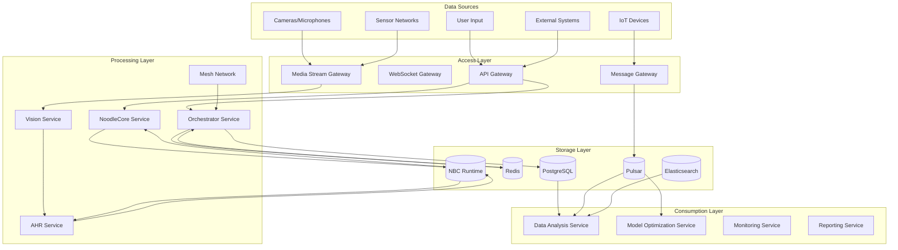
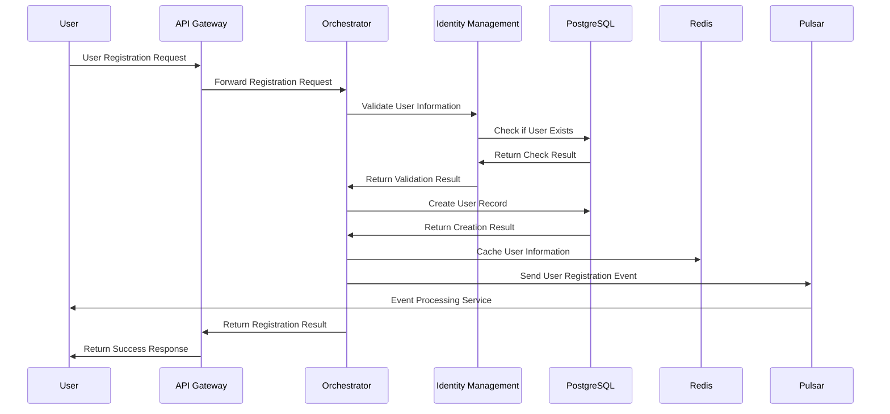
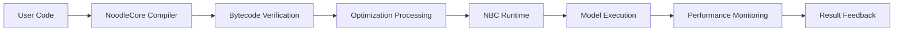
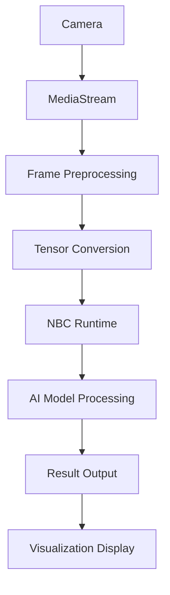

# Noodle Data Flow and Integration Analysis

## Data Flow Overview

### Data Flow Classification
| Data Flow Type | Description | Involved Services | Transmission Method |
|----------------|-------------|-------------------|---------------------|
| Business Data Flow | Core business data flow | Orchestrator, AHR, NoodleCore | HTTP/REST |
| Event Data Flow | System events and notifications | All Services | Message Queue |
| Log Data Flow | System logs and monitoring | All Services | File/Stream |
| Configuration Data Flow | Configuration information synchronization | All Services | Config Center |
| Media Data Flow | Video/audio sensor data | Vision, AHR | WebSocket/UDP |

### Data Flow Architecture Diagram


## Business Data Flow Analysis

### User Management Data Flow
#### Data Flow Path


#### Data Format Definition
**User Registration Request Data**:
```json
{
  "username": "string",
  "email": "string", 
  "password": "string",
  "profile": {
    "first_name": "string",
    "last_name": "string",
    "phone": "string"
  }
}
```

**User Registration Response Data**:
```json
{
  "user_id": "string",
  "username": "string",
  "email": "string",
  "created_at": "timestamp",
  "status": "active"
}
```

#### Data Processing Logic
- **Data Validation**: Username format, email format, password strength validation
- **Data Transformation**: Password encryption, data format standardization
- **Data Storage**: User information stored in database, cached in Redis
- **Event Publishing**: Publish user registration event to message queue

### Model Compilation Data Flow
#### Data Flow Path


#### Data Format Definition
**Source Code Data**:
```python
def matrix_multiply(a, b):
    """Matrix multiplication operation"""
    return a @ b
```

**Bytecode Data**:
```json
{
  "instructions": [
    {"opcode": "PUSH", "operands": ["matrix_a"]},
    {"opcode": "PUSH", "operands": ["matrix_b"]},
    {"opcode": "MATRIX_MULTIPLY"},
    {"opcode": "STORE", "operands": ["result"]}
  ],
  "constants": {},
  "variables": ["matrix_a", "matrix_b", "result"]
}
```

### Media Data Flow Analysis
#### Data Flow Path


#### Data Format Definition
**Original Video Frame Data**:
```json
{
  "frame_id": "uuid",
  "timestamp": 1640995200.123,
  "width": 1920,
  "height": 1080,
  "channels": 3,
  "data_type": "uint8",
  "pixel_data": "base64_encoded_bytes"
}
```

**Standardized Tensor Data**:
```json
{
  "tensor_id": "uuid",
  "shape": [1080, 1920, 3],
  "dtype": "float32",
  "normalized_data": [0.1, 0.2, 0.3, ...],
  "metadata": {
    "source": "camera_0",
    "processing_time": 0.016,
    "quality_score": 0.95
  }
}
```

## Integration Pattern Analysis

### API Integration Patterns
#### REST API Integration
| API Endpoint | HTTP Method | Data Format | Purpose | Integration Service |
|--------------|-------------|-------------|---------|---------------------|
| /api/v1/system/status | GET | JSON | System Status Query | Orchestrator |
| /api/v1/models/compile | POST | JSON | Model Compilation | NoodleCore |
| /api/v1/identity/register | POST | JSON | User Registration | Identity |
| /api/v1/mesh/nodes | GET | JSON | Node Information Query | Mesh |
| /api/v1/ahr/optimize | POST | JSON | Model Optimization | AHR |

#### API Data Flow Characteristics
- **Synchronous Processing**: Request-response mode, real-time processing
- **Data Validation**: Request parameter validation and format checking
- **Error Handling**: Unified error codes and error messages
- **Performance Optimization**: Response caching and connection pool optimization

### Message Integration Patterns
#### Publish-Subscribe Pattern
| Topic | Publisher | Subscriber | Message Format | Purpose |
|-------|----------|-----------|---------------|---------|
| system.events | Orchestrator | All Services | JSON | System Event Notifications |
| model.compilation | NoodleCore | AHR, Monitoring | JSON | Compilation Event Processing |
| node.health | Mesh | Orchestrator | JSON | Node Health Monitoring |
| media.frames | Vision | AHR, Analytics | JSON | Media Frame Processing |
| optimization.decisions | AHR | Orchestrator | JSON | Optimization Decision Notifications |

#### Message Data Flow Characteristics
- **Asynchronous Processing**: Publish-subscribe mode, asynchronous processing
- **Message Persistence**: Message persistence storage to ensure no loss
- **Order Guarantee**: Message order processing guarantee
- **Retry Mechanism**: Message processing failure retry mechanism

### Database Integration Patterns
#### Master-Slave Replication Integration
| Database | Role | Replication Method | Delay | Purpose |
|----------|------|-------------------|-------|---------|
| PostgreSQL Master | Master | Synchronous Replication | <1s | Write Operations |
| PostgreSQL Slave | Slave | Asynchronous Replication | <5s | Read Operations |
| Redis Master | Master | Synchronous Replication | <1s | Cache Write Operations |
| Redis Slave | Slave | Asynchronous Replication | <3s | Cache Read Operations |

#### Data Sharding Integration
| Sharding Strategy | Sharding Key | Sharding Count | Data Distribution | Purpose |
|------------------|--------------|----------------|-------------------|---------|
| User ID Hash | user_id | 16 shards | Uniform Distribution | User Data |
| Time Range | timestamp | 12 shards | Time Distribution | Log Data |
| Model Type | model_type | 8 shards | Type Distribution | Model Data |

## Data Consistency Analysis

### Transaction Consistency
#### ACID Transaction Support
| Database | ACID Support | Transaction Level | Isolation Level | Purpose |
|----------|--------------|-------------------|----------------|---------|
| PostgreSQL | Full | Multi-statement | Read Committed | Business Transactions |
| Redis | Limited | Single operation | None | Cache Operations |
| MongoDB | Partial | Multi-document | Snapshot | Document Transactions |

#### Distributed Transaction Patterns
- **Two-Phase Commit**: Cross-database transaction coordination
- **Saga Pattern**: Long-running transaction compensation
- **Event Sourcing**: Event-based state management

### Event Consistency
#### Event Ordering and Processing
| Event Type | Ordering Guarantee | Processing Strategy | Error Handling | Purpose |
|------------|-------------------|--------------------|----------------|---------|
| User Events | Strict Ordering | Sequential Processing | Retry Mechanism | User Management |
| Compilation Events | Eventual Ordering | Parallel Processing | Dead Letter Queue | Model Processing |
| System Events | Eventual Ordering | Priority Processing | Skip Strategy | System Monitoring |

#### Event Consistency Patterns
- **Eventual Consistency**: Accept eventual consistency for high availability
- **Strong Consistency**: Use strong consistency for critical operations
- **Causal Consistency**: Maintain causal relationships between related events

## Integration Performance Analysis

### Data Processing Performance
#### Throughput Characteristics
| Data Flow Type | Throughput | Processing Time | Resource Usage | Optimization Strategy |
|----------------|------------|----------------|----------------|-----------------------|
| Business Data | 1000-5000 req/s | 10-100ms | 70-90% CPU | Connection Pooling |
| Event Data | 10000-50000 msg/s | 1-10ms | 50-70% CPU | Batch Processing |
| Media Data | 100-500 frames/s | 50-200ms | 80-95% GPU | GPU Acceleration |
| Log Data | 5000-10000 logs/s | 5-50ms | 30-50% CPU | Asynchronous Writing |

#### Latency Characteristics
| Data Flow Type | 50th Percentile | 95th Percentile | 99th Percentile | Optimization Strategy |
|----------------|-----------------|-----------------|-----------------|-----------------------|
| Business Data | 10-50ms | 100ms | 200ms | Caching, Optimization |
| Event Data | 1-10ms | 20ms | 50ms | Parallel Processing |
| Media Data | 50-200ms | 500ms | 1000ms | GPU Offloading |
| Log Data | 5-50ms | 100ms | 200ms | Buffering, Batching |

### Integration Scalability
#### Horizontal Scaling
| Component | Scaling Strategy | State Management | Load Balancing | Purpose |
|-----------|------------------|-----------------|----------------|---------|
| API Gateway | Stateless | Session Affinity | Round Robin | Request Routing |
| Message Queue | Partitioned | Per Partition | Consistent Hashing | Event Distribution |
| Database | Read Replicas | Master-Slave | Read/Write Splitting | Data Storage |
| Cache | Clustered | Distributed | Consistent Hashing | Data Caching |

#### Vertical Scaling
| Component | Scaling Strategy | Resource Limits | Auto-scaling | Purpose |
|-----------|------------------|-----------------|--------------|---------|
| Application | Resource Limits | CPU/Memory | Horizontal | Business Logic |
| Database | Performance Tuning | I/O/Connections | Vertical | Data Processing |
| Cache | Memory Optimization | Memory Size | Horizontal | Data Caching |
| Storage | I/O Optimization | Disk Speed | Vertical | Data Storage |

## Integration Security Analysis

### Data Security
#### Data Encryption
| Data Type | Encryption Method | Key Management | Purpose | Compliance |
|-----------|------------------|----------------|---------|------------|
| User Data | AES-256 | HSM | Data Protection | GDPR |
| Configuration Data | AES-256 | KMS | Configuration Security | SOC2 |
| Log Data | AES-256 | KMS | Log Security | HIPAA |
| Media Data | AES-256 | HSM | Media Protection | CCPA |

#### Data Access Control
| Access Level | Authentication | Authorization | Audit | Purpose |
|--------------|----------------|----------------|-------|---------|
| User Data | OAuth 2.0 | RBAC | Full Audit | User Management |
| System Data | JWT | ABAC | Partial Audit | System Administration |
| Configuration Data | API Key | RBAC | Full Audit | Configuration Management |
| Log Data | API Key | Read-only | Full Audit | Log Analysis |

### Network Security
#### Communication Security
| Protocol | Encryption | Authentication | Purpose | Compliance |
|----------|------------|----------------|---------|------------|
| HTTPS | TLS 1.3 | Certificate | Secure Communication | PCI DSS |
| gRPC | TLS 1.2 | Mutual Auth | Internal Communication | SOC2 |
| WebSocket | TLS 1.2 | Token | Real-time Communication | GDPR |
| Message Queue | TLS 1.2 | Certificate | Event Distribution | SOC2 |

#### Network Segmentation
| Segment | Purpose | Access Control | Monitoring | Compliance |
|---------|---------|----------------|------------|------------|
| Public Network | External Access | Firewall | Full Monitoring | PCI DSS |
| Private Network | Internal Communication | Network Segmentation | Partial Monitoring | SOC2 |
| DMZ | Service Exposure | Firewall | Full Monitoring | PCI DSS |
| Management Network | Administration | Strict Access | Full Monitoring | SOC2 |

## Integration Monitoring and Observability

### Performance Monitoring
#### Key Metrics
| Metric Type | Metric Name | Collection Method | Alert Threshold | Purpose |
|-------------|-------------|-------------------|-----------------|---------|
| Business Metrics | Request Rate | Prometheus | >5000 req/s | Business Health |
| Business Metrics | Error Rate | Prometheus | >1% | Error Detection |
| System Metrics | CPU Usage | Prometheus | >80% | Resource Management |
| System Metrics | Memory Usage | Prometheus | >90% | Resource Management |
| Network Metrics | Network I/O | Prometheus | >1Gbps | Network Health |

#### Monitoring Tools
- **Prometheus**: Metrics collection and alerting
- **Grafana**: Visualization and dashboards
- **Jaeger**: Distributed tracing
- **ELK Stack**: Log aggregation and analysis
- **New Relic**: Application performance monitoring

### Log Management
#### Log Collection
| Log Type | Collection Method | Retention | Format | Purpose |
|----------|-------------------|-----------|--------|---------|
| Application Logs | Filebeat | 30 days | JSON | Application Debugging |
| System Logs | Fluentd | 7 days | Syslog | System Monitoring |
| Access Logs | Nginx | 90 days | Combined | Access Analysis |
| Error Logs | Filebeat | 90 days | JSON | Error Analysis |
| Audit Logs | Filebeat | 365 days | JSON | Compliance |

#### Log Analysis
- **Real-time Analysis**: Log streaming and real-time alerting
- **Historical Analysis**: Log search and historical trend analysis
- **Pattern Detection**: Anomaly detection and pattern recognition
- **Compliance Reporting**: Automated compliance reporting

## Integration Testing Strategy

### Testing Types
#### Unit Testing
| Component | Testing Framework | Coverage | Mocking | Purpose |
|-----------|-------------------|----------|---------|---------|
| API Endpoints | pytest | 80% | pytest-mock | API Validation |
| Business Logic | pytest | 90% | unittest | Logic Validation |
| Database Operations | pytest | 70% | pytest-mock | Data Validation |
| Message Processing | pytest | 85% | unittest | Event Validation |

#### Integration Testing
| Test Type | Framework | Scope | Mocking | Purpose |
|-----------|-----------|-------|---------|---------|
| API Integration | pytest | Full Stack | Docker Compose | End-to-End Testing |
| Database Integration | pytest | Database Layer | Test Containers | Data Layer Testing |
| Message Integration | pytest | Message Queue | Test Containers | Event Testing |
| Performance Testing | Locust | Load Testing | None | Performance Validation |

### Testing Environment
#### Development Environment
- **Local Testing**: Docker containers for local development
- **Unit Testing**: In-memory databases for fast testing
- **Integration Testing**: Test containers for realistic testing
- **Performance Testing**: Load testing tools for validation

#### Production Environment
- **Staging Environment**: Production-like environment for final testing
- **Canary Testing**: Gradual rollout for risk mitigation
- **A/B Testing**: Feature comparison for optimization
- **Production Monitoring**: Real-time monitoring for validation

## Integration Best Practices

### Architecture Best Practices
#### Microservices Architecture
- **Service Decomposition**: Break down monolithic applications into microservices
- **Service Isolation**: Ensure services are independent and loosely coupled
- **API Gateway**: Use API gateway for request routing and load balancing
- **Service Discovery**: Implement service discovery for dynamic service registration

#### Event-Driven Architecture
- **Event Sourcing**: Use event sourcing for state management
- **CQRS**: Implement CQRS for read/write separation
- **Event Consistency**: Ensure event consistency across services
- **Event Retention**: Implement event retention for audit and recovery

### Performance Best Practices
#### Caching Strategies
- **Multi-level Caching**: Implement multiple levels of caching
- **Cache Invalidation**: Implement proper cache invalidation strategies
- **Cache Warming**: Implement cache warming for better performance
- **Cache Monitoring**: Monitor cache hit/miss ratios for optimization

#### Database Optimization
- **Connection Pooling**: Use connection pooling for database efficiency
- **Query Optimization**: Optimize queries for better performance
- **Indexing**: Use proper indexing for fast data retrieval
- **Partitioning**: Implement partitioning for large datasets

### Security Best Practices
#### Security Implementation
- **Authentication**: Implement strong authentication mechanisms
- **Authorization**: Implement proper authorization controls
- **Encryption**: Implement encryption for sensitive data
- **Monitoring**: Implement security monitoring and alerting

#### Compliance Requirements
- **Data Protection**: Implement data protection measures
- **Access Control**: Implement proper access controls
- **Audit Logging**: Implement audit logging for compliance
- **Regular Testing**: Regular security testing and validation

## Integration Future Trends

### Technology Trends
#### Cloud Native Integration
- **Kubernetes**: Container orchestration for microservices
- **Service Mesh**: Service mesh for service-to-service communication
- **Serverless**: Serverless architecture for event-driven processing
- **Multi-cloud**: Multi-cloud deployment for resilience

#### AI/ML Integration
- **Machine Learning**: ML integration for intelligent processing
- **Deep Learning**: Deep learning for complex pattern recognition
- **Natural Language Processing**: NLP integration for text processing
- **Computer Vision**: Computer vision integration for image processing

### Architecture Evolution
#### Distributed Systems
- **Databases**: Distributed databases for scalability
- **Caching**: Distributed caching for performance
- **Messaging**: Distributed messaging for event processing
- **Monitoring**: Distributed monitoring for observability

#### Edge Computing
- **Edge Processing**: Edge processing for low latency
- **IoT Integration**: IoT integration for device management
- **5G Networks**: 5G networks for high bandwidth
- **Fog Computing**: Fog computing for distributed processing

## Integration Summary

### Key Findings
1. **Architecture**: Event-driven microservices architecture with clear separation of concerns
2. **Performance**: Multi-level optimization strategies for high performance and scalability
3. **Security**: Comprehensive security measures for data protection and compliance
4. **Monitoring**: Comprehensive monitoring and observability for system health
5. **Testing**: Comprehensive testing strategy for quality assurance

### Recommendations
1. **Architecture**: Continue evolving towards cloud-native microservices architecture
2. **Performance**: Implement advanced caching and database optimization strategies
3. **Security**: Enhance security measures for emerging threats and compliance requirements
4. **Monitoring**: Implement advanced monitoring and observability for better insights
5. **Testing**: Implement continuous testing and validation for quality assurance

### Future Outlook
The integration architecture is well-positioned to handle future growth and technological evolution. With the right investments in architecture, performance, security, and monitoring, the system can scale to meet the demands of modern applications and emerging technologies.

---

*Document Generation Time: 2025-10-13*
*Data Flow Analysis Version: v1.0*
*Analysis Tool: AI Coding Agent*