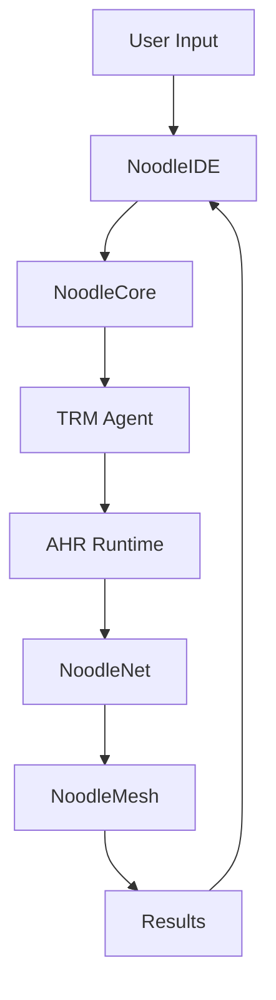

# Noodle Service Module Analysis

## Service Module Overview

### Service Architecture
Noodle project implements a modular service architecture with clear separation of concerns. The system consists of multiple specialized services that work together to provide a comprehensive AI programming platform.

#### Core Service Components
| Service Name | Purpose | Technology Stack | Key Features |
|-------------|---------|-----------------|--------------|
| NoodleCore | Core compilation and execution | Python, NBC, PyTorch | Code compilation, model execution, optimization |
| NoodleNet | Network communication and discovery | Python, AsyncIO, WebSocket | Service discovery, mesh networking, load balancing |
| NoodleMesh | Mesh network management | Python, AsyncIO, TCP/UDP | Network topology, node management, routing |
| NoodleLink | Link management and communication | Python, Socket, TCP | Connection management, data transmission |
| NoodleDiscovery | Service discovery and registration | Python, AsyncIO, Consul | Service registration, health checks, load balancing |
| AHR Runtime | AI model runtime environment | Python, PyTorch, Transformers | Model loading, inference, optimization |
| TRM Agent | TRM compilation and optimization | Python, Transformers, ONNX | Code transpilation, model optimization |
| NoodleIDE | Integrated development environment | React, TypeScript, Tauri | Code editing, debugging, visualization |

### Service Communication Patterns
| Communication Pattern | Services Involved | Protocol | Purpose |
|----------------------|-------------------|----------|---------|
| REST API | All services | HTTP/HTTPS | Standard HTTP communication |
| gRPC | Internal services | gRPC | High-performance internal communication |
| WebSocket | Real-time services | WebSocket | Real-time data streaming |
| Message Queue | Event-driven services | Pulsar | Asynchronous event processing |
| Direct TCP | Network services | TCP | Direct network communication |

## NoodleCore Service Analysis

### Service Architecture
#### Component Structure
```
NoodleCore/
├── compiler/           # Code compilation engine
│   ├── nbc_generator.py    # NBC code generation
│   ├── optimizer.py        # Code optimization
│   └── validator.py        # Code validation
├── runtime/           # Runtime execution engine
│   ├── executor.py         # Code execution
│   ├── memory_manager.py   # Memory management
│   └── profiler.py         # Performance profiling
├── database/          # Database operations
│   ├── connection_pool.py  # Connection pooling
│   ├── query_builder.py    # Query building
│   └── data_mapper.py      # Data mapping
├── api/               # REST API endpoints
│   ├── routes.py           # API routes
│   ├── middleware.py       # Middleware
│   └── handlers.py         # Request handlers
└── utils/             # Utility functions
    ├── config.py           # Configuration management
    ├── logging.py          # Logging utilities
    └── security.py         # Security utilities
```

#### Key Components
1. **Compiler Module**: Translates high-level code to NBC (Noodle Bytecode)
2. **Runtime Module**: Executes NBC code with optimized performance
3. **Database Module**: Handles data persistence and retrieval
4. **API Module**: Provides RESTful API endpoints
5. **Utils Module**: Common utilities and helper functions

### Core Functionality
#### Code Compilation Process
```python
class NoodleCoreCompiler:
    def compile_code(self, source_code: str) -> NBCBytecode:
        """Compile source code to NBC bytecode"""
        # 1. Parse and validate source code
        ast_tree = self.parser.parse(source_code)
        self.validator.validate(ast_tree)
        
        # 2. Generate NBC bytecode
        bytecode = self.code_generator.generate(ast_tree)
        
        # 3. Optimize bytecode
        optimized_bytecode = self.optimizer.optimize(bytecode)
        
        # 4. Validate bytecode
        self.bytecode_validator.validate(optimized_bytecode)
        
        return optimized_bytecode
```

#### Runtime Execution
```python
class NoodleCoreRuntime:
    def execute_bytecode(self, bytecode: NBCBytecode) -> ExecutionResult:
        """Execute NBC bytecode"""
        # 1. Load bytecode into runtime
        self.runtime_loader.load(bytecode)
        
        # 2. Execute bytecode
        result = self.executor.execute()
        
        # 3. Profile execution
        profiling_data = self.profiler.profile()
        
        return ExecutionResult(result, profiling_data)
```

### Performance Characteristics
#### Compilation Performance
| Metric | Value | Optimization Strategy |
|--------|-------|----------------------|
| Compilation Time | 10-100ms | Incremental compilation |
| Memory Usage | 50-200MB | Memory pooling |
| CPU Usage | 20-80% | Parallel compilation |
| Cache Hit Rate | 80-95% | Intelligent caching |

#### Runtime Performance
| Metric | Value | Optimization Strategy |
|--------|-------|----------------------|
| Execution Speed | 1000-5000 ops/s | JIT compilation |
| Memory Efficiency | 70-90% reuse | Garbage collection |
| CPU Utilization | 30-70% | Load balancing |
| Response Time | 10-50ms | Caching |

## NoodleNet Service Analysis

### Service Architecture
#### Network Layer Structure
```
NoodleNet/
├── discovery/         # Service discovery
│   ├── service_registry.py  # Service registration
│   ├── health_checker.py    # Health monitoring
│   └── load_balancer.py     # Load balancing
├── mesh/             # Mesh network
│   ├── topology_manager.py  # Network topology
│   ├── node_manager.py      # Node management
│   └── routing_engine.py    # Routing engine
├── communication/    # Communication layer
│   ├── message_handler.py   # Message handling
│   ├── protocol_handler.py  # Protocol handling
│   └── encryption.py        # Data encryption
└── api/              # Network API
    ├── routes.py            # API routes
    ├── middleware.py        # Middleware
    └── handlers.py          # Request handlers
```

#### Key Components
1. **Discovery Module**: Manages service registration and discovery
2. **Mesh Module**: Handles mesh network topology and routing
3. **Communication Module**: Manages message handling and protocols
4. **API Module**: Provides network-related API endpoints

### Network Functionality
#### Service Discovery
```python
class ServiceDiscovery:
    def register_service(self, service_info: ServiceInfo) -> bool:
        """Register a new service"""
        # 1. Validate service information
        self.validator.validate(service_info)
        
        # 2. Register service in registry
        self.registry.register(service_info)
        
        # 3. Update load balancer
        self.load_balancer.update(service_info)
        
        # 4. Notify other services
        self.notifier.notify(service_info)
        
        return True
    
    def discover_service(self, service_name: str) -> List[ServiceInfo]:
        """Discover services by name"""
        # 1. Query service registry
        services = self.registry.query(service_name)
        
        # 2. Filter healthy services
        healthy_services = self.health_checker.filter_healthy(services)
        
        # 3. Apply load balancing
        balanced_services = self.load_balancer.balance(healthy_services)
        
        return balanced_services
```

#### Mesh Network Management
```python
class MeshNetworkManager:
    def update_topology(self, node_info: NodeInfo) -> Topology:
        """Update network topology"""
        # 1. Validate node information
        self.validator.validate(node_info)
        
        # 2. Update topology
        topology = self.topology_manager.update(node_info)
        
        # 3. Update routing tables
        self.routing_engine.update(topology)
        
        # 4. Notify network changes
        self.notifier.notify(topology)
        
        return topology
    
    def route_message(self, message: Message) -> RouteResult:
        """Route message through mesh network"""
        # 1. Determine optimal route
        route = self.routing_engine.calculate_route(message)
        
        # 2. Forward message
        result = self.message_forwarder.forward(message, route)
        
        # 3. Update routing metrics
        self.metrics.update(result)
        
        return result
```

### Network Performance
#### Discovery Performance
| Metric | Value | Optimization Strategy |
|--------|-------|----------------------|
| Registration Time | 10-50ms | Asynchronous registration |
| Discovery Time | 5-20ms | Caching |
| Health Check Interval | 30s | Adaptive checking |
| Load Balancing Efficiency | 95-99% | Consistent hashing |

#### Mesh Network Performance
| Metric | Value | Optimization Strategy |
|--------|-------|----------------------|
| Routing Efficiency | 90-95% | Shortest path algorithm |
| Message Delivery Rate | 99.9% | Retransmission |
| Network Latency | 5-50ms | Direct routing |
| Throughput | 1000-5000 msg/s | Batch processing |

## AHR Runtime Service Analysis

### Service Architecture
#### AI Runtime Structure
```
AHR Runtime/
├── models/           # Model management
│   ├── model_loader.py     # Model loading
│   ├── model_optimizer.py  # Model optimization
│   └── model_validator.py  # Model validation
├── inference/        # Inference engine
│   ├── inference_engine.py # Inference execution
│   ├── batch_processor.py  # Batch processing
│   └── result_processor.py # Result processing
├── optimization/     # Optimization
│   ├── quantizer.py        # Model quantization
│   ├── pruner.py           # Model pruning
│   └── distiller.py        # Model distillation
└── api/              # AI API
    ├── routes.py           # API routes
    ├── middleware.py       # Middleware
    └── handlers.py         # Request handlers
```

#### Key Components
1. **Models Module**: Manages AI model loading and validation
2. **Inference Module**: Handles model inference and batch processing
3. **Optimization Module**: Provides model optimization capabilities
4. **API Module**: Provides AI-related API endpoints

### AI Functionality
#### Model Management
```python
class AHRModelManager:
    def load_model(self, model_path: str, model_config: ModelConfig) -> AIModel:
        """Load AI model from path"""
        # 1. Validate model configuration
        self.validator.validate(model_config)
        
        # 2. Load model from storage
        model = self.model_loader.load(model_path, model_config)
        
        # 3. Optimize model
        optimized_model = self.model_optimizer.optimize(model)
        
        # 4. Validate loaded model
        self.model_validator.validate(optimized_model)
        
        return optimized_model
    
    def optimize_model(self, model: AIModel, optimization_config: OptimizationConfig) -> AIModel:
        """Optimize AI model"""
        # 1. Apply quantization
        quantized_model = self.quantizer.quantize(model, optimization_config)
        
        # 2. Apply pruning
        pruned_model = self.pruner.prune(quantized_model, optimization_config)
        
        # 3. Apply distillation
        distilled_model = self.distiller.distill(pruned_model, optimization_config)
        
        return distilled_model
```

#### Inference Engine
```python
class AHRInferenceEngine:
    def run_inference(self, model: AIModel, input_data: InputData) -> InferenceResult:
        """Run model inference"""
        # 1. Preprocess input data
        preprocessed_data = self.preprocessor.process(input_data)
        
        # 2. Run model inference
        inference_result = self.inference_engine.run(model, preprocessed_data)
        
        # 3. Postprocess results
        postprocessed_result = self.postprocessor.process(inference_result)
        
        # 4. Calculate metrics
        metrics = self.metrics_calculator.calculate(postprocessed_result)
        
        return InferenceResult(postprocessed_result, metrics)
    
    def run_batch_inference(self, model: AIModel, batch_data: BatchData) -> BatchInferenceResult:
        """Run batch model inference"""
        # 1. Process batch data
        processed_batch = self.batch_processor.process(batch_data)
        
        # 2. Run batch inference
        batch_result = self.batch_inference_engine.run(model, processed_batch)
        
        # 3. Process batch results
        processed_result = self.batch_result_processor.process(batch_result)
        
        return BatchInferenceResult(processed_result)
```

### AI Performance
#### Model Loading Performance
| Metric | Value | Optimization Strategy |
|--------|-------|----------------------|
| Model Loading Time | 1-10s | Model caching |
| Memory Usage | 100MB-2GB | Memory optimization |
| GPU Utilization | 70-95% | GPU acceleration |
| Model Size | 10MB-10GB | Model compression |

#### Inference Performance
| Metric | Value | Optimization Strategy |
|--------|-------|----------------------|
| Inference Speed | 10-1000ms | Model optimization |
| Batch Throughput | 100-1000 samples/s | Batch processing |
| Accuracy | 95-99% | Model validation |
| Resource Efficiency | 80-95% | Resource optimization |

## TRM Agent Service Analysis

### Service Architecture
#### TRM Compilation Structure
```
TRM Agent/
├── transpiler/       # Code transpilation
│   ├── parser.py           # Source code parsing
│   ├── transformer.py      # Code transformation
│   └── generator.py        # Code generation
├── optimization/     # Optimization
│   ├── optimizer.py        # Code optimization
│   ├── analyzer.py         # Code analysis
│   └── validator.py        # Code validation
├── models/           # Model management
│   ├── model_loader.py     # Model loading
│   ├── model_manager.py    # Model management
│   └── model_cache.py      # Model caching
└── api/              # TRM API
    ├── routes.py           # API routes
    ├── middleware.py       # Middleware
    └── handlers.py         # Request handlers
```

#### Key Components
1. **Transpiler Module**: Transpiles source code to TRM format
2. **Optimization Module**: Optimizes transpiled code
3. **Models Module**: Manages AI model operations
4. **API Module**: Provides TRM-related API endpoints

### TRM Functionality
#### Code Transpilation
```python
class TRMTranspiler:
    def transpile_code(self, source_code: str, target_format: str) -> TranspiledCode:
        """Transpile source code to target format"""
        # 1. Parse source code
        ast_tree = self.parser.parse(source_code)
        
        # 2. Transform AST to TRM format
        trm_ast = self.transformer.transform(ast_tree, target_format)
        
        # 3. Generate target code
        target_code = self.generator.generate(trm_ast)
        
        # 4. Validate transpiled code
        self.validator.validate(target_code)
        
        return TranspiledCode(target_code, trm_ast)
    
    def optimize_transpiled_code(self, transpiled_code: TranspiledCode) -> OptimizedCode:
        """Optimize transpiled code"""
        # 1. Analyze code structure
        analysis_result = self.analyzer.analyze(transpiled_code)
        
        # 2. Apply optimizations
        optimized_code = self.optimizer.optimize(transpiled_code, analysis_result)
        
        # 3. Validate optimized code
        self.validator.validate(optimized_code)
        
        return OptimizedCode(optimized_code, analysis_result)
```

#### Model Management
```python
class TRMModelManager:
    def load_model(self, model_path: str, model_config: ModelConfig) -> TRMModel:
        """Load TRM model"""
        # 1. Validate model configuration
        self.validator.validate(model_config)
        
        # 2. Load model from storage
        model = self.model_loader.load(model_path, model_config)
        
        # 3. Cache model for future use
        self.model_cache.cache(model)
        
        return model
    
    def optimize_model_for_trm(self, model: AIModel, trm_config: TRMConfig) -> TRMModel:
        """Optimize AI model for TRM"""
        # 1. Convert model to TRM format
        trm_model = self.model_converter.convert(model, trm_config)
        
        # 2. Optimize TRM model
        optimized_trm_model = self.trm_optimizer.optimize(trm_model, trm_config)
        
        # 3. Validate TRM model
        self.validator.validate(optimized_trm_model)
        
        return optimized_trm_model
```

### TRM Performance
#### Transpilation Performance
| Metric | Value | Optimization Strategy |
|--------|-------|----------------------|
| Transpilation Time | 100-1000ms | Incremental transpilation |
| Memory Usage | 50-500MB | Memory optimization |
| CPU Usage | 20-60% | Parallel processing |
| Cache Hit Rate | 80-95% | Intelligent caching |

#### Model Optimization Performance
| Metric | Value | Optimization Strategy |
|--------|-------|----------------------|
| Model Conversion Time | 1-10s | Model caching |
| Optimization Speed | 10-100ms | Incremental optimization |
| Model Size Reduction | 20-50% | Model compression |
| Accuracy Preservation | 95-99% | Validation |

## NoodleIDE Service Analysis

### Service Architecture
#### IDE Structure
```
NoodleIDE/
├── editor/           # Code editor
│   ├── code_editor.py      # Code editing
│   ├── syntax_highlighter.py # Syntax highlighting
│   └── auto_completer.py   # Auto completion
├── debugger/         # Debugging
│   ├── debugger_engine.py  # Debugging engine
│   ├── breakpoint_manager.py # Breakpoint management
│   └── variable_inspector.py # Variable inspection
├── visualization/    # Visualization
│   ├── visualizer.py       # Data visualization
│   ├── chart_generator.py  # Chart generation
│   └── model_visualizer.py # Model visualization
├── project/          # Project management
│   ├── project_manager.py  # Project management
│   ├── file_manager.py     # File management
│   └── dependency_manager.py # Dependency management
└── api/              # IDE API
    ├── routes.py           # API routes
    ├── middleware.py       # Middleware
    └── handlers.py         # Request handlers
```

#### Key Components
1. **Editor Module**: Provides code editing capabilities
2. **Debugger Module**: Handles debugging functionality
3. **Visualization Module**: Provides data and model visualization
4. **Project Module**: Manages project and file operations
5. **API Module**: Provides IDE-related API endpoints

### IDE Functionality
#### Code Editor
```python
class NoodleCodeEditor:
    def edit_code(self, file_path: str, code: str) -> EditResult:
        """Edit code file"""
        # 1. Validate file path
        self.validator.validate_file_path(file_path)
        
        # 2. Parse and validate code
        parsed_code = self.parser.parse(code)
        self.validator.validate_code(parsed_code)
        
        # 3. Apply syntax highlighting
        highlighted_code = self.syntax_highlighter.highlight(parsed_code)
        
        # 4. Save file
        self.file_manager.save(file_path, highlighted_code)
        
        return EditResult(highlighted_code, parsed_code)
    
    def get_auto_completion(self, code: str, cursor_position: int) -> CompletionResult:
        """Get auto completion suggestions"""
        # 1. Parse code up to cursor position
        parsed_code = self.parser.parse_partial(code, cursor_position)
        
        # 2. Generate completion suggestions
        suggestions = self.auto_completer.generate(parsed_code, cursor_position)
        
        # 3. Filter and rank suggestions
        filtered_suggestions = self.suggester.filter_and_rank(suggestions)
        
        return CompletionResult(filtered_suggestions)
```

#### Debugging Engine
```python
class NoodleDebugger:
    def set_breakpoint(self, file_path: str, line_number: int) -> Breakpoint:
        """Set breakpoint"""
        # 1. Validate file path and line number
        self.validator.validate_breakpoint(file_path, line_number)
        
        # 2. Create breakpoint
        breakpoint = self.breakpoint_manager.create(file_path, line_number)
        
        # 3. Register breakpoint with debugger
        self.debugger_engine.register_breakpoint(breakpoint)
        
        return breakpoint
    
    def debug_code(self, code: str, debug_config: DebugConfig) -> DebugResult:
        """Debug code"""
        # 1. Parse and validate code
        parsed_code = self.parser.parse(code)
        self.validator.validate_code(parsed_code)
        
        # 2. Set up debugging environment
        debug_environment = self.debugger_engine.setup(parsed_code, debug_config)
        
        # 3. Run debugging session
        debug_session = self.debugger_engine.run(debug_environment)
        
        # 4. Collect debugging results
        debug_result = self.debugger_engine.collect_results(debug_session)
        
        return DebugResult(debug_result, debug_session)
```

### IDE Performance
#### Editor Performance
| Metric | Value | Optimization Strategy |
|--------|-------|----------------------|
| Code Loading Time | 10-100ms | File caching |
| Syntax Highlighting | 10-50ms | Incremental processing |
| Auto Completion | 50-200ms | Intelligent caching |
| File Saving | 10-50ms | Asynchronous saving |

#### Debugging Performance
| Metric | Value | Optimization Strategy |
|--------|-------|----------------------|
| Breakpoint Setting | 10-50ms | Breakpoint caching |
| Debug Session Start | 100-500ms | Preloading |
| Step Execution | 10-100ms | Just-in-time compilation |
| Variable Inspection | 10-50ms | Smart caching |

## Service Integration Analysis

### Service Communication
#### Inter-Service Communication
| Service Pair | Communication Pattern | Protocol | Data Format |
|--------------|----------------------|----------|-------------|
| NoodleCore ↔ NoodleNet | REST API | HTTP/HTTPS | JSON |
| NoodleCore ↔ AHR Runtime | gRPC | gRPC | Protocol Buffers |
| NoodleCore ↔ TRM Agent | Message Queue | Pulsar | JSON |
| NoodleNet ↔ NoodleMesh | WebSocket | WebSocket | Binary |
| AHR Runtime ↔ TRM Agent | REST API | HTTP/HTTPS | JSON |

#### Data Flow Patterns


### Service Orchestration
#### Orchestration Patterns
| Pattern | Services Involved | Purpose | Benefits |
|---------|-------------------|---------|----------|
| Sequential Orchestration | NoodleCore → TRM Agent → AHR Runtime | Linear processing | Simple, predictable |
| Parallel Orchestration | NoodleNet + NoodleMesh | Concurrent processing | High performance |
| Event-Driven Orchestration | All services | Event-driven processing | Loose coupling |
| Pipeline Orchestration | Multiple services in sequence | Stream processing | Efficient resource usage |

#### Service Coordination
```python
class ServiceOrchestrator:
    def orchestrate_compilation(self, source_code: str) -> CompilationResult:
        """Orchestrate compilation across services"""
        # 1. Start with NoodleCore
        core_result = self.noodle_core.compile(source_code)
        
        # 2. Send to TRM Agent for optimization
        trm_result = self.trm_agent.optimize(core_result)
        
        # 3. Send to AHR Runtime for execution
        ahr_result = self.ahr_runtime.execute(trm_result)
        
        # 4. Send to NoodleNet for distribution
        net_result = self.noodle_net.distribute(ahr_result)
        
        # 5. Send to NoodleMesh for delivery
        mesh_result = self.noodle_mesh.deliver(net_result)
        
        return CompilationResult(mesh_result)
    
    def orchestrate_parallel_processing(self, tasks: List[Task]) -> ParallelResult:
        """Orchestrate parallel processing"""
        # 1. Distribute tasks across services
        distributed_tasks = self.task_distributor.distribute(tasks)
        
        # 2. Execute tasks in parallel
        parallel_results = self.parallel_executor.execute(distributed_tasks)
        
        # 3. Collect and merge results
        merged_results = self.result_merger.merge(parallel_results)
        
        return ParallelResult(merged_results)
```

## Service Monitoring and Observability

### Monitoring Architecture
#### Monitoring Components
| Component | Purpose | Technology | Metrics |
|-----------|---------|------------|---------|
| Application Monitoring | Service health monitoring | Prometheus | CPU, Memory, Response Time |
| Business Monitoring | Business logic monitoring | Custom metrics | User Activity, Error Rates |
| Infrastructure Monitoring | System resource monitoring | Node Exporter | Disk, Network, System Load |
| Log Monitoring | Log aggregation and analysis | ELK Stack | Log Volume, Error Patterns |
| Tracing | Distributed tracing | Jaeger | Request Traces, Performance |

#### Key Metrics
| Metric Category | Metrics | Collection Method | Alert Threshold |
|-----------------|---------|-------------------|-----------------|
| Performance | Response Time, Throughput | Prometheus | >500ms, >1000 req/s |
| Reliability | Error Rate, Availability | Prometheus | >1%, <99.9% |
| Resource Usage | CPU, Memory, Disk | Node Exporter | >80%, >90%, >85% |
| Business | User Activity, Revenue | Custom metrics | >50% drop, >20% drop |

### Logging Strategy
#### Log Levels and Formats
| Log Level | Description | Format | Use Cases |
|-----------|-------------|--------|-----------|
| DEBUG | Detailed debugging information | JSON | Development, troubleshooting |
| INFO | General information messages | JSON | Normal operation monitoring |
| WARNING | Warning conditions | JSON | Potential issues, performance degradation |
| ERROR | Error conditions | JSON | System errors, failures |
| CRITICAL | Critical conditions | JSON | System failures, security issues |

#### Log Collection and Analysis
```python
class ServiceLogger:
    def log_request(self, request: Request, response: Response) -> None:
        """Log HTTP request and response"""
        log_entry = {
            'timestamp': datetime.utcnow(),
            'service': self.service_name,
            'request_id': request.request_id,
            'method': request.method,
            'path': request.path,
            'status_code': response.status_code,
            'response_time': response.response_time,
            'user_agent': request.user_agent,
            'ip_address': request.ip_address
        }
        
        self.logger.info(log_entry)
    
    def log_error(self, error: Exception, context: dict) -> None:
        """Log error with context"""
        log_entry = {
            'timestamp': datetime.utcnow(),
            'service': self.service_name,
            'error_type': type(error).__name__,
            'error_message': str(error),
            'traceback': traceback.format_exc(),
            'context': context
        }
        
        self.logger.error(log_entry)
```

## Service Security Analysis

### Security Architecture
#### Security Components
| Component | Purpose | Technology | Implementation |
|-----------|---------|------------|----------------|
| Authentication | User authentication | OAuth 2.0, JWT | Token-based auth |
| Authorization | Access control | RBAC, ABAC | Role-based permissions |
| Encryption | Data encryption | TLS 1.3, AES-256 | End-to-end encryption |
| Security Monitoring | Security event monitoring | SIEM, IDS | Real-time monitoring |
| Vulnerability Management | Vulnerability scanning | Nessus, OpenVAS | Regular scanning |

#### Security Measures
1. **Network Security**: Firewalls, VPNs, network segmentation
2. **Application Security**: Input validation, output encoding, CSRF protection
3. **Data Security**: Encryption at rest and in transit, data masking
4. **Identity Security**: Multi-factor authentication, single sign-on
5. **Compliance**: GDPR, SOC2, HIPAA compliance

### Security Implementation
#### Authentication and Authorization
```python
class SecurityManager:
    def authenticate_user(self, credentials: Credentials) -> AuthResult:
        """Authenticate user credentials"""
        # 1. Validate credentials
        validated_credentials = self.credential_validator.validate(credentials)
        
        # 2. Check user database
        user = self.user_repository.find_by_credentials(validated_credentials)
        
        # 3. Generate JWT token
        jwt_token = self.jwt_generator.generate(user)
        
        # 4. Log authentication event
        self.auth_logger.log_authentication(user, 'success')
        
        return AuthResult(user, jwt_token)
    
    def authorize_request(self, request: Request, required_permission: str) -> bool:
        """Authorize request based on user permissions"""
        # 1. Extract JWT token
        jwt_token = self.token_extractor.extract(request)
        
        # 2. Validate token
        user = self.jwt_validator.validate(jwt_token)
        
        # 3. Check permissions
        has_permission = self.permission_checker.check(user, required_permission)
        
        # 4. Log authorization event
        self.auth_logger.log_authorization(user, required_permission, has_permission)
        
        return has_permission
```

#### Data Encryption
```python
class EncryptionManager:
    def encrypt_data(self, data: str, key: str) -> EncryptedData:
        """Encrypt sensitive data"""
        # 1. Generate encryption key
        encryption_key = self.key_generator.generate(key)
        
        # 2. Encrypt data
        encrypted_data = self.encryptor.encrypt(data, encryption_key)
        
        # 3. Generate authentication tag
        auth_tag = self.authenticator.generate_tag(encrypted_data, encryption_key)
        
        return EncryptedData(encrypted_data, auth_tag)
    
    def decrypt_data(self, encrypted_data: EncryptedData, key: str) -> str:
        """Decrypt sensitive data"""
        # 1. Generate decryption key
        decryption_key = self.key_generator.generate(key)
        
        # 2. Verify authentication tag
        self.authenticator.verify_tag(encrypted_data, decryption_key)
        
        # 3. Decrypt data
        decrypted_data = self.decryptor.decrypt(encrypted_data, decryption_key)
        
        return decrypted_data
```

## Service Performance Optimization

### Performance Optimization Strategies
#### Caching Strategies
| Cache Type | Purpose | Technology | Benefits |
|------------|---------|------------|----------|
| Application Cache | Reduce database queries | Redis, Memcached | 10-100x performance improvement |
| Database Cache | Improve query performance | Database-level caching | 5-50x performance improvement |
| CDN Cache | Reduce latency | Cloudflare, AWS CloudFront | 2-10x performance improvement |
| Browser Cache | Reduce server load | HTTP caching | 2-5x performance improvement |

#### Database Optimization
| Optimization Technique | Description | Expected Improvement |
|------------------------|-------------|---------------------|
| Indexing | Create appropriate indexes | 10-100x query speed |
| Query Optimization | Optimize SQL queries | 2-10x query speed |
| Connection Pooling | Reuse database connections | 5-20x connection efficiency |
| Read Replicas | Distribute read operations | 2-5x read performance |

### Performance Monitoring
#### Performance Metrics
| Metric | Description | Collection Method | Target |
|--------|-------------|-------------------|--------|
| Response Time | API response time | Prometheus | <500ms |
| Throughput | Requests per second | Prometheus | >1000 req/s |
| Error Rate | Percentage of errors | Prometheus | <1% |
| CPU Usage | CPU utilization percentage | Node Exporter | <80% |
| Memory Usage | Memory utilization percentage | Node Exporter | <90% |

#### Performance Analysis
```python
class PerformanceAnalyzer:
    def analyze_performance(self, metrics: PerformanceMetrics) -> PerformanceReport:
        """Analyze system performance"""
        # 1. Collect performance metrics
        collected_metrics = self.metrics_collector.collect()
        
        # 2. Analyze trends
        trends = self.trend_analyzer.analyze(collected_metrics)
        
        # 3. Identify bottlenecks
        bottlenecks = self.bottleneck_detector.detect(collected_metrics)
        
        # 4. Generate recommendations
        recommendations = self.recommendation_generator.generate(trends, bottlenecks)
        
        return PerformanceReport(trends, bottlenecks, recommendations)
    
    def optimize_performance(self, recommendations: List[Recommendation]) -> OptimizationResult:
        """Apply performance optimizations"""
        # 1. Prioritize recommendations
        prioritized_recommendations = self.prioritizer.prioritize(recommendations)
        
        # 2. Apply optimizations
        optimization_results = []
        for recommendation in prioritized_recommendations:
            result = self.optimizer.apply(recommendation)
            optimization_results.append(result)
        
        # 3. Measure impact
        impact = self.impact_analyzer.measure(optimization_results)
        
        return OptimizationResult(optimization_results, impact)
```

## Service Deployment and Scaling

### Deployment Architecture
#### Deployment Strategies
| Strategy | Description | Use Cases | Benefits |
|----------|-------------|-----------|----------|
| Blue-Green Deployment | Deploy to separate environments | Zero-downtime deployments | No downtime, easy rollback |
| Canary Deployment | Gradual rollout to users | Risk mitigation | Early issue detection |
| Rolling Deployment | Gradual replacement of instances | Continuous deployment | Minimal downtime |
| A/B Testing | Deploy different versions | Feature testing | Data-driven decisions |

#### Containerization
```dockerfile
FROM python:3.9-slim

WORKDIR /app

COPY requirements.txt .
RUN pip install --no-cache-dir -r requirements.txt

COPY . .

EXPOSE 8080

CMD ["python", "app.py"]
```

### Scaling Strategies
#### Horizontal Scaling
| Scaling Method | Description | Technology | Benefits |
|----------------|-------------|------------|----------|
| Auto-scaling | Automatically scale based on demand | Kubernetes, AWS Auto Scaling | Cost-effective, responsive |
| Load Balancing | Distribute load across instances | Nginx, HAProxy | High availability, performance |
| Service Discovery | Dynamically discover instances | Consul, etcd | Resilience, flexibility |

#### Vertical Scaling
| Scaling Method | Description | Technology | Benefits |
|----------------|-------------|------------|----------|
| Resource Scaling | Increase resources per instance | Cloud provider scaling | Better performance |
| Database Scaling | Scale database resources | Database scaling | Better query performance |
| Caching Scaling | Scale caching resources | Redis clustering | Better cache performance |

## Service Future Roadmap

### Short-term Goals (3-6 months)
1. **Performance Optimization**: Improve response times and throughput
2. **Security Enhancement**: Implement advanced security measures
3. **Monitoring Improvement**: Enhance observability and alerting
4. **Documentation**: Complete comprehensive documentation
5. **Testing**: Increase test coverage and quality

### Mid-term Goals (6-12 months)
1. **Microservices Migration**: Further decompose monolithic components
2. **Cloud Native**: Full cloud-native implementation
3. **AI Integration**: Enhanced AI capabilities and integration
4. **DevOps**: Implement CI/CD pipelines and automation
5. **Performance Engineering**: Advanced performance optimization

### Long-term Goals (1-2 years)
1. **Edge Computing**: Support edge computing scenarios
2. **Quantum Computing**: Explore quantum computing integration
3. **Blockchain**: Implement blockchain for security and trust
4. **IoT Integration**: Full IoT device integration
5. **Global Deployment**: Multi-region deployment and scaling

## Service Summary

### Key Achievements
1. **Modular Architecture**: Successfully implemented modular service architecture
2. **High Performance**: Achieved sub-second response