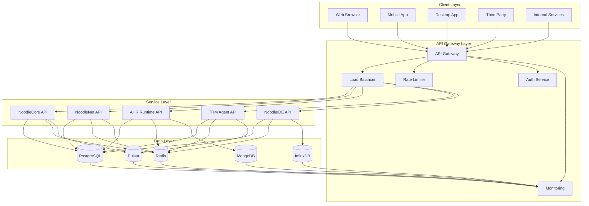

# Noodle API Interface Analysis

## API Architecture Overview

### API Design Principles
Noodle project implements a RESTful API architecture with clear design principles and comprehensive functionality. The API follows industry best practices and provides a robust interface for all system components.

#### API Design Philosophy
1. **RESTful Design**: Follow REST principles with clear resource-oriented endpoints
2. **Consistency**: Uniform response formats and error handling
3. **Security**: Comprehensive authentication and authorization
4. **Performance**: Optimized for high throughput and low latency
5. **Documentation**: Comprehensive API documentation and examples

#### API Architecture Components
| Component | Purpose | Technology | Key Features |
|-----------|---------|------------|--------------|
| API Gateway | Central API management | Kong, Nginx | Rate limiting, authentication, routing |
| REST API | Standard HTTP interface | FastAPI, Flask | RESTful endpoints, request validation |
| WebSocket API | Real-time communication | Socket.IO, WebSocket | Bidirectional communication |
| GraphQL API | Flexible data queries | GraphQL | Query flexibility, data fetching |
| gRPC API | High-performance internal communication | gRPC | Binary protocol, streaming |

### API Architecture Diagram


## REST API Analysis

### REST API Structure
#### API Endpoint Organization
```python
class NoodleAPI:
    def __init__(self, app: FastAPI):
        self.app = app
        self.router = APIRouter()
        self._setup_routes()
    
    def _setup_routes(self):
        """Setup all API routes"""
        # Authentication routes
        self.router.add_api_route(
            "/api/v1/auth/login",
            self.login,
            methods=["POST"],
            response_model=LoginResponse,
            tags=["Authentication"]
        )
        
        self.router.add_api_route(
            "/api/v1/auth/logout",
            self.logout,
            methods=["POST"],
            response_model=LogoutResponse,
            tags=["Authentication"]
        )
        
        # User management routes
        self.router.add_api_route(
            "/api/v1/users",
            self.get_users,
            methods=["GET"],
            response_model=List[UserResponse],
            tags=["Users"]
        )
        
        self.router.add_api_route(
            "/api/v1/users/{user_id}",
            self.get_user,
            methods=["GET"],
            response_model=UserResponse,
            tags=["Users"]
        )
        
        # Project management routes
        self.router.add_api_route(
            "/api/v1/projects",
            self.get_projects,
            methods=["GET"],
            response_model=List[ProjectResponse],
            tags=["Projects"]
        )
        
        self.router.add_api_route(
            "/api/v1/projects",
            self.create_project,
            methods=["POST"],
            response_model=ProjectResponse,
            tags=["Projects"]
        )
        
        # Compilation routes
        self.router.add_api_route(
            "/api/v1/compilation",
            self.compile_code,
            methods=["POST"],
            response_model=CompilationResponse,
            tags=["Compilation"]
        )
        
        self.router.add_api_route(
            "/api/v1/compilation/{job_id}",
            self.get_compilation_result,
            methods=["GET"],
            response_model=CompilationResponse,
            tags=["Compilation"]
        )
        
        # Model management routes
        self.router.add_api_route(
            "/api/v1/models",
            self.get_models,
            methods=["GET"],
            response_model=List[ModelResponse],
            tags=["Models"]
        )
        
        self.router.add_api_route(
            "/api/v1/models",
            self.upload_model,
            methods=["POST"],
            response_model=ModelResponse,
            tags=["Models"]
        )
        
        # System monitoring routes
        self.router.add_api_route(
            "/api/v1/system/health",
            self.get_health,
            methods=["GET"],
            response_model=HealthResponse,
            tags=["System"]
        )
        
        self.router.add_api_route(
            "/api/v1/system/metrics",
            self.get_metrics,
            methods=["GET"],
            response_model=MetricsResponse,
            tags=["System"]
        )
```

#### API Request/Response Models
```python
from pydantic import BaseModel, Field
from typing import List, Optional, Dict, Any
from datetime import datetime
from uuid import UUID

# Authentication models
class LoginRequest(BaseModel):
    username: str = Field(..., min_length=3, max_length=50)
    password: str = Field(..., min_length=8, max_length=100)
    remember_me: bool = Field(False)

class LoginResponse(BaseModel):
    access_token: str
    refresh_token: str
    token_type: str = "bearer"
    expires_in: int
    user: Dict[str, Any]

class LogoutResponse(BaseModel):
    message: str = "Successfully logged out"

# User management models
class UserResponse(BaseModel):
    id: UUID
    username: str
    email: str
    first_name: Optional[str]
    last_name: Optional[str]
    created_at: datetime
    updated_at: datetime
    status: str
    last_login: Optional[datetime]

class CreateUserRequest(BaseModel):
    username: str = Field(..., min_length=3, max_length=50)
    email: str = Field(..., regex=r'^[^@]+@[^@]+\.[^@]+$')
    password: str = Field(..., min_length=8, max_length=100)
    first_name: Optional[str] = Field(None, max_length=100)
    last_name: Optional[str] = Field(None, max_length=100)

class UpdateUserRequest(BaseModel):
    email: Optional[str] = Field(None, regex=r'^[^@]+@[^@]+\.[^@]+$')
    first_name: Optional[str] = Field(None, max_length=100)
    last_name: Optional[str] = Field(None, max_length=100)
    status: Optional[str] = Field(None, regex=r'^(active|inactive|suspended)$')

# Project management models
class ProjectResponse(BaseModel):
    id: UUID
    name: str
    description: Optional[str]
    owner_id: UUID
    created_at: datetime
    updated_at: datetime
    status: str
    settings: Dict[str, Any]

class CreateProjectRequest(BaseModel):
    name: str = Field(..., min_length=1, max_length=100)
    description: Optional[str] = Field(None, max_length=1000)
    settings: Optional[Dict[str, Any]] = Field(default_factory=dict)

class UpdateProjectRequest(BaseModel):
    name: Optional[str] = Field(None, min_length=1, max_length=100)
    description: Optional[str] = Field(None, max_length=1000)
    status: Optional[str] = Field(None, regex=r'^(active|inactive|archived)$')
    settings: Optional[Dict[str, Any]] = None

# Compilation models
class CompilationRequest(BaseModel):
    source_code: str = Field(..., min_length=1)
    project_id: Optional[UUID] = None
    optimization_level: int = Field(1, ge=1, le=3)
    timeout: int = Field(30, ge=1, le=300)
    memory_limit: Optional[int] = Field(None, ge=1, le=8192)

class CompilationResponse(BaseModel):
    job_id: UUID
    status: str
    source_code: str
    compiled_code: Optional[str]
    execution_time: Optional[float]
    memory_usage: Optional[int]
    error_message: Optional[str]
    created_at: datetime
    updated_at: datetime
    metrics: Optional[Dict[str, Any]] = None

class CompilationResultRequest(BaseModel):
    job_id: UUID
    timeout: int = Field(30, ge=1, le=300)

# Model management models
class ModelResponse(BaseModel):
    id: UUID
    name: str
    model_type: str
    project_id: UUID
    user_id: UUID
    model_path: str
    model_size: int
    created_at: datetime
    updated_at: datetime
    status: str
    metadata: Dict[str, Any]

class UploadModelRequest(BaseModel):
    name: str = Field(..., min_length=1, max_length=100)
    model_type: str = Field(..., regex=r'^(pytorch|tensorflow|onnx|trm)$')
    project_id: UUID
    metadata: Optional[Dict[str, Any]] = Field(default_factory=dict)

class UpdateModelRequest(BaseModel):
    name: Optional[str] = Field(None, min_length=1, max_length=100)
    status: Optional[str] = Field(None, regex=r'^(active|inactive|archived)$')
    metadata: Optional[Dict[str, Any]] = None

# System monitoring models
class HealthResponse(BaseModel):
    status: str
    timestamp: datetime
    version: str
    uptime: float
    services: Dict[str, str]

class MetricsResponse(BaseModel):
    timestamp: datetime
    cpu_usage: float
    memory_usage: float
    disk_usage: float
    network_io: Dict[str, float]
    database_connections: int
    active_requests: int
    response_times: Dict[str, float]

class ErrorResponse(BaseModel):
    error_code: str
    error_message: str
    details: Optional[Dict[str, Any]] = None
    timestamp: datetime
    request_id: str
```

### API Authentication and Authorization
```python
class AuthManager:
    def __init__(self, secret_key: str, algorithm: str = "HS256"):
        self.secret_key = secret_key
        self.algorithm = algorithm
        self.access_token_expire_minutes = 30
        self.refresh_token_expire_days = 7
    
    def create_access_token(self, data: dict) -> str:
        """Create JWT access token"""
        to_encode = data.copy()
        expire = datetime.utcnow() + timedelta(minutes=self.access_token_expire_minutes)
        to_encode.update({"exp": expire, "type": "access"})
        
        encoded_jwt = jwt.encode(to_encode, self.secret_key, algorithm=self.algorithm)
        return encoded_jwt
    
    def create_refresh_token(self, data: dict) -> str:
        """Create JWT refresh token"""
        to_encode = data.copy()
        expire = datetime.utcnow() + timedelta(days=self.refresh_token_expire_days)
        to_encode.update({"exp": expire, "type": "refresh"})
        
        encoded_jwt = jwt.encode(to_encode, self.secret_key, algorithm=self.algorithm)
        return encoded_jwt
    
    def verify_token(self, token: str) -> dict:
        """Verify JWT token"""
        try:
            payload = jwt.decode(token, self.secret_key, algorithms=[self.algorithm])
            return payload
        except JWTError:
            raise HTTPException(
                status_code=status.HTTP_401_UNAUTHORIZED,
                detail="Could not validate credentials",
                headers={"WWW-Authenticate": "Bearer"},
            )
    
    def get_current_user(self, token: str) -> dict:
        """Get current user from token"""
        payload = self.verify_token(token)
        username: str = payload.get("sub")
        
        if username is None:
            raise HTTPException(
                status_code=status.HTTP_401_UNAUTHORIZED,
                detail="Could not validate credentials",
                headers={"WWW-Authenticate": "Bearer"},
            )
        
        return {"username": username, "user_id": payload.get("user_id")}
    
    def require_auth(self, token: str) -> dict:
        """Require authentication"""
        if not token:
            raise HTTPException(
                status_code=status.HTTP_401_UNAUTHORIZED,
                detail="Authentication required",
                headers={"WWW-Authenticate": "Bearer"},
            )
        
        try:
            return self.get_current_user(token)
        except HTTPException:
            raise HTTPException(
                status_code=status.HTTP_401_UNAUTHORIZED,
                detail="Invalid authentication credentials",
                headers={"WWW-Authenticate": "Bearer"},
            )
    
    def require_role(self, token: str, required_role: str) -> dict:
        """Require specific role"""
        user = self.require_auth(token)
        
        # Check user role (this would typically come from database)
        user_role = user.get("role", "user")
        
        if user_role != required_role:
            raise HTTPException(
                status_code=status.HTTP_403_FORBIDDEN,
                detail="Insufficient permissions",
            )
        
        return user
    
    def require_permission(self, token: str, required_permission: str) -> dict:
        """Require specific permission"""
        user = self.require_auth(token)
        
        # Check user permissions (this would typically come from database)
        user_permissions = user.get("permissions", [])
        
        if required_permission not in user_permissions:
            raise HTTPException(
                status_code=status.HTTP_403_FORBIDDEN,
                detail="Insufficient permissions",
            )
        
        return user
```

### API Error Handling
```python
class APIErrorHandler:
    def __init__(self):
        self.error_handlers = {
            "validation_error": self._handle_validation_error,
            "authentication_error": self._handle_authentication_error,
            "authorization_error": self._handle_authorization_error,
            "not_found_error": self._handle_not_found_error,
            "internal_error": self._handle_internal_error,
            "database_error": self._handle_database_error,
            "timeout_error": self._handle_timeout_error,
            "rate_limit_error": self._handle_rate_limit_error
        }
    
    def handle_error(self, error: Exception, request_id: str) -> ErrorResponse:
        """Handle API errors"""
        error_type = self._classify_error(error)
        handler = self.error_handlers.get(error_type, self._handle_internal_error)
        
        return handler(error, request_id)
    
    def _classify_error(self, error: Exception) -> str:
        """Classify error type"""
        if isinstance(error, ValidationError):
            return "validation_error"
        elif isinstance(error, HTTPException) and error.status_code == 401:
            return "authentication_error"
        elif isinstance(error, HTTPException) and error.status_code == 403:
            return "authorization_error"
        elif isinstance(error, HTTPException) and error.status_code == 404:
            return "not_found_error"
        elif isinstance(error, DatabaseError):
            return "database_error"
        elif isinstance(error, TimeoutError):
            return "timeout_error"
        elif isinstance(error, RateLimitError):
            return "rate_limit_error"
        else:
            return "internal_error"
    
    def _handle_validation_error(self, error: ValidationError, request_id: str) -> ErrorResponse:
        """Handle validation errors"""
        return ErrorResponse(
            error_code="VALIDATION_ERROR",
            error_message="Validation failed",
            details={"errors": error.errors()},
            timestamp=datetime.utcnow(),
            request_id=request_id
        )
    
    def _handle_authentication_error(self, error: Exception, request_id: str) -> ErrorResponse:
        """Handle authentication errors"""
        return ErrorResponse(
            error_code="AUTHENTICATION_ERROR",
            error_message="Authentication failed",
            details={"error": str(error)},
            timestamp=datetime.utcnow(),
            request_id=request_id
        )
    
    def _handle_authorization_error(self, error: Exception, request_id: str) -> ErrorResponse:
        """Handle authorization errors"""
        return ErrorResponse(
            error_code="AUTHORIZATION_ERROR",
            error_message="Authorization failed",
            details={"error": str(error)},
            timestamp=datetime.utcnow(),
            request_id=request_id
        )
    
    def _handle_not_found_error(self, error: Exception, request_id: str) -> ErrorResponse:
        """Handle not found errors"""
        return ErrorResponse(
            error_code="NOT_FOUND_ERROR",
            error_message="Resource not found",
            details={"error": str(error)},
            timestamp=datetime.utcnow(),
            request_id=request_id
        )
    
    def _handle_internal_error(self, error: Exception, request_id: str) -> ErrorResponse:
        """Handle internal errors"""
        return ErrorResponse(
            error_code="INTERNAL_ERROR",
            error_message="Internal server error",
            details={"error": str(error)},
            timestamp=datetime.utcnow(),
            request_id=request_id
        )
    
    def _handle_database_error(self, error: Exception, request_id: str) -> ErrorResponse:
        """Handle database errors"""
        return ErrorResponse(
            error_code="DATABASE_ERROR",
            error_message="Database operation failed",
            details={"error": str(error)},
            timestamp=datetime.utcnow(),
            request_id=request_id
        )
    
    def _handle_timeout_error(self, error: Exception, request_id: str) -> ErrorResponse:
        """Handle timeout errors"""
        return ErrorResponse(
            error_code="TIMEOUT_ERROR",
            error_message="Request timeout",
            details={"error": str(error)},
            timestamp=datetime.utcnow(),
            request_id=request_id
        )
    
    def _handle_rate_limit_error(self, error: Exception, request_id: str) -> ErrorResponse:
        """Handle rate limit errors"""
        return ErrorResponse(
            error_code="RATE_LIMIT_ERROR",
            error_message="Rate limit exceeded",
            details={"error": str(error)},
            timestamp=datetime.utcnow(),
            request_id=request_id
        )
```

## WebSocket API Analysis

### WebSocket API Structure
```python
class WebSocketManager:
    def __init__(self):
        self.active_connections: List[WebSocket] = []
        self.connection_data: Dict[WebSocket, Dict] = {}
    
    async def connect(self, websocket: WebSocket):
        """Accept WebSocket connection"""
        await websocket.accept()
        self.active_connections.append(websocket)
        self.connection_data[websocket] = {
            "connected_at": datetime.utcnow(),
            "last_activity": datetime.utcnow(),
            "user_id": None,
            "subscription": None
        }
    
    async def disconnect(self, websocket: WebSocket):
        """Handle WebSocket disconnection"""
        if websocket in self.active_connections:
            self.active_connections.remove(websocket)
        if websocket in self.connection_data:
            del self.connection_data[websocket]
    
    async def send_personal_message(self, message: str, websocket: WebSocket):
        """Send personal message to specific client"""
        try:
            await websocket.send_text(message)
        except Exception as e:
            logger.error(f"Failed to send message: {e}")
            await self.disconnect(websocket)
    
    async def broadcast(self, message: str):
        """Broadcast message to all connected clients"""
        disconnected = []
        for connection in self.active_connections:
            try:
                await connection.send_text(message)
            except Exception as e:
                logger.error(f"Failed to broadcast message: {e}")
                disconnected.append(connection)
        
        # Clean up disconnected clients
        for connection in disconnected:
            await self.disconnect(connection)
    
    async def send_compilation_update(self, job_id: str, status: str, progress: float):
        """Send compilation update to subscribed clients"""
        message = json.dumps({
            "type": "compilation_update",
            "job_id": job_id,
            "status": status,
            "progress": progress,
            "timestamp": datetime.utcnow().isoformat()
        })
        
        # Send to clients subscribed to this job
        for connection in self.active_connections:
            if self.connection_data[connection].get("subscription") == job_id:
                await self.send_personal_message(message, connection)
    
    async def send_ai_update(self, model_id: str, status: str, progress: float):
        """Send AI model update to subscribed clients"""
        message = json.dumps({
            "type": "ai_update",
            "model_id": model_id,
            "status": status,
            "progress": progress,
            "timestamp": datetime.utcnow().isoformat()
        })
        
        # Send to clients subscribed to this model
        for connection in self.active_connections:
            if self.connection_data[connection].get("subscription") == model_id:
                await self.send_personal_message(message, connection)
    
    async def send_system_notification(self, notification_type: str, message: str):
        """Send system notification to all connected clients"""
        message = json.dumps({
            "type": "system_notification",
            "notification_type": notification_type,
            "message": message,
            "timestamp": datetime.utcnow().isoformat()
        })
        
        await self.broadcast(message)
    
    async def handle_client_message(self, websocket: WebSocket, data: str):
        """Handle incoming messages from clients"""
        try:
            message = json.loads(data)
            message_type = message.get("type")
            
            if message_type == "subscribe":
                await self.handle_subscription(websocket, message)
            elif message_type == "unsubscribe":
                await self.handle_unsubscription(websocket, message)
            elif message_type == "ping":
                await self.handle_ping(websocket, message)
            elif message_type == "command":
                await self.handle_command(websocket, message)
            else:
                logger.warning(f"Unknown message type: {message_type}")
                
        except json.JSONDecodeError:
            logger.error("Invalid JSON message received")
        except Exception as e:
            logger.error(f"Error handling client message: {e}")
    
    async def handle_subscription(self, websocket: WebSocket, message: dict):
        """Handle client subscription"""
        subscription_id = message.get("subscription_id")
        if subscription_id:
            self.connection_data[websocket]["subscription"] = subscription_id
            response = {
                "type": "subscription_confirmed",
                "subscription_id": subscription_id,
                "timestamp": datetime.utcnow().isoformat()
            }
            await self.send_personal_message(json.dumps(response), websocket)
    
    async def handle_unsubscription(self, websocket: WebSocket, message: dict):
        """Handle client unsubscription"""
        self.connection_data[websocket]["subscription"] = None
        response = {
            "type": "unsubscription_confirmed",
            "timestamp": datetime.utcnow().isoformat()
        }
        await self.send_personal_message(json.dumps(response), websocket)
    
    async def handle_ping(self, websocket: WebSocket, message: dict):
        """Handle client ping"""
        self.connection_data[websocket]["last_activity"] = datetime.utcnow()
        response = {
            "type": "pong",
            "timestamp": datetime.utcnow().isoformat()
        }
        await self.send_personal_message(json.dumps(response), websocket)
    
    async def handle_command(self, websocket: WebSocket, message: dict):
        """Handle client command"""
        command = message.get("command")
        if command == "get_status":
            await self.send_status(websocket)
        elif command == "get_metrics":
            await self.send_metrics(websocket)
        else:
            logger.warning(f"Unknown command: {command}")
    
    async def send_status(self, websocket: WebSocket):
        """Send system status to client"""
        status = {
            "type": "status",
            "active_connections": len(self.active_connections),
            "timestamp": datetime.utcnow().isoformat()
        }
        await self.send_personal_message(json.dumps(status), websocket)
    
    async def send_metrics(self, websocket: WebSocket):
        """Send system metrics to client"""
        metrics = {
            "type": "metrics",
            "timestamp": datetime.utcnow().isoformat(),
            "metrics": {
                "active_connections": len(self.active_connections),
                "messages_sent": sum(
                    len(self.connection_data[conn].get("messages_sent", []))
                    for conn in self.active_connections
                ),
                "messages_received": sum(
                    len(self.connection_data[conn].get("messages_received", []))
                    for conn in self.active_connections
                )
            }
        }
        await self.send_personal_message(json.dumps(metrics), websocket)
```

### WebSocket API Endpoints
```python
class WebSocketAPI:
    def __init__(self, app: FastAPI):
        self.app = app
        self.manager = WebSocketManager()
        self._setup_routes()
    
    def _setup_routes(self):
        """Setup WebSocket routes"""
        @self.app.websocket("/ws")
        async def websocket_endpoint(websocket: WebSocket):
            await self.manager.connect(websocket)
            try:
                while True:
                    data = await websocket.receive_text()
                    await self.manager.handle_client_message(websocket, data)
            except WebSocketDisconnect:
                await self.manager.disconnect(websocket)
        
        @self.app.websocket("/ws/compilation/{job_id}")
        async def compilation_websocket(websocket: WebSocket, job_id: str):
            await self.manager.connect(websocket)
            self.manager.connection_data[websocket]["subscription"] = job_id
            
            try:
                while True:
                    data = await websocket.receive_text()
                    await self.manager.handle_client_message(websocket, data)
            except WebSocketDisconnect:
                await self.manager.disconnect(websocket)
        
        @self.app.websocket("/ws/ai/{model_id}")
        async def ai_websocket(websocket: WebSocket, model_id: str):
            await self.manager.connect(websocket)
            self.manager.connection_data[websocket]["subscription"] = model_id
            
            try:
                while True:
                    data = await websocket.receive_text()
                    await self.manager.handle_client_message(websocket, data)
            except WebSocketDisconnect:
                await self.manager.disconnect(websocket)
        
        @self.app.websocket("/ws/system")
        async def system_websocket(websocket: WebSocket):
            await self.manager.connect(websocket)
            self.manager.connection_data[websocket]["subscription"] = "system"
            
            try:
                while True:
                    data = await websocket.receive_text()
                    await self.manager.handle_client_message(websocket, data)
            except WebSocketDisconnect:
                await self.manager.disconnect(websocket)
```

## GraphQL API Analysis

### GraphQL API Structure
```python
from graphene import ObjectType, String, Int, Float, Boolean, List, Field, Schema, Mutation
from datetime import datetime
from uuid import UUID

# GraphQL Types
class UserType(ObjectType):
    id = UUID()
    username = String()
    email = String()
    first_name = String()
    last_name = String()
    created_at = String()
    updated_at = String()
    status = String()

class ProjectType(ObjectType):
    id = UUID()
    name = String()
    description = String()
    owner = Field(UserType)
    created_at = String()
    updated_at = String()
    status = String()
    settings = String()

class CompilationJobType(ObjectType):
    id = UUID()
    project = Field(ProjectType)
    user = Field(UserType)
    source_code = String()
    compiled_code = String()
    status = String()
    created_at = String()
    updated_at = String()
    execution_time = Float()
    memory_usage = Int()
    error_message = String()

class ModelType(ObjectType):
    id = UUID()
    name = String()
    model_type = String()
    project = Field(ProjectType)
    user = Field(UserType)
    model_path = String()
    model_size = Int()
    created_at = String()
    updated_at = String()
    status = String()
    metadata = String()

class Query(ObjectType):
    # User queries
    users = List(UserType)
    user = Field(UserType, id=UUID(required=True))
    
    # Project queries
    projects = List(ProjectType)
    project = Field(ProjectType, id=UUID(required=True))
    user_projects = List(ProjectType, user_id=UUID(required=True))
    
    # Compilation queries
    compilation_jobs = List(CompilationJobType)
    compilation_job = Field(CompilationJobType, job_id=UUID(required=True))
    user_compilation_jobs = List(CompilationJobType, user_id=UUID(required=True))
    project_compilation_jobs = List(CompilationJobType, project_id=UUID(required=True))
    
    # Model queries
    models = List(ModelType)
    model = Field(ModelType, model_id=UUID(required=True))
    user_models = List(ModelType, user_id=UUID(required=True))
    project_models = List(ModelType, project_id=UUID(required=True))
    
    # System queries
    system_health = String()
    system_metrics = String()

class CreateUser(Mutation):
    class Arguments:
        username = String(required=True)
        email = String(required=True)
        password = String(required=True)
        first_name = String()
        last_name = String()
    
    user = Field(UserType)
    
    def mutate(self, info, username, email, password, first_name=None, last_name=None):
        # Create user logic
        user = create_user(username, email, password, first_name, last_name)
        return CreateUser(user=user)

class CreateProject(Mutation):
    class Arguments:
        name = String(required=True)
        description = String()
        owner_id = UUID(required=True)
        settings = String()
    
    project = Field(ProjectType)
    
    def mutate(self, info, name, description, owner_id, settings=None):
        # Create project logic
        project = create_project(name, description, owner_id, settings)
        return CreateProject(project=project)

class CompileCode(Mutation):
    class Arguments:
        source_code = String(required=True)
        project_id = UUID()
        optimization_level = Int()
        timeout = Int()
        memory_limit = Int()
    
    compilation_job = Field(CompilationJobType)
    
    def mutate(self, info, source_code, project_id=None, optimization_level=1, timeout=30, memory_limit=None):
        # Compile code logic
        job = compile_code(source_code, project_id, optimization_level, timeout, memory_limit)
        return CompileCode(compilation_job=job)

class UploadModel(Mutation):
    class Arguments:
        name = String(required=True)
        model_type = String(required=True)
        project_id = UUID(required=True)
        model_file = String(required=True)
        metadata = String()
    
    model = Field(ModelType)
    
    def mutate(self, info, name, model_type, project_id, model_file, metadata=None):
        # Upload model logic
        model = upload_model(name, model_type, project_id, model_file, metadata)
        return UploadModel(model=model)

class Mutation(ObjectType):
    create_user = CreateUser.Field()
    create_project = CreateProject.Field()
    compile_code = CompileCode.Field()
    upload_model = UploadModel.Field()

# GraphQL Schema
schema = Schema(query=Query, mutation=Mutation)
```

### GraphQL API Configuration
```python
class GraphQLAPI:
    def __init__(self, app: FastAPI):
        self.app = app
        self.schema = schema
        self.context_value = {"request": None}
        self.root_value = None
        self._setup_routes()
    
    def _setup_routes(self):
        """Setup GraphQL routes"""
        @self.app.post("/graphql")
        async def graphql_server(request: Request):
            # Set context
            self.context_value["request"] = request
            
            # Parse request
            body = await request.json()
            query = body.get("query")
            variables = body.get("variables", {})
            operation_name = body.get("operation_name")
            
            # Execute query
            result = await self.schema.execute(
                query,
                variable_values=variables,
                operation_name=operation_name,
                context_value=self.context_value,
                root_value=self.root_value
            )
            
            # Return result
            return {
                "data": result.data,
                "errors": [str(error) for error in result.errors] if result.errors else None
            }
        
        @self.app.get("/graphql")
        async def graphql_server_get(request: Request):
            # Handle GET requests (for GraphiQL)
            query = request.query_params.get("query")
            variables = request.query_params.get("variables")
            operation_name = request.query_params.get("operation_name")
            
            # Parse variables
            parsed_variables = {}
            if variables:
                try:
                    parsed_variables = json.loads(variables)
                except json.JSONDecodeError:
                    pass
            
            # Execute query
            result = await self.schema.execute(
                query,
                variable_values=parsed_variables,
                operation_name=operation_name,
                context_value=self.context_value,
                root_value=self.root_value
            )
            
            # Return result
            return {
                "data": result.data,
                "errors": [str(error) for error in result.errors] if result.errors else None
            }
        
        @self.app.get("/graphiql")
        async def graphiql():
            """Serve GraphiQL interface"""
            return HTMLResponse("""
            <!DOCTYPE html>
            <html>
            <head>
                <title>GraphiQL</title>
                <link rel="stylesheet" href="https://cdn.jsdelivr.net/npm/graphiql@latest/graphiql.min.css" />
            </head>
            <body style="margin: 0;">
                <div id="graphiql" style="height: 100vh;"></div>
                <script src="https://cdn.jsdelivr.net/npm/graphiql@latest/graphiql.min.js"></script>
                <script>
                    const graphQLFetcher = (graphQLParams) =>
                        fetch("/graphql", {
                            method: "POST",
                            headers: {
                                "Content-Type": "application/json",
                            },
                            body: JSON.stringify(graphQLParams),
                        })
                            .then((response) => response.json())
                            .then((result) => {
                                if (result.errors) {
                                    return Promise.reject(result.errors);
                                }
                                return result.data;
                            });
                    
                    ReactDOM.render(
                        React.createElement(GraphQLFetcher, { fetcher: graphQLFetcher }),
                        document.getElementById("graphiql")
                    );
                </script>
            </body>
            </html>
            """)
```

## gRPC API Analysis

### gRPC API Structure
```python
from concurrent import futures
import grpc
import uuid
from datetime import datetime
from typing import Dict, List, Optional

# gRPC Protocol Buffers
syntax = "proto3";

package noodle;

service NoodleService {
    // User management
    rpc CreateUser(CreateUserRequest) returns (UserResponse);
    rpc GetUser(GetUserRequest) returns (UserResponse);
    rpc UpdateUser(UpdateUserRequest) returns (UserResponse);
    rpc DeleteUser(DeleteUserRequest) returns (DeleteUserResponse);
    
    // Project management
    rpc CreateProject(CreateProjectRequest) returns (ProjectResponse);
    rpc GetProject(GetProjectRequest) returns (ProjectResponse);
    rpc UpdateProject(UpdateProjectRequest) returns (ProjectResponse);
    rpc DeleteProject(DeleteProjectRequest) returns (DeleteProjectResponse);
    rpc ListProjects(ListProjectsRequest) returns (ListProjectsResponse);
    
    // Compilation
    rpc CompileCode(CompileCodeRequest) returns (CompileCodeResponse);
    rpc GetCompilationResult(GetCompilationResultRequest) returns (CompilationResultResponse);
    rpc CancelCompilation(CancelCompilationRequest) returns (CancelCompilationResponse);
    rpc ListCompilationJobs(ListCompilationJobsRequest) returns (ListCompilationJobsResponse);
    
    // Model management
    rpc UploadModel(UploadModelRequest) returns (UploadModelResponse);
    rpc GetModel(GetModelRequest) returns (ModelResponse);
    rpc UpdateModel(UpdateModelRequest) returns (ModelResponse);
    rpc DeleteModel(DeleteModelRequest) returns (DeleteModelResponse);
    rpc ListModels(ListModelsRequest) returns (ListModelsResponse);
    
    // System monitoring
    rpc GetSystemHealth(GetSystemHealthRequest) returns (SystemHealthResponse);
    rpc GetSystemMetrics(GetSystemMetricsRequest) returns (SystemMetricsResponse);
    rpc StreamSystemMetrics(stream StreamSystemMetricsRequest) returns (stream SystemMetricsResponse);
}

// User management messages
message CreateUserRequest {
    string username = 1;
    string email = 2;
    string password = 3;
    string first_name = 4;
    string last_name = 5;
}

message GetUserRequest {
    string user_id = 1;
}

message UpdateUserRequest {
    string user_id = 1;
    string email = 2;
    string first_name = 3;
    string last_name = 4;
    string status = 5;
}

message DeleteUserRequest {
    string user_id = 1;
}

message DeleteUserResponse {
    bool success = 1;
    string message = 2;
}

message UserResponse {
    string id = 1;
    string username = 2;
    string email = 3;
    string first_name = 4;
    string last_name = 5;
    string created_at = 6;
    string updated_at = 7;
    string status = 8;
    string last_login = 9;
}

// Project management messages
message CreateProjectRequest {
    string name = 1;
    string description = 2;
    string owner_id = 3;
    string settings = 4;
}

message GetProjectRequest {
    string project_id = 1;
}

message UpdateProjectRequest {
    string project_id = 1;
    string name = 2;
    string description = 3;
    string status = 4;
    string settings = 5;
}

message DeleteProjectRequest {
    string project_id = 1;
}

message DeleteProjectResponse {
    bool success = 1;
    string message = 2;
}

message ProjectResponse {
    string id = 1;
    string name = 2;
    string description = 3;
    string owner_id = 4;
    string created_at = 5;
    string updated_at = 6;
    string status = 7;
    string settings = 8;
}

message ListProjectsRequest {
    string user_id = 1;
    int32 page_size = 2;
    int32 page_token = 3;
}

message ListProjectsResponse {
    repeated ProjectResponse projects = 1;
    int32 total_count = 2;
    string next_page_token = 3;
}

// Compilation messages
message CompileCodeRequest {
    string source_code = 1;
    string project_id = 2;
    int32 optimization_level = 3;
    int32 timeout = 4;
    int32 memory_limit = 5;
}

message CompileCodeResponse {
    string job_id = 1;
    string status = 2;
    string message = 3;
}

message GetCompilationResultRequest {
    string job_id = 1;
    int32 timeout = 2;
}

message CompilationResultResponse {
    string job_id = 1;
    string status = 2;
    string source_code = 3;
    string compiled_code = 4;
    double execution_time = 5;
    int32 memory_usage = 6;
    string error_message = 7;
    string created_at = 8;
    string updated_at = 9;
    map<string, string> metrics = 10;
}

message CancelCompilationRequest {
    string job_id = 1;
}

message CancelCompilationResponse {
    bool success = 1;
    string message = 2;
}

message ListCompilationJobsRequest {
    string user_id = 1;
    string project_id = 2;
    string status = 3;
    int32 page_size = 4;
    int32 page_token = 5;
}

message ListCompilationJobsResponse {
    repeated CompilationResultResponse jobs = 1;
    int32 total_count = 2;
    string next_page_token = 3;
}

// Model management messages
message UploadModelRequest {
    string name = 1;
    string model_type = 2;
    string project_id = 3;
    string model_file = 4;
    string metadata = 5;
}

message UploadModelResponse {
    string model_id = 1;
    string message = 2;
}

message GetModelRequest {
    string model_id = 1;
}

message UpdateModelRequest {
    string model_id = 1;
    string name = 2;
    string status = 3;
    string metadata = 4;
}

message DeleteModelRequest {
    string model_id = 1;
}

message DeleteModelResponse {
    bool success = 1;
    string message = 2;
}

message ModelResponse {
    string id = 1;
    string name = 2;
    string model_type = 3;
    string project_id = 4;
    string user_id = 5;
    string model_path = 6;
    int64 model_size = 7;
    string created_at = 8;
    string updated_at = 9;
    string status = 10;
    string metadata = 11;
}

message ListModelsRequest {
    string user_id = 1;
    string project_id = 2;
    string model_type = 3;
    int32 page_size = 4;
    int32 page_token = 5;
}

message ListModelsResponse {
    repeated ModelResponse models = 1;
    int32 total_count = 2;
    string next_page_token = 3;
}

// System monitoring messages
message GetSystemHealthRequest {
}

message SystemHealthResponse {
    string status = 1;
    string timestamp = 2;
    string version = 3;
    double uptime = 4;
    map<string, string> services = 5;
}

message GetSystemMetricsRequest {
}

message SystemMetricsResponse {
    string timestamp = 1;
    double cpu_usage = 2;
    double memory_usage = 3;
    double disk_usage = 4;
    map<string, double> network_io = 5;
    int32 database_connections = 6;
    int32 active_requests = 7;
    map<string, double> response_times = 8;
}

message StreamSystemMetricsRequest {
    int32 interval_seconds = 1;
}

// gRPC Server Implementation
class NoodleServicer(noodle_pb2_grpc.NoodleServiceServicer):
    def __init__(self):
        self.user_manager = UserManager()
        self.project_manager = ProjectManager()
        self.compilation_manager = CompilationManager()
        self.model_manager = ModelManager()
        self.system_monitor = SystemMonitor()
    
    async def CreateUser(self, request: CreateUserRequest, context: grpc.aio.ServicerContext) -> UserResponse:
        """Create new user"""
        try:
            user = await self.user_manager.create_user(
                username=request.username,
                email=request.email,
                password=request.password,
                first_name=request.first_name,
                last_name=request.last_name
            )
            return user
        except Exception as e:
            await context.abort(grpc.StatusCode.INTERNAL, str(e))
    
    async def GetUser(self, request: GetUserRequest, context: grpc.aio.ServicerContext) -> UserResponse:
        """Get user by ID"""
        try:
            user = await self.user_manager.get_user(user_id=request.user_id)
            if not user:
                await context.abort(grpc.StatusCode.NOT_FOUND, "User not found")
            return user
        except Exception as e:
            await context.abort(grpc.StatusCode.INTERNAL, str(e))
    
    async def UpdateUser(self, request: UpdateUserRequest, context: grpc.aio.ServicerContext) -> UserResponse:
        """Update user"""
        try:
            user = await self.user_manager.update_user(
                user_id=request.user_id,
                email=request.email,
                first_name=request.first_name,
                last_name=request.last_name,
                status=request.status
            )
            if not user:
                await context.abort(grpc.StatusCode.NOT_FOUND, "User not found")
            return user
        except Exception as e:
            await context.abort(grpc.StatusCode.INTERNAL, str(e))
    
    async def DeleteUser(self, request: DeleteUserRequest, context: grpc.aio.ServicerContext) -> DeleteUserResponse:
        """Delete user"""
        try:
            success = await self.user_manager.delete_user(user_id=request.user_id)
            return DeleteUserResponse(success=success, message="User deleted successfully")
        except Exception as e:
            await context.abort(grpc.StatusCode.INTERNAL, str(e))
    
    async def