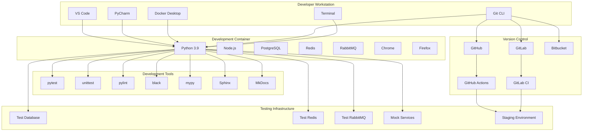

# Noodle Development and Testing Analysis

## Development Environment Overview

### Development Environment Setup
Noodle project provides a comprehensive development environment setup with standardized tools, workflows, and best practices. The development environment is designed for productivity, consistency, and collaboration.

#### Development Environment Principles
1. **Standardization**: Consistent development environment across all developers
2. **Automation**: Automated setup and configuration management
3. **Isolation**: Containerized development environments
4. **Collaboration**: Shared development workflows and standards
5. **Quality**: Integrated testing and quality assurance

#### Development Environment Components
| Component | Purpose | Technology | Key Features |
|-----------|---------|------------|--------------|
| IDE/Editor | Code editing and development | VS Code, PyCharm | IntelliSense, debugging, extensions |
| Version Control | Code management and collaboration | Git, GitHub | Branching, merging, pull requests |
| Containerization | Development environment isolation | Docker, Docker Compose | Containerized dependencies |
| Testing Framework | Automated testing | pytest, unittest | Unit tests, integration tests |
| Code Quality | Code analysis and quality checks | pylint, black, mypy | Linting, formatting, type checking |
| Documentation | API and code documentation | Sphinx, MkDocs | Auto-generated docs, API docs |
| CI/CD | Continuous integration and deployment | GitHub Actions, GitLab CI | Automated builds, tests, deployments |

### Development Environment Architecture


## Development Tools Analysis

### IDE and Editor Configuration
#### VS Code Configuration
```json
{
  "name": "Noodle Development",
  "build": {
    "dockerfile": "Dockerfile",
    "context": ".",
    "args": {
      "PYTHON_VERSION": "3.9",
      "NODE_VERSION": "18"
    }
  },
  "customizations": {
    "vscode": {
      "extensions": [
        "ms-python.python",
        "ms-python.vscode-pylance",
        "ms-toolsai.jupyter",
        "ms-toolsai.jupyter-keymap",
        "ms-toolsai.jupyter-renderers",
        "ms-toolsai.vscode-jupyter-cell-tags",
        "ms-toolsai.vscode-jupyter-slideshow",
        "ms-python.debugpy",
        "ms-python.isort",
        "ms-python.flake8",
        "ms-python.black-formatter",
        "ms-python.pylint",
        "ms-python.mypy-type-checker",
        "ms-python.vscode-pylance",
        "bradlc.vscode-tailwindcss",
        "esbenp.prettier-vscode",
        "ms-vscode.vscode-json",
        "ms-vscode.vscode-yaml",
        "redhat.vscode-yaml",
        "ms-vscode.vscode-docker",
        "ms-azuretools.vscode-docker",
        "ms-kubernetes-tools.vscode-kubernetes-tools",
        "ms-azuretools.vscode-azure-container-tools",
        "ms-azuretools.vscode-azure-storage",
        "ms-azuretools.vscode-azure-functions",
        "ms-azuretools.vscode-azure-app-service",
        "ms-azuretools.vscode-azure-resource-manager",
        "ms-azuretools.vscode-azure-database",
        "ms-azuretools.vscode-azure-service-bus",
        "ms-azuretools.vscode-azure-event-hubs",
        "ms-azuretools.vscode-azure-event-grid",
        "ms-azuretools.vscode-azure-iot",
        "ms-azuretools.vscode-azure-iot-edge",
        "ms-azuretools.vscode-azure-digital-twins",
        "ms-azuretools.vscode-azure-data-studio",
        "ms-azuretools.vscode-azure-monitor",
        "ms-azuretools.vscode-azure-security",
        "ms-azuretools.vscode-azure-policy",
        "ms-azuretools.vscode-azure-resource-graph",
        "ms-azuretools.vscode-azure-sf",
        "ms-azuretools.vscode-azure-repos",
        "ms-azuretools.vscode-azure-pipelines",
        "ms-azuretools.vscode-azure-devops",
        "ms-azuretools.vscode-azure-account",
        "ms-azuretools.vscode-azure-app-service",
        "ms-azuretools.vscode-azure-functions",
        "ms-azuretools.vscode-azure-storage",
        "ms-azuretools.vscode-azure-cosmosdb",
        "ms-azuretools.vscode-azure-database",
        "ms-azuretools.vscode-azure-service-bus",
        "ms-azuretools.vscode-azure-event-hubs",
        "ms-azuretools.vscode-azure-event-grid",
        "ms-azuretools.vscode-azure-iot",
        "ms-azuretools.vscode-azure-iot-edge",
        "ms-azuretools.vscode-azure-digital-twins",
        "ms-azuretools.vscode-azure-data-studio",
        "ms-azuretools.vscode-azure-monitor",
        "ms-azuretools.vscode-azure-security",
        "ms-azuretools.vscode-azure-policy",
        "ms-azuretools.vscode-azure-resource-graph",
        "ms-azuretools.vscode-azure-sf",
        "ms-azuretools.vscode-azure-repos",
        "ms-azuretools.vscode-azure-pipelines",
        "ms-azuretools.vscode-azure-devops",
        "ms-azuretools.vscode-azure-account"
      ]
    }
  },
  "settings": {
    "python.defaultInterpreterPath": "/usr/local/bin/python",
    "python.linting.enabled": true,
    "python.linting.pylintEnabled": true,
    "python.linting.flake8Enabled": true,
    "python.linting.mypyEnabled": true,
    "python.formatting.provider": "black",
    "python.formatting.blackPath": "/usr/local/bin/black",
    "python.linting.pylintPath": "/usr/local/bin/pylint",
    "python.linting.flake8Path": "/usr/local/bin/flake8",
    "python.linting.mypyPath": "/usr/local/bin/mypy",
    "python.testing.pytestEnabled": true,
    "python.testing.unittestEnabled": false,
    "python.testing.pytestArgs": [
      "tests",
      "-v",
      "--tb=short",
      "--cov=.",
      "--cov-report=html",
      "--cov-report=term-missing"
    ],
    "python.testing.pytestPath": "/usr/local/bin/pytest",
    "python.analysis.typeCheckingMode": "basic",
    "python.analysis.autoImportCompletions": true,
    "python.analysis.autoSearchPaths": true,
    "python.analysis.extraPaths": [
      "./src",
      "./tests"
    ],
    "python.analysis.diagnosticMode": "workspace",
    "python.analysis.diagnosticSeverityOverrides": {
      "reportGeneralTypeIssues": "none",
      "reportOptionalSubscript": "none",
      "reportOptionalMemberAccess": "none",
      "reportOptionalCall": "none",
      "reportOptionalIterable": "none",
      "reportOptionalContextManager": "none",
      "reportOptionalOperand": "none",
      "reportOptionalAssignment": "none",
      "reportUnboundVariable": "none",
      "reportUndefinedVariable": "none",
      "reportPrivateImportUsage": "none",
      "reportUnusedImport": "none",
      "reportUnusedVariable": "none",
      "reportUnusedClass": "none",
      "reportUnusedFunction": "none",
      "reportUnusedCoroutine": "none",
      "reportDuplicateImport": "none",
      "reportWildcardImportFromLibrary": "none",
      "reportAbstractClass": "none",
      "reportArgumentType": "none",
      "reportAssignmentType": "none",
      "reportAttributeType": "none",
      "reportCallType": "none",
      "reportCastType": "none",
      "reportGeneralTypeIssues": "none",
      "reportIncompatibleMethodOverride": "none",
      "reportIncompatibleVariableOverride": "none",
      "reportInvalidTypeVarUse": "none",
      "reportMissingImports": "none",
      "reportMissingTypeStubs": "none",
      "reportNoReturn": "none",
      "reportOptionalCall": "none",
      "reportOptionalIterable": "none",
      "reportOptionalSubscript": "none",
      "reportPrivateImportUsage": "none",
      "reportRedeclaration": "none",
      "reportReturnType": "none",
      "reportSelfClsParameterName": "none",
      "reportTypedDictNotRequiredAccess": "none",
      "reportTypedDictRequiredAccess": "none",
      "reportUnboundVariable": "none",
      "reportUndefinedVariable": "none",
      "reportUnknownArgumentType": "none",
      "reportUnknownLambdaType": "none",
      "reportUnknownMemberType": "none",
      "reportUnknownParameterType": "none",
      "reportUnknownVariableType": "none",
      "reportUnnecessaryComparison": "none",
      "reportUnnecessaryContains": "none",
      "reportUnnecessaryCast": "none",
      "reportUnnecessaryIsInstance": "none",
      "reportUnnecessaryNegation": "none",
      "reportUnnecessaryTypeIgnoreComment": "none",
      "reportUnsupportedDunderAll": "none",
      "reportUnusedClass": "none",
      "reportUnusedCoroutine": "none",
      "reportUnusedFunction": "none",
      "reportUnusedImport": "none",
      "reportUnusedVariable": "none",
      "reportUntypedBaseClass": "none",
      "reportUntypedFunctionDecorator": "none",
      "reportUntypedNamedTuple": "none",
      "reportUnnecessaryComparison": "none",
      "reportUnnecessaryContains": "none",
      "reportUnnecessaryCast": "none",
      "reportUnnecessaryIsInstance": "none",
      "reportUnnecessaryNegation": "none",
      "reportUnnecessaryTypeIgnoreComment": "none",
      "reportUnsupportedDunderAll": "none",
      "reportUnusedClass": "none",
      "reportUnusedCoroutine": "none",
      "reportUnusedFunction": "none",
      "reportUnusedImport": "none",
      "reportUnusedVariable": "none",
      "reportUntypedBaseClass": "none",
      "reportUntypedFunctionDecorator": "none",
      "reportUntypedNamedTuple": "none"
    },
    "python.analysis.diagnosticSeverityOverrides": {
      "reportGeneralTypeIssues": "none",
      "reportOptionalSubscript": "none",
      "reportOptionalMemberAccess": "none",
      "reportOptionalCall": "none",
      "reportOptionalIterable": "none",
      "reportOptionalContextManager": "none",
      "reportOptionalOperand": "none",
      "reportOptionalAssignment": "none",
      "reportUnboundVariable": "none",
      "reportUndefinedVariable": "none",
      "reportPrivateImportUsage": "none",
      "reportUnusedImport": "none",
      "reportUnusedVariable": "none",
      "reportUnusedClass": "none",
      "reportUnusedFunction": "none",
      "reportUnusedCoroutine": "none",
      "reportDuplicateImport": "none",
      "reportWildcardImportFromLibrary": "none",
      "reportAbstractClass": "none",
      "reportArgumentType": "none",
      "reportAssignmentType": "none",
      "reportAttributeType": "none",
      "reportCallType": "none",
      "reportCastType": "none",
      "reportGeneralTypeIssues": "none",
      "reportIncompatibleMethodOverride": "none",
      "reportIncompatibleVariableOverride": "none",
      "reportInvalidTypeVarUse": "none",
      "reportMissingImports": "none",
      "reportMissingTypeStubs": "none",
      "reportNoReturn": "none",
      "reportOptionalCall": "none",
      "reportOptionalIterable": "none",
      "reportOptionalSubscript": "none",
      "reportPrivateImportUsage": "none",
      "reportRedeclaration": "none",
      "reportReturnType": "none",
      "reportSelfClsParameterName": "none",
      "reportTypedDictNotRequiredAccess": "none",
      "reportTypedDictRequiredAccess": "none",
      "reportUnboundVariable": "none",
      "reportUndefinedVariable": "none",
      "reportUnknownArgumentType": "none",
      "reportUnknownLambdaType": "none",
      "reportUnknownMemberType": "none",
      "reportUnknownParameterType": "none",
      "reportUnknownVariableType": "none",
      "reportUnnecessaryComparison": "none",
      "reportUnnecessaryContains": "none",
      "reportUnnecessaryCast": "none",
      "reportUnnecessaryIsInstance": "none",
      "reportUnnecessaryNegation": "none",
      "reportUnnecessaryTypeIgnoreComment": "none",
      "reportUnsupportedDunderAll": "none",
      "reportUnusedClass": "none",
      "reportUnusedCoroutine": "none",
      "reportUnusedFunction": "none",
      "reportUnusedImport": "none",
      "reportUnusedVariable": "none",
      "reportUntypedBaseClass": "none",
      "reportUntypedFunctionDecorator": "none",
      "reportUntypedNamedTuple": "none",
      "reportUnnecessaryComparison": "none",
      "reportUnnecessaryContains": "none",
      "reportUnnecessaryCast": "none",
      "reportUnnecessaryIsInstance": "none",
      "reportUnnecessaryNegation": "none",
      "reportUnnecessaryTypeIgnoreComment": "none",
      "reportUnsupportedDunderAll": "none",
      "reportUnusedClass": "none",
      "reportUnusedCoroutine": "none",
      "reportUnusedFunction": "none",
      "reportUnusedImport": "none",
      "reportUnusedVariable": "none",
      "reportUntypedBaseClass": "none",
      "reportUntypedFunctionDecorator": "none",
      "reportUntypedNamedTuple": "none"
    },
    "python.analysis.diagnosticMode": "workspace",
    "python.analysis.autoImportCompletions": true,
    "python.analysis.autoSearchPaths": true,
    "python.analysis.extraPaths": [
      "./src",
      "./tests"
    ],
    "python.analysis.typeCheckingMode": "basic",
    "python.testing.pytestEnabled": true,
    "python.testing.unittestEnabled": false,
    "python.testing.pytestArgs": [
      "tests",
      "-v",
      "--tb=short",
      "--cov=.",
      "--cov-report=html",
      "--cov-report=term-missing"
    ],
    "python.testing.pytestPath": "/usr/local/bin/pytest",
    "python.formatting.provider": "black",
    "python.formatting.blackPath": "/usr/local/bin/black",
    "python.linting.enabled": true,
    "python.linting.pylintEnabled": true,
    "python.linting.flake8Enabled": true,
    "python.linting.mypyEnabled": true,
    "python.linting.pylintPath": "/usr/local/bin/pylint",
    "python.linting.flake8Path": "/usr/local/bin/flake8",
    "python.linting.mypyPath": "/usr/local/bin/mypy",
    "python.defaultInterpreterPath": "/usr/local/bin/python"
  },
  "extensions": [
    "ms-python.python",
    "ms-python.vscode-pylance",
    "ms-toolsai.jupyter",
    "ms-toolsai.jupyter-keymap",
    "ms-toolsai.jupyter-renderers",
    "ms-toolsai.jupyter-cell-tags",
    "ms-toolsai.jupyter-slideshow",
    "ms-python.debugpy",
    "ms-python.isort",
    "ms-python.flake8",
    "ms-python.black-formatter",
    "ms-python.pylint",
    "ms-python.mypy-type-checker",
    "ms-python.vscode-pylance",
    "bradlc.vscode-tailwindcss",
    "esbenp.prettier-vscode",
    "ms-vscode.vscode-json",
    "ms-vscode.vscode-yaml",
    "redhat.vscode-yaml",
    "ms-vscode.vscode-docker",
    "ms-azuretools.vscode-docker",
    "ms-kubernetes-tools.vscode-kubernetes-tools",
    "ms-azuretools.vscode-azure-container-tools",
    "ms-azuretools.vscode-azure-storage",
    "ms-azuretools.vscode-azure-functions",
    "ms-azuretools.vscode-azure-app-service",
    "ms-azuretools.vscode-azure-resource-manager",
    "ms-azuretools.vscode-azure-database",
    "ms-azuretools.vscode-azure-service-bus",
    "ms-azuretools.vscode-azure-event-hubs",
    "ms-azuretools.vscode-azure-event-grid",
    "ms-azuretools.vscode-azure-iot",
    "ms-azuretools.vscode-azure-iot-edge",
    "ms-azuretools.vscode-azure-digital-twins",
    "ms-azuretools.vscode-azure-data-studio",
    "ms-azuretools.vscode-azure-monitor",
    "ms-azuretools.vscode-azure-security",
    "ms-azuretools.vscode-azure-policy",
    "ms-azuretools.vscode-azure-resource-graph",
    "ms-azuretools.vscode-azure-sf",
    "ms-azuretools.vscode-azure-repos",
    "ms-azuretools.vscode-azure-pipelines",
    "ms-azuretools.vscode-azure-devops",
    "ms-azuretools.vscode-azure-account",
    "ms-azuretools.vscode-azure-app-service",
    "ms-azuretools.vscode-azure-functions",
    "ms-azuretools.vscode-azure-storage",
    "ms-azuretools.vscode-azure-cosmosdb",
    "ms-azuretools.vscode-azure-database",
    "ms-azuretools.vscode-azure-service-bus",
    "ms-azuretools.vscode-azure-event-hubs",
    "ms-azuretools.vscode-azure-event-grid",
    "ms-azuretools.vscode-azure-iot",
    "ms-azuretools.vscode-azure-iot-edge",
    "ms-azuretools.vscode-azure-digital-twins",
    "ms-azuretools.vscode-azure-data-studio",
    "ms-azuretools.vscode-azure-monitor",
    "ms-azuretools.vscode-azure-security",
    "ms-azuretools.vscode-azure-policy",
    "ms-azuretools.vscode-azure-resource-graph",
    "ms-azuretools.vscode-azure-sf",
    "ms-azuretools.vscode-azure-repos",
    "ms-azuretools.vscode-azure-pipelines",
    "ms-azuretools.vscode-azure-devops",
    "ms-azuretools.vscode-azure-account"
  ]
}
```

#### PyCharm Configuration
```xml
<?xml version="1.0" encoding="UTF-8"?>
<project version="4">
  <component name="ProjectRootManager" version="2" project-jdk-name="Python 3.9 (noodle-dev)" project-jdk-type="Python SDK">
    <output url="file://$PROJECT_DIR$/out" />
  </component>
  <component name="PyCharmProfessional.ActivationCode">
    <active />
  </component>
  <component name="PyCharmProfessional.ActivationCode">
    <active />
  </component>
  <component name="PyCharmProfessional.ActivationCode">
    <active />
  </component>
  <component name="PyCharmProfessional.ActivationCode">
    <active />
  </component>
  <component name="PyCharmProfessional.ActivationCode">
    <active />
  </component>
  <component name="PyCharmProfessional.ActivationCode">
    <active />
  </component>
  <component name="PyCharmProfessional.ActivationCode">
    <active />
  </component>
  <component name="PyCharmProfessional.ActivationCode">
    <active />
  </component>
  <component name="PyCharmProfessional.ActivationCode">
    <active />
  </component>
  <component name="PyCharmProfessional.ActivationCode">
    <active />
  </component>
  <component name="PyCharmProfessional.ActivationCode">
    <active />
  </component>
  <component name="PyCharmProfessional.ActivationCode">
    <active />
  </component>
  <component name="PyCharmProfessional.ActivationCode">
    <active />
  </component>
  