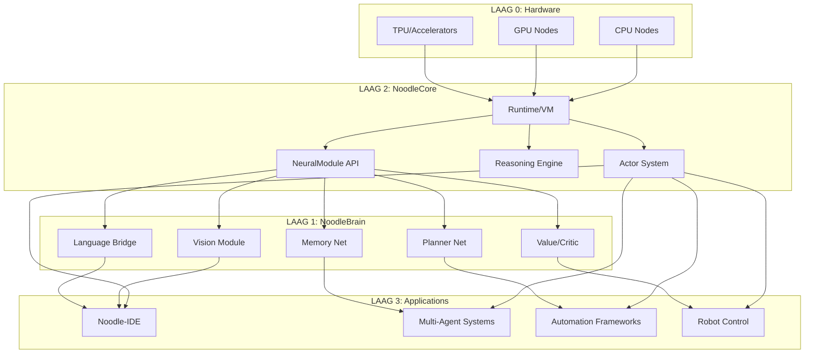
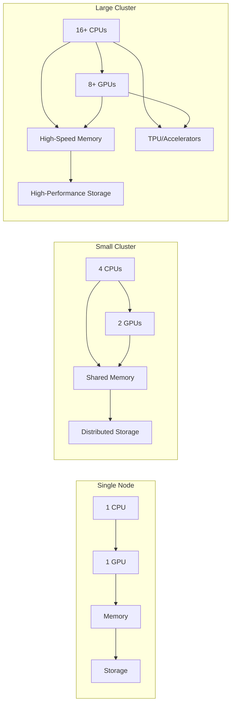

# 🧩 ARCHITECTURE_OVERVIEW.md

## Top-down Architectuur

### LAAG 0 — Hardware

**Functie**: Fysieke compute infrastructuur.

**Componenten**:
- CPU
- GPU
- eventueel multi-node clusters
- future TPU/AI accelerator support

**Kenmerken**:
- Hardware abstractie lagen
- Resource management
- Compute heterogeniteit

### LAAG 1 — NoodleBrain (neurale engine)

**Functie**: Subsymbolische laag voor pattern herkenning en intuïtie.

**Modules**:
- Vision
- Language Bridge
- Planner Net
- Memory Net
- Value/Critic
- Future: Spiking modules

**Kenmerken**:
- Eigen weights, learning rules
- Persistente state
- Trainable tijdens runtime
- Modulair, niet één groot model
- Online learning capabilities

**API Interface**:
```python
class NeuralModule:
    def forward(self, input_data):
        """Forward pass through neural network"""
        pass
    
    def train(self, data, labels):
        """Train neural network with data"""
        pass
    
    def load(self, path):
        """Load trained model from storage"""
        pass
    
    def save(self, path):
        """Save trained model to storage"""
        pass
```

### LAAG 2 — NoodleCore (symbolische laag)

**Functie**: "De denktaal" voor planning, logica en structuur.

**Componenten**:
- Taal
- Type system
- Actor runtime
- Async primitives
- VM/bytecode/JIT
- NeuralModule API
- Tooling + orchestrators
- Memory abstractions
- Reasoning frameworks
- Agent frameworks

**Taken**:
- Plannen
- Logica
- Structuur
- Tools aanroepen
- Neurale modules orkestreren
- Langlopende agents uitvoeren

**NeuralModule Integration**:
```python
class NoodleCoreRuntime:
    def load_neural_module(self, module_path):
        """Load neural module as actor"""
        return self.actor_system.spawn(module_path)
    
    def orchestrate_modules(self, modules, task):
        """Orchestrate multiple neural modules"""
        plan = self.planner.create_plan(task, modules)
        return self.executor.execute(plan)
```

### LAAG 3 — Applications & Agents

**Functie**: Toepassings die NoodleCore en NoodleBrain combineren.

**Voorbeelden**:
- Noodle-IDE
- Code-assistenten
- Multi-agent systemen
- Kenniswerkers
- Zelflerende bots
- OS-achtige omgevingen
- Automation frameworks
- Robot control

**Toegang tot**:
- Reasoning
- LLM-kracht (via modules)
- Lokale neurale modules
- Planning
- Persistente geheugen
- Multi-task coordination

## Interconnect

### Communicatiepatronen

**Actor-Berichten**:
- Asynchronous message passing
- Type-veilige communicatie
- Fault-tolerante delivery

**Message Queues**:
- Distributed task scheduling
- Prioriteit gebaseerd verwerking
- Back-pressure handling

**Shared Memory Abstraction**:
- Type-veilige data deling
- Zero-copy operaties waar mogelijk
- Garbage collection

**Neural Module RPC's**:
- Standard interface voor neurale operaties
- Hardware-geoptimaliseerde uitvoering
- Resultaat streaming

**Distributed Mini-VM's**:
- Code shipping naar nodes
- Sandboxed uitvoering
- Resource monitoring

## Architecturale Filosofie

### Kernprincipes

1. **Modulariteit**
   - Elke laag is onafhankelijk vervangbaar
   - Standaard interfaces tussen componenten
   - Plug-and-play architectuur

2. **Persistentie**
   - State bewaard tussen sessies
   - Langlopende processen mogelijk
   - Fault-tolerante opslag

3. **Observability**
   - Volledige monitoring van alle lagen
   - Distributed tracing
   - Real-time debugging

4. **Hot-Reload Everywhere**
   - Code updates zonder downtime
   - Live module vervanging
   - A/B testing mogelijk

5. **Extreem Parallel**
   - Massaal parallellisme
   - Lock-free datastructuren
   - Actor-based concurrency

6. **Cognitive Layering**
   - Duidige scheiding symbolisch/neuraal
   - Welgedefinieerde interfaces
   - Complementaire functionaliteit

7. **Neural + Symbolic Hybrid Design**
   - Beste van beide werelden
   - Synergie tussen lagen
   - Emergente intelligentie

### Ontwikkelbaar in Kleine Stappen

1. **Foundation First**
   - Begin met robuuste basis
   - Voeg complexiteit toe indien nodig
   - Valideer elke laag

2. **Production-Eerste Mentaliteit**
   - Ontwerp voor productie van dag 1
   - Monitoring en observabiliteit
   - Security by design

3. **AI-Native vanaf Dag 1**
   - AI integratie geen afterthought
   - Machine learning in elke component
   - Adaptief vermogen

## Datastromen



## Security Model

### Capability-Based Security

```python
class Capability:
    def __init__(self, resource, actions):
        self.resource = resource
        self.actions = actions
        self.granted_by = None
        self.expires_at = None
    
    def check(self, action):
        """Check if capability grants action"""
        return action in self.actions and not self.expired()
    
    def delegate(self, target_capability, actions):
        """Delegate subset of actions to another capability"""
        return Capability(target_capability, actions)
```

### Isolation Principes

1. **Hardware Isolation**
   - VM's en containers voor code uitvoering
   - Resource limits per process
   - Secure boot process

2. **Network Isolation**
   - Encrypted communicatie tussen nodes
   - Zero-trust netwerkmodel
   - Capability-based routing

3. **Data Isolation**
   - Type-veilige data toegang
   - Encrypted opslag
   - Audit trails voor data toegang

## Performance Consideraties

### Hardware Optimalisatie

- **CPU**: Optimale instructiepipelines, cache-gebruik
- **GPU**: CUDA/OpenCL integratie, tensor operaties
- **NPU**: Gespecialiseerde AI acceleratie ondersteuning

### Software Optimalisatie

- **JIT Compilation**: Dynamische optimalisatie per hardware
- **Memory Management**: Zero-copy, pool-based allocatie
- **Network**: Minimal latency routing, compression

### Schaalbaarheid



## Implementatie Strategie

### Fase 1: Foundation (LAAG 0-1)

1. Hardware abstractie lagen
2. Basis NoodleCore runtime
3. Eenvoudige neurale module interface

### Fase 2: Neural Integration (LAAG 1-2)

1. NoodleBrain basis modules
2. Volledige NeuralModule API
3. Eerste hybride applicaties

### Fase 3: Ecosystem (LAAG 2-3)

1. Volledige tooling
2. Multi-agent frameworks
3. Productie-ready applicaties

### Fase 4: Optimalisatie

1. Performance tuning
2. Security hardening
3. Schaalbaarheid verbetering

## Conclusie

Deze architectuur biedt een fundamenteel vooruitzicht voor het bouwen van een AI-native, gedistribueerd systeem. Door duidelijke scheiding tussen hardware, neurale engine, symbolische laag en applicaties, creëren we een modulair, schaalbaar en toekomstbestendig platform.

De sleutel tot succes ligt in de synergie tussen de lagen:
- Hardware provides raw compute kracht
- NoodleBrain levert pattern herkenning en intuïtie
- NoodleCore biedt structuur, planning en logica
- Applicaties leveren waarde aan gebruikers

Samen vormen ze een compleet ecosysteem dat kan evolueren van simpele neurale netwerken naar volledige AGI-capabele systemen.

---

*Laatst bijgewerkt: 16 November 2025*
*Versie: 1.0*
*Auteurs: NoodleCore Architectuur Team*