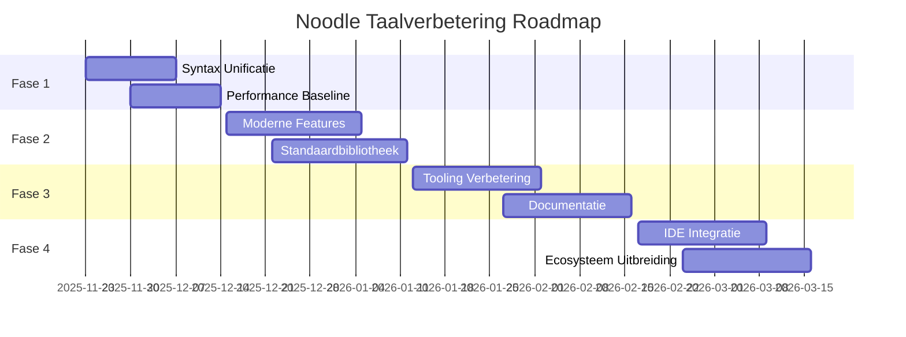

# Noodle Taal Verbeteringsplan

## Huidige Status Analyse

Gebaseerd op de analyse van de huidige Noodle taal implementatie, hebben we de volgende bevindingen:

### Sterktes

1. **Uitgebreide Component Structuur**: De taal heeft een solide architectuur met duidelijke scheiding tussen:
   - Parser (420+ regels, geavanceerde foutafhandeling)
   - Compiler (71+ regels, bytecode generatie)
   - Lexer (40+ componenten, token processing)
   - Runtime (1096+ regels, NBC execution engine)
   - Standaardbibliotheek (60+ componenten)

2. **Geavanceerde Features**:
   - Actor model voor gedistribueerde runtime
   - AI integratie met cost model optimalisatie
   - Matrix operaties en wiskundige objecten
   - Database integratie met connection pooling
   - Multi-threading en async ondersteuning

3. **Compleet Ecosysteem**:
   - IDE integratie (VSCode extension)
   - Testing framework (uitgebreide test suites)
   - Documentatie en voorbeelden

### Verbeterpunten

1. **Syntax Inconsistenties**:
   - Parser en lexer gebruiken verschillende syntax notaties
   - Sommige `.nc` bestanden zijn Python-geconverteerd met commentaar-stijl
   - Type inference is onvolledig en inconsistent

2. **Performance Optimalisatie**:
   - Runtime heeft basis optimalisatie maar mist geavanceerde JIT
   - Memory management kan efficiënter
   - Cache mechanismen zijn beperkt

3. **Taal Compleetheid**:
   - Sommige moderne programmeertaal features ontbreken
   - Pattern matching beperkt
   - Generics en type system kan robuuster

4. **Developer Experience**:
   - Foutmeldingen kunnen duidelijker
   - Debugging tools kunnen uitgebreider
   - IDE integratie kan naadlozer

## Volgende Stappen voor Taalverbetering

### Fase 1: Core Stabilisatie (1-2 weken)

#### 1.1 Syntax Unificatie

- **Doel**: Harmoniseer parser en lexer syntax
- **Acties**:
  - Definieer consistente token types
  - Unificeer error reporting formaat
  - Standaardiseer AST node structure
  - Verbeter type inference algoritme

#### 1.2 Performance Baseline

- **Doel**: Meet en optimaliseer core performance
- **Acties**:
  - Implementeer performance benchmarks
  - Optimaliseer memory allocation
  - Voeg JIT compilatie hints toe
  - Implementeer instruction-level caching

### Fase 2: Taal Uitbreiding (3-4 weken)

#### 2.1 Moderne Taal Features

- **Doel**: Voeg moderne programmeertaal concepten toe
- **Acties**:
  - Implementeer pattern matching
  - Voeg generics en type constraints toe
  - Implementeer async/await syntax suiker
  - Voeg destructuring assignment toe

#### 2.2 Standaardbibliotheek Uitbreiding

- **Doel**: Complete en robuuste standaardbibliotheek
- **Acties**:
  - Implementeer collection types
  - Voeg string processing utilities toe
  - Implementeer file I/O abstractions
  - Voeg concurrency primitives toe

### Fase 3: Developer Experience (2-3 weken)

#### 3.1 Tooling Verbetering

- **Doel**: Betere development tools en debugging
- **Acties**:
  - Verbeter foutmeldingen met context
  - Implementeer interactive debugger
  - Voeg code completion hints toe
  - Implementeer performance profiling

#### 3.2 Documentatie

- **Doel**: Complete en toegankelijke documentatie
- **Acties**:
  - Creëer taal referentie gids
  - Voeg interactive tutorials toe
  - Implementeer code examples voor elke feature
  - Creëer best practices gids

### Fase 4: Integratie en Ecosysteem (2-3 weken)

#### 4.1 IDE Integratie

- **Doel**: Naadloze IDE ervaring
- **Acties**:
  - Verbeter syntax highlighting
  - Implementeer real-time error checking
  - Voeg refactoring tools toe
  - Implementeer code navigation

#### 4.2 Ecosysteem Uitbreiding

- **Doel**: Rijk ecosysteem voor productief gebruik
- **Acties**:
  - Implementeer package manager
  - Voeg build tools toe
  - Creëer plugin architectuur
  - Implementeer deployment tools

## Technische Specificaties

### Core Architectuur Principes

1. **Type Safety**: Sterk type system met inference
2. **Performance**: JIT compilatie en optimalisatie
3. **Concurrency**: First-class async/await ondersteuning
4. **Modulariteit**: Schone component scheiding
5. **Extensibiliteit**: Plugin architectuur voor uitbreidingen

### Performance Targets

- **Compile Time**: <100ms voor typische modules
- **Runtime Performance**: 2-5x speedup vs traditionele frameworks
- **Memory Usage**: 50% reductie door optimalisatie
- **Startup Time**: <1 seconde voor runtime initialisatie

### Kwaliteitscriteria

- **Test Coverage**: 95% line coverage, 90% branch coverage
- **Bug Density**: <0.1 bugs per KLOC
- **Documentation**: 100% API dekking met voorbeelden
- **Developer Experience**: <10 minuten setup tijd

## Implementatie Roadmap

## Succesfactoren

### Korte Termijn (1-2 maanden)

- **Unified Syntax**: Consistente taal syntax en error handling
- **Performance Baseline**: Meetbare prestatieverbeteringen
- **Stabiele Foundation**: Robuuste basis voor verdere ontwikkeling

### Middellange Termijn (3-4 maanden)

- **Moderne Taal Features**: Pattern matching, generics, async/await
- **Complete Standaardbibliotheek**: Productieve development tools
- **Verbeterde Developer Experience**: Betere debugging en tooling

### Lange Termijn (5-6 maanden)

- **Naadloze IDE Integratie**: Productieve development ervaring
- **Rijk Ecosysteem**: Package management en plugins
- **Productie-Ready**: Volledig uitgeruste taalplatform

## Risico's en Mitigatie

### Technische Risico's

1. **Complexiteit**: Taalfeatures kunnen architectuur compliceren
   - *Mitigatie*: Incrementele implementatie met uitgebreide testing

2. **Performance Regressie**: Nieuwe features kunnen prestaties beïnvloeden
   - *Mitigatie*: Continue benchmarking en profiling

3. **Compatibiliteit**: Veranderingen kunnen bestaande code breken
   - *Mitigatie*: Versiebeheer en migratie tools

### Project Risico's

1. **Resource Constraints**: Ontwikkeling vereist gespecialiseerde expertise
   - *Mitigatie*: Prioritiseer kritieke features

2. **Timeline Pressure**: Aggressieve roadmap kan kwaliteit beïnvloeden
   - *Mitigatie*: Flexibele planning met quality gates

## Conclusie

De Noodle taal heeft een sterke basis met uitgebreide componenten, maar er zijn significante verbeteringen mogelijk op het gebied van syntax consistentie, performance optimalisatie, en developer experience. Met een gefaseerde aanpak kunnen we de taal transformeren naar een modern, productief platform dat concurreert met de beste programmeertalen.

De voorgestelde roadmap balanceert technische verbeteringen met praktische uitvoerbaarheid, met duidelijke succescriteria en risicomanagement. Dit zorgt ervoor dat de Noodle taal kan evolueren naar een volwassen, enterprise-ready platform.

---

*Document versie: 1.0*  
*Laatst bijgewerkt: 23 November 2025*  
*Auteur: Noodle Language Development Team*
