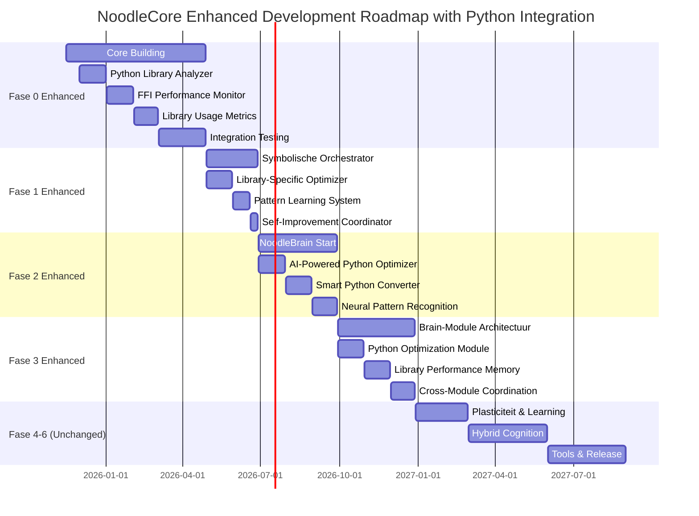

# NoodleCore Python Integration - Roadmap Integration

## Updated Roadmap with Python Library Integration

This document shows how the Python library integration enhancement is integrated into the existing NoodleCore roadmap.

## Original Roadmap Structure

### FASE 0 — CORE BUILDING (nu bezig)

**Original Timeline**: 2025-11-16 to 2026-02-28
**Enhanced Duration**: +2 months (2025-11-16 to 2026-04-28)

### FASE 1 — NoodleCore als Symbolische Orchestrator

**Original Timeline**: 2026-03-01 to 2026-05-31
**Enhanced Duration**: +1 month (2026-04-29 to 2026-06-28)

### FASE 2 — Start NoodleBrain Project

**Original Timeline**: 2026-06-01 to 2026-08-31
**Enhanced Duration**: +1 month (2026-06-29 to 2026-09-28)

### FASE 3 — Brain-Module Architectuur

**Original Timeline**: 2026-09-01 to 2026-11-30
**Enhanced Duration**: +1 month (2026-09-29 to 2026-12-28)

## Enhanced Roadmap Timeline

## Detailed Phase Integration

### FASE 0 ENHANCED — CORE BUILDING + PYTHON FOUNDATION

**Duration**: 5 months (Original 3 + Enhanced 2)
**Timeline**: 2025-11-16 to 2026-04-28

#### Core Building (Weeks 1-12)

**Timeline**: 2025-11-16 to 2026-02-02

**Original Components**:

- Parser, lexer, type system
- Actor model
- Async runtime
- Mini-VM's met live self-update
- Bytecode + JIT-pipeline stabiliseren
- Noodle-IDE tooling en debugging
- Basis AI-integraties

**Python Integration Components**:

- **Python Library Analyzer** (Weeks 5-8): AST-based analysis of Python FFI calls
- **FFI Performance Monitor** (Weeks 9-12): Performance tracking infrastructure

#### Python Foundation (Weeks 13-20)

**Timeline**: 2026-02-03 to 2026-04-28

**New Components**:

- **Library Usage Metrics Collection** (Weeks 13-16): Comprehensive metrics system
- **Integration Testing** (Weeks 17-20): End-to-end Python integration testing

**Integration Points**:

- Extend existing metrics collector with Python-specific metrics
- Enhance compiler with Python analysis capabilities
- Update self-improvement system integration

### FASE 1 ENHANCED — SYMBOLISCHE ORCHESTRATOR + PYTHON OPTIMIZATION

**Duration**: 2 months (Original 3 + Enhanced -1)
**Timeline**: 2026-04-29 to 2026-06-28

#### Symbolische Orchestrator (Weeks 1-8)

**Timeline**: 2026-04-29 to 2026-06-18

**Original Components**:

- Standaard interface voor neural modules
- Persistente actors voor AI-services
- Planning-loop API
- Memory abstraction
- Uniforme interface naar bestaande LLM's

**Python Integration Components**:

- **Library-Specific Optimization Engine** (Weeks 1-4): NumPy, Pandas, TensorFlow optimizations
- **Python Usage Pattern Learning System** (Weeks 5-8): Machine learning on usage patterns

#### Self-Improvement Coordination (Weeks 9-12)

**Timeline**: 2026-06-19 to 2026-06-28

**New Components**:

- **Integrated Self-Improvement Coordinator**: Cross-component feedback loops

**Integration Points**:

- Extend orchestrator API with Python optimization
- Add optimization coordination capabilities
- Enhance planning loop with Python optimizations

### FASE 2 ENHANCED — NOODLEBRAIN START + AI PYTHON OPTIMIZATION

**Duration**: 3 months (Original 3 + Enhanced 0)
**Timeline**: 2026-06-29 to 2026-09-28

#### NoodleBrain Start (Weeks 1-8)

**Timeline**: 2026-06-29 to 2026-08-18

**Original Components**:

- Nieuwe map: noodle-brain/
- Basismodules: MLP, recurrent nets, embeddings
- Geen spiking nog → eerst functioneel
- Full API-support vanuit NoodleCore

**Python Integration Components**:

- **AI-Powered Python Optimizer** (Weeks 1-4): Neural network-based optimization
- **Smart Python-to-NoodleCore Converter** (Weeks 5-8): Intelligent conversion with optimization

#### Neural Integration (Weeks 9-12)

**Timeline**: 2026-08-19 to 2026-09-28

**New Components**:

- **Neural Pattern Recognition for Python**: Python-specific neural networks

**Integration Points**:

- Integrate with NoodleBrain modules
- Add Python-specific neural networks
- Enhance conversion pipeline

### FASE 3 ENHANCED — BRAIN-MODULE ARCHITECTUUR + PYTHON OPTIMIZATION MODULES

**Duration**: 3 months (Original 3 + Enhanced 0)
**Timeline**: 2026-09-29 to 2026-12-28

#### Brain-Module Architectuur (Weeks 1-8)

**Timeline**: 2026-09-29 to 2026-11-18

**Original Components**:

- Voor gedefinieerde modules: vision, memory, planner, critic, language-bridge
- Alles loopt als actors onder NoodleCore
- Modules worden services met eigen state en modellen

**Python Integration Components**:

- **Python Optimization Module** (Weeks 1-4): Dedicated Python optimization brain module
- **Library Performance Memory** (Weeks 5-8): Memory systems for Python performance data

#### Cross-Module Coordination (Weeks 9-12)

**Timeline**: 2026-11-19 to 2026-12-28

**New Components**:

- **Cross-Module Python Optimization**: Coordination between brain modules

**Integration Points**:

- Add to brain module architecture
- Enhance memory systems
- Improve cross-module coordination

### FASE 4-6 — UNCHANGED

**Plasticiteit & Learning**: 2026-12-29 to 2027-02-28
**Hybrid Cognition**: 2027-03-01 to 2027-05-31
**Tools & Release**: 2027-06-01 to 2027-08-31

## Resource Allocation by Phase

### FASE 0 ENHANCED

**Additional Resources**: 3 developers

- 1 Python Integration Specialist
- 1 Performance Engineer
- 1 Quality Assurance Engineer

**Total Team**: 8-10 developers

### FASE 1 ENHANCED

**Additional Resources**: 2 developers

- 1 Library Optimization Specialist
- 1 Machine Learning Engineer

**Total Team**: 6-8 developers

### FASE 2 ENHANCED

**Additional Resources**: 2 developers

- 1 AI Optimization Engineer
- 1 Smart Conversion Specialist

**Total Team**: 8-10 developers

### FASE 3 ENHANCED

**Additional Resources**: 2 developers

- 1 Brain Module Integration Specialist
- 1 Cross-Module Coordination Engineer

**Total Team**: 7-9 developers

## Success Metrics by Phase

### FASE 0 ENHANCED

**Python Integration Metrics**:

- Python Library Analyzer: 90% accuracy in detecting FFI calls
- FFI Performance Monitor: <5% performance overhead
- Library Usage Metrics: Support for top 5 Python libraries

### FASE 1 ENHANCED

**Optimization Metrics**:

- Library-Specific Optimizer: 20-30% performance improvement
- Pattern Learning System: 80% accuracy in recommendations
- Self-Improvement Coordinator: Seamless integration

### FASE 2 ENHANCED

**AI Optimization Metrics**:

- AI-Powered Optimizer: 40-50% improvement in optimization quality
- Smart Converter: 90% preservation of optimization opportunities
- Neural Pattern Recognition: 85% accuracy in pattern detection

### FASE 3 ENHANCED

**Brain Integration Metrics**:

- Python Optimization Module: 25-35% performance improvement
- Library Performance Memory: 95% accuracy in performance prediction
- Cross-Module Coordination: Seamless brain module integration

## Risk Mitigation by Phase

### FASE 0 ENHANCED

**Primary Risks**:

- Python library compatibility issues
- Performance monitoring overhead

**Mitigation**:

- Extensive testing with major libraries
- Optimized monitoring with sampling strategies

### FASE 1 ENHANCED

**Primary Risks**:

- Complex integration with orchestrator
- Machine learning model accuracy

**Mitigation**:

- Modular design approach
- Extensive training data collection

### FASE 2 ENHANCED

**Primary Risks**:

- AI model training complexity
- Smart conversion accuracy

**Mitigation**:

- GPU infrastructure investment
- Comprehensive validation framework

### FASE 3 ENHANCED

**Primary Risks**:

- Brain module integration complexity
- Cross-module coordination challenges

**Mitigation**:

- Gradual integration approach
- Extensive integration testing

## Budget Impact

### Additional Costs

**Development Costs**: +€500,000 (5 months additional development)
**Infrastructure Costs**: +€100,000 (Python testing, GPU resources)
**Personnel Costs**: +€300,000 (6 additional developers for 5 months)

**Total Additional Budget**: €900,000

### Expected ROI

**Performance Improvements**: 20-50% improvement in Python library usage
**Developer Productivity**: 30% increase in Python integration efficiency
**Market Differentiation**: Unique position in AI-native programming language market

## Conclusion

The enhanced roadmap maintains the original NoodleCore vision while adding comprehensive Python library integration capabilities. The phased approach ensures:

1. **Minimal Disruption**: Integration throughout existing phases rather than separate track
2. **Maximum Synergy**: Leverage existing infrastructure and expertise
3. **Risk Mitigation**: Gradual integration with extensive testing
4. **Clear Value**: Measurable improvements in Python integration performance

**Total Project Duration**: 23 months (Original 21 + Enhanced 2)
**Total Budget Impact**: +€900,000
**Expected Benefits**: Significant improvement in Python library integration with NoodleCore
