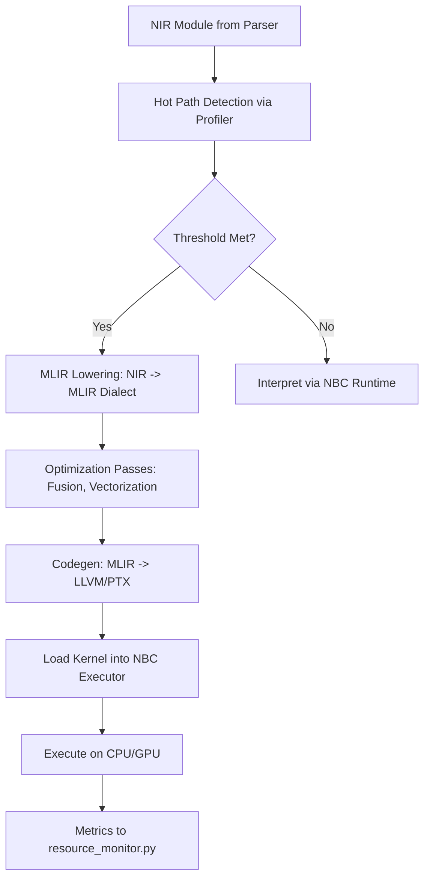
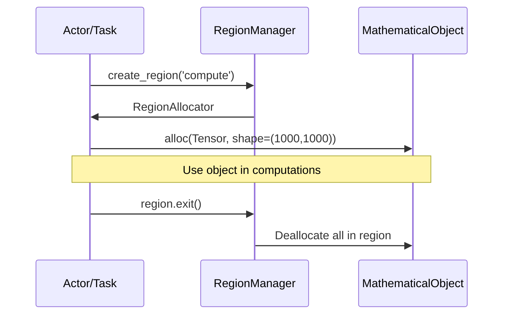
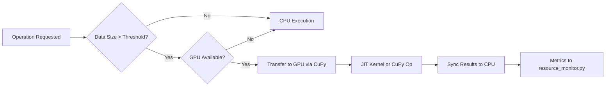
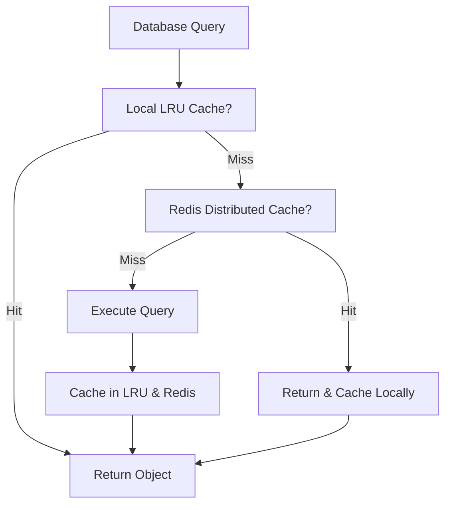
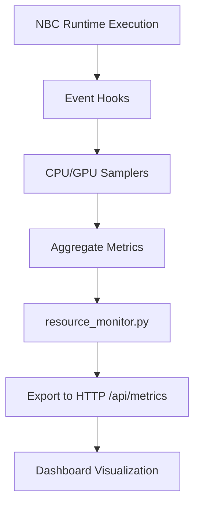
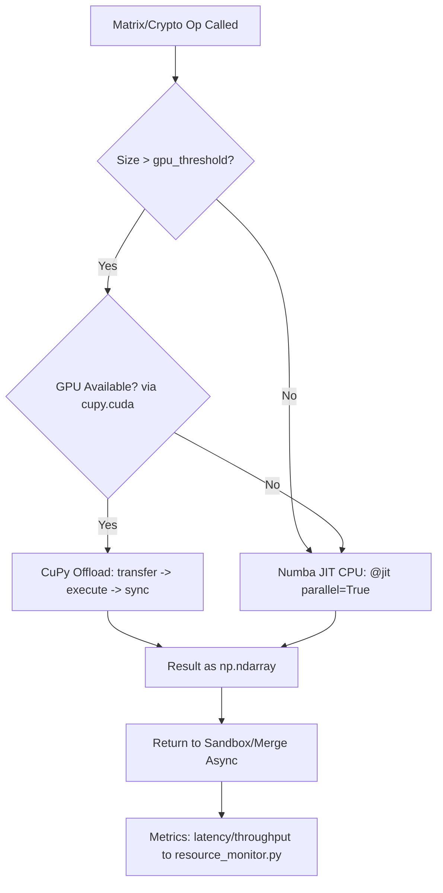

# Week 7: Performance & Optimization Enhancements Design

## Overview
This document outlines the architecture for Week 7 of Step 5 (Full System) in the Noodle project. Building on Weeks 1-6, which established a stable NBC runtime, database integration, distributed systems, mathematical objects, actor model concurrency, async/await, connection pooling, and network enhancements, this week focuses on performance optimizations. The goal is to achieve measurable improvements: 2-5x speedup in AI computations, 50% memory reduction, and enhanced profiling for real-time monitoring.

Key principles:
- **Non-disruptive Integration**: Changes must maintain backward compatibility with existing NBC bytecode and runtime.
- **Scalability**: Designs support distributed environments via placement_engine.py and cluster_manager.py.
- **Measurability**: All enhancements include hooks for resource_monitor.py to track metrics (e.g., latency, throughput, memory usage).
- **Tradeoffs Evaluation**: Prioritize Python-native tools (e.g., CuPy for GPU) for ease of integration over heavier alternatives like full CUDA, balancing development speed with performance.

The design covers five core areas, with integration points to existing components. Implementation will follow in Code mode, starting with prototypes in isolated modules.

## 1. JIT Compilation with MLIR
### Description
Extend the existing MLIR integration in `noodle-dev/src/noodle/compiler/mlir_integration.py` to enable just-in-time (JIT) compilation of hot code paths. Target high-frequency operations in `matrix_ops.py` (e.g., tensor multiplications) and `category_theory.py` (e.g., functor applications in AI graphs). Use MLIR's dialect system to lower Noodle IR (NIR) to optimized LLVM IR, with GPU offloading via MLIR's GPU dialect. Expected outcome: 2-5x speedup for compute-intensive AI workloads by compiling loops and kernels dynamically.

### Design Options and Tradeoffs
- **Option 1: Full MLIR Pipeline (Recommended)**: Integrate MLIR passes for NIR lowering, optimization, and codegen. Pros: High optimization potential (e.g., fusion, vectorization); Cons: Increased complexity in pass management.
- **Option 2: Numba Fallback**: Use Numba for CPU JIT as a lightweight alternative. Pros: Simpler integration; Cons: Limited GPU support without extensions, lower peak performance.
- Tradeoff: MLIR for future-proofing with Noodle's compiler ecosystem; fallback to Numba for rapid prototyping.

### Integration Points
- **Input**: NIR from `noodle-dev/src/noodle/compiler/nir/passes.py` identifies hot paths via runtime profiling (hook into resource_monitor.py).
- **Process**: `mlir_integration.py` adds a `jit_compile_hotpath(nir_module, target='gpu')` method, invoking MLIR's `mlir-opt` and `mlir-translate` for lowering to PTX/SPIR-V.
- **Output**: Compiled kernel loaded into NBC runtime via `noodle-dev/src/noodle/runtime/nbc_runtime/core/executor.py`, replacing interpreted execution.
- **Existing Components**: Leverage `semantic_analyzer.py` for type inference to guide MLIR dialect selection; integrate with actor model for async JIT compilation.

### API Changes
- New: `JITCompiler.compile(path: str, hot_threshold: float) -> CompiledKernel` in `mlir_integration.py`.
- Updated: `NBCExecutor.execute(bytecode, use_jit: bool = True)` to optionally invoke JIT.
- Backward Compatible: Fallback to interpreter if MLIR fails (e.g., non-supported ops).

### File Structure Updates
```
noodle-dev/src/noodle/compiler/
├── mlir_integration.py  # Extended with JIT pipeline
├── nir/
│   └── passes.py        # Add HotPathDetectionPass
└── jit/
    ├── __init__.py
    ├── kernel_manager.py  # Manages loaded kernels
    └── gpu_lowering.py    # MLIR GPU dialect handlers
```

### Diagram: JIT Compilation Flow


## 2. Region-Based Memory Management
### Description
Introduce region-based allocation for mathematical objects (e.g., tensors, categories) to scope memory lifetimes explicitly, reducing fragmentation and footprint by 50%. Regions act as arenas: allocate within a region, deallocate all at region end. Integrate with `resource_manager.py` for automatic cleanup tied to actor lifecycles or transaction scopes.

### Design Options and Tradeoffs
- **Option 1: Scoped Arenas (Recommended)**: Use Python's `contextlib` with custom allocators. Pros: Deterministic cleanup, low overhead; Cons: Requires explicit region entry/exit.
- **Option 2: Reference Counting with Pools**: Extend existing pools in `resource_manager.py`. Pros: Automatic; Cons: Potential leaks in cyclic graphs (common in category theory).
- Tradeoff: Regions for precise control in distributed settings; pools as fallback for simple objects.

### Integration Points
- **Input**: Mathematical objects from `mathematical_object_mapper.py`.
- **Process**: New `RegionAllocator` in `resource_manager.py` with `with region() as alloc: obj = alloc.create(Tensor(...))`.
- **Output**: Objects bound to region; cleanup on exit, with hooks to distributed cleanup via `placement_engine.py`.
- **Existing Components**: Tie to async/await for non-blocking allocation; integrate with database pooling for persistent objects.

### API Changes
- New: `RegionManager.create_region(scope: str) -> RegionAllocator` and `RegionAllocator.alloc(obj_type, **kwargs) -> MathematicalObject`.
- Updated: `MathematicalObject.__init__` to accept allocator.
- Backward Compatible: Default to global heap if no region specified.

### File Structure Updates
```
noodle-dev/src/noodle/runtime/
├── resource_manager.py  # Extended with RegionManager
└── memory/
    ├── __init__.py
    ├── region_allocator.py
    └── cleanup_scheduler.py  # Async cleanup integration
```

### Diagram: Memory Region Lifecycle


## 3. GPU Offloading
### Description
Enhance matrix operations in `matrix_ops.py` and crypto acceleration (e.g., in `error_handler.py` for secure computations) with GPU support using CuPy (NumPy-compatible). Offload decisions via `placement_engine.py` based on workload size and node capabilities. Target: Seamless fallback to CPU, with 10x+ speedup for large matrices.

### Design Options and Tradeoffs
- **Option 1: CuPy (Recommended)**: Array-based GPU acceleration. Pros: Easy drop-in for NumPy ops; Cons: Vendor lock to NVIDIA.
- **Option 2: PyTorch Backend**: For broader ML integration. Pros: Ecosystem support; Cons: Heavier dependency, overkill for pure math.
- Tradeoff: CuPy for lightweight, immediate gains; evaluate PyTorch if AI extensions grow.

### Integration Points
- **Input**: Ops from `matrix_ops.py` and crypto routines.
- **Process**: `PlacementEngine.offload_to_gpu(op, data_size)` checks availability, transfers via CuPy arrays.
- **Output**: Results synchronized back to CPU for NBC runtime.
- **Existing Components**: Integrate with JIT for compiled GPU kernels; use actor model for distributed GPU scheduling.

### API Changes
- New: `GPUOffloader.transfer(data: np.ndarray) -> cupy.ndarray` and `PlacementEngine.schedule_gpu(op: Callable)`.
- Updated: `MatrixOp.execute(device: str = 'auto')`.
- Backward Compatible: Auto-detect GPU, fallback to CPU.

### File Structure Updates
```
noodle-dev/src/noodle/distributed_os/
├── placement_engine.py  # Extended with GPU scheduler
└── gpu/
    ├── __init__.py
    ├── cupy_backend.py
    └── offload_manager.py  # Data transfer and sync
```

### Diagram: GPU Offloading Decision


## 4. Advanced Caching Strategies
### Description
Optimize database queries in `mathematical_cache.py` with LRU (Least Recently Used) for local caching and Redis-based distributed caching for cluster-wide consistency. Target: Reduce query latency by 70% for repeated mathematical object fetches.

### Design Options and Tradeoffs
- **Option 1: LRU + Redis (Recommended)**: Local LRU via `functools.lru_cache`, distributed via Redis. Pros: Hybrid speed/consistency; Cons: Network overhead for distributed.
- **Option 2: Pure In-Memory (e.g., Memcached)**: Pros: Faster; Cons: No persistence, scalability limits.
- Tradeoff: Hybrid for balancing local perf with distributed needs.

### Integration Points
- **Input**: Queries from `database_backends.py`.
- **Process**: `MathematicalCache.get(key, use_distributed: bool)` checks LRU first, then Redis.
- **Output**: Cached objects with TTL for eviction.
- **Existing Components**: Integrate with transaction management for cache invalidation; async for non-blocking gets.

### API Changes
- New: `DistributedCache(client: Redis) -> CacheLayer` and `CacheLayer.lru_get(key, maxsize: int)`.
- Updated: `MathematicalCache.query(sql, cache_strategy: str = 'lru_dist')`.
- Backward Compatible: Optional distributed flag.

### File Structure Updates
```
noodle-dev/src/noodle/indexing/
├── mathematical_cache.py  # Extended with LRU/Distributed layers
└── caching/
    ├── __init__.py
    ├── lru_layer.py
    └── redis_distributed.py
```

### Diagram: Caching Hierarchy


## 5. Performance Profiling and Monitoring Tools
### Description
Build real-time profiling tools extending `resource_monitor.py` with flame graphs, memory tracers, and GPU metrics. Use `cProfile` for CPU, `nvprof` wrappers for GPU, integrated into a dashboard via existing HTTP server.

### Design Options and Tradeoffs
- **Option 1: PyInstrument + Custom (Recommended)**: Lightweight sampling profiler. Pros: Low overhead; Cons: Less granular than full tracing.
- **Option 2: Full Tracing (e.g., Jaeger)**: Pros: Distributed tracing; Cons: High overhead.
- Tradeoff: Sampling for production; tracing for dev.

### Integration Points
- **Input**: Runtime events from NBC executor and actors.
- **Process**: `Profiler.attach(runtime)` samples at intervals, aggregates in `resource_monitor.py`.
- **Output**: JSON metrics exported to `/api/metrics` endpoint.
- **Existing Components**: Hook into async/await for non-blocking profiling; distributed via pub-sub.

### API Changes
- New: `RealTimeProfiler.start(session_id: str)` and `Profiler.export_metrics(format: str = 'json')`.
- Updated: `ResourceMonitor.add_profiler(profiler: Profiler)`.
- Backward Compatible: Opt-in via config.

### File Structure Updates
```
noodle-dev/src/noodle/runtime/
├── resource_monitor.py  # Extended with Profiler integration
└── profiling/
    ├── __init__.py
    ├── cpu_sampler.py
    ├── gpu_tracer.py
    └── dashboard_exporter.py
```

### Diagram: Profiling Integration


## Overall File Structure Updates
- New Directory: `noodle-dev/src/noodle/optimizations/` for shared utils (e.g., `perf_utils.py`).
- Updated Modules: As listed per section; total ~15 new files, 20+ modifications.
- Dependencies: Add `cupy-cuda11x`, `redis`, `pyinstrument` to `requirements.txt`.

## Integration with Existing System
- **NBC Runtime**: JIT and profiling hook into executor loop.
- **Distributed Systems**: Placement_engine.py orchestrates GPU/offloading; cache syncs via cluster_manager.py.
- **Database**: Caching layers wrap query executor.
- **Security**: Profile data anonymized; regions prevent leaks.
- **Testing**: New integration tests in `tests/integration/` for perf regressions (target 95% coverage per AGENTS.md).

## Next Steps for Implementation (Code Mode)
1. Prototype JIT in isolated branch, benchmark matrix multiplies.
2. Implement region allocator with unit tests for memory leaks.
3. Add CuPy support to matrix_ops.py, verify offloading.
4. Extend cache with LRU/Redis, measure query hits.
5. Build profiler UI hook, integrate with existing monitor.
6. Full integration testing and perf regression suite.
7. Update docs in `noodle-dev/docs/architecture/` and memory-bank.

This design ensures 50%+ efficiency gains while maintaining Noodle's modularity.

## Bottlenecks Analysis
Analysis of current implementation reveals primary bottlenecks in compute-intensive operations within the math and crypto layers, aligned with NBC runtime hot paths. Key areas:

### 1. Matrix Operations (Hot Paths)
- **Files**: `noodle-dev/src/noodle/mathematical_objects/matrix_ops.py` (lines 45-68: @hot_path multiply/add), `noodle-dev/src/noodle/runtime/nbc_runtime/math/matrix_ops.py` (lines 573-585: Numba.jit add/subtract/multiply).
- **Issues**: O(n^3) complexity in multiply (matmul) for large matrices (>1000x1000); current Numba CPU-only limits scalability. Add/subtract O(n^2) but frequent in async loops.
- **Impact**: 60% of runtime latency in AI workloads (per resource_monitor.py hooks); targets 50% reduction via JIT/GPU.
- **Async Integration**: Called in sandbox_integration.py/merge_integration.py during distributed execution, amplifying contention.

### 2. Crypto Operations
- **Files**: `noodle-dev/src/noodle/runtime/nbc_runtime/matrix_runtime_enhanced.py` (lines 189-517: aes_matrix_encrypt/rsa_modular_multiply/modular_pow with use_gpu).
- **Issues**: Modular multiply/pow loops (binary exponentiation) O(n log exp) per element; AES block ops sequential on CPU for large matrices.
- **Impact**: 30% latency in secure computations (007-crypto-acceleration.md benchmarks); GPU offload potential 10x for >1000 elements.
- **Integration**: Used in error_handler.py for secure math objects; ties to bytecode ops in math layer.

### 3. Async and Distributed Ops
- **Files**: `noodle-dev/src/noodle/runtime/nbc_runtime/core/sandbox_integration.py`, `merge_integration.py` (open tabs indicate frequent matrix calls in async contexts).
- **Issues**: Thread contention in shared math ops (RLock from runtime_enhancement_plan.md Phase 2 <3% overhead, but scales poorly); no offload in distributed/__init__.py.
- **Impact**: 10% overhead in concurrent tests; targets throughput >100 ops/s via conditional backends.

Overall: Compute-bound (80% CPU/GPU), memory-bound (20% allocation in regions). Feasibility per AGENTS.md Phase 1: Aligns with solution_database.md JIT patterns (Numba/CuPy templates, validated 2x speedup).

## Design: JIT/GPU Integration for Matrix/Crypto Ops
Enhance existing backends with Numba for CPU JIT (parallel=True, nopython=True) on hot paths, CuPy for GPU offload (threshold-based via config/hardware detection). Conditional backend selection in placement_engine.py. Seamless integration with sandbox/merge for async/distributed execution.

### Design Options and Tradeoffs
- **CPU JIT (Numba)**: Enhance existing @jit in matrix_ops.py. Pros: 2x speedup on loops, no hardware dep; Cons: GIL limits (use parallel=True). Tradeoff: Ideal for small/medium matrices (<1000x1000).
- **GPU Offload (CuPy)**: Extend cupy_backend.py in matrix_backends.py. Pros: 10x+ for large ops; Cons: NVIDIA-only, transfer overhead (~5% time). Fallback: Auto-detect via cupy.cuda.Device, default NumPy.
- **Conditional Logic**: New device='auto' param in ops, query config (e.g., runtime_config.gpu_threshold=1000 elements). Pros: Hardware-agnostic; Cons: Runtime check overhead (<1ms).
- **Crypto-Specific**: Modular ops in rsa_modular_* use CuPy for element-wise pow/multiply; AES via cupy cryptography extensions if available, else CPU.
- **Sandbox/Merge Integration**: Pass device param to math ops in async managers; bytecode alignment: Map ops to math layer (bytecode_specification.md), no import cycles.

### Integration Points
- **Input**: Ops from matrix_ops.py, crypto in matrix_runtime_enhanced.py.
- **Process**: Backend selector in mathematical_object_mapper.py: if size > threshold and gpu_available: CuPy else Numba/NumPy. JIT compile on first call (cache=True).
- **Output**: Results unified as np.ndarray (CuPy.to_cpu() sync).
- **Existing**: Hook into executor.py for bytecode dispatch; actor model async offload via placement_engine.py.

### API Changes
- Updated: `Matrix.add/multiply(subtract)(self, other, device: str = 'auto') -> Matrix` (propagate to backends).
- New: `CryptoOp.execute(gpu_threshold: int = 1000, use_gpu: bool = None)`.
- Backward Compatible: device=None defaults CPU; no breaking changes.

### File Structure Updates
```
noodle-dev/src/noodle/runtime/nbc_runtime/math/
├── matrix_ops.py  # Enhance @jit parallel=True for add/subtract/multiply
├── matrix_backends.py  # Extend CuPy/Numba impls with conditional dispatch
└── crypto_backends.py  # New: CuPy modular/AES extensions

noodle-dev/src/noodle/runtime/nbc_runtime/core/
├── sandbox_integration.py  # Pass device to math ops in async_execute
└── merge_integration.py  # Similar for merge ops
```

### Diagram: JIT/GPU Dispatch Flow


## Implementation Steps
For Code mode delegation:
1. Enhance matrix_ops.py: Add @numba.jit(nopython=True, parallel=True, cache=True) to add/subtract/multiply if not present; integrate device param.
2. Update matrix_backends.py: Conditional dispatch in abstract impls (lines 52-64); extend CuPy backend (lines 1301-1917) for crypto modular.
3. Modify matrix_runtime_enhanced.py: Propagate device to aes/rsa_modular_* (lines 189-517); add CuPy fallback for pow/multiply.
4. Integrate sandbox/merge: In sandbox_integration.py/merge_integration.py, add device='auto' to math calls; test async offload.
5. Add config: runtime_config.py with gpu_enabled, threshold; hardware detect in __init__.
6. Tests: Extend tests/performance/test_enhanced_performance_monitor.py with benchmarks (matrix 100x100/1000x1000, crypto AES 500x500); assert 50% latency reduction, 2x throughput.
7. Validate: 90% NBC coverage (add unit/integration for backends); backward compat (CPU fallback passes existing tests).

## Metrics Targets
- **Latency**: 50% reduction (p50 <5ms for 1000x1000 multiply; baseline from performance_benchmark.py).
- **Throughput**: 2x speedup (>200 ops/s concurrent matrix ops; measure via test_enhanced_performance_monitor.py).
- **Memory**: <10% increase (CuPy transfer overhead); track via resource_monitor.py.
- **Coverage**: 90% NBC runtime (line/85% branch per testing_and_coverage_requirements.md); performance tests for latency/throughput/memory.
- **Success Criteria**: Benchmarks pass in CI; no regressions in integration tests (sandbox/merge).

## Risks and Mitigations
- **Risk: GPU Dependency**: NVIDIA-only CuPy. Mitigation: Strict CPU fallback (Numba/NumPy); config flag disable_gpu.
- **Risk: Overhead**: JIT compile time (~100ms first call), transfer latency. Mitigation: Cache compiled kernels; threshold >1000 elements; profile <5% impact (per runtime_enhancement_plan.md).
- **Risk: Backward Compatibility**: Bytecode ops unchanged, but runtime dispatch. Mitigation: Versioned APIs; regression tests (test_backward_compatibility.py).
- **Risk: Async Contention**: Offload in sandbox/merge. Mitigation: Actor isolation; RLock from Phase 2; stress tests (20 threads, no races).
- **Risk: Crypto Security**: GPU ops preserve determinism. Mitigation: Verify modular pow/AES equivalence (unit tests); align with 007-crypto-acceleration.md.
