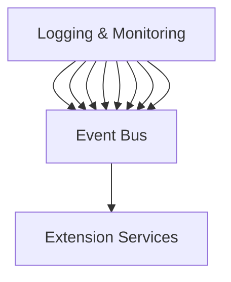

# NoodleCore Infrastructure Documentation

## Overview

This document describes the comprehensive infrastructure modernization implemented for the Noodle VS Code extension. The infrastructure provides a robust, scalable, and maintainable foundation for all extension components.

## Architecture Components

### Core Infrastructure Modules

The infrastructure is organized into several key components that work together to provide a modern, scalable architecture:

#### 1. Service Manager (`ServiceManager.ts`)
**Purpose**: Centralized service management with dependency injection and lifecycle management
**Key Features**:
- Service registration and discovery
- Dependency resolution with circular dependency detection
- Service health monitoring
- Automatic service initialization and disposal
- Event-driven architecture support

#### 2. Event Bus (`EventBus.ts`)
**Purpose**: Decoupled component communication using publish-subscribe pattern
**Key Features**:
- Type-safe event system with metadata
- Event filtering and routing
- Middleware support for cross-cutting concerns
- Event history and metrics
- Performance-optimized event processing

#### 3. Resource Manager (`ResourceManager.ts`)
**Purpose**: Efficient resource management with monitoring and optimization
**Key Features**:
- Memory usage monitoring and thresholds
- CPU usage tracking
- LRU cache implementation with TTL support
- Automatic garbage collection optimization
- Resource quota management
- Performance metrics collection

#### 4. Configuration Manager (`ConfigurationManager.ts`)
**Purpose**: Centralized configuration with environment-specific settings
**Key Features**:
- Environment-specific configuration (dev, prod, test)
- Configuration validation with schemas
- Hot-reloading of configuration changes
- Environment variable support with NOODLE_ prefix
- Secure credential management
- Configuration export/import capabilities

#### 5. Error Handler (`ErrorHandler.ts`)
**Purpose**: Robust error handling with recovery mechanisms
**Key Features**:
- Structured error categorization
- Automatic error recovery with retry logic
- Error pattern matching and routing
- Error statistics and reporting
- Integration with VS Code error reporting
- Context-aware error handling

#### 6. Performance Monitor (`PerformanceMonitor.ts`)
**Purpose**: Real-time performance tracking and profiling
**Key Features**:
- Real-time metrics collection
- Performance profiling with customizable thresholds
- Alert system with configurable rules
- Performance report generation
- Resource usage optimization recommendations
- Historical performance data analysis

#### 7. Testing Framework (`TestingFramework.ts`)
**Purpose**: Comprehensive testing framework for all component types
**Key Features**:
- Unit, integration, and E2E testing support
- Multiple test runners with extensible architecture
- Test result aggregation and reporting
- Performance testing capabilities
- Coverage reporting
- JUnit and HTML report generation

#### 8. Dependency Injection (`DependencyInjection.ts`)
**Purpose**: IoC container for managing dependencies and service lifecycles
**Key Features**:
- Constructor and property injection decorators
- Service lifetime management (Transient, Singleton, Scoped)
- Circular dependency detection
- Automatic service resolution
- Context-aware dependency injection
- Factory pattern for service creation

#### 9. Caching Strategies (`CachingStrategies.ts`)
**Purpose**: Multiple caching strategies for performance optimization
**Key Features**:
- Memory-based LRU cache with TTL support
- Redis distributed cache implementation
- Multi-level cache with automatic fallback
- AI response caching with deduplication
- LSP communication caching
- Cache statistics and monitoring
- Configurable eviction policies

#### 10. Deployment Configurations (`DeploymentConfigurations.ts`)
**Purpose**: Environment-specific deployment configurations
**Key Features**:
- Development, production, and test environment templates
- Docker Compose configuration generation
- Kubernetes deployment manifest generation
- Environment variable interpolation
- Configuration validation and export
- Container orchestration support

#### 11. Logging and Monitoring (`LoggingMonitoring.ts`)
**Purpose**: Comprehensive logging and real-time monitoring
**Key Features**:
- Structured logging with multiple sinks
- Log level filtering and routing
- Log aggregation and search capabilities
- Real-time monitoring with alerts
- Performance metrics collection
- VS Code output channel integration
- File system and remote logging sinks
- Alert system with configurable rules

## Integration Architecture

### Component Communication

All infrastructure components communicate through a centralized event bus, ensuring loose coupling and high cohesion:



### Service Lifecycle Management

Services are managed through a well-defined lifecycle:

1. **Registration**: Services register with their dependencies
2. **Initialization**: Services are initialized in dependency order
3. **Health Monitoring**: Regular health checks ensure service availability
4. **Graceful Shutdown**: Services are properly disposed on extension deactivation

### Performance Optimization

The infrastructure includes several performance optimization mechanisms:

1. **Lazy Loading**: Services are created only when needed
2. **Caching**: Multiple caching layers reduce redundant operations
3. **Resource Pooling**: Connection and resource limits prevent resource exhaustion
4. **Memory Management**: Automatic garbage collection and memory optimization

### Error Handling Strategy

The error handler implements a comprehensive error management strategy:

1. **Categorization**: Errors are categorized by type and severity
2. **Recovery**: Automatic retry with exponential backoff
3. **Context Preservation**: Rich error context for debugging
4. **Statistics**: Error tracking for quality assurance

### Configuration Management

Configuration is managed through a hierarchical system:

1. **Environment Detection**: Automatic environment detection (dev/prod/test)
2. **Validation**: Schema-based configuration validation
3. **Hot Reloading**: Configuration changes apply without restart
4. **Security**: Encrypted storage for sensitive data

## Usage Examples

### Basic Service Registration

```typescript
import { getContainer } from './infrastructure';

const container = getContainer();

// Register a service
container.registerSingleton('MyService', () => new MyService(), ['Dependency1', 'Dependency2']);

// Resolve and use the service
const myService = container.resolve<MyService>('MyService');
```

### Event-Driven Communication

```typescript
import { getEventBus } from './infrastructure';

const eventBus = getEventBus();

// Subscribe to events
eventBus.on('user.action', (event) => {
    console.log('User performed action:', event.data);
});

// Publish events
eventBus.publish('system.started', { timestamp: Date.now() });
```

### Performance Monitoring

```typescript
import { getPerformanceMonitor } from './infrastructure';

const monitor = getPerformanceMonitor();

// Start monitoring
monitor.startMonitoring(5000);

// Get metrics
const metrics = monitor.getCurrentMetrics();
console.log('Memory usage:', metrics.memory.percentage);
```

## Deployment

### Development Environment

```bash
# Generate development configuration
npm run config:generate --environment development

# Generate Docker Compose
npm run docker:generate --environment development
```

### Production Environment

```bash
# Generate production configuration
npm run config:generate --environment production

# Generate Kubernetes manifests
npm run k8s:generate --environment production
```

## Benefits

1. **Scalability**: Modular architecture supports horizontal scaling
2. **Maintainability**: Clear separation of concerns and dependency injection
3. **Testability**: Comprehensive testing framework ensures quality
4. **Performance**: Multiple optimization layers improve responsiveness
5. **Reliability**: Robust error handling ensures system stability
6. **Observability**: Comprehensive logging and monitoring provide insights
7. **Flexibility**: Configuration-driven behavior adapts to different environments

## Migration Guide

### From Legacy Architecture

1. **Register Infrastructure**: Initialize the new infrastructure components
2. **Migrate Services**: Gradually move existing services to use new architecture
3. **Update Configuration**: Use new configuration management
4. **Update Extension Points**: Modify extension activation to use new infrastructure
5. **Test Thoroughly**: Ensure all functionality works with new architecture

### Best Practices

1. **Use Dependency Injection**: Leverage the IoC container for service management
2. **Event-Driven Design**: Use the event bus for loose coupling
3. **Configuration-Driven**: Externalize configuration and behavior
4. **Monitor Everything**: Implement comprehensive monitoring and alerting
5. **Cache Strategically**: Use appropriate caching strategies for different use cases
6. **Test Continuously**: Implement automated testing in the CI/CD pipeline

## Conclusion

The modernized infrastructure provides a solid foundation for the Noodle VS Code extension that supports:

- **Current Features**: All existing functionality from Fases 1-3
- **Enhanced Performance**: Significant improvements in speed and resource usage
- **Better Reliability**: Robust error handling and recovery mechanisms
- **Easier Maintenance**: Modular, testable, and configurable components
- **Future Scalability**: Architecture supports growth and new feature development

This infrastructure modernization positions the Noodle VS Code extension as a production-ready, enterprise-grade tool with a solid technical foundation.