# Noodle Project Reorganization Plan

## Current Issues with Project Structure

Based on my analysis, the current Noodle project structure has several issues:

1. **Root Directory Clutter**: Many loose files in the root directory
2. **Inconsistent Organization**: Components not logically grouped
3. **Duplicate Scripts**: Multiple scripts with similar functionality but different names
4. **Mixed Concerns**: Source code, tests, tools, and documentation not properly separated

## Proposed New Project Structure

```
noodle/                                    # Main project root
├── README.md                              # Main project documentation
├── .gitignore                             # Git ignore file
├── Makefile                               # Build automation
├── requirements.txt                       # Python dependencies
├── docker-compose.yml                     # Container orchestration
│
├── src/                                   # Source code directory
│   ├── noodlecore/                        # NoodleCore language runtime and compiler
│   ├── noodlenet/                         # NoodleNet distributed networking
│   ├── noodleide/                         # NoodleIDE development environment
│   ├── noodlecli/                         # NoodleCLI command-line interface
│   ├── noodlevectordb/                    # NoodleVectorDB vector database
│   ├── noodlesrc/noodlecmdb/                        # NoodleCMDB configuration management
│   ├── noodlelang/                        # NoodleLang language specifications
│   ├── noodleapp/                         # NoodleApp application framework
│   └── src/shared/                            # Shared libraries and utilities
│
├── tests/                                 # Test suite
│   ├── unit/                              # Unit tests
│   ├── integration/                       # Integration tests
│   ├── performance/                       # Performance tests
│   └── e2e/                               # End-to-end tests
│
├── tools/                                 # Development and deployment tools
│   ├── tools/scripts/                           # Utility scripts
│   ├── tools/build/                             # Build tools and configurations
│   └── tools/deployment/                        # Deployment scripts and configurations
│
├── docs/                                  # Documentation
│   ├── api/                               # API documentation
│   ├── user-guide/                        # User guides
│   ├── developer-guide/                   # Developer guides
│   └── architecture/                      # Architecture documentation
│
├── project-management/                    # Project management resources
│   ├── memory-bank/                       # Project memory and decisions
│   ├── roadmaps/                          # Project roadmaps
│   └── plans/                             # Implementation plans
│
└── examples/                              # Example code and demos
    ├── basic/                              # Basic usage examples
    ├── advanced/                           # Advanced examples
    └── tutorials/                          # Tutorial examples
```

## Key Principles for Reorganization

1. **Separation of Concerns**: Each component has a clear purpose and location
2. **Logical Grouping**: Related functionality is grouped together
3. **Clean Root Directory**: Only essential files in the root directory
4. **Consistent Naming**: Clear, consistent naming conventions
5. **Scalable Structure**: Easy to add new components in the future

## Implementation Steps

1. **Analyze Current Structure**: Identify all files and their purposes
2. **Create New Directory Structure**: Set up the new directory hierarchy
3. **Categorize Files**: Determine the correct location for each file
4. **Move Files**: Organize files into their new locations
5. **Update References**: Fix import statements and file references
6. **Update Documentation**: Reflect new structure in documentation
7. **Validate Functionality**: Ensure everything works correctly

## Benefits of New Structure

1. **Improved Maintainability**: Easier to find and modify code
2. **Better Developer Experience**: Clear organization makes navigation easier
3. **Enhanced Scalability**: Simple to add new components
4. **Reduced Cognitive Load**: Developers can focus on specific areas
5. **Cleaner Project Management**: Better separation of concerns

## Mermaid Diagram of New Structure

```mermaid
graph TD
    A[Noodle Project Root] --> B[Source Code src/]
    A --> C[Tests tests/]
    A --> D[Tools tools/]
    A --> E[Documentation docs/]
    A --> F[Project Management project-management/]
    A --> G[Examples examples/]
    
    B --> B1[NoodleCore]
    B --> B2[NoodleNet]
    B --> B3[NoodleIDE]
    B --> B4[NoodleCLI]
    B --> B5[NoodleVectorDB]
    B --> B6[NoodleCMDB]
    B --> B7[NoodleLang]
    B --> B8[NoodleApp]
    B --> B9[Shared]
    
    C --> C1[Unit Tests]
    C --> C2[Integration Tests]
    C --> C3[Performance Tests]
    C --> C4[End-to-End Tests]
    
    D --> D1[Scripts]
    D --> D2[Build Tools]
    D --> D3[Deployment]
    
    E --> E1[API Documentation]
    E --> E2[User Guides]
    E --> E3[Developer Guides]
    E --> E4[Architecture]
    
    F --> F1[Memory Bank]
    F --> F2[Roadmaps]
    F --> F3[Plans]
    
    G --> G1[Basic Examples]
    G --> G2[Advanced Examples]
    G --> G3[Tutorials]
```



## Questions for Clarification

1. Are there any specific components I missed in the proposed structure?
2. Should we keep any of the current loose files in the root directory?
3. Are there any specific naming conventions you prefer for the new structure?
4. Should we create any additional subdirectories within the main components?
