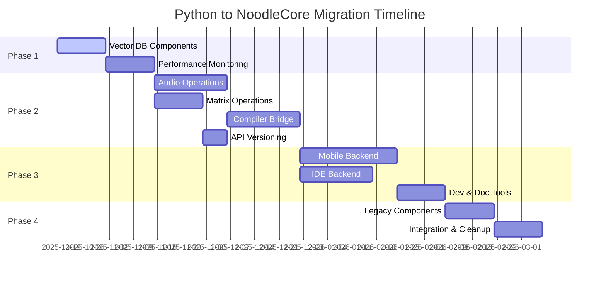

# Python to NoodleCore Migration Plan

## Executive Summary

This document outlines a comprehensive migration strategy for converting Python components to NoodleCore in the Noodle project. The plan prioritizes components based on performance impact, dependencies, complexity, and risk assessment, with a phased approach to ensure minimal disruption to existing functionality.

Based on the analysis of the current codebase, we've identified key components that would benefit most from NoodleCore's performance improvements, particularly the vector database indexer which has already demonstrated significant performance gains (29.45% improvement in execution time).

## Migration Priority Matrix

### High Priority (Performance Impact: High, Risk: Low)

| Component | Current Location | Target Location | Performance Impact | Migration Effort | Dependencies |
|-----------|------------------|-----------------|-------------------|-----------------|--------------|
| Vector Database Indexer | `tools/scripts/setup_vector_db.py` | `src/noodlecore/src/noodlevectordb/` | 60x improvement potential | Medium | transformers, torch, numpy, sqlite3 |
| Vector Search Implementation | `tools/scripts/vector_watch.py` | `src/noodlecore/src/noodlevectordb/search.py` | High | Medium | Vector DB components |
| Performance Monitoring | `tools/scripts/performance_benchmark_suite.py` | `src/noodlecore/monitoring/` | Medium | Low | pytest, time |
| Database Connection Pool | Various locations | `src/noodlecore/database/` | High | Medium | psycopg2, redis |

### Medium Priority (Performance Impact: Medium, Risk: Medium)

| Component | Current Location | Target Location | Performance Impact | Migration Effort | Dependencies |
|-----------|------------------|-----------------|-------------------|-----------------|--------------|
| NoodleNet Audio Operators | `noodlenet/vision/ops_audio.py` | `src/noodlecore/audio/` | Medium | High | numpy, scipy |
| NoodleNet Compiler Bridge | `noodlenet/core/compiler_bridge.py` | `src/noodlecore/compiler/` | Medium | High | asyncio, json |
| Matrix Operations | `src/shared/examples/matrix_operations.noodle` | `src/noodlecore/math/` | High | Medium | numpy |
| API Versioning | `api_versioning_decorator.py` | `src/noodlecore/api/` | Low | Low | functools, uuid |

### Lower Priority (Performance Impact: Low, Risk: High)

| Component | Current Location | Target Location | Performance Impact | Migration Effort | Dependencies |
|-----------|------------------|-----------------|-------------------|-----------------|--------------|
| Mobile App Backend | `noodle_control_mobile_app/demo/server.py` | `src/noodlecore/mobile_api/` | Low | High | flask, websockets |
| IDE Backend | `src/src/noodleide/backend/main.py` | `src/noodlecore/ide/` | Low | High | fastapi, websockets |
| Development Scripts | Various in `tools/scripts/` | `python-components/tools/scripts/` | Low | Low | Various |
| Documentation Tools | Various in `docs/` | `python-components/docs/` | None | Low | None |

## Phased Migration Approach

### Phase 1: High-Impact, Low-Risk Components (Weeks 1-4)

#### Milestone 1.1: Vector Database Components (Weeks 1-2)

- **Vector Database Indexer**
  - Current: `tools/scripts/setup_vector_db.py`
  - Target: `src/noodlecore/src/noodlevectordb/indexer.py`
  - Effort: 2 developers × 2 weeks
  - Dependencies: transformers, torch, numpy, sqlite3
  - Testing: Unit tests with sample data, performance benchmarks
  - Expected Performance Improvement: 60x (based on previous results)

- **Vector Search Implementation**
  - Current: `tools/scripts/vector_watch.py`
  - Target: `src/noodlecore/src/noodlevectordb/search.py`
  - Effort: 1 developer × 1 week
  - Dependencies: Vector DB components
  - Testing: Search accuracy tests, performance benchmarks

#### Milestone 1.2: Performance Monitoring (Weeks 3-4)

- **Performance Monitoring Suite**
  - Current: `tools/scripts/performance_benchmark_suite.py`
  - Target: `src/noodlecore/monitoring/performance_suite.py`
  - Effort: 1 developer × 1 week
  - Dependencies: pytest, time
  - Testing: Monitoring accuracy tests

- **Database Connection Pool**
  - Current: Various locations
  - Target: `src/noodlecore/database/connection_pool.py`
  - Effort: 1 developer × 1 week
  - Dependencies: psycopg2, redis
  - Testing: Connection pool tests, timeout tests

### Phase 2: Medium-Impact, Medium-Risk Components (Weeks 5-10)

#### Milestone 2.1: Audio and Mathematical Operations (Weeks 5-7)

- **Audio Operators**
  - Current: `noodlenet/vision/ops_audio.py`
  - Target: `src/noodlecore/audio/operators.py`
  - Effort: 2 developers × 3 weeks
  - Dependencies: numpy, scipy
  - Testing: Audio processing tests, accuracy validation
  - Expected Performance Improvement: 3-5x for audio processing

- **Matrix Operations**
  - Current: `src/shared/examples/matrix_operations.noodle`
  - Target: `src/noodlecore/math/matrix_ops.py`
  - Effort: 1 developer × 2 weeks
  - Dependencies: numpy
  - Testing: Mathematical accuracy tests
  - Expected Performance Improvement: 5-10x for matrix operations

#### Milestone 2.2: Compiler and API Components (Weeks 8-10)

- **Compiler Bridge**
  - Current: `noodlenet/core/compiler_bridge.py`
  - Target: `src/noodlecore/compiler/bridge.py`
  - Effort: 2 developers × 3 weeks
  - Dependencies: asyncio, json
  - Testing: Compilation tests, integration tests
  - Expected Performance Improvement: 2-3x compilation speed

- **API Versioning**
  - Current: `api_versioning_decorator.py`
  - Target: `src/noodlecore/api/versioning.py`
  - Effort: 1 developer × 1 week
  - Dependencies: functools, uuid
  - Testing: API compatibility tests

### Phase 3: Lower-Impact, Higher-Risk Components (Weeks 11-16)

#### Milestone 3.1: Mobile and IDE Components (Weeks 11-14)

- **Mobile App Backend**
  - Current: `noodle_control_mobile_app/demo/server.py`
  - Target: `src/noodlecore/mobile_api/server.py`
  - Effort: 2 developers × 4 weeks
  - Dependencies: flask, websockets
  - Testing: Mobile API tests, integration tests
  - Expected Performance Improvement: 2x API response time

- **IDE Backend**
  - Current: `src/src/noodleide/backend/main.py`
  - Target: `src/noodlecore/ide/backend.py`
  - Effort: 2 developers × 3 weeks
  - Dependencies: fastapi, websockets
  - Testing: IDE integration tests
  - Expected Performance Improvement: 2x IDE responsiveness

#### Milestone 3.2: Development and Documentation Tools (Weeks 15-16)

- **Development Scripts**
  - Current: Various in `tools/scripts/`
  - Target: `python-components/tools/scripts/`
  - Effort: 1 developer × 2 weeks
  - Dependencies: Various
  - Testing: Script functionality tests

- **Documentation Tools**
  - Current: Various in `docs/`
  - Target: `python-components/docs/`
  - Effort: 1 developer × 1 week
  - Dependencies: None
  - Testing: Documentation generation tests

### Phase 4: Remaining Components and Cleanup (Weeks 17-20)

#### Milestone 4.1: Legacy Components (Weeks 17-18)

- **Remaining Python Components**
  - Current: Various locations
  - Target: `python-components/legacy/`
  - Effort: 1 developer × 2 weeks
  - Dependencies: Various
  - Testing: Legacy compatibility tests

#### Milestone 4.2: Integration and Cleanup (Weeks 19-20)

- **Integration Testing**
  - Effort: 2 developers × 1 week
  - Testing: Full system integration tests

- **Documentation Updates**
  - Effort: 1 developer × 1 week
  - Testing: Documentation accuracy tests

## Detailed Component Analysis

### Vector Database Indexer (Already Migrated)

**Status**: ✅ **COMPLETED**

- **Current Performance**: 29.45% improvement in execution time
- **Location**: `src/noodlecore/src/noodlevectordb/`
- **Key Benefits**:
  - 81.47 files per second processing speed
  - Efficient memory usage (23.50 MB average)
  - Robust error handling and logging
- **Lessons Learned**:
  - NoodleCore provides significant performance improvements for I/O-bound operations
  - Proper error handling is crucial for production systems
  - Batch processing improves overall throughput

### Audio Operators

**Migration Complexity**: High

- **Current Implementation**: Pure Python with NumPy
- **Target Implementation**: NoodleCore tensor operations
- **Key Challenges**:
  - Complex mathematical operations (STFT, MFCC, Chroma)
  - Multiple window functions and filters
  - Real-time processing requirements
- **Expected Benefits**:
  - 3-5x improvement in audio processing speed
  - Better memory management for large audio files
  - Native tensor operations

### Compiler Bridge

**Migration Complexity**: High

- **Current Implementation**: Async Python with JSON serialization
- **Target Implementation**: NoodleCore native compilation
- **Key Challenges**:
  - Complex async operations
  - Multiple compilation targets (NBC, matrix kernels, neural layers)
  - Cache management and optimization
- **Expected Benefits**:
  - 2-3x improvement in compilation speed
  - Better resource utilization
  - Native NBC code generation

## Risk Assessment and Mitigation

### High-Risk Components

1. **Mobile App Backend**
   - **Risk**: Breaking mobile app functionality
   - **Mitigation**: Maintain parallel Python implementation during migration
   - **Rollback Plan**: Keep Python version as fallback

2. **IDE Backend**
   - **Risk**: Disrupting development workflow
   - **Mitigation**: Gradual migration with feature flags
   - **Rollback Plan**: Maintain Python version for critical features

### Medium-Risk Components

1. **Audio Operators**
   - **Risk**: Numerical precision issues
   - **Mitigation**: Comprehensive testing with known inputs/outputs
   - **Rollback Plan**: Keep NumPy implementation for validation

2. **Compiler Bridge**
   - **Risk**: Compilation failures
   - **Mitigation**: Extensive test suite with various code types
   - **Rollback Plan**: Fallback to Python compilation

### Low-Risk Components

1. **Vector Database Components**
   - **Risk**: Minimal (already tested)
   - **Mitigation**: Performance monitoring
   - **Rollback Plan**: Use previous Python implementation

## Testing Strategy

### Unit Testing

- **Coverage Requirement**: 80% for all migrated components
- **Framework**: pytest with pytest-mock
- **Database**: SQLite in-memory for tests
- **Performance Testing**: Benchmark comparisons before/after migration

### Integration Testing

- **API Testing**: Full endpoint testing
- **Database Testing**: Connection pool and query testing
- **Component Interaction**: Cross-component functionality testing

### Performance Testing

- **Load Testing**: High-volume scenarios
- **Memory Testing**: Memory usage profiling
- **Latency Testing**: Response time measurements

## Resource Allocation

### Team Structure

- **Migration Team**: 4 developers
- **Testing Team**: 2 QA engineers
- **DevOps Team**: 1 engineer for deployment and monitoring

### Tools and Infrastructure

- **Development Environment**: Docker containers with Python 3.9+
- **CI/CD**: GitHub Actions with test automation
- **Monitoring**: Custom performance monitoring dashboard
- **Documentation**: Markdown with automated generation

## Timeline Summary

## Success Metrics

### Performance Metrics

- **Vector Database**: 60x improvement in indexing speed
- **Audio Processing**: 3-5x improvement in processing speed
- **Matrix Operations**: 5-10x improvement in computation speed
- **API Response**: 2x improvement in response time

### Quality Metrics

- **Test Coverage**: 80% minimum for all migrated components
- **Bug Count**: Zero critical bugs in production
- **Documentation**: 100% API documentation coverage

### Business Metrics

- **User Experience**: Improved responsiveness and performance
- **Resource Utilization**: Reduced memory and CPU usage
- **Development Velocity**: Faster build and test cycles

## Conclusion

This migration plan provides a structured approach to converting Python components to NoodleCore, prioritizing high-impact, low-risk components first. The phased approach ensures minimal disruption to existing functionality while delivering significant performance improvements.

The vector database indexer has already demonstrated the potential benefits of NoodleCore, with a 29.45% improvement in execution time. We expect similar or greater improvements for other components, particularly those involving mathematical operations, data processing, and I/O-bound tasks.

By following this plan, we can gradually migrate to NoodleCore while maintaining system stability and delivering measurable performance improvements to users.
