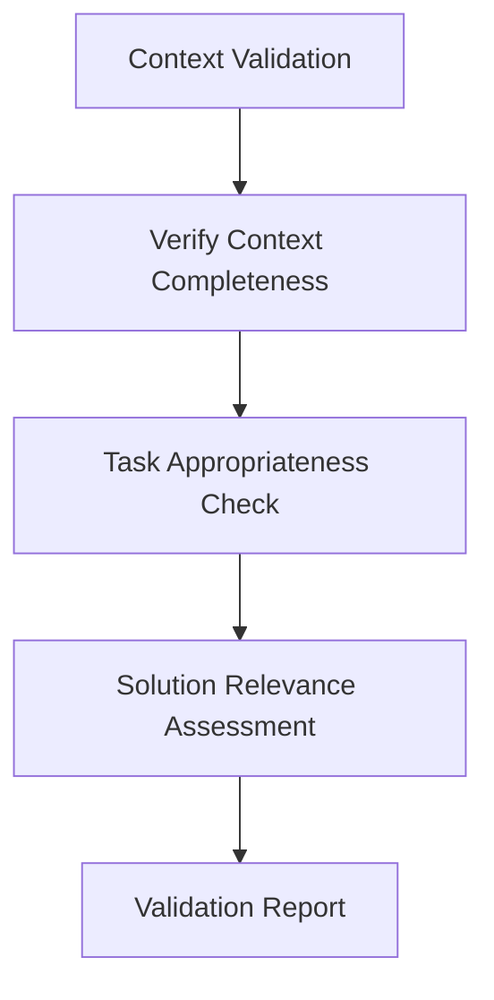
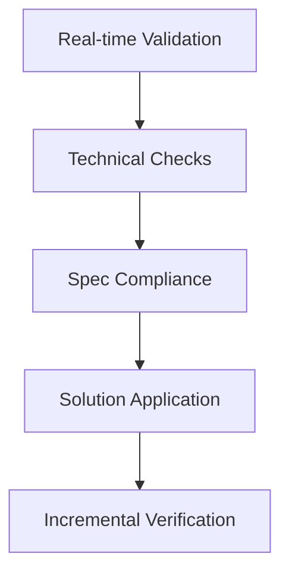
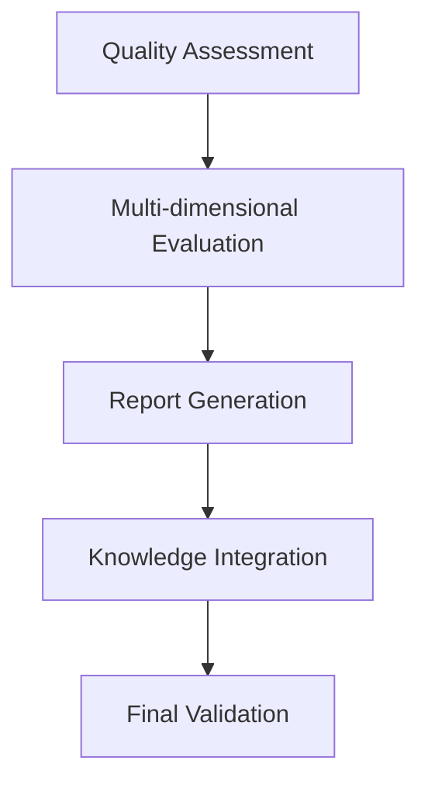

# Implementation Procedures and Validation Workflows

## Overview
This document provides detailed implementation procedures and validation workflows for the updated Noodle roadmap, ensuring consistent quality, traceability, and adherence to AGENTS standards throughout the development process.

## 1. Implementation Procedures

### 1.1 File Update Process

#### Step 1: Pre-implementation Preparation
- **Backup Existing Files**: Create timestamped backups of all roadmap files
  ```bash
  cp memory-bank/roadmap.md memory-bank/roadmap.md.backup.$(date +%Y%m%d_%H%M%S)
  cp memory-bank/noodle-ide-roadmap.md memory-bank/noodle-ide-roadmap.md.backup.$(date +%Y%m%d_%H%M%S)
  cp memory-bank/python_transpiler_roadmap.md memory-bank/python_transpiler_roadmap.md.backup.$(date +%Y%m%d_%H%M%S)
  ```
- **Validate Current State**: Run existing test suites to establish baseline
- **Review Integration Points**: Confirm alignment with existing Stappen 1-4

#### Step 2: Incremental Integration
- **Apply Changes Methodically**: Update one file at a time
- **Validate Each Change**: After each file update, run validation procedures
- **Document Changes**: Keep detailed logs of all modifications

#### Step 3: Post-implementation Validation
- **Comprehensive Testing**: Execute all test suites
- **Performance Benchmarking**: Compare performance before/after changes
- **Documentation Update**: Update all related documentation

### 1.2 Quality Assurance Procedures

#### Automated Checks
- **Technical Correctness**: Validate syntax, structure, and technical accuracy
- **Compliance Verification**: Ensure adherence to project specifications
- **Solution Application**: Confirm proper use of solution database entries

#### Manual Review Process
- **Peer Review**: Multi-role review (Architect, Validator, Documentation Expert)
- **Stakeholder Feedback**: Collect feedback from team members
- **Final Approval**: Project Manager sign-off before deployment

### 1.3 Change Management

#### Version Control
- **Semantic Versioning**: Follow SemVer for roadmap updates
- **Commit Messages**: Use descriptive commit messages following project conventions
- **Branch Strategy**: Use feature branches for major updates

#### Deployment Process
- **Staging Environment**: Test changes in staging before production
- **Rollback Plan**: Prepare rollback procedures for critical changes
- **Monitoring**: Post-deployment monitoring for issues

## 2. Validation Workflows

### 2.1 AGENTS Validation Phases

#### Phase 1: Pre-execution Validation


**Procedures:**
- **Context Validation**: Verify all necessary information is gathered
  - Check existing roadmap files
  - Review vision requirements
  - Confirm integration points
- **Task Appropriateness Check**: Confirm alignment with scope and resources
  - Validate technical feasibility
  - Confirm resource availability
  - Check timeline appropriateness
- **Solution Relevance Assessment**: Validate solution database applicability
  - Query solution database for relevant patterns
  - Assess solution effectiveness
  - Confirm applicability to current task

#### Phase 2: Execution Validation


**Procedures:**
- **Real-time Validation Checks**: Continuous validation during implementation
  - Automated syntax checking
  - Structure validation
  - Cross-reference verification
- **Automated Validation Suite**: Comprehensive technical validation
  - Run test suites after each change
  - Validate against specifications
  - Check solution database usage
- **Incremental Output Verification**: Step-by-step validation
  - Validate each file update individually
  - Check integration between components
  - Verify incremental progress

#### Phase 3: Post-execution Validation


**Procedures:**
- **Comprehensive Quality Assessment**: Multi-dimensional evaluation
  - Technical accuracy
  - Completeness
  - Readability
  - Alignment with vision
- **Validation Report Generation**: Structured reporting
  - Document findings
  - Recommend improvements
  - Track metrics
- **Knowledge Integration**: Update knowledge base
  - Update solution database
  - Update memory bank
  - Document lessons learned

### 2.2 Testing Procedures

#### Unit Testing
- **Coverage Requirements**: 90%+ coverage for core components
- **Test Categories**:
  - Syntax validation
  - Structure validation
  - Integration testing
  - Performance testing

#### Integration Testing
- **Component Interactions**: Validate integration between roadmap components
- **Cross-file Validation**: Ensure consistency across updated files
- **Workflow Testing**: Test end-to-end workflows

#### Performance Testing
- **Metrics Tracking**: Monitor performance before/after changes
- **Benchmark Comparison**: Compare with baseline performance
- **Resource Utilization**: Monitor CPU/GPU usage

### 2.3 Error Handling and Recovery

#### Error Detection
- **Automated Scanning**: Use automated tools to detect errors
- **Manual Review**: Manual review for complex issues
- **User Feedback**: Collect feedback from users

#### Error Resolution
- **Prioritization**: Prioritize errors by severity
- **Root Cause Analysis**: Identify root causes of errors
- **Resolution Tracking**: Track resolution progress

#### Recovery Procedures
- **Rollback Plans**: Prepare rollback procedures for critical errors
- **Backup Restoration**: Restore from backups if needed
- **Contingency Planning**: Plan for unexpected issues

## 3. Role-Based Workflows

### 3.1 Architect Role
**Responsibilities:**
- System design and technical specifications
- Roadmap integration planning
- Quality assurance oversight

**Workflow:**
1. Review vision requirements
2. Design integration approach
3. Create implementation plan
4. Review technical specifications
5. Validate final output

### 3.2 Code Specialist Role
**Responsibilities:**
- Implementation and refactoring
- File updates and modifications
- Code quality assurance

**Workflow:**
1. Review implementation plan
2. Apply changes incrementally
3. Validate each change
4. Document modifications
5. Ensure code quality

### 3.3 Validator Role
**Responsibilities:**
- Quality assurance and testing
- Validation report generation
- Performance monitoring

**Workflow:**
1. Establish baseline metrics
2. Execute validation procedures
3. Generate validation reports
4. Monitor performance
5. Recommend improvements

### 3.4 Documentation Expert Role
**Responsibilities:**
- Knowledge management
- Documentation updates
- Training materials creation

**Workflow:**
1. Review documentation requirements
2. Update documentation
3. Create training materials
4. Maintain knowledge base
5. Ensure documentation quality

### 3.5 Project Manager Role
**Responsibilities:**
- Workflow coordination
- Milestone tracking
- Resource management

**Workflow:**
1. Plan implementation timeline
2. Coordinate team activities
3. Track milestones
4. Manage resources
5. Ensure project completion

## 4. Performance Monitoring

### 4.1 Metrics Tracking

#### Task Metrics
- **Completion Time**: Track time per phase and task
- **Validation Success Rate**: Monitor percentage of successful validations
- **Error Rate**: Track frequency and severity of errors

#### Quality Metrics
- **Coverage Achievement**: Monitor test coverage targets
- **Code Quality**: Track code quality metrics
- **Documentation Quality**: Monitor documentation completeness

#### Resource Metrics
- **CPU Utilization**: Monitor CPU usage during implementation
- **Memory Usage**: Track memory consumption
- **Storage Usage**: Monitor disk space usage

### 4.2 Reporting and Analytics

#### Real-time Dashboard
- **API Endpoint**: GET /api/metrics for real-time data
- **Visualization**: Integrate with VS Code extensions
- **Alerts**: Set up alerts for threshold breaches

#### Historical Analysis
- **Trend Analysis**: Analyze performance trends over time
- **Comparative Analysis**: Compare different implementation approaches
- **Predictive Analysis**: Predict future performance based on historical data

### 4.3 Continuous Improvement

#### Feedback Loops
- **User Feedback**: Collect and analyze user feedback
- **Team Feedback**: Gather feedback from team members
- **Automated Feedback**: Use automated tools for continuous feedback

####
