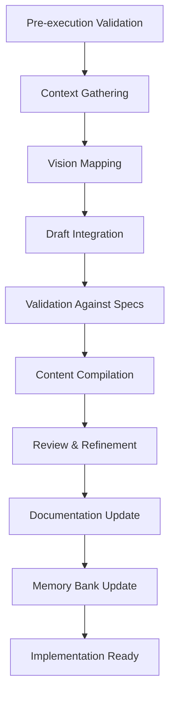

# Roadmap Integration Documentation Plan

## Overview
This document outlines the comprehensive documentation strategy for the updated Noodle roadmap, ensuring all changes, procedures, and workflows are thoroughly documented for maintainability, onboarding, and future reference.

## Documentation Structure

### 1. Roadmap Update Documentation
#### 1.1 Change Summary
- **Files Updated**: [`memory-bank/roadmap.md`](memory-bank/roadmap.md), [`memory-bank/noodle-ide-roadmap.md`](memory-bank/noodle-ide-roadmap.md), [`memory-bank/python_transpiler_roadmap.md`](memory-bank/python_transpiler_roadmap.md)
- **Vision Integrated**: Incremental approach to IDE independence and Python migration
- **Key Changes**: Hybrid architecture, intent-based optimization, progressive migration phases
- **Integration Points**: Aligns with existing Stappen 1-4, extends to Stappen 5-9

#### 1.2 Vision Integration Details
- **Noodle-IDE Independence**: Bridge phase → progressive migration → pure Noodle
- **Python Migration**: Interop runtime → shadow profiling → transpilation → optimization
- **Hybrid Architecture**: Runtime decisions between Python/NBC/native based on performance

### 2. Working Procedures Documentation
#### 2.1 Implementation Workflow

#### 2.2 Quality Assurance Procedures
- **Validation Phases**: Pre-execution, Execution, Post-execution (per AGENTS.md)
- **Coverage Requirements**: 95%+ line coverage for core components
- **Testing Categories**: Unit, Integration, Performance, Error Handling, Regression
- **Metrics Tracking**: Task completion time, validation success rate, resource utilization

#### 2.3 Role-Based Responsibilities
- **Architect**: System design, technical specifications, roadmap integration
- **Code Specialist**: Implementation, refactoring, file updates
- **Validator**: Quality assurance, testing, validation reports
- **Documentation Expert**: Knowledge management, documentation updates
- **Project Manager**: Workflow coordination, milestone tracking

### 3. Memory Bank Integration
#### 3.1 Knowledge Categories
- **Lessons Learned**: Incremental migration patterns, integration challenges
- **Context Digests**: Roadmap integration summary, vision alignment
- **Blueprint Indexing**: Updated roadmap structure, phase mappings
- **Technical Specifications**: Hybrid architecture details, intent-based optimization

#### 3.2 Update Procedures
- **Automatic Updates**: Git post-commit hook triggers memory-updater.js
- **Index Management**: Update memory-bank/index.json with new roadmap files
- **Changelog Generation**: Create memory-bank/changelog.md with integration summary
- **API Access**: Endpoints for programmatic access to updated documentation

### 4. Implementation Procedures
#### 4.1 File Update Process
1. **Backup**: Create backups of existing roadmap files
2. **Draft Integration**: Apply proposed changes incrementally
3. **Validation**: Run AGENTS validation procedures
4. **Testing**: Execute test suites for updated components
5. **Documentation**: Update all related documentation
6. **Memory Bank**: Integrate learnings and updates

#### 4.2 Validation Workflows
- **Automated Checks**: Technical correctness, compliance verification
- **Spec Compliance**: Validation against project specifications
- **Solution Application**: Confirmation of solution database usage
- **Peer Review**: Role-based validation and review process

#### 4.3 Performance Monitoring
- **Task Metrics**: Track completion time per phase
- **Validation Metrics**: Monitor success rate of validation checks
- **Resource Metrics**: Monitor CPU/GPU usage during implementation
- **Knowledge Metrics**: Track database and memory bank updates

### 5. Documentation Deliverables
#### 5.1 Immediate Deliverables
- **Roadmap Updates**: Updated roadmap files with vision integration
- **Documentation Plan**: This document outlining procedures
- **Memory Bank Updates**: Integration learnings and context digests

#### 5.2 Ongoing Documentation
- **Implementation Logs**: Detailed logs of each update procedure
- **Validation Reports**: Comprehensive validation results
- **Performance Benchmarks**: Metrics from updated roadmap implementation
- **Changelog**: Version history of roadmap updates

#### 5.3 Training Materials
- **Onboarding Guide**: For new team members understanding updated roadmap
- **Workflow Documentation**: Step-by-step procedures for updates
- **Best Practices**: Lessons learned from integration process
- **Troubleshooting Guide**: Common issues and solutions

### 6. Maintenance Procedures
#### 6.1 Version Control
- **Semantic Versioning**: Follow SemVer for roadmap updates
- **Backward Compatibility**: Ensure new features don't break existing workflows
- **Deprecation Policy**: 2-version grace period for removed features

#### 6.2 Contribution Workflow
- **Proposal Process**: New sections proposed via memory-bank pull requests
- **Review Cycle**: Multi-role review (Architect, Validator, Documentation Expert)
- **Testing Requirements**: All updates must pass test-agents-integration.js
- **Deployment**: Automatic via agents-server.js on VS Code startup

#### 6.3 Monitoring & Feedback
- **Usage Analytics**: Track documentation usage via agents-server.js logs
- **Feedback Loop**: Integrate user and agent feedback into solution database
- **Periodic Reviews**: Quarterly audits of documentation effectiveness

### 7. Risk Management
#### 7.1 Documentation Risks
- **Outdated Information**: Regular updates and validation
- **Inconsistent Format**: Standardized templates and style guides
- **Missing Context**: Comprehensive context gathering and mapping

#### 7.2 Mitigation Strategies
- **Automated Validation**: Regular validation of documentation accuracy
- **Version Control**: Track changes and maintain history
- **Peer Review**: Multi-role review for quality assurance

### 8. Success Criteria
#### 8.1 Documentation Quality
- **Accuracy**: All information technically correct and up-to-date
- **Completeness**: Comprehensive coverage of all roadmap changes
- **Accessibility**: Easy to find and understand for all team members

#### 8.2 Workflow Effectiveness
- **Efficiency**: Streamlined update and validation processes
- **Reliability**: Consistent quality across all documentation
- **Maintainability**: Easy to update and maintain over time

#### 8.3 Integration Success
- **Memory Bank Sync**: All updates properly integrated into memory bank
- **AGENTS Compliance**: All procedures follow AGENTS standards
- **Performance Metrics**: Achieve target coverage and validation metrics

## Next Steps
1. **Implementation**: Apply roadmap updates to actual files
2. **Validation**: Execute validation procedures and generate reports
3. **Documentation**: Update all related documentation and memory bank
4. **Training**: Create training materials for team onboarding
5. **Monitoring**: Establish ongoing monitoring and maintenance procedures

## Related Documentation
- [`AGENTS.md`](AGENTS.md) - Agent workflow and validation standards
- [`memory-bank/README.md`](memory-bank/README.md) - Memory bank organization
- [`memory-bank/documentation_organization_plan.md`](memory-bank/documentation_organization_plan.md) - Documentation structure
- [`memory-bank/workflow_implementation_final.md`](memory-bank/workflow_implementation_final.md) - Workflow implementation
- [`memory-bank/validation_quality_assurance_procedures.md`](memory-bank/validation_quality_assurance_procedures.md) - Validation procedures
