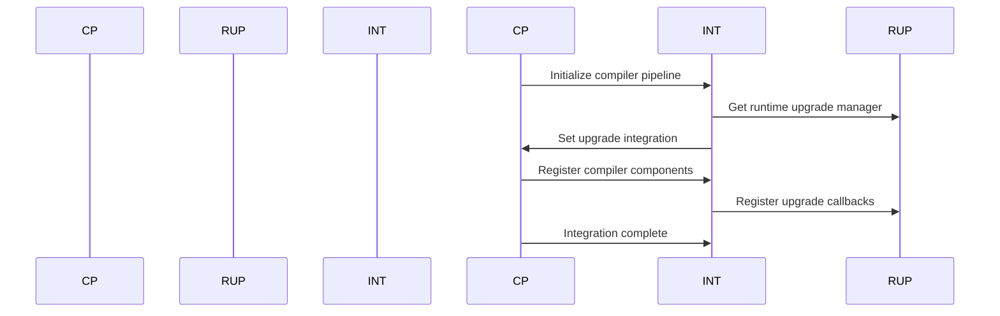
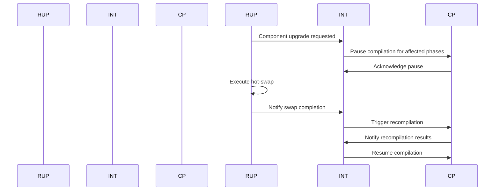

# Compiler Runtime Upgrade Integration Implementation

This document describes the integration between the NoodleCore compiler pipeline and the runtime upgrade system, enabling hot-swapping of compiler components, version-aware compilation, and automatic recompilation when runtime components are upgraded.

## Overview

The compiler runtime upgrade integration provides seamless coordination between compilation operations and runtime upgrade operations. This integration enables:

1. **Hot-swapping of compiler components** during compilation
2. **Version-aware compilation** that considers component versions
3. **Automatic recompilation** when runtime components are upgraded
4. **Compiler pipeline integration** with runtime upgrade validation
5. **Pause/resume compilation** during upgrade operations

## Architecture

### Core Components

#### 1. CompilerRuntimeUpgradeIntegration

The main integration class that coordinates between compiler pipeline and runtime upgrade system:

- **Location**: `noodle-core/src/noodlecore/compiler/runtime_upgrade_integration.py`
- **Key Features**:
  - Version-aware compilation with constraint validation
  - Hot-swapping coordination for compiler components
  - Automatic recompilation triggers on component upgrades
  - Compilation pause/resume during upgrade operations
  - Upgrade event handling and callbacks

#### 2. Enhanced CompilerPipeline

Extended compiler pipeline with upgrade awareness:

- **Location**: `noodle-core/src/noodlecore/compiler/compiler_pipeline.py`
- **Key Features**:
  - Runtime upgrade integration hooks
  - Phase-based pause/resume functionality
  - Version-aware compilation parameter
  - Upgrade event callbacks
  - Upgrade status tracking

#### 3. Compiler Component Registry

Registry for compiler components with upgrade metadata:

- **Components**: lexer, parser, optimizer, bytecode_generator
- **Metadata**: version, hot-swappable status, dependencies, compatibility matrix
- **Integration**: Links with runtime upgrade system component registry

## Key Features

### 1. Hot-Swapping Hooks

The integration provides hooks for hot-swapping compiler components:

```python
# Register upgrade callback
pipeline.register_upgrade_callback(upgrade_callback)

# Pause compilation during upgrade
pipeline.pause_compilation(phases=[CompilationPhase.LEXING, CompilationPhase.PARSING])

# Resume compilation after upgrade
pipeline.resume_compilation(phases=[CompilationPhase.LEXING])
```

### 2. Version-Aware Compilation

Compilation can be performed with version awareness:

```python
# Version-aware compilation
result = integration.compile_with_version_awareness(
    source_code, 
    filename="test.nc",
    target_versions={
        'lexer': '1.1.0',
        'parser': '1.1.0',
        'optimizer': '1.0.0'
    }
)
```

### 3. Automatic Recompilation Triggers

When runtime components are upgraded, the system automatically triggers recompilation:

```python
# Trigger recompilation for upgrade
integration.trigger_recompilation_for_upgrade(
    upgrade_id="upgrade_123",
    affected_files=["file1.nc", "file2.nc"]
)
```

### 4. Runtime Upgrade Validation

The compiler validates compatibility with runtime upgrade system:

```python
# Validate version constraints
validation_result = integration.validate_version_constraints({
    'lexer': '1.2.0',
    'parser': '1.2.0'
})

if not validation_result['valid']:
    # Handle incompatibility
    pass
```

## Configuration

### Environment Variables

- `NOODLE_COMPILER_UPGRADE_INTEGRATION`: Enable/disable integration (default: "1")
- `NOODLE_COMPILER_HOT_SWAP_ENABLED`: Enable hot-swapping (default: "1")
- `NOODLE_COMPILER_VERSION_AWARE`: Enable version-aware compilation (default: "1")
- `NOODLE_COMPILER_AUTO_RECOMPILE`: Enable automatic recompilation (default: "1")
- `NOODLE_COMPILER_UPGRADE_TIMEOUT`: Upgrade timeout in seconds (default: "30.0")

### Configuration Class

```python
@dataclass
class CompilerUpgradeIntegrationConfig:
    enabled: bool = True
    hot_swap_enabled: bool = True
    version_aware_compilation: bool = True
    auto_recompile_on_upgrade: bool = True
    pause_compilation_during_upgrade: bool = True
    validate_compiler_compatibility: bool = True
    max_concurrent_upgrades: int = 2
    upgrade_timeout: float = 30.0
```

## Integration Workflow

### 1. Initialization



### 2. Normal Compilation Flow

```mermaid
sequenceDiagram
    participant User as U
    participant Compiler as CP
    participant Integration as INT
    
    U->>CP: Request compilation
    CP->>INT: Check for active upgrades
    INT->>CP: Return upgrade status
    alt No active upgrades
        CP->>CP: Perform standard compilation
    else Active upgrades
        CP->>CP: Pause affected phases
        CP->>INT: Notify upgrade progress
```

### 3. Upgrade Flow



## Implementation Details

### Compiler Component Registration

The system registers compiler components with the runtime upgrade system:

```python
# Component descriptors
components = [
    ComponentDescriptor(
        name="lexer",
        version="1.0.0",
        component_type=RuntimeComponentType.COMPILER,
        hot_swappable=True,
        critical=True,
        dependencies=[],
        metadata={
            'compilation_phase': 'lexing',
            'features': ['streaming', 'error_recovery', 'optimization'],
            'upgrade_impact': 'high'
        }
    ),
    # ... other components
]
```

### Version Constraint Validation

The system validates version constraints before compilation:

```python
def validate_version_constraints(self, target_versions: Dict[str, str]) -> Dict[str, Any]:
    validation_result = {
        'valid': True,
        'errors': [],
        'warnings': []
    }
    
    for component_name, target_version in target_versions.items():
        if component_name in self.compiler_components:
            current_version = self.compiler_components[component_name].version
            compatibility = self.version_manager.check_compatibility(
                current_version, target_version
            )
            
            if not compatibility['compatible']:
                validation_result['valid'] = False
                validation_result['errors'].append(
                    f"Version incompatibility for {component_name}: "
                    f"{compatibility['reason']}"
                )
            elif compatibility['breaking_changes']:
                validation_result['warnings'].append(
                    f"Breaking changes for {component_name}: "
                    f"{compatibility['reason']}"
                )
    
    return validation_result
```

### Recompilation Triggering

When components are upgraded, the system:

1. Identifies affected files based on dependencies
2. Adds recompilation requests to queue
3. Processes queue with priority handling
4. Notifies completion callbacks

```python
def trigger_recompilation_for_upgrade(self, upgrade_id: str, affected_files: List[str]):
    # Determine files to recompile
    files_to_recompile = self._get_files_affected_by_upgrade(upgrade_id, affected_files)
    
    # Add to compilation queue
    for file_path in files_to_recompile:
        self.compilation_queue.append({
            'file_path': file_path,
            'upgrade_id': upgrade_id,
            'reason': 'upgrade_trigger',
            'timestamp': time.time(),
            'priority': 'high'
        })
    
    # Process queue
    self._process_compilation_queue()
```

## Testing

### Test Coverage

The integration includes comprehensive tests:

1. **Initialization Tests**
   - Integration startup and shutdown
   - Component registration
   - Configuration validation

2. **Version-Aware Compilation Tests**
   - Version constraint validation
   - Compilation with target versions
   - Cache invalidation on version change

3. **Hot-Swapping Tests**
   - Component upgrade initiation
   - Compilation pause during upgrade
   - Resume after upgrade completion
   - Error handling and rollback

4. **Automatic Recompilation Tests**
   - Recompilation trigger on upgrade
   - Queue processing
   - File dependency analysis
   - Priority handling

5. **Integration Tests**
   - End-to-end workflow testing
   - Performance under load
   - Error recovery scenarios

### Running Tests

```bash
# Run all integration tests
python -m noodlecore.compiler.tests.test_runtime_upgrade_integration

# Run specific test suite
python -m noodlecore.compiler.tests.test_runtime_upgrade_integration.TestCompilerRuntimeUpgradeIntegration.test_initialization

# Run with verbose output
python -m noodlecore.compiler.tests.run_tests --suites runtime_upgrade_integration --verbosity 2
```

## Performance Considerations

### Optimization Strategies

1. **Lazy Initialization**
   - Initialize integration components only when needed
   - Defer expensive operations until first use

2. **Caching**
   - Cache version compatibility results
   - Cache component descriptors
   - Cache compilation results with version metadata

3. **Concurrency Control**
   - Limit concurrent upgrades to prevent resource exhaustion
   - Queue-based recompilation with priority handling

4. **Resource Management**
   - Clean up temporary files after upgrades
   - Release resources when integration is shut down

### Monitoring and Metrics

The integration provides comprehensive monitoring:

```python
# Get integration status
status = integration.get_state()

# Get upgrade statistics
stats = integration.get_upgrade_statistics()

# Get component versions
versions = integration.get_component_versions()
```

## Usage Examples

### Basic Usage

```python
from noodlecore.compiler import CompilerPipeline, CompilationConfig
from noodlecore.compiler.runtime_upgrade_integration import get_compiler_runtime_upgrade_integration

# Create compiler pipeline
config = CompilationConfig(
    optimization_level=OptimizationLevel.BALANCED,
    enable_debug_info=True
)
pipeline = CompilerPipeline(config)

# Initialize runtime upgrade integration
integration = get_compiler_runtime_upgrade_integration(pipeline, config)
integration.initialize()

# Perform version-aware compilation
result = integration.compile_with_version_awareness(
    source_code="function test() { return 42; }",
    filename="test.nc",
    target_versions={
        'lexer': '1.1.0',
        'parser': '1.1.0'
    }
)
```

### Advanced Usage

```python
# Register custom upgrade callback
def on_upgrade_complete(upgrade_id: str, result: UpgradeResult):
    print(f"Upgrade {upgrade_id} completed: {result.success}")

integration.register_upgrade_callback(on_upgrade_complete)

# Upgrade specific component
integration.upgrade_compiler_component('lexer', '1.1.0')

# Trigger recompilation
integration.trigger_recompilation_for_upgrade(
    upgrade_id="lexer_upgrade_123",
    affected_files=["main.nc", "utils.nc"]
)
```

## Error Handling

### Common Error Scenarios

1. **Version Incompatibility**
   - Detect and report version conflicts
   - Provide upgrade path suggestions
   - Graceful degradation to compatible versions

2. **Hot-Swap Failures**
   - Automatic rollback on swap failure
   - Error reporting and recovery
   - Component state restoration

3. **Compilation Errors During Upgrade**
   - Queue management for failed compilations
   - Retry mechanisms with exponential backoff
   - Error isolation to prevent cascade failures

### Recovery Strategies

```python
# Automatic rollback on upgrade failure
if not upgrade_result.success:
    rollback_result = integration.rollback_component(
        component_name=component_name,
        rollback_point=upgrade_result.rollback_point
    )
    
# Fallback to previous versions
if not integration.validate_version_constraints(target_versions)['valid']:
    fallback_versions = integration.get_compatible_versions(target_versions)
    # Use fallback versions for compilation
```

## Future Enhancements

### Planned Improvements

1. **Dependency Analysis**
   - Automatic dependency graph construction
   - Impact analysis for component upgrades
   - Optimized recompilation ordering

2. **Advanced Hot-Swapping**
   - Zero-downtime upgrades for critical components
   - State migration during component swaps
   - Performance optimization during upgrades

3. **Enhanced Versioning**
   - Semantic version range support
   - Automatic version resolution
   - Compatibility matrix management

4. **Integration with IDE**
   - Real-time upgrade notifications in IDE
   - Visual upgrade progress indicators
   - Interactive upgrade management

## Security Considerations

### Access Control

- Component-specific upgrade permissions
- Version constraint validation
- Secure upgrade channels
- Audit logging for all operations

### Validation

- Component signature verification
- Upgrade integrity checking
- Rollback point validation

## Conclusion

The compiler runtime upgrade integration provides a robust foundation for maintaining system uptime while enabling continuous improvement through hot-swapping and version-aware compilation. The integration follows established patterns for upgrade management while providing the flexibility needed for a dynamic, evolving compiler system.

For more details, see the implementation files:

- `noodle-core/src/noodlecore/compiler/runtime_upgrade_integration.py`
- `noodle-core/src/noodlecore/compiler/compiler_pipeline.py`
- `noodle-core/src/noodlecore/compiler/tests/test_runtime_upgrade_integration.py`
