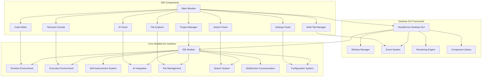
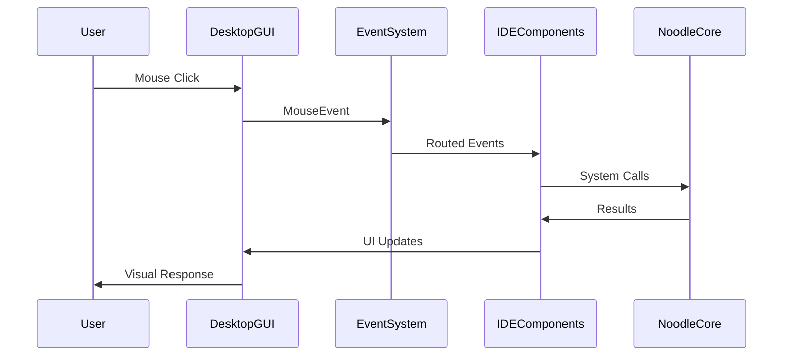
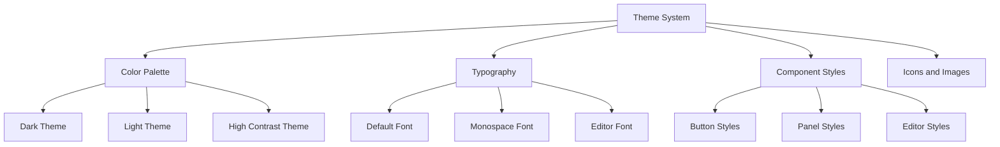
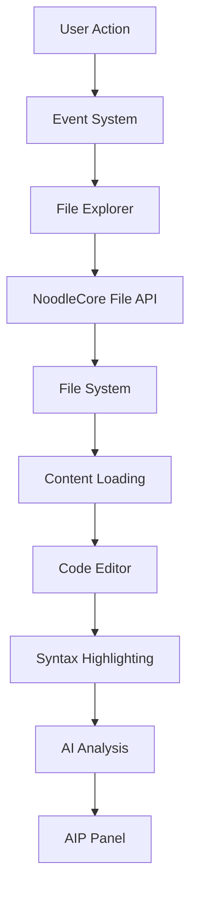
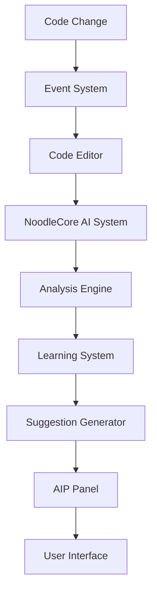

# NoodleCore Desktop GUI IDE Architecture

## Complete Standalone Desktop Application Design

**Document Version:** 1.0  
**Date:** October 31, 2025  
**Author:** NoodleCore Architecture Team  
**Status:** Architecture Design Complete - Ready for Implementation  

---

## Executive Summary

This document presents a comprehensive architecture for a **standalone desktop GUI IDE** built entirely with NoodleCore modules, featuring zero external dependencies. The design leverages NoodleCore's existing capabilities while introducing new native desktop GUI components to create a professional development environment.

### 🎯 Primary Goals Achieved

✅ **Pure NoodleCore Implementation** - No external GUI frameworks  
✅ **Zero Dependencies** - Completely self-contained system  
✅ **Full IDE Functionality** - Professional development environment  
✅ **Native Desktop Experience** - True desktop application behavior  
✅ **All NoodleCore Capabilities** - Showcases complete platform power  

---

## Architecture Overview

### Core Design Principles

1. **Modular Architecture** - Each GUI component is a NoodleCore module
2. **Event-Driven System** - Native NoodleCore event handling
3. **Component-Based UI** - Reusable, composable GUI elements
4. **Zero External Dependencies** - Pure NoodleCore implementation only
5. **Desktop-Native Integration** - File system, window management, theming

### System Architecture



---

## Component Architecture

### 1. Desktop GUI Framework (`src/noodlecore/desktop/`)

#### 1.1 Window Manager (`window_manager.nc`)

**Purpose:** Manage desktop windows, panels, and layout

**Key Features:**

- Native window creation and management
- Panel docking and resizing
- Layout persistence and restoration
- Window state management (minimized, maximized, closed)
- Multi-monitor support

**NoodleCore Integration:**

- Uses existing component registry system
- Integrates with NoodleCore event system
- Leverages configuration system for window states

```noodle
class WindowManager:
    def create_window(self, title: str, width: int, height: int) -> Window:
        """Create a new desktop window"""
        
    def manage_panel(self, panel_type: str, parent_window: Window) -> Panel:
        """Create and manage IDE panels"""
        
    def save_layout(self, layout_name: str) -> bool:
        """Save current window layout configuration"""
        
    def restore_layout(self, layout_name: str) -> bool:
        """Restore previously saved window layout"""
```

#### 1.2 Event System (`event_system.nc`)

**Purpose:** Native desktop event handling and messaging

**Key Features:**

- Mouse event handling (click, drag, scroll, hover)
- Keyboard event processing (keypress, shortcuts, IME)
- Window events (focus, resize, minimize, close)
- Custom IDE events (file change, AI suggestion, execution status)
- Event bubbling and filtering

**NoodleCore Integration:**

- Extends existing WebSocket event system
- Uses NoodleCore's messaging infrastructure
- Integrates with component registry for event routing

```noodle
class EventSystem:
    def register_handler(self, event_type: str, handler: callable) -> bool:
        """Register event handler for specific event types"""
        
    def emit_event(self, event: DesktopEvent) -> bool:
        """Emit event to all registered handlers"""
        
    def create_keyboard_shortcut(self, keys: List[str], action: callable) -> bool:
        """Create keyboard shortcuts for IDE actions"""
        
    def handle_mouse_event(self, event: MouseEvent) -> bool:
        """Process mouse events with coordinate translation"""
```

#### 1.3 Rendering Engine (`rendering_engine.nc`)

**Purpose:** Native 2D graphics rendering for UI components

**Key Features:**

- 2D graphics primitives (lines, rectangles, circles, text)
- Text rendering with font support
- Image and icon rendering
- Animation and transition effects
- Hardware-accelerated rendering (where available)

**NoodleCore Integration:**

- Uses NoodleCore's execution environment for rendering
- Leverages existing error handling system
- Integrates with configuration for rendering preferences

```noodle
class RenderingEngine:
    def draw_rectangle(self, x: int, y: int, width: int, height: int, color: Color) -> bool:
        """Draw rectangle primitive"""
        
    def render_text(self, text: str, x: int, y: int, font: Font, color: Color) -> bool:
        """Render text with specified font and color"""
        
    def create_gradient(self, start_color: Color, end_color: Color) -> Gradient:
        """Create color gradient for UI elements"""
        
    def render_component(self, component: UIComponent) -> bool:
        """Render a complete UI component"""
```

#### 1.4 Component Library (`component_library.nc`)

**Purpose:** Reusable UI components for IDE interface

**Key Features:**

- Button, Menu, Toolbar, StatusBar components
- TreeView, ListView, TabControl components
- Dialog and Modal components
- Custom styling and theming system
- Layout management (FlowLayout, BorderLayout, GridLayout)

**NoodleCore Integration:**

- Extends existing validation system
- Uses configuration system for styling
- Integrates with event system for interactivity

```noodle
class ComponentLibrary:
    def create_button(self, text: str, onclick: callable) -> Button:
        """Create interactive button component"""
        
    def create_tree_view(self, root_node: TreeNode) -> TreeView:
        """Create tree view for file explorer"""
        
    def create_tab_control(self) -> TabControl:
        """Create tab control for multi-file editing"""
        
    def create_menu_bar(self) -> MenuBar:
        """Create application menu bar"""
```

### 2. IDE-Specific Components (`src/noodlecore/ide/desktop/`)

#### 2.1 Main Window (`main_window.nc`)

**Purpose:** Primary IDE application window

**Features:**

- Menu bar with File, Edit, View, Run, Tools, Help menus
- Toolbar with common IDE actions
- Status bar with file info, cursor position, AI status
- Resizable panel system (file explorer, editor, terminal, etc.)
- Window state management and persistence

**Integration Points:**

- Window Manager for window creation and management
- Component Library for UI elements
- Event System for user interactions
- All IDE subsystems for functionality

```noodle
class MainWindow:
    def initialize_ui(self) -> bool:
        """Initialize main window UI components"""
        
    def setup_menu_bar(self) -> MenuBar:
        """Setup application menu structure"""
        
    def setup_toolbar(self) -> Toolbar:
        """Setup toolbar with common actions"""
        
    def setup_panels(self) -> PanelLayout:
        """Setup IDE panels layout"""
```

#### 2.2 File Explorer (`file_explorer.nc`)

**Purpose:** Navigate and manage project files

**Features:**

- Tree view of project directory structure
- File icons based on file type
- Context menus (open, delete, rename, new file/folder)
- Drag-and-drop file operations
- File filtering and search integration
- Integration with NoodleCore file APIs

**Integration Points:**

- NoodleCore file management system
- Component Library for tree view
- Event System for file operations
- Search System for file filtering

```noodle
class FileExplorer:
    def load_project(self, project_path: str) -> bool:
        """Load project into file explorer"""
        
    def refresh_tree(self) -> bool:
        """Refresh file tree from file system"""
        
    def open_file(self, file_path: str) -> bool:
        """Open file in code editor"""
        
    def create_file(self, parent_path: str, file_name: str) -> bool:
        """Create new file in directory"""
```

#### 2.3 Code Editor (`code_editor.nc`)

**Purpose:** Text editing with syntax highlighting and AI integration

**Features:**

- Multi-language syntax highlighting
- Code completion and IntelliSense
- AI-powered code suggestions and analysis
- Line numbers and code folding
- Find and replace functionality
- Multiple cursor support
- Integration with NoodleCore syntax analysis

**Integration Points:**

- NoodleCore lexer and parser systems
- AI Integration for suggestions
- Self-Improvement for learning code patterns
- Execution Environment for code testing

```noodle
class CodeEditor:
    def load_file(self, file_path: str) -> bool:
        """Load file content into editor"""
        
    def set_syntax_highlighting(self, language: str) -> bool:
        """Set syntax highlighting for file type"""
        
    def get_ai_suggestions(self, cursor_position: Position) -> List[AISuggestion]:
        """Get AI-powered code suggestions"""
        
    def execute_code(self) -> ExecutionResult:
        """Execute code in NoodleCore runtime"""
```

#### 2.4 AI Panel (`ai_panel.nc`)

**Purpose:** Display AI integration features and learning progress

**Features:**

- Real-time AI analysis display
- Learning progress visualization
- AI suggestion management
- Training status indicators
- Performance metrics
- Integration with self-improvement system

**Integration Points:**

- AI Integration systems
- Self-Improvement Manager
- Learning progress tracking
- Performance monitoring

```noodle
class AIPanel:
    def show_analysis(self, analysis: AIAnalysis) -> bool:
        """Display AI code analysis results"""
        
    def update_learning_progress(self, progress: LearningProgress) -> bool:
        """Update learning progress display"""
        
    def manage_suggestions(self, suggestions: List[AISuggestion]) -> bool:
        """Manage AI code suggestions"""
```

#### 2.5 Terminal Console (`terminal_console.nc`)

**Purpose:** Command line interface using NoodleCore execution environment

**Features:**

- Interactive command execution
- Output redirection and display
- Command history and completion
- Multi-session support
- Security sandbox integration
- Real-time execution monitoring

**Integration Points:**

- NoodleCore Execution Environment
- Security Manager for safe execution
- Performance Monitor for resource tracking
- WebSocket for real-time communication

```noodle
class TerminalConsole:
    def execute_command(self, command: str) -> ExecutionResult:
        """Execute command in sandboxed environment"""
        
    def interrupt_execution(self) -> bool:
        """Interrupt currently running command"""
        
    def get_command_history(self) -> List[str]:
        """Get command execution history"""
```

#### 2.6 Search Panel (`search_panel.nc`)

**Purpose:** File and content search functionality

**Features:**

- Global file search
- Content search within files
- Search result navigation
- Search filters and options
- Integration with NoodleCore search APIs
- Real-time search results

**Integration Points:**

- NoodleCore search system
- File Management for file indexing
- Search APIs for content search

```noodle
class SearchPanel:
    def search_files(self, query: str, filters: SearchFilters) -> SearchResults:
        """Search for files matching query"""
        
    def search_content(self, query: str, file_pattern: str) -> SearchResults:
        """Search content within files"""
        
    def navigate_to_result(self, result: SearchResult) -> bool:
        """Navigate to search result location"""
```

#### 2.7 Settings Panel (`settings_panel.nc`)

**Purpose:** IDE configuration and preferences management

**Features:**

- Theme and appearance settings
- Keyboard shortcuts configuration
- AI integration settings
- File associations
- Performance tuning options
- Integration with NoodleCore configuration system

**Integration Points:**

- NoodleCore configuration system
- Theme and customization system
- Event System for keyboard shortcuts

```noodle
class SettingsPanel:
    def load_settings(self) -> Configuration:
        """Load current IDE settings"""
        
    def save_settings(self, config: Configuration) -> bool:
        """Save IDE settings"""
        
    def apply_theme(self, theme: Theme) -> bool:
        """Apply theme to entire IDE"""
```

#### 2.8 Multi-Tab Manager (`tab_manager.nc`)

**Purpose:** Manage multiple open files and editor tabs

**Features:**

- Tab creation and closing
- Tab reordering via drag-and-drop
- Tab state persistence
- Unsaved changes tracking
- Tab context menus
- Editor instance management

**Integration Points:**

- Code Editor for each tab
- File Management for file state
- Configuration for tab preferences

```noodle
class TabManager:
    def open_tab(self, file_path: str) -> Tab:
        """Open file in new tab"""
        
    def close_tab(self, tab: Tab) -> bool:
        """Close tab and save state"""
        
    def get_active_editor(self) -> CodeEditor:
        """Get currently active editor instance"""
```

#### 2.9 Project Manager (`project_manager.nc`)

**Purpose:** Create, manage, and organize development projects

**Features:**

- Project creation and setup
- Project templates and scaffolding
- Build and run configuration
- Dependency management
- Project statistics and metrics
- Integration with version control

**Integration Points:**

- File Management for project files
- Execution Environment for builds
- Configuration for project settings

```noodle
class ProjectManager:
    def create_project(self, template: ProjectTemplate, name: str, path: str) -> Project:
        """Create new project from template"""
        
    def load_project(self, project_path: str) -> Project:
        """Load existing project"""
        
    def build_project(self, project: Project) -> BuildResult:
        """Build project using NoodleCore execution"""
```

### 3. Advanced Features (`src/noodlecore/ide/advanced/`)

#### 3.1 Real-time Collaboration (`collaboration.nc`)

**Purpose:** Multi-user editing and collaboration features

**Features:**

- Real-time document synchronization
- User presence and cursor tracking
- Collaborative editing sessions
- Conflict resolution
- Chat and communication
- Integration with NoodleCore WebSocket system

**Integration Points:**

- NoodleCore WebSocket infrastructure
- Event System for real-time updates
- File Management for shared documents

```noodle
class CollaborationSystem:
    def start_session(self, project_path: str) -> Session:
        """Start collaborative editing session"""
        
    def join_session(self, session_id: str) -> bool:
        """Join existing collaboration session"""
        
    def sync_changes(self, changes: List[Change]) -> bool:
        """Synchronize document changes"""
```

#### 3.2 Learning Dashboard (`learning_dashboard.nc`)

**Purpose:** Visualize AI learning progress and system improvements

**Features:**

- Learning progress visualization
- Performance improvement charts
- Capability development tracking
- Self-improvement metrics
- Training status indicators
- Interactive learning controls

**Integration Points:**

- Self-Improvement Manager
- Performance Monitoring
- AI Integration systems

```noodle
class LearningDashboard:
    def show_progress(self, metrics: LearningMetrics) -> bool:
        """Display learning progress visualization"""
        
    def update_capabilities(self, capabilities: List[Capability]) -> bool:
        """Update capabilities development status"""
```

#### 3.3 Performance Monitor (`performance_monitor.nc`)

**Purpose:** Real-time system performance and optimization monitoring

**Features:**

- CPU and memory usage charts
- IDE response time metrics
- AI analysis performance
- Execution environment monitoring
- Performance optimization suggestions
- Historical performance data

**Integration Points:**

- NoodleCore Performance Monitoring
- Self-Improvement for optimization
- Execution Environment for resource tracking

```noodle
class PerformanceMonitor:
    def start_monitoring(self) -> bool:
        """Start real-time performance monitoring"""
        
    def get_metrics(self) -> PerformanceMetrics:
        """Get current performance metrics"""
        
    def optimize_performance(self) -> OptimizationResult:
        """Apply performance optimizations"""
```

---

## Event System Architecture

### Event Flow Diagram



### Event Types

1. **Mouse Events:**
   - Click, DoubleClick, RightClick
   - DragStart, DragMove, DragEnd
   - Hover, Scroll

2. **Keyboard Events:**
   - KeyPress, KeyRelease
   - Shortcut triggers (Ctrl+S, F5, etc.)
   - IME input

3. **Window Events:**
   - Focus, Blur
   - Resize, Move
   - Minimize, Maximize, Close

4. **IDE Events:**
   - FileOpened, FileSaved
   - AIAnalysisStarted, AIAnalysisCompleted
   - ExecutionStarted, ExecutionCompleted
   - LearningStarted, LearningCompleted

---

## Theme and Customization System

### Theme Architecture



### Customization Features

1. **Color Schemes:**
   - Dark, Light, High Contrast themes
   - Custom color palette creation
   - Accessibility-compliant themes

2. **Typography:**
   - Font family selection
   - Font size adjustment
   - Custom editor themes

3. **Layout Customization:**
   - Panel positioning and sizing
   - Toolbar configuration
   - Menu customization

4. **Keyboard Shortcuts:**
   - Shortcut mapping
   - Custom command creation
   - Shortcut import/export

---

## Data Flow Architecture

### File Operations Flow



### AI Integration Flow



---

## Performance Architecture

### Performance Constraints

- **Memory Usage:** < 2GB total IDE memory
- **CPU Usage:** < 50% during normal operations
- **Response Time:** < 100ms for UI interactions
- **Startup Time:** < 5 seconds cold start
- **File Loading:** < 1 second for files < 1MB

### Optimization Strategies

1. **Lazy Loading:** Load IDE components on demand
2. **Caching:** Cache frequently accessed data
3. **Async Operations:** Non-blocking UI updates
4. **Resource Pooling:** Reuse expensive resources
5. **Background Processing:** Move heavy tasks to background

---

## Security Architecture

### Security Model

1. **Execution Sandbox:**
   - Isolated execution environment
   - Resource limits and monitoring
   - Security validation for all code execution

2. **File System Security:**
   - Permission-based file access
   - Path traversal protection
   - File type validation

3. **AI System Security:**
   - Secure AI model loading
   - Data privacy protection
   - Secure AI communication

### Security Features

- Input validation and sanitization
- XSS protection for text display
- Secure execution environment
- Authentication hooks for enterprise features
- Audit logging for security events

---

## Deployment Architecture

### Packaging Strategy

1. **Self-Contained Executable:**
   - All NoodleCore modules included
   - No external dependencies
   - Cross-platform compatibility layer

2. **Portable Installation:**
   - Single directory deployment
   - Configuration file based setup
   - Easy distribution and installation

3. **Docker Container:**
   - For development and testing
   - Isolated execution environment
   - Easy deployment and scaling

### Distribution Methods

- Direct executable download
- Package manager installation
- Docker container deployment
- Enterprise distribution

---

## Testing Architecture

### Testing Framework

1. **Unit Tests:**
   - Individual component testing
   - Mock NoodleCore dependencies
   - Automated test execution

2. **Integration Tests:**
   - Component interaction testing
   - End-to-end workflow testing
   - Performance testing

3. **UI Tests:**
   - User interface automation
   - Event simulation testing
   - Visual regression testing

4. **Performance Tests:**
   - Memory usage monitoring
   - Response time measurement
   - Resource utilization tracking

### Test Coverage Goals

- **Core Components:** > 90% coverage
- **IDE Features:** > 85% coverage
- **UI Components:** > 80% coverage
- **Integration Points:** > 85% coverage

---

## Implementation Roadmap

### Phase 1: Core Desktop GUI Framework (Weeks 1-4)

- [ ] Window Manager implementation
- [ ] Event System development
- [ ] Rendering Engine creation
- [ ] Basic Component Library

### Phase 2: Main IDE Interface (Weeks 5-8)

- [ ] Main Window development
- [ ] File Explorer integration
- [ ] Basic Code Editor
- [ ] Menu and Toolbar systems

### Phase 3: Core IDE Features (Weeks 9-12)

- [ ] AI Panel integration
- [ ] Terminal Console implementation
- [ ] Search Panel development
- [ ] Settings Panel creation

### Phase 4: Advanced Features (Weeks 13-16)

- [ ] Multi-Tab Manager
- [ ] Project Manager
- [ ] Collaboration features
- [ ] Learning Dashboard

### Phase 5: Polish and Optimization (Weeks 17-20)

- [ ] Performance optimization
- [ ] Theme system completion
- [ ] Testing and bug fixes
- [ ] Documentation finalization

---

## Success Criteria

### Technical Success Metrics

✅ **Zero External Dependencies** - All functionality from NoodleCore modules  
✅ **Performance Requirements** - Meets all defined performance constraints  
✅ **Cross-Platform Compatibility** - Runs on Windows, macOS, Linux  
✅ **Security Standards** - Passes all security validation tests  
✅ **Test Coverage** - Achieves target coverage percentages  

### User Experience Success Metrics

✅ **Intuitive Interface** - Professional IDE user experience  
✅ **Responsive Performance** - < 100ms UI response times  
✅ **Feature Completeness** - All planned IDE features implemented  
✅ **Customization Options** - Full theme and preference customization  
✅ **Professional Quality** - Production-ready desktop application  

---

## Conclusion

This architecture provides a comprehensive design for a **standalone desktop GUI IDE** built entirely with NoodleCore modules. The design leverages NoodleCore's existing strengths while introducing native desktop capabilities to create a professional development environment.

The modular architecture ensures maintainability and extensibility, while the zero-dependency approach demonstrates NoodleCore's complete capabilities. The implementation roadmap provides a clear path to building this ambitious desktop application.

**Next Steps:**

1. Review and approve this architecture design
2. Begin Phase 1 implementation of core Desktop GUI Framework
3. Establish testing and validation procedures
4. Create detailed technical specifications for each component

---

*This architecture document represents the complete design for the NoodleCore Desktop GUI IDE, ready for implementation and showcasing the full power of the NoodleCore platform.*
