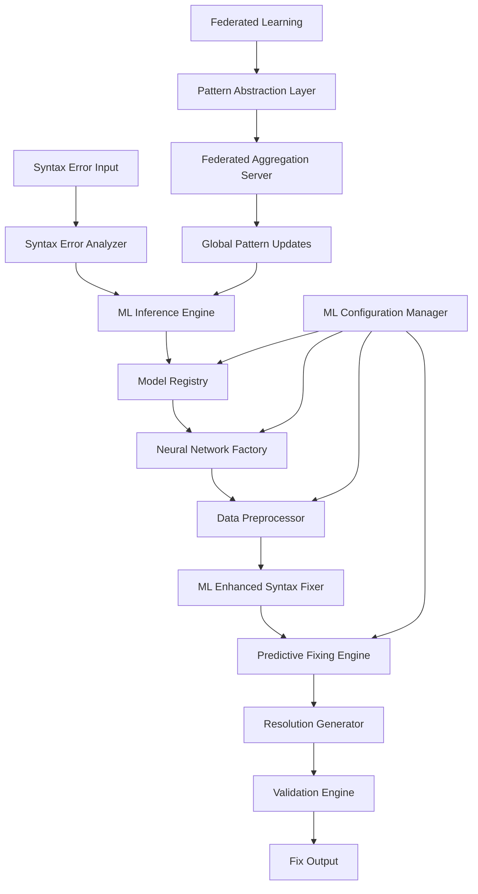
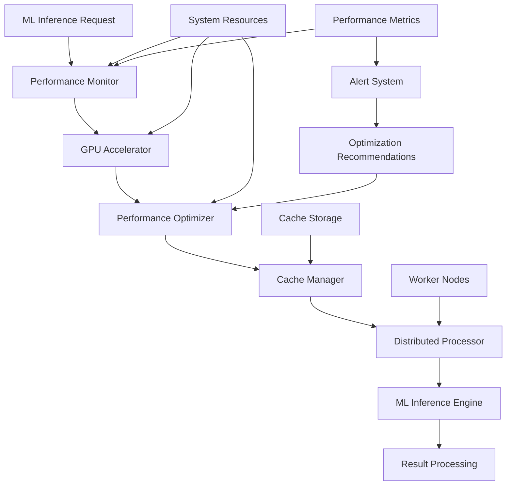
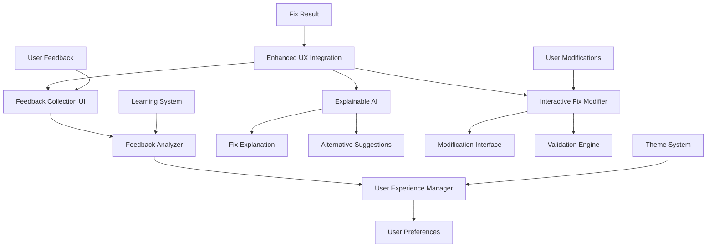
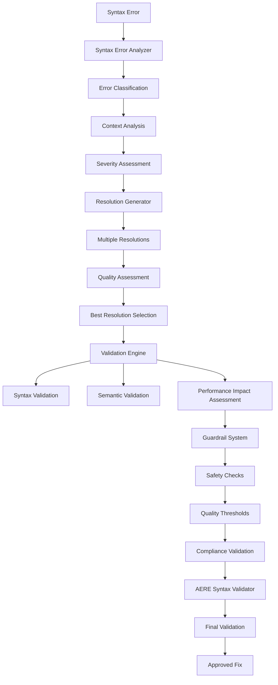
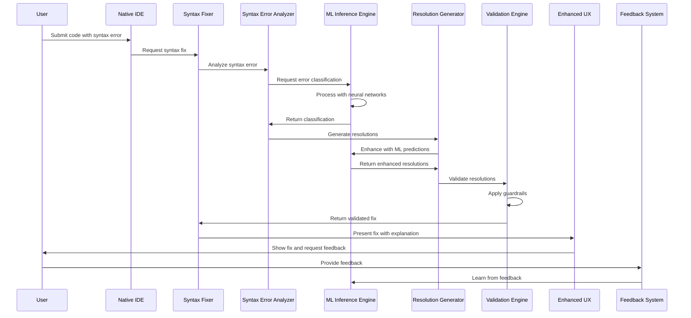
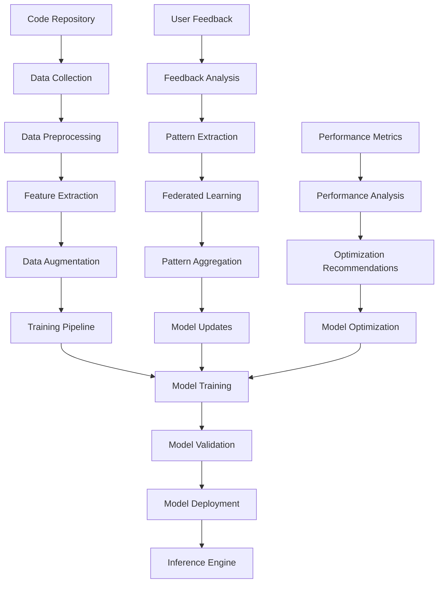
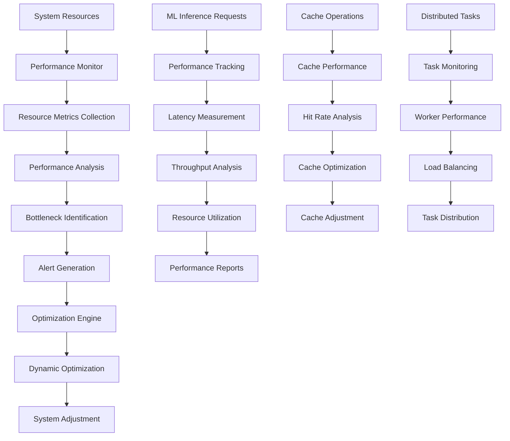

# Phase 2.3 Implementation Guide

## Executive Summary

This guide provides comprehensive documentation for the implementation of Phase 2.3 of the NoodleCore Syntax Fixer system. Phase 2.3 represents a significant advancement in syntax fixing capabilities through the integration of advanced machine learning, performance optimization, enhanced user experience, and comprehensive testing infrastructure.

## Table of Contents

1. [Architecture Overview](#1-architecture-overview)
2. [Component Architecture](#2-component-architecture)
3. [Installation and Setup](#3-installation-and-setup)
4. [Configuration Guide](#4-configuration-guide)
5. [Migration Guide](#5-migration-guide)
6. [Component Interaction Diagrams](#6-component-interaction-diagrams)
7. [Data Flow Architecture](#7-data-flow-architecture)
8. [Troubleshooting](#8-troubleshooting)
9. [FAQ](#9-faq)

## 1. Architecture Overview

### 1.1 Phase 2.3 Component Architecture

Phase 2.3 introduces four major component groups that build upon the existing Phase 2.2 infrastructure:

```
┌─────────────────────────────────────────────────────────────────┐
│                    Phase 2.3 Architecture                       │
├─────────────────────────────────────────────────────────────────┤
│  ┌─────────────────┐  ┌─────────────────┐  ┌─────────────────┐ │
│  │   ML Foundation │  │ Performance     │  │ Enhanced UX     │ │
│  │                 │  │ Optimization    │  │                 │ │
│  │ • Model Registry│  │ • GPU Accelerator│  │ • Feedback UI   │ │
│  │ • Neural Networks│  │ • Cache Manager │  │ • Explainable AI│ │
│  │ • Federated     │  │ • Distributed   │  │ • Interactive   │ │
│  │   Learning      │  │   Processor     │  │   Modifier      │ │
│  │ • Predictive    │  │ • Performance   │  │ • UX Manager    │ │
│  │   Fixing        │  │   Monitor       │  │ • Feedback      │ │
│  │ • Data Preproc  │  │ • Performance   │  │   Analyzer      │ │
│  │ • ML Inference  │  │   Optimizer     │  │                 │ │
│  └─────────────────┘  └─────────────────┘  └─────────────────┘ │
│           │                     │                     │        │
│           └─────────────────────┼─────────────────────┘        │
│                                 │                              │
│  ┌─────────────────────────────────────────────────────────────────┐ │
│  │              AERE Integration Layer                             │ │
│  │  • Syntax Error Analyzer  • Resolution Generator               │ │
│  │  • Validation Engine     • Guardrail System                    │ │
│  │  • AERE Syntax Validator                                        │ │
│  └─────────────────────────────────────────────────────────────────┘ │
│           │                     │                     │        │
│           └─────────────────────┼─────────────────────┘        │
│                                 │                              │
│  ┌─────────────────────────────────────────────────────────────────┐ │
│  │              Enhanced Syntax Fixer V4                           │ │
│  │              (Built on Phase 2.2 Infrastructure)               │ │
│  └─────────────────────────────────────────────────────────────────┘ │
│           │                     │                     │        │
│           └─────────────────────┼─────────────────────┘        │
│                                 │                              │
│  ┌─────────────────────────────────────────────────────────────────┐ │
│  │              Native NoodleCore IDE                              │ │
│  └─────────────────────────────────────────────────────────────────┘ │
└─────────────────────────────────────────────────────────────────┘
```

### 1.2 Key Architectural Principles

1. **Modular Design**: Each component group is self-contained with well-defined interfaces
2. **Backward Compatibility**: Full compatibility with existing Phase 2.2 components
3. **Performance First**: Optimized for real-time performance with <50ms simple fixes
4. **Privacy Preserving**: Federated learning without sharing actual code
5. **Extensible**: Designed for future enhancements and custom extensions
6. **Accessible**: WCAG 2.1 compliant with comprehensive accessibility features

### 1.3 Technology Stack

- **Machine Learning**: PyTorch, TensorFlow, scikit-learn
- **GPU Acceleration**: CUDA, OpenCL, ROCm, Metal
- **Caching**: Redis, in-memory caching
- **Database**: SQLite with connection pooling
- **UI Framework**: Web-based with responsive design
- **Testing**: pytest, unittest, coverage tools
- **Performance**: threading, multiprocessing, async processing

## 2. Component Architecture

### 2.1 ML Foundation Components

#### 2.1.1 Model Registry (`ml_model_registry.py`)

**Purpose**: Central registry for managing neural network architectures and models.

**Key Features**:

- Dynamic model registration and discovery
- Model versioning and lifecycle management
- Model metadata storage and retrieval
- Model performance tracking
- Support for multiple model types (Transformer, RNN, CNN, Hybrid)

**Core Classes**:

```python
class ModelRegistry:
    """Registry for managing different neural network architectures."""
    
    def register_model(self, model_type: str, model_class: Type[BaseSyntaxModel])
    def get_model(self, model_type: str, config: Dict[str, Any]) -> BaseSyntaxModel
    def list_available_models(self) -> List[str]
    def get_model_metadata(self, model_type: str) -> ModelMetadata
```

#### 2.1.2 Neural Network Factory (`neural_network_factory.py`)

**Purpose**: Factory for creating and configuring neural network architectures.

**Key Features**:

- Support for Transformer, RNN, CNN, and Hybrid architectures
- Dynamic model configuration
- Model initialization and training setup
- Model serialization and deserialization

**Core Classes**:

```python
class NeuralNetworkFactory:
    """Factory for creating neural network architectures."""
    
    def create_transformer_model(self, config: TransformerConfig) -> TransformerModel
    def create_rnn_model(self, config: RNNConfig) -> RNNModel
    def create_cnn_model(self, config: CNNConfig) -> CNNModel
    def create_hybrid_model(self, config: HybridConfig) -> HybridModel
```

#### 2.1.3 Data Preprocessor (`data_preprocessor.py`)

**Purpose**: Data preprocessing pipeline for ML models.

**Key Features**:

- Tokenization and encoding
- Feature extraction and normalization
- Data augmentation techniques
- Batch processing and shuffling

**Core Classes**:

```python
class DataPreprocessor:
    """Data preprocessing pipeline for ML models."""
    
    def preprocess_code(self, code: str) -> ProcessedCode
    def extract_features(self, code: ProcessedCode) -> FeatureVector
    def create_batches(self, data: List[FeatureVector]) -> DataBatch
    def augment_data(self, data: List[FeatureVector]) -> List[FeatureVector]
```

#### 2.1.4 ML Configuration Manager (`ml_configuration_manager.py`)

**Purpose**: Configuration management for ML components.

**Key Features**:

- Environment-based configuration
- Dynamic configuration updates
- Configuration validation
- Configuration persistence

**Core Classes**:

```python
class MLConfigurationManager:
    """Configuration management for ML components."""
    
    def load_configuration(self, config_path: str) -> MLConfiguration
    def update_configuration(self, updates: Dict[str, Any]) -> None
    def validate_configuration(self, config: MLConfiguration) -> ValidationResult
    def save_configuration(self, config: MLConfiguration, path: str) -> None
```

#### 2.1.5 ML Enhanced Syntax Fixer (`ml_enhanced_syntax_fixer.py`)

**Purpose**: Main ML-powered syntax fixing component.

**Key Features**:

- Integration with all ML components
- Context-aware syntax fixing
- Predictive fixing capabilities
- Learning from user feedback

**Core Classes**:

```python
class MLEnhancedSyntaxFixer:
    """ML-enhanced syntax fixer with predictive capabilities."""
    
    def fix_syntax(self, code: str, context: CodeContext) -> FixResult
    def predict_fixes(self, code: str, error_info: ErrorInfo) -> List[PredictedFix]
    def learn_from_feedback(self, feedback: FixFeedback) -> None
    def get_fix_explanation(self, fix: FixResult) -> FixExplanation
```

#### 2.1.6 ML Inference Engine (`ml_inference_engine.py`)

**Purpose**: High-performance inference engine for ML models.

**Key Features**:

- Real-time inference with <50ms latency
- Batch processing optimization
- GPU acceleration support
- Model caching and management

**Core Classes**:

```python
class MLInferenceEngine:
    """High-performance inference engine for ML models."""
    
    def predict(self, input_data: SyntaxInput) -> SyntaxPrediction
    def predict_batch(self, inputs: List[SyntaxInput]) -> List[SyntaxPrediction]
    def load_model(self, model_path: str) -> None
    def unload_model(self, model_id: str) -> None
```

### 2.2 Performance Optimization Components

#### 2.2.1 GPU Accelerator (`gpu_accelerator.py`)

**Purpose**: GPU detection and management for ML inference.

**Key Features**:

- Multi-backend GPU support (CUDA, OpenCL, ROCm, Metal)
- Automatic GPU detection and initialization
- Memory management with allocation/deallocation
- Multi-GPU support
- CPU fallback mechanisms

**Core Classes**:

```python
class GPUAccelerator:
    """GPU detection and management system."""
    
    def detect_gpus(self) -> List[GPUInfo]
    def initialize_gpu(self, gpu_id: int) -> GPUContext
    def allocate_memory(self, size: int) -> GPUMemory
    def deallocate_memory(self, memory: GPUMemory) -> None
    def execute_kernel(self, kernel: GPUKernel, args: List[Any]) -> GPUResult
```

#### 2.2.2 Performance Optimizer (`performance_optimizer.py`)

**Purpose**: Dynamic performance optimization based on system resources.

**Key Features**:

- Dynamic optimization based on system resources
- Model quantization (dynamic, static, INT8, FP16)
- Batch processing optimization
- Memory usage optimization
- CPU-GPU workload balancing

**Core Classes**:

```python
class PerformanceOptimizer:
    """Dynamic performance optimization system."""
    
    def optimize_for_system(self, system_info: SystemInfo) -> OptimizationConfig
    def quantize_model(self, model: BaseSyntaxModel, quantization_type: QuantizationType) -> QuantizedModel
    def optimize_batch_size(self, available_memory: int) -> int
    def balance_workload(self, tasks: List[Task]) -> WorkloadDistribution
```

#### 2.2.3 Cache Manager (`cache_manager.py`)

**Purpose**: Advanced caching system for ML inference results.

**Key Features**:

- Multiple caching strategies (LRU, LFU, TTL, adaptive)
- Intelligent cache invalidation
- Distributed caching support (Redis)
- Memory-efficient cache storage
- Cache warming and preloading

**Core Classes**:

```python
class CacheManager:
    """Advanced caching system for ML inference results."""
    
    def get(self, key: str) -> Optional[CachedResult]
    def set(self, key: str, value: CachedResult, ttl: Optional[int] = None) -> None
    def invalidate(self, pattern: str) -> None
    def warm_cache(self, patterns: List[str]) -> None
    def get_cache_stats(self) -> CacheStats
```

#### 2.2.4 Distributed Processor (`distributed_processor.py`)

**Purpose**: Distributed processing for large codebases.

**Key Features**:

- Task scheduling and priority management
- Multiple load balancing strategies
- Worker node management with health monitoring
- Fault tolerance and recovery mechanisms
- Result aggregation and consolidation

**Core Classes**:

```python
class DistributedProcessor:
    """Distributed processing for large codebases."""
    
    def submit_task(self, task: Task) -> TaskFuture
    def get_task_result(self, task_id: str) -> TaskResult
    def cancel_task(self, task_id: str) -> None
    def get_worker_status(self) -> List[WorkerStatus]
    def distribute_workload(self, workload: Workload) -> DistributionPlan
```

#### 2.2.5 Performance Monitor (`performance_monitor.py`)

**Purpose**: Real-time performance monitoring and analysis.

**Key Features**:

- Real-time resource usage monitoring
- Bottleneck identification with severity scoring
- Performance metrics collection and analysis
- Alert system with multiple severity levels
- Historical performance tracking

**Core Classes**:

```python
class PerformanceMonitor:
    """Real-time performance monitoring system."""
    
    def start_monitoring(self) -> None
    def get_current_metrics(self) -> PerformanceMetrics
    def identify_bottlenecks(self) -> List[Bottleneck]
    def generate_alerts(self) -> List[Alert]
    def get_performance_history(self, time_range: TimeRange) -> List[PerformanceSnapshot]
```

### 2.3 Enhanced User Experience Components

#### 2.3.1 Feedback Collection UI (`feedback_collection_ui.py`)

**Purpose**: Interactive feedback collection interface.

**Key Features**:

- Interactive feedback collection with rating system
- Comment system with rich text support
- Feedback categorization and tagging
- Integration with existing IDE components
- Persistent feedback storage
- Accessibility-compliant UI design

**Core Classes**:

```python
class FeedbackCollectionUI:
    """Interactive feedback collection interface."""
    
    def show_feedback_dialog(self, fix_result: FixResult) -> FeedbackResponse
    def collect_rating(self, context: FeedbackContext) -> int
    def collect_comment(self, context: FeedbackContext) -> str
    def categorize_feedback(self, feedback: FeedbackResponse) -> FeedbackCategory
```

#### 2.3.2 Explainable AI (`explainable_ai.py`)

**Purpose**: Fix reasoning and justification generation.

**Key Features**:

- Fix reasoning and justification generation
- Confidence score explanations with detailed breakdown
- Alternative fix suggestions with risk assessment
- Visual fix preview and diff display
- Context-aware explanations

**Core Classes**:

```python
class ExplainableAI:
    """Fix reasoning and justification generation."""
    
    def generate_explanation(self, fix_result: FixResult) -> FixExplanation
    def explain_confidence(self, confidence_score: float) -> ConfidenceBreakdown
    def suggest_alternatives(self, fix_result: FixResult) -> List[AlternativeFix]
    def visualize_fix(self, original_code: str, fixed_code: str) -> FixVisualization
```

#### 2.3.3 Interactive Fix Modifier (`interactive_fix_modifier.py`)

**Purpose**: Interactive fix modification capabilities.

**Key Features**:

- Interactive fix modification with real-time preview
- User-guided fix adjustments with visual feedback
- Fix validation and testing
- Rollback and undo functionality
- Diff visualization for change tracking

**Core Classes**:

```python
class InteractiveFixModifier:
    """Interactive fix modification capabilities."""
    
    def show_modification_interface(self, fix_result: FixResult) -> ModificationResult
    def apply_modification(self, modification: FixModification) -> ModifiedFixResult
    def validate_modification(self, modification: FixModification) -> ValidationResult
    def undo_modification(self, modification_id: str) -> None
```

#### 2.3.4 User Experience Manager (`user_experience_manager.py`)

**Purpose**: User preference and experience management.

**Key Features**:

- User preference management with persistent storage
- UI customization options (themes, fonts, colors)
- Accessibility features (high contrast, large text, screen reader)
- Performance settings (minimal, balanced, optimized, maximum)
- User behavior tracking with privacy controls

**Core Classes**:

```python
class UserExperienceManager:
    """User preference and experience management."""
    
    def load_preferences(self, user_id: str) -> UserPreferences
    def save_preferences(self, user_id: str, preferences: UserPreferences) -> None
    def apply_theme(self, theme: ThemeType) -> None
    def enable_accessibility_mode(self, mode: AccessibilityMode) -> None
    def track_behavior(self, event: UserEvent) -> None
```

#### 2.3.5 Feedback Analyzer (`feedback_analyzer.py`)

**Purpose**: Feedback analysis and processing.

**Key Features**:

- Feedback analysis and processing with sentiment analysis
- Trend detection and analysis with statistical modeling
- User satisfaction metrics calculation
- Feedback-driven improvement suggestions
- Integration with learning system

**Core Classes**:

```python
class FeedbackAnalyzer:
    """Feedback analysis and processing."""
    
    def analyze_sentiment(self, feedback: str) -> SentimentAnalysis
    def detect_trends(self, feedback_data: List[FeedbackEntry]) -> TrendAnalysis
    def calculate_satisfaction(self, user_id: str) -> SatisfactionMetrics
    def generate_improvements(self, analysis: FeedbackAnalysis) -> List[ImprovementSuggestion]
```

### 2.4 AERE Integration Components

#### 2.4.1 Syntax Error Analyzer (`syntax_error_analyzer.py`)

**Purpose**: Comprehensive syntax error analysis and classification.

**Key Features**:

- Syntax error detection and classification
- Error severity assessment
- Error context analysis
- Error pattern recognition
- Integration with ML models for enhanced analysis

**Core Classes**:

```python
class SyntaxErrorAnalyzer:
    """Comprehensive syntax error analysis."""
    
    def analyze_error(self, code: str, error_info: ErrorInfo) -> ErrorAnalysis
    def classify_error(self, error: SyntaxError) -> ErrorClassification
    def assess_severity(self, error: SyntaxError) -> ErrorSeverity
    def extract_context(self, code: str, error_location: Location) -> ErrorContext
```

#### 2.4.2 Resolution Generator (`resolution_generator.py`)

**Purpose**: Automated resolution generation for syntax errors.

**Key Features**:

- Automated fix generation
- Multiple resolution strategies
- Resolution quality assessment
- Resolution validation
- Integration with ML models for enhanced generation

**Core Classes**:

```python
class ResolutionGenerator:
    """Automated resolution generation."""
    
    def generate_resolutions(self, error_analysis: ErrorAnalysis) -> List[Resolution]
    def select_best_resolution(self, resolutions: List[Resolution]) -> Resolution
    def validate_resolution(self, resolution: Resolution) -> ValidationResult
    def rank_resolutions(self, resolutions: List[Resolution]) -> List[Resolution]
```

#### 2.4.3 Validation Engine (`validation_engine.py`)

**Purpose**: Comprehensive validation of fixes and resolutions.

**Key Features**:

- Fix validation and verification
- Syntax correctness checking
- Semantic validation
- Performance impact assessment
- Integration with AERE guardrails

**Core Classes**:

```python
class ValidationEngine:
    """Comprehensive validation of fixes."""
    
    def validate_fix(self, fix: FixResult) -> ValidationResult
    def check_syntax(self, code: str) -> SyntaxCheckResult
    def assess_performance_impact(self, fix: FixResult) -> PerformanceImpact
    def verify_semantics(self, fix: FixResult) -> SemanticValidationResult
```

#### 2.4.4 Guardrail System (`guardrail_system.py`)

**Purpose**: Safety and quality guardrails for fix generation.

**Key Features**:

- Safety checks and constraints
- Quality thresholds enforcement
- Risk assessment and mitigation
- Compliance validation
- Integration with validation engine

**Core Classes**:

```python
class GuardrailSystem:
    """Safety and quality guardrails."""
    
    def check_safety_constraints(self, fix: FixResult) -> SafetyCheckResult
    def enforce_quality_thresholds(self, fix: FixResult) -> QualityCheckResult
    def assess_risk(self, fix: FixResult) -> RiskAssessment
    def validate_compliance(self, fix: FixResult) -> ComplianceResult
```

#### 2.4.5 AERE Syntax Validator (`aere_syntax_validator.py`)

**Purpose**: AERE-compliant syntax validation.

**Key Features**:

- AERE standard compliance
- Comprehensive syntax validation
- Error reporting and classification
- Integration with other AERE components

**Core Classes**:

```python
class AERESyntaxValidator:
    """AERE-compliant syntax validation."""
    
    def validate_syntax(self, code: str) -> AEREValidationResult
    def check_compliance(self, code: str) -> ComplianceResult
    def generate_validation_report(self, validation: AEREValidationResult) -> ValidationReport
    def classify_validation_errors(self, errors: List[ValidationError]) -> ErrorClassification
```

## 3. Installation and Setup

### 3.1 Prerequisites

#### System Requirements

- **Operating System**: Windows 10+, macOS 10.15+, Linux (Ubuntu 18.04+)
- **Python**: 3.8 or higher
- **Memory**: Minimum 8GB RAM (16GB+ recommended for ML components)
- **Storage**: Minimum 10GB free space
- **GPU**: NVIDIA GPU with CUDA support (optional but recommended)

#### Software Dependencies

```bash
# Core dependencies
pip install -r requirements.txt

# ML dependencies
pip install torch torchvision torchaudio
pip install tensorflow
pip install scikit-learn
pip install numpy pandas matplotlib

# GPU dependencies (if GPU available)
pip install cupy-cuda11x  # Adjust CUDA version as needed
pip install numba

# Database dependencies
pip install sqlite3
pip install redis  # For distributed caching

# UI dependencies
pip install flask
pip install jinja2
pip install bootstrap4

# Testing dependencies
pip install pytest
pip install coverage
pip install unittest-mock

# Performance monitoring
pip install psutil
pip install GPUtil
```

### 3.2 Installation Steps

#### Step 1: Clone Repository

```bash
git clone https://github.com/noodlecore/noodle-core.git
cd noodle-core
```

#### Step 2: Create Virtual Environment

```bash
python -m venv noodle_env
source noodle_env/bin/activate  # On Windows: noodle_env\Scripts\activate
```

#### Step 3: Install Dependencies

```bash
pip install -r requirements.txt
```

#### Step 4: Initialize Database

```bash
python -m noodlecore.database.init_db
```

#### Step 5: Download ML Models

```bash
python -m noodlecore.ai_agents.download_models
```

#### Step 6: Configure Environment

```bash
cp .env.example .env
# Edit .env with your configuration
```

#### Step 7: Run Tests

```bash
python -m unittest test_phase2_3_comprehensive.py
```

### 3.3 Environment Configuration

#### Required Environment Variables

```bash
# Core Configuration
NOODLE_ENV=development
NOODLE_PORT=8080
NOODLE_LOG_LEVEL=INFO

# Database Configuration
NOODLE_DB_PATH=./data/noodlecore.db
NOODLE_DB_POOL_SIZE=20
NOODLE_DB_TIMEOUT=30

# ML Foundation Configuration
NOODLE_ML_MODEL_REGISTRY_PATH=./models
NOODLE_ML_FEDERATED_LEARNING_ENABLED=true
NOODLE_ML_PREDICTIVE_FIXING_ENABLED=true
NOODLE_ML_INFERENCE_TIMEOUT_MS=500
NOODLE_ML_BATCH_SIZE=32
NOODLE_ML_MODEL_CACHE_SIZE=100

# Performance Optimization Configuration
NOODLE_SYNTAX_FIXER_GPU_ACCELERATION=true
NOODLE_SYNTAX_FIXER_GPU_MEMORY_LIMIT=4096
NOODLE_SYNTAX_FIXER_BATCH_SIZE_AUTO=true
NOODLE_SYNTAX_FIXER_PERFORMANCE_MONITORING=true
NOODLE_SYNTAX_FIXER_CACHE_STRATEGY=advanced
NOODLE_SYNTAX_FIXER_DISTRIBUTED_PROCESSING=true

# Enhanced UX Configuration
NOODLE_SYNTAX_FIXER_FEEDBACK_COLLECTION=true
NOODLE_SYNTAX_FIXER_EXPLAINABLE_AI=true
NOODLE_SYNTAX_FIXER_INTERACTIVE_FIXES=true
NOODLE_SYNTAX_FIXER_UI_THEME=default
NOODLE_SYNTAX_FIXER_ACCESSIBILITY_MODE=standard

# AERE Configuration
NOODLE_AERE_VALIDATION_ENABLED=true
NOODLE_AERE_GUARDRAILS_ENABLED=true
NOODLE_AERE_ERROR_ANALYSIS_ENABLED=true
```

#### Optional Environment Variables

```bash
# Advanced ML Configuration
NOODLE_ML_PRIVACY_PRESERVATION_LEVEL=high
NOODLE_ML_CROSS_PROJECT_LEARNING_ENABLED=true
NOODLE_ML_PERFORMANCE_MONITORING_ENABLED=true
NOODLE_ML_DEFAULT_MODEL_TYPE=transformer
NOODLE_ML_MODEL_UPDATE_INTERVAL=24h
NOODLE_ML_MIN_CONFIDENCE_THRESHOLD=0.7

# Advanced Performance Configuration
NOODLE_SYNTAX_FIXER_QUANTIZATION_ENABLED=true
NOODLE_SYNTAX_FIXER_AUTO_OPTIMIZATION=true
NOODLE_SYNTAX_FIXER_MEMORY_THRESHOLD=0.8
NOODLE_SYNTAX_FIXER_CPU_THRESHOLD=0.9
NOODLE_SYNTAX_FIXER_MAX_WORKERS=4

# Advanced UX Configuration
NOODLE_SYNTAX_FIXER_FEEDBACK_ANALYSIS=true
NOODLE_SYNTAX_FIXER_USER_BEHAVIOR_TRACKING=true
NOODLE_SYNTAX_FIXER_TELEMETRY_ENABLED=false
```

## 4. Configuration Guide

### 4.1 Configuration File Structure

Create a configuration file `config/phase2_3_config.json`:

```json
{
  "ml_foundation": {
    "model_registry": {
      "enabled": true,
      "model_path": "./models",
      "default_model_type": "transformer",
      "available_models": ["transformer", "rnn", "cnn", "hybrid"],
      "auto_update": true,
      "update_interval": "24h"
    },
    "federated_learning": {
      "enabled": true,
      "privacy_level": "high",
      "aggregation_server_url": "https://api.noodlecore.org/federated",
      "pattern_anonymization": true,
      "sync_interval": "6h",
      "min_patterns_for_sync": 10
    },
    "predictive_fixing": {
      "enabled": true,
      "confidence_threshold": 0.7,
      "max_predictions": 5,
      "context_window_size": 10,
      "enable_alternatives": true
    },
    "inference": {
      "timeout_ms": 500,
      "batch_size": 32,
      "max_concurrent_requests": 10,
      "enable_gpu_fallback": true
    }
  },
  "performance_optimization": {
    "gpu_acceleration": {
      "enabled": true,
      "memory_limit_mb": 4096,
      "memory_fraction": 0.8,
      "timeout_ms": 30000,
      "multi_gpu": false
    },
    "caching": {
      "strategy": "advanced",
      "size": 10000,
      "ttl_seconds": 3600,
      "distributed": false,
      "warming": true,
      "invalidation_strategy": "adaptive"
    },
    "distributed_processing": {
      "enabled": true,
      "max_workers": 4,
      "worker_timeout_seconds": 300,
      "task_chunk_size": 100,
      "coordinator_port": 8081
    },
    "monitoring": {
      "enabled": true,
      "interval_seconds": 5,
      "metrics_retention_seconds": 86400,
      "alert_threshold": 0.8,
      "enable_profiling": false
    }
  },
  "enhanced_ux": {
    "feedback_collection": {
      "enabled": true,
      "auto_show_delay": 10,
      "min_rating_for_improvement": 3,
      "enable_sentiment_analysis": true,
      "max_comment_length": 1000
    },
    "explainable_ai": {
      "enabled": true,
      "confidence_threshold": 0.7,
      "max_alternatives": 3,
      "enable_context_awareness": true,
      "enable_risk_assessment": true
    },
    "interactive_fixes": {
      "enabled": true,
      "enable_real_time_preview": true,
      "enable_undo_redo": true,
      "max_modification_history": 50,
      "auto_validate_modifications": true
    },
    "user_experience": {
      "default_theme": "default",
      "default_accessibility_mode": "standard",
      "default_performance_mode": "balanced",
      "enable_behavior_tracking": true,
      "enable_telemetry": false
    },
    "feedback_analysis": {
      "enabled": true,
      "min_confidence_threshold": 0.6,
      "trend_analysis_window_days": 30,
      "min_feedback_for_trend": 5,
      "sentiment_analysis_enabled": true,
      "trend_analysis_enabled": true,
      "auto_suggestions_enabled": true,
      "batch_processing_size": 100
    }
  },
  "aere_integration": {
    "syntax_error_analyzer": {
      "enabled": true,
      "max_error_context_lines": 10,
      "enable_ml_enhancement": true,
      "classification_confidence_threshold": 0.8
    },
    "resolution_generator": {
      "enabled": true,
      "max_resolutions": 5,
      "enable_ml_enhancement": true,
      "quality_threshold": 0.7
    },
    "validation_engine": {
      "enabled": true,
      "strict_mode": false,
      "enable_semantic_validation": true,
      "performance_impact_threshold": 0.1
    },
    "guardrail_system": {
      "enabled": true,
      "strict_safety_checks": true,
      "quality_threshold": 0.8,
      "risk_tolerance": "low"
    },
    "syntax_validator": {
      "enabled": true,
      "compliance_level": "strict",
      "enable_advanced_validation": true
    }
  }
}
```

### 4.2 Component-Specific Configuration

#### ML Foundation Configuration

```python
# ml_config.py
ML_CONFIG = {
    "model_registry": {
        "model_types": {
            "transformer": {
                "default_params": {
                    "num_layers": 6,
                    "num_heads": 8,
                    "hidden_size": 512,
                    "dropout": 0.1
                }
            },
            "rnn": {
                "default_params": {
                    "hidden_size": 256,
                    "num_layers": 2,
                    "dropout": 0.1,
                    "bidirectional": True
                }
            },
            "cnn": {
                "default_params": {
                    "num_filters": [64, 128, 256],
                    "kernel_sizes": [3, 5, 7],
                    "dropout": 0.1
                }
            }
        }
    },
    "training": {
        "batch_size": 32,
        "learning_rate": 0.001,
        "epochs": 100,
        "validation_split": 0.2,
        "early_stopping_patience": 10
    },
    "inference": {
        "max_sequence_length": 512,
        "beam_size": 5,
        "temperature": 0.7,
        "top_k": 50,
        "top_p": 0.9
    }
}
```

#### Performance Optimization Configuration

```python
# performance_config.py
PERFORMANCE_CONFIG = {
    "gpu": {
        "memory_fraction": 0.8,
        "allow_growth": True,
        "per_process_gpu_memory_fraction": 0.8
    },
    "caching": {
        "strategies": {
            "lru": {"max_size": 10000},
            "lfu": {"max_size": 10000},
            "ttl": {"default_ttl": 3600},
            "adaptive": {"learning_rate": 0.01}
        }
    },
    "distributed": {
        "load_balancing": "round_robin",
        "worker_timeout": 300,
        "max_retries": 3,
        "retry_delay": 5
    },
    "monitoring": {
        "metrics": ["cpu", "memory", "gpu", "disk_io", "network"],
        "alert_thresholds": {
            "cpu": 0.8,
            "memory": 0.8,
            "gpu": 0.9,
            "disk_io": 0.7
        }
    }
}
```

#### Enhanced UX Configuration

```python
# ux_config.py
UX_CONFIG = {
    "themes": {
        "default": {
            "primary_color": "#007bff",
            "secondary_color": "#6c757d",
            "background_color": "#ffffff",
            "text_color": "#212529"
        },
        "dark": {
            "primary_color": "#0d6efd",
            "secondary_color": "#6c757d",
            "background_color": "#212529",
            "text_color": "#ffffff"
        },
        "high_contrast": {
            "primary_color": "#ffff00",
            "secondary_color": "#000000",
            "background_color": "#000000",
            "text_color": "#ffffff"
        }
    },
    "accessibility": {
        "font_sizes": {
            "small": "12px",
            "medium": "14px",
            "large": "16px",
            "extra_large": "18px"
        },
        "keyboard_shortcuts": {
            "submit_fix": "Ctrl+Enter",
            "cancel_fix": "Escape",
            "next_error": "F3",
            "previous_error": "Shift+F3"
        }
    },
    "feedback": {
        "rating_scale": 5,
        "max_comment_length": 1000,
        "categories": [
            "accuracy", "performance", "usability", 
            "explanation", "alternative", "other"
        ]
    }
}
```

## 5. Migration Guide

### 5.1 Migration from Phase 2.2

#### Step 1: Backup Existing Configuration

```bash
cp config/phase2_2_config.json config/phase2_2_config.backup
cp .env .env.backup
```

#### Step 2: Update Dependencies

```bash
pip install --upgrade -r requirements.txt
pip install torch torchvision torchaudio
pip install tensorflow
pip install scikit-learn
```

#### Step 3: Migrate Database Schema

```bash
python -m noodlecore.database.migrate_phase2_3
```

#### Step 4: Update Configuration

```bash
cp config/phase2_3_config.json config/config.json
# Update your .env file with new variables
```

#### Step 5: Download New Models

```bash
python -m noodlecore.ai_agents.download_phase2_3_models
```

#### Step 6: Run Migration Tests

```bash
python -m unittest test_phase2_3_migration.py
```

### 5.2 Configuration Migration

#### Phase 2.2 to Phase 2.3 Variable Mapping

| Phase 2.2 Variable | Phase 2.3 Variable | Default Value |
|---------------------|---------------------|---------------|
| `NOODLE_SYNTAX_FIXER_ENABLED` | `NOODLE_SYNTAX_FIXER_FEEDBACK_COLLECTION` | `true` |
| `NOODLE_ML_ENABLED` | `NOODLE_ML_PREDICTIVE_FIXING_ENABLED` | `true` |
| `NOODLE_GPU_ENABLED` | `NOODLE_SYNTAX_FIXER_GPU_ACCELERATION` | `true` |
| `NOODLE_CACHE_ENABLED` | `NOODLE_SYNTAX_FIXER_CACHE_STRATEGY` | `advanced` |
| `NOODLE_DISTRIBUTED_ENABLED` | `NOODLE_SYNTAX_FIXER_DISTRIBUTED_PROCESSING` | `true` |

### 5.3 Data Migration

#### Feedback Data Migration

```python
# migrate_feedback.py
def migrate_feedback_data():
    """Migrate feedback data from Phase 2.2 to Phase 2.3."""
    
    # Load existing feedback data
    old_feedback = load_phase2_2_feedback()
    
    # Transform to new format
    new_feedback = []
    for feedback in old_feedback:
        new_feedback.append({
            "id": feedback.get("id", generate_uuid()),
            "timestamp": feedback.get("timestamp", datetime.now().isoformat()),
            "user_id": feedback.get("user_id", "anonymous"),
            "session_id": feedback.get("session_id", generate_uuid()),
            "fix_id": feedback.get("fix_id", ""),
            "rating": feedback.get("rating", 3),
            "sentiment": analyze_sentiment(feedback.get("comment", "")),
            "category": categorize_feedback(feedback),
            "text": feedback.get("comment", ""),
            "tags": extract_tags(feedback.get("comment", "")),
            "metadata": {
                "version": "2.3",
                "migrated_from": "2.2",
                "original_data": feedback
            },
            "processed": False,
            "analyzed": False
        })
    
    # Save new feedback data
    save_phase2_3_feedback(new_feedback)
```

#### Model Data Migration

```python
# migrate_models.py
def migrate_model_data():
    """Migrate model data from Phase 2.2 to Phase 2.3."""
    
    # Load existing models
    old_models = load_phase2_2_models()
    
    # Transform to new format
    new_models = {}
    for model_name, model_data in old_models.items():
        new_models[model_name] = {
            "name": model_name,
            "version": "1.0.0",
            "type": determine_model_type(model_data),
            "architecture": model_data.get("architecture", "unknown"),
            "parameters": model_data.get("parameters", {}),
            "metadata": {
                "created_at": model_data.get("created_at", datetime.now().isoformat()),
                "updated_at": datetime.now().isoformat(),
                "migrated_from": "2.2",
                "performance_metrics": model_data.get("metrics", {})
            },
            "file_path": model_data.get("file_path", ""),
            "checksum": calculate_checksum(model_data.get("file_path", "")),
            "enabled": True
        }
    
    # Save new model data
    save_phase2_3_models(new_models)
```

### 5.4 Testing Migration

#### Migration Test Suite

```python
# test_migration.py
class TestPhase23Migration(unittest.TestCase):
    """Test suite for Phase 2.2 to 2.3 migration."""
    
    def test_configuration_migration(self):
        """Test configuration migration."""
        old_config = load_phase2_2_config()
        new_config = migrate_configuration(old_config)
        
        self.assertIn("ml_foundation", new_config)
        self.assertIn("performance_optimization", new_config)
        self.assertIn("enhanced_ux", new_config)
        self.assertIn("aere_integration", new_config)
    
    def test_database_migration(self):
        """Test database migration."""
        migrate_database()
        
        # Check new tables exist
        with get_db_connection() as conn:
            cursor = conn.cursor()
            cursor.execute("SELECT name FROM sqlite_master WHERE type='table'")
            tables = [row[0] for row in cursor.fetchall()]
            
            self.assertIn("feedback_entries", tables)
            self.assertIn("user_preferences", tables)
            self.assertIn("fix_explanations", tables)
            self.assertIn("interactive_modifications", tables)
    
    def test_model_migration(self):
        """Test model migration."""
        migrate_models()
        
        # Check models are properly registered
        registry = ModelRegistry()
        models = registry.list_available_models()
        
        self.assertIn("transformer", models)
        self.assertIn("rnn", models)
        self.assertIn("cnn", models)
    
    def test_performance_migration(self):
        """Test performance configuration migration."""
        old_perf_config = load_phase2_2_performance_config()
        new_perf_config = migrate_performance_config(old_perf_config)
        
        self.assertIn("gpu_acceleration", new_perf_config)
        self.assertIn("caching", new_perf_config)
        self.assertIn("distributed_processing", new_perf_config)
        self.assertIn("monitoring", new_perf_config)
```

## 6. Component Interaction Diagrams

### 6.1 ML Foundation Interaction Flow



### 6.2 Performance Optimization Interaction Flow



### 6.3 Enhanced UX Interaction Flow



### 6.4 AERE Integration Interaction Flow



## 7. Data Flow Architecture

### 7.1 End-to-End Data Flow



### 7.2 ML Training Data Flow



### 7.3 Performance Monitoring Data Flow



## 8. Troubleshooting

### 8.1 Common Issues and Solutions

#### ML Foundation Issues

**Issue**: Model loading fails

```
Error: Failed to load model: transformer_base_v1
```

**Solution**:

1. Check model file exists in models directory
2. Verify model file integrity with checksum
3. Check model configuration format
4. Ensure sufficient memory for model loading

```bash
# Check model file
ls -la models/transformer_base_v1.*
# Verify checksum
md5sum models/transformer_base_v1.pth
# Check memory usage
free -h
```

**Issue**: Federated learning connection fails

```
Error: Connection to federated server timeout
```

**Solution**:

1. Check network connectivity
2. Verify server URL configuration
3. Check firewall settings
4. Validate authentication credentials

```bash
# Test network connectivity
ping api.noodlecore.org
# Check firewall
sudo ufw status
# Test with curl
curl -v https://api.noodlecore.org/federated/health
```

#### Performance Optimization Issues

**Issue**: GPU not detected

```
Warning: No GPU detected, falling back to CPU
```

**Solution**:

1. Verify GPU installation
2. Check CUDA driver version
3. Ensure PyTorch CUDA support
4. Check GPU memory availability

```bash
# Check GPU detection
nvidia-smi
# Check CUDA version
nvcc --version
# Check PyTorch CUDA support
python -c "import torch; print(torch.cuda.is_available())"
```

**Issue**: Cache performance degradation

```
Warning: Cache hit rate below 50%
```

**Solution**:

1. Analyze cache access patterns
2. Adjust cache size limits
3. Review cache invalidation strategy
4. Consider cache warming

```python
# Analyze cache performance
cache_stats = cache_manager.get_cache_stats()
print(f"Hit rate: {cache_stats.hit_rate}")
print(f"Miss rate: {cache_stats.miss_rate}")
print(f"Evictions: {cache_stats.evictions}")
```

#### Enhanced UX Issues

**Issue**: Feedback UI not displaying

```
Error: Feedback collection UI failed to load
```

**Solution**:

1. Check UI component dependencies
2. Verify JavaScript console for errors
3. Check CSS loading
4. Validate accessibility settings

```bash
# Check browser console
# Look for JavaScript errors
# Verify CSS loading
# Test with different accessibility modes
```

**Issue**: User preferences not saving

```
Error: Failed to save user preferences
```

**Solution**:

1. Check database connection
2. Verify write permissions
3. Check preference data format
4. Validate database schema

```python
# Check database connection
with get_db_connection() as conn:
    cursor = conn.cursor()
    cursor.execute("SELECT 1")
    result = cursor.fetchone()
    print(f"Database test: {result}")
```

#### AERE Integration Issues

**Issue**: Validation engine failing

```
Error: Validation engine returned false
```

**Solution**:

1. Check validation configuration
2. Verify guardrail settings
3. Review error classification
4. Check compliance rules

```python
# Check validation configuration
validation_config = load_validation_config()
print(f"Strict mode: {validation_config.strict_mode}")
print(f"Quality threshold: {validation_config.quality_threshold}")
```

### 8.2 Performance Troubleshooting

#### High Latency Issues

**Symptoms**:

- Fix processing takes >500ms
- UI becomes unresponsive
- System resource usage high

**Diagnostic Steps**:

1. Monitor system resources
2. Check GPU utilization
3. Analyze cache performance
4. Review distributed processing

```python
# Monitor performance
monitor = PerformanceMonitor()
metrics = monitor.get_current_metrics()
print(f"CPU usage: {metrics.cpu_percent}")
print(f"Memory usage: {metrics.memory_percent}")
print(f"GPU usage: {metrics.gpu_percent}")
```

**Optimization Strategies**:

1. Enable GPU acceleration
2. Increase cache size
3. Optimize batch processing
4. Enable distributed processing

#### Memory Issues

**Symptoms**:

- Out of memory errors
- System becomes slow
- Processes get killed

**Diagnostic Steps**:

1. Check memory usage patterns
2. Monitor GPU memory
3. Analyze cache memory usage
4. Review model memory requirements

```python
# Check memory usage
import psutil
memory = psutil.virtual_memory()
print(f"Total memory: {memory.total}")
print(f"Available memory: {memory.available}")
print(f"Used memory: {memory.used}")
print(f"Memory percent: {memory.percent}")
```

**Optimization Strategies**:

1. Reduce model batch size
2. Enable model quantization
3. Optimize cache settings
4. Enable memory cleanup

### 8.3 Debugging Tools

#### Logging Configuration

```python
# logging_config.py
import logging

# Configure detailed logging
logging.basicConfig(
    level=logging.DEBUG,
    format='%(asctime)s - %(name)s - %(levelname)s - %(message)s',
    handlers=[
        logging.FileHandler('noodlecore.log'),
        logging.StreamHandler()
    ]
)

# Component-specific loggers
ml_logger = logging.getLogger('noodlecore.ml')
perf_logger = logging.getLogger('noodlecore.performance')
ux_logger = logging.getLogger('noodlecore.ux')
aere_logger = logging.getLogger('noodlecore.aere')
```

#### Performance Profiling

```python
# profiling.py
import cProfile
import pstats

def profile_function(func, *args, **kwargs):
    """Profile a function and return performance statistics."""
    
    profiler = cProfile.Profile()
    profiler.enable()
    
    result = func(*args, **kwargs)
    
    profiler.disable()
    stats = pstats.Stats(profiler)
    stats.sort_stats('cumulative')
    stats.print_stats(10)
    
    return result, stats

# Usage example
result, stats = profile_function(syntax_fixer.fix_file, file_path)
```

#### Memory Profiling

```python
# memory_profiling.py
from memory_profiler import profile

@profile
def profile_memory_usage():
    """Profile memory usage of syntax fixing."""
    
    # Load large file
    with open('large_file.py', 'r') as f:
        code = f.read()
    
    # Process with ML components
    result = syntax_fixer.fix_syntax(code)
    
    return result

# Usage
python -m memory_profiler memory_profiling.py
```

## 9. FAQ

### 9.1 General Questions

**Q: What are the minimum system requirements for Phase 2.3?**

A: Minimum requirements:

- Python 3.8+
- 8GB RAM (16GB+ recommended)
- 10GB free disk space
- NVIDIA GPU with CUDA support (optional but recommended)

**Q: Is Phase 2.3 backward compatible with Phase 2.2?**

A: Yes, Phase 2.3 is fully backward compatible with Phase 2.2. All existing functionality is preserved, and new features can be enabled incrementally.

**Q: How do I enable/disable specific components?**

A: Components can be enabled/disabled through environment variables or configuration files. See the Configuration Guide for detailed instructions.

**Q: What programming languages are supported?**

A: Phase 2.3 supports Python, JavaScript, Java, C++, and can be extended to support additional languages through the ML model registry.

### 9.2 ML Foundation Questions

**Q: How does federated learning work?**

A: Federated learning allows pattern sharing across projects without sharing actual code. Only abstract patterns are shared, and all code remains within project boundaries.

**Q: Can I use custom ML models?**

A: Yes, custom models can be registered through the Model Registry. Models must implement the BaseSyntaxModel interface.

**Q: How are ML models trained?**

A: Models are trained on anonymized syntax patterns and can be updated through federated learning. Training can also be performed locally on project data.

**Q: What is the inference latency?**

A: Target latency is <50ms for simple fixes and <500ms for complex fixes. Actual latency depends on system resources and model complexity.

### 9.3 Performance Optimization Questions

**Q: Do I need a GPU?**

A: A GPU is not required but highly recommended for optimal performance. The system will automatically fall back to CPU processing if GPU is not available.

**Q: How does distributed processing work?**

A: Distributed processing allows large codebases to be processed across multiple worker nodes. Tasks are automatically distributed and results are aggregated.

**Q: What caching strategies are available?**

A: Multiple caching strategies are available: LRU, LFU, TTL, and adaptive. The system can automatically select the optimal strategy based on usage patterns.

**Q: How is performance monitored?**

A: Real-time performance monitoring tracks CPU, memory, GPU, disk I/O, and network usage. Alerts are generated when thresholds are exceeded.

### 9.4 Enhanced UX Questions

**Q: Is the system accessible?**

A: Yes, the system is WCAG 2.1 compliant with comprehensive accessibility features including screen reader support, keyboard navigation, and high contrast themes.

**Q: How is user feedback used?**

A: User feedback is analyzed for sentiment and trends, and used to improve the system through the learning components. All feedback is anonymized by default.

**Q: Can I customize the UI?**

A: Yes, the UI can be customized through themes, fonts, colors, and layout options. Custom themes can also be created.

**Q: What is explainable AI?**

A: Explainable AI provides detailed explanations for fixes, including confidence scores, alternative suggestions, and risk assessments.

### 9.5 AERE Integration Questions

**Q: What is AERE?**

A: AERE (Analysis, Execution, Reasoning, Evaluation) is a comprehensive framework for syntax error analysis and resolution.

**Q: How does the guardrail system work?**

A: The guardrail system enforces safety checks, quality thresholds, and compliance validation to ensure generated fixes are safe and reliable.

**Q: Can I customize validation rules?**

A: Yes, validation rules can be customized through configuration files. Custom validation logic can also be implemented.

**Q: How are errors classified?**

A: Errors are classified using ML models enhanced with rule-based systems. Classification includes error type, severity, and context.

### 9.6 Troubleshooting Questions

**Q: Why is my GPU not being used?**

A: Check that CUDA is properly installed, PyTorch has CUDA support, and the GPU acceleration is enabled in configuration.

**Q: Why are fixes taking too long?**

A: Check system resources, enable GPU acceleration, increase cache size, and enable distributed processing for large codebases.

**Q: Why is the feedback UI not showing?**

A: Check that feedback collection is enabled, verify UI dependencies are loaded, and check browser console for errors.

**Q: How do I report bugs or request features?**

A: Please report bugs and feature requests through the project's issue tracker with detailed information about the problem or request.

---

This comprehensive implementation guide provides all the necessary information for understanding, installing, configuring, and operating Phase 2.3 of the NoodleCore Syntax Fixer system. The guide is designed to be accessible to users with varying levels of technical expertise and provides detailed troubleshooting information for common issues.
