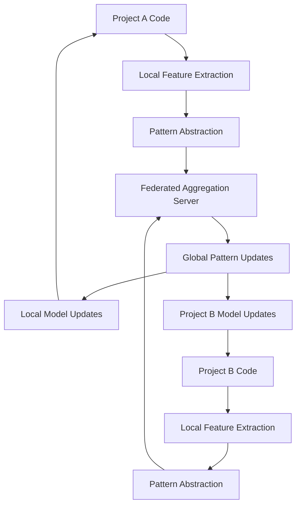
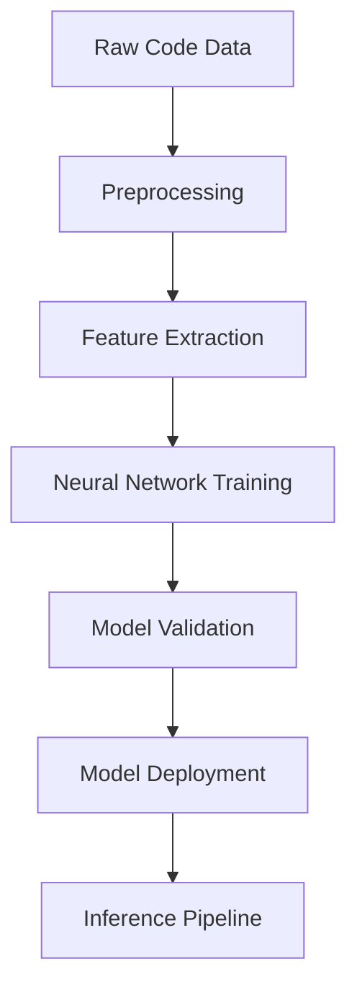

# Phase 2.3 Advanced Machine Learning Foundation Architecture Design

## Executive Summary

This document outlines the architecture for Phase 2.3's advanced machine learning foundation for syntax pattern recognition in NoodleCore Syntax Fixer. The design builds upon the existing Phase 2.2 infrastructure (EnhancedNoodleCoreSyntaxFixerV3, SyntaxReasoningModule, LearningEngine) to provide sophisticated neural network-based pattern recognition, cross-project learning, and predictive fixing capabilities while maintaining privacy and data separation.

## 1. Neural Network Architecture for Syntax Pattern Recognition

### 1.1 Multi-Model Architecture

The ML foundation will support multiple neural network architectures through a flexible model registry system:

#### Core Model Types

1. **Transformer-based Models**
   - Architecture: Multi-head attention with positional encoding
   - Use Case: Complex syntax patterns with long-range dependencies
   - Strengths: Context understanding, sequential pattern recognition

2. **Recurrent Neural Networks (RNN/LSTM)**
   - Architecture: Bidirectional LSTM with attention mechanism
   - Use Case: Sequential syntax constructs and code flow patterns
   - Strengths: Temporal pattern recognition, code structure analysis

3. **Convolutional Neural Networks (CNN)**
   - Architecture: 1D CNN for token sequences
   - Use Case: Local syntax pattern detection and token-level features
   - Strengths: Local pattern recognition, efficient processing

4. **Hybrid Ensemble Models**
   - Architecture: Combination of Transformer and CNN components
   - Use Case: Complex syntax issues requiring both local and global context
   - Strengths: Balanced performance across different pattern types

### 1.2 Model Registry System

```python
class ModelRegistry:
    """Registry for managing different neural network architectures."""
    
    def register_model(self, model_type: str, model_class: Type[BaseSyntaxModel]):
        """Register a new model architecture."""
        
    def get_model(self, model_type: str, config: Dict[str, Any]) -> BaseSyntaxModel:
        """Get instantiated model for specified type."""
        
    def list_available_models(self) -> List[str]:
        """List all available model types."""
```

### 1.3 Model Selection Algorithm

```python
def select_optimal_model(problem_complexity: ComplexityLevel, 
                      pattern_type: str, 
                      performance_requirements: Dict[str, float]) -> str:
    """
    Select optimal model based on problem characteristics.
    
    Returns model type from registry.
    """
```

## 2. Cross-Project Learning System with Federated Approach

### 2.1 Federated Learning Architecture

The cross-project learning system will use a federated approach where patterns and improvements are shared without sharing actual code:

#### Privacy-Preserving Data Flow



### 2.2 Pattern Abstraction Layer

```python
class PatternAbstractionLayer:
    """Converts local patterns to privacy-preserving abstractions."""
    
    def extract_patterns(self, code_features: Dict[str, Any]) -> List[AbstractPattern]:
        """Extract abstract patterns from code features."""
        
    def anonymize_patterns(self, patterns: List[AbstractPattern]) -> List[AnonymizedPattern]:
        """Remove identifying information while preserving pattern structure."""
```

### 2.3 Federated Aggregation Server

```python
class FederatedAggregationServer:
    """Aggregates anonymized patterns from multiple projects."""
    
    def collect_patterns(self, project_id: str, patterns: List[AnonymizedPattern]):
        """Collect patterns from a project."""
        
    def aggregate_global_patterns(self) -> Dict[str, GlobalPattern]:
        """Aggregate patterns across all projects."""
        
    def distribute_updates(self, global_patterns: Dict[str, GlobalPattern]):
        """Distribute pattern updates to participating projects."""
```

## 3. Predictive Fixing Algorithm Architecture

### 3.1 Context-Aware Prediction Engine

```python
class PredictiveFixingEngine:
    """Predicts syntax fixes based on context and historical patterns."""
    
    def __init__(self, model_registry: ModelRegistry, pattern_store: PatternStore):
        self.model_registry = model_registry
        self.pattern_store = pattern_store
        
    def predict_fix(self, 
                   code_context: CodeContext,
                   error_analysis: ErrorAnalysis,
                   historical_patterns: List[HistoricalPattern]) -> List[PredictedFix]:
        """Generate fix predictions with confidence scores."""
```

### 3.2 Multi-Factor Confidence Scoring

```python
class ConfidenceScorer:
    """Calculates confidence scores for predicted fixes."""
    
    def calculate_confidence(self, 
                        predicted_fix: PredictedFix,
                        context_similarity: float,
                        pattern_strength: float,
                        historical_success_rate: float) -> float:
        """Calculate overall confidence from multiple factors."""
```

## 4. Integration Points with Existing Phase 2.2 Components

### 4.1 EnhancedNoodleCoreSyntaxFixerV3 Integration

```python
class EnhancedNoodleCoreSyntaxFixerV4(EnhancedNoodleCoreSyntaxFixerV3):
    """Enhanced syntax fixer with ML foundation integration."""
    
    def __init__(self, **kwargs):
        super().__init__(**kwargs)
        self.ml_engine = MLEngine()
        self.pattern_predictor = PatternPredictor()
        
    def fix_file_enhanced_v4(self, file_path: str, **kwargs) -> Dict[str, Any]:
        """Enhanced file fixing with ML-powered predictions."""
```

### 4.2 SyntaxReasoningModule Enhancement

```python
class EnhancedSyntaxReasoningModule(SyntaxReasoningModule):
    """Enhanced reasoning module with ML integration."""
    
    def __init__(self, **kwargs):
        super().__init__(**kwargs)
        self.ml_predictor = MLPredictor()
        
    def analyze_with_ml_enhancement(self, problem: SyntaxProblem) -> TRMReasoningResult:
        """Enhanced analysis with ML-powered pattern recognition."""
```

### 4.3 LearningEngine Integration

```python
class EnhancedLearningEngine(LearningEngine):
    """Enhanced learning engine with neural network capabilities."""    
    def __init__(self, **kwargs):
        super().__init__(**kwargs)
        self.neural_trainer = NeuralNetworkTrainer()
        self.pattern_extractor = NeuralPatternExtractor()
```

## 5. Data Pipeline Architecture

### 5.1 Training Pipeline



### 5.2 Validation Pipeline

```python
class ValidationPipeline:
    """Validates ML models before deployment."""    
    def validate_model(self, model: BaseSyntaxModel, 
                    test_data: Dataset) -> ValidationResults:
        """Validate model performance against test dataset."""
        
    def cross_validate(self, model: BaseSyntaxModel, 
                   folds: int = 5) -> CrossValidationResults:
        """Perform k-fold cross-validation."""
```

### 5.3 Inference Pipeline

```python
class InferencePipeline:
    """High-performance inference pipeline for real-time predictions."""    
    def __init__(self, model_cache: ModelCache, batch_processor: BatchProcessor):
        self.model_cache = model_cache
        self.batch_processor = batch_processor
        
    def predict_batch(self, inputs: List[SyntaxInput]) -> List[SyntaxPrediction]:
        """Batch prediction for improved throughput."""
```

## 6. Performance Considerations

### 6.1 Real-Time Inference Optimization

#### Performance Targets

- **Simple Fixes**: <100ms inference time
- **Complex Fixes**: <500ms inference time
- **TRM-Enhanced Fixes**: <2s total processing time
- **Batch Processing**: 1000+ predictions per second

#### Optimization Strategies

1. **Model Quantization**

   ```python
   class ModelQuantizer:
       def quantize_model(self, model: BaseSyntaxModel) -> QuantizedModel:
           """Reduce model size and improve inference speed."""
   ```

2. **Dynamic Batching**

   ```python
   class DynamicBatcher:
       def create_optimal_batches(self, inputs: List[SyntaxInput]) -> List[Batch]:
           """Create optimal batches based on input characteristics."""
   ```

3. **Model Caching**

   ```python
   class ModelCache:
       def cache_model(self, model_id: str, model: BaseSyntaxModel):
           """Cache frequently used models in memory."""
   ```

### 6.2 Memory Management

```python
class MemoryManager:
    """Manages memory usage for ML operations."""    
    def monitor_memory(self) -> MemoryStats:
        """Monitor current memory usage."""
        
    def optimize_memory(self) -> None:
        """Optimize memory allocation for ML operations."""
```

## 7. Configuration Management

### 7.1 Environment Variables

```bash
# ML Foundation Configuration
NOODLE_ML_MODEL_REGISTRY_PATH=/path/to/models
NOODLE_ML_FEDERATED_LEARNING_ENABLED=true
NOODLE_ML_PREDICTIVE_FIXING_ENABLED=true
NOODLE_ML_INFERENCE_TIMEOUT_MS=500
NOODLE_ML_BATCH_SIZE=32
NOODLE_ML_MODEL_CACHE_SIZE=100
NOODLE_ML_PRIVACY_PRESERVATION_LEVEL=high
NOODLE_ML_CROSS_PROJECT_LEARNING_ENABLED=true
NOODLE_ML_PERFORMANCE_MONITORING_ENABLED=true

# Model Configuration
NOODLE_ML_DEFAULT_MODEL_TYPE=transformer
NOODLE_ML_MODEL_UPDATE_INTERVAL=24h
NOODLE_ML_MIN_CONFIDENCE_THRESHOLD=0.7
NOODLE_ML_MAX_PATTERN_COMPLEXITY=0.9
```

### 7.2 Configuration Structure

```json
{
  "ml_foundation": {
    "model_registry": {
      "enabled": true,
      "model_path": "/path/to/models",
      "default_model_type": "transformer",
      "available_models": ["transformer", "rnn", "cnn", "hybrid"]
    },
    "federated_learning": {
      "enabled": true,
      "privacy_level": "high",
      "aggregation_server_url": "https://api.noodlecore.org/federated",
      "pattern_anonymization": true,
      "sync_interval": "6h"
    },
    "predictive_fixing": {
      "enabled": true,
      "confidence_threshold": 0.7,
      "max_predictions": 5,
      "context_window_size": 10
    },
    "performance": {
      "inference_timeout_ms": 500,
      "batch_size": 32,
      "model_cache_size": 100,
      "memory_limit_mb": 1024,
      "enable_quantization": true
    }
  }
}
```

## 8. Component Interfaces and API Definitions

### 8.1 Core ML Interfaces

```python
class BaseSyntaxModel(ABC):
    """Abstract base class for syntax models."""
    @abstractmethod
    def predict(self, input_data: SyntaxInput) -> SyntaxPrediction:
        """Predict syntax fix for given input."""
        
    @abstractmethod
    def train(self, training_data: TrainingDataset) -> TrainingResults:
        """Train the model on provided dataset."""
        
    @abstractmethod
    def evaluate(self, test_data: TestDataset) -> EvaluationResults:
        """Evaluate model performance."""
```

### 8.2 ML Foundation API

```python
class MLFoundationAPI:
    """Main API for ML foundation components."""
    def __init__(self, config: MLConfiguration):
        self.config = config
        self.model_registry = ModelRegistry()
        self.federated_client = FederatedLearningClient()
        self.predictive_engine = PredictiveFixingEngine()
        
    def predict_syntax_fix(self,
                          code_context: CodeContext,
                          error_info: ErrorInfo) -> List[PredictedFix]:
        """Predict syntax fixes using ML models."""
        
    def train_model(self,
                   model_type: str,
                   training_data: TrainingDataset) -> TrainingResults:
        """Train a new model or update existing model."""
        
    def contribute_patterns(self, patterns: List[AbstractPattern]):
        """Contribute patterns to federated learning."""
        
    def get_global_patterns(self) -> List[GlobalPattern]:
        """Retrieve global patterns from federated server."""
```

## 9. Scalability and Maintainability

### 9.1 Scalability Architecture

#### Horizontal Scaling

```python
class ScalableMLInfrastructure:
    """Manages scalable ML infrastructure."""
    def __init__(self, cluster_config: ClusterConfiguration):
        self.cluster_manager = ClusterManager(cluster_config)
        self.load_balancer = MLModelLoadBalancer()
        self.resource_monitor = ResourceMonitor()
        
    def scale_inference_cluster(self, target_throughput: float):
        """Scale inference cluster to meet throughput requirements."""
        
    def distribute_training_load(self, training_jobs: List[TrainingJob]):
        """Distribute training jobs across available resources."""
```

#### Model Versioning

```python
class ModelVersionManager:
    """Manages model versions and deployments."""
    def create_model_version(self, model: BaseSyntaxModel) -> ModelVersion:
        """Create new version of a model."""
        
    def deploy_model_version(self, version_id: str, deployment_config: DeploymentConfig):
        """Deploy specific model version."""
        
    def rollback_model_version(self, version_id: str):
        """Rollback to previous model version."""
```

### 9.2 Maintainability Design

#### Modular Architecture

```python
class MLModuleRegistry:
    """Registry for ML modules with dependency management."""
    def register_module(self, module_name: str, module_class: Type[MLModule]):
        """Register ML module with dependencies."""
        
    def resolve_dependencies(self, module_name: str) -> List[MLModule]:
        """Resolve and initialize module dependencies."""
        
    def validate_module_compatibility(self, modules: List[MLModule]) -> CompatibilityReport:
        """Validate module compatibility."""
```

#### Health Monitoring

```python
class MLHealthMonitor:
    """Monitors health of ML components."""
    def monitor_model_health(self, model_id: str) -> HealthStatus:
        """Monitor health of specific model."""
        
    def monitor_system_health(self) -> SystemHealthReport:
        """Monitor overall ML system health."""
        
    def generate_health_report(self) -> HealthReport:
        """Generate comprehensive health report."""
```

## 10. Implementation Phases

### 10.1 Phase 1: Core ML Infrastructure (Weeks 1-2)

- Implement BaseSyntaxModel interface
- Create ModelRegistry system
- Implement basic neural network architectures
- Set up configuration management

### 10.2 Phase 2: Federated Learning System (Weeks 3-4)

- Implement PatternAbstractionLayer
- Create FederatedAggregationServer
- Set up privacy-preserving data flow
- Implement pattern anonymization

### 10.3 Phase 3: Predictive Fixing Engine (Weeks 5-6)

- Implement PredictiveFixingEngine
- Create ConfidenceScorer
- Integrate with existing Phase 2.2 components
- Set up inference pipeline

### 10.4 Phase 4: Performance Optimization (Weeks 7-8)

- Implement model quantization
- Create dynamic batching system
- Set up model caching
- Optimize memory management

### 10.5 Phase 5: Integration and Testing (Weeks 9-10)

- Complete integration with all Phase 2.2 components
- Implement comprehensive testing
- Performance benchmarking
- Documentation and deployment

## 11. Security and Privacy Considerations

### 11.1 Data Privacy

- All code data remains within project boundaries
- Only abstract patterns are shared in federated learning
- Pattern anonymization removes identifying information
- Optional local-only mode for sensitive projects

### 11.2 Model Security

- Model validation before deployment
- Secure model versioning and rollback
- Access control for model operations
- Audit logging for all ML operations

## 12. Monitoring and Observability

### 12.1 Performance Metrics

```python
class MLPipelineMetrics:
    """Metrics for ML pipeline performance."""
    def track_inference_latency(self, model_id: str, latency_ms: float):
        """Track inference latency for model."""
        
    def track_prediction_accuracy(self, predictions: List[PredictionResult]):
        """Track prediction accuracy over time."""
        
    def track_model_performance(self, model_id: str, performance_metrics: Dict[str, float]):
        """Track overall model performance."""
```

### 12.2 System Monitoring

```python
class MLSystemMonitor:
    """Monitor ML system health and performance."""
    def monitor_resource_usage(self) -> ResourceUsageReport:
        """Monitor CPU, memory, and GPU usage."""
        
    def monitor_model_drift(self, model_id: str) -> DriftReport:
        """Monitor model performance drift."""
        
    def generate_alerts(self) -> List[SystemAlert]:
        """Generate alerts for system issues."""
```

## 13. Conclusion

The Phase 2.3 ML Foundation Architecture provides a comprehensive, scalable, and privacy-preserving foundation for advanced syntax pattern recognition in NoodleCore. The design:

- **Builds upon existing Phase 2.2 infrastructure** without breaking current functionality
- **Provides flexible neural network architectures** for different types of syntax patterns
- **Enables cross-project learning** while maintaining privacy and data separation
- **Delivers real-time performance** for responsive user experience
- **Follows NoodleCore conventions** including NOODLE_ environment variables and database patterns
- **Ensures scalability and maintainability** for long-term evolution

The modular design allows for incremental implementation and testing, with clear interfaces and well-defined integration points. The federated learning approach enables pattern sharing across projects while maintaining privacy, and the performance optimization strategies ensure real-time inference capabilities.

This architecture provides a solid foundation for the next generation of syntax fixing capabilities in NoodleCore, enabling more accurate, context-aware, and intelligent syntax corrections.
