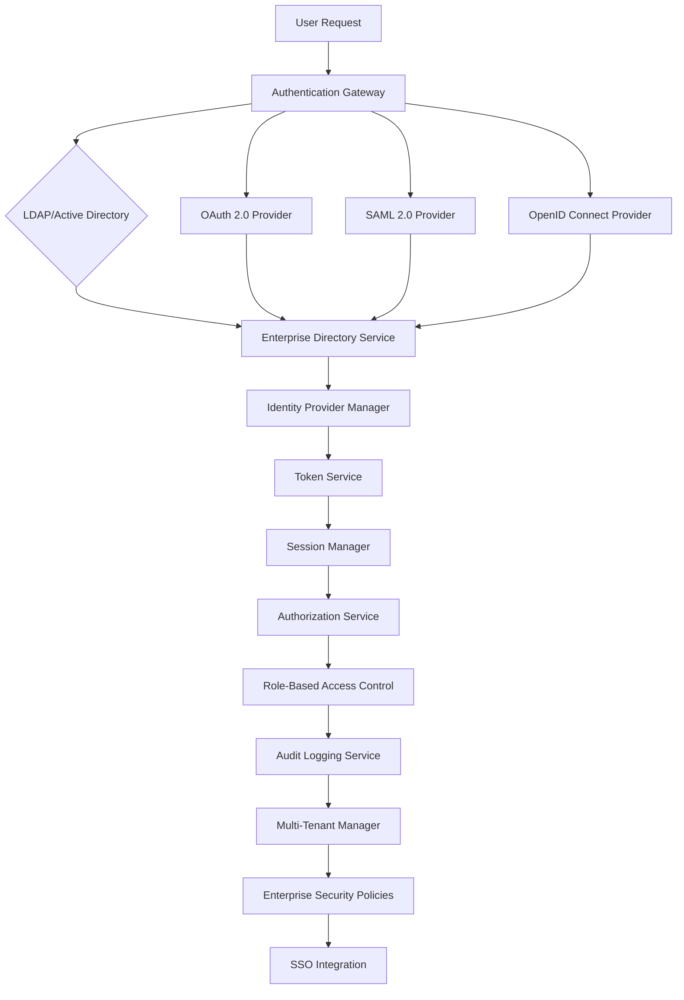
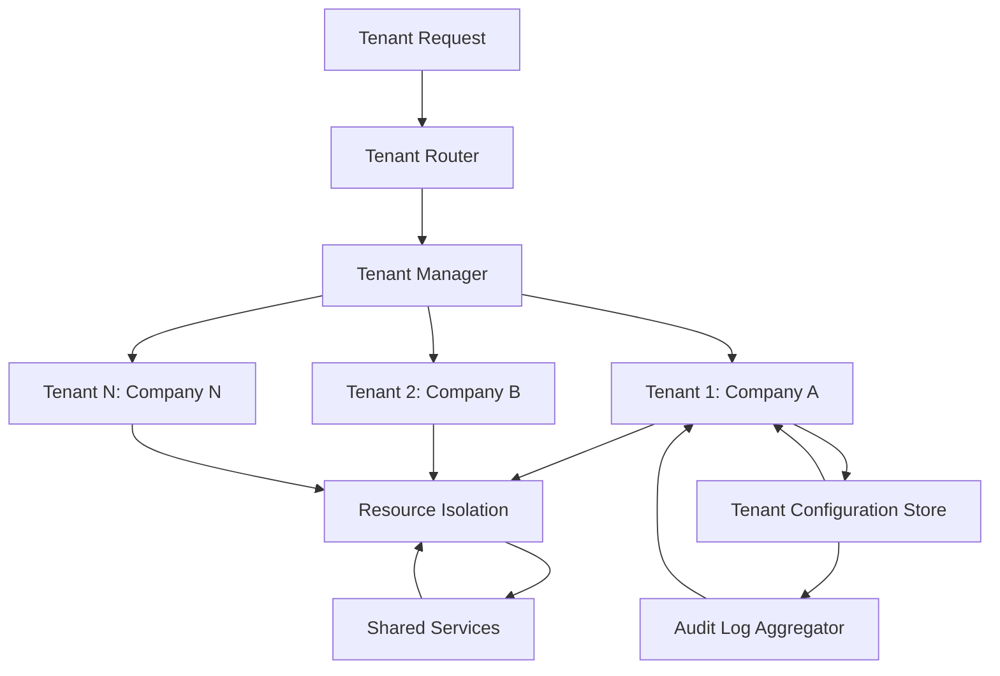
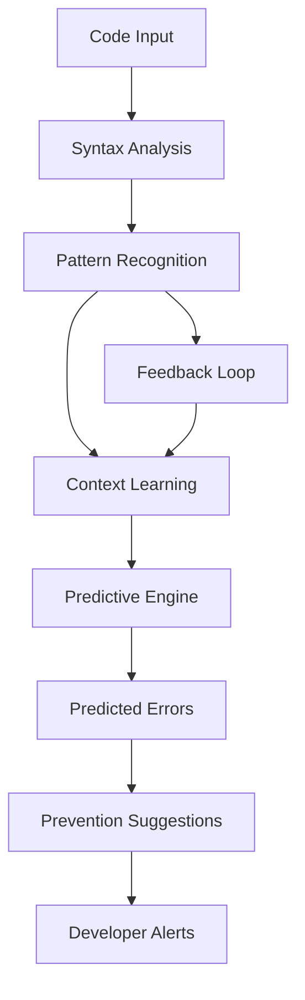
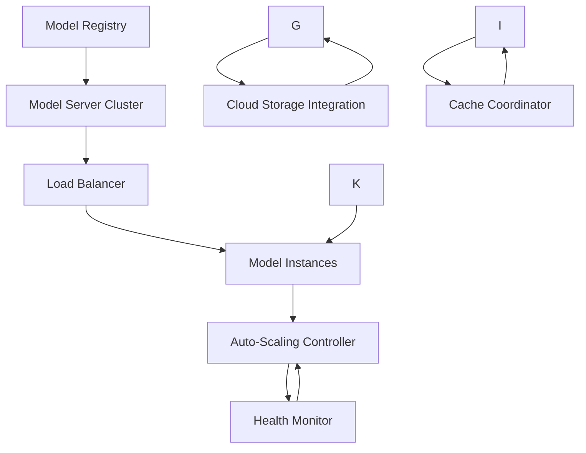
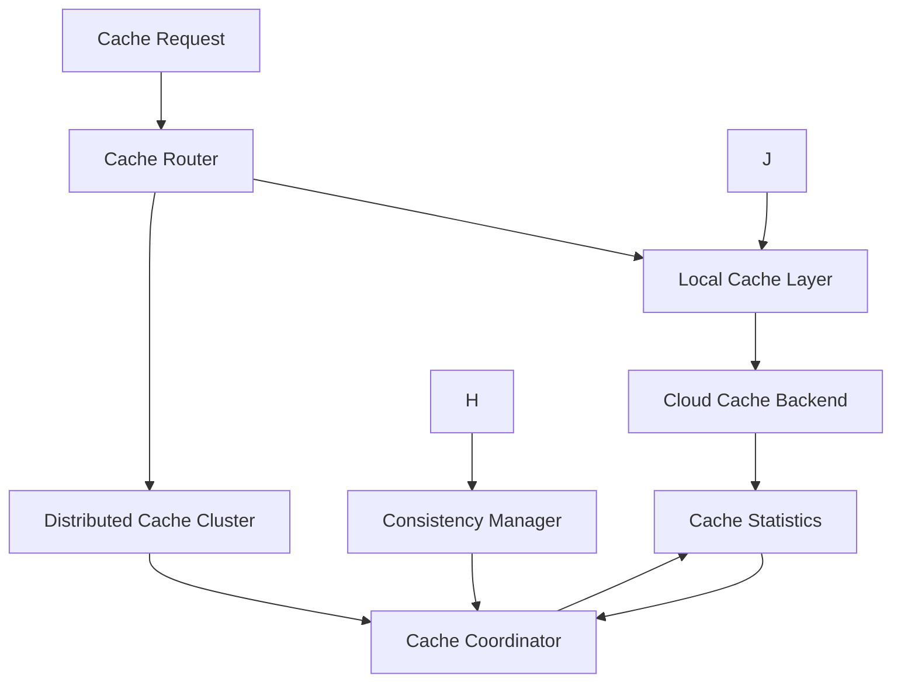
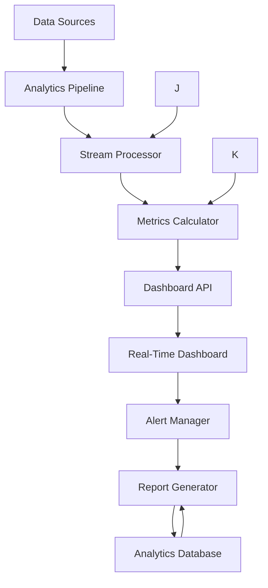
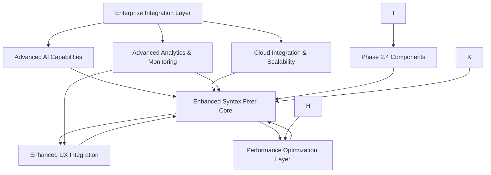

# Phase 2.5: Enterprise Integration & Advanced AI Architecture Design

## Executive Summary

This document outlines the architecture for Phase 2.5 of the NoodleCore ML-enhanced syntax fixer system, focusing on enterprise-grade integration, advanced AI capabilities, cloud scalability, and comprehensive analytics. This phase builds upon the completed Phase 2.4 implementation (AERE integration, performance optimization, and enhanced UX) to deliver a production-ready enterprise solution.

## 1. Enterprise Integration Layer Architecture

### 1.1 Authentication & Authorization System

#### Core Components



#### Authentication Provider Interface

```python
class AuthenticationProvider(ABC):
    """Abstract base for authentication providers."""
    
    @abstractmethod
    def authenticate(self, credentials: Dict[str, str]) -> AuthResult:
        """Authenticate user credentials."""
        
    @abstractmethod
    def authorize(self, token: str, resource: str, action: str) -> AuthzResult:
        """Authorize user action on resource."""
        
    @abstractmethod
    def get_user_info(self, user_id: str) -> UserInfo:
        """Retrieve user information."""
```

#### Enterprise Directory Integration

```python
class EnterpriseDirectoryAuth(AuthenticationProvider):
    """LDAP/Active Directory authentication provider."""
    
    def __init__(self, config: Dict[str, Any]):
        self.ldap_server = config.get('ldap_server')
        self.ldap_port = config.get('ldap_port', 389)
        self.base_dn = config.get('base_dn')
        self.use_ssl = config.get('use_ssl', True)
        self.connection_timeout = config.get('connection_timeout', 30)
        
    def authenticate(self, credentials: Dict[str, str]) -> AuthResult:
        """Authenticate against LDAP/Active Directory."""
        # Implementation details in technical specification
```

#### Role-Based Access Control (RBAC)

```python
class RBACManager:
    """Role-Based Access Control management."""
    
    def __init__(self, config: Dict[str, Any]):
        self.role_hierarchy = config.get('role_hierarchy', {})
        self.permission_matrix = config.get('permission_matrix', {})
        self.default_role = config.get('default_role', 'developer')
        
    def check_permission(self, user: UserInfo, resource: str, action: str) -> bool:
        """Check if user has permission for action on resource."""
        
    def assign_role(self, user_id: str, role: str) -> bool:
        """Assign role to user."""
```

### 1.2 Multi-Tenant Support Architecture

#### Tenant Isolation Model



#### Multi-Tenant Manager Implementation

```python
class MultiTenantManager:
    """Multi-tenant system management."""
    
    def __init__(self, config: Dict[str, Any]):
        self.tenant_config_store = TenantConfigStore()
        self.resource_isolation = ResourceIsolationManager()
        self.shared_services = SharedServiceManager()
        
    def create_tenant(self, tenant_config: TenantConfig) -> str:
        """Create new tenant with isolated resources."""
        
    def get_tenant_context(self, tenant_id: str) -> TenantContext:
        """Get tenant-specific context for operations."""
```

### 1.3 Enterprise Security & Compliance

#### Security Policy Framework

```python
class EnterpriseSecurityPolicy:
    """Enterprise security policy enforcement."""
    
    def __init__(self, config: Dict[str, Any]):
        self.password_policy = PasswordPolicy(config.get('password_policy', {}))
        self.session_policy = SessionPolicy(config.get('session_policy', {}))
        self.audit_policy = AuditPolicy(config.get('audit_policy', {}))
        self.compliance_standards = config.get('compliance_standards', [])
        
    def enforce_policy(self, operation: Operation, context: Dict[str, Any]) -> PolicyResult:
        """Enforce security policy on operation."""
```

## 2. Advanced AI Capabilities Architecture

### 2.1 GPT-4/Vision Integration Framework

#### Multi-Provider AI Interface

```python
class AdvancedAIProvider(ABC):
    """Abstract interface for advanced AI providers."""
    
    @abstractmethod
    def generate_code_fix(self, context: CodeContext, error_info: ErrorInfo) -> List[AIFix]:
        """Generate AI-powered code fixes."""
        
    @abstractmethod
    def analyze_code_context(self, code: str, file_path: str) -> ContextAnalysis:
        """Analyze code context for enhanced understanding."""
        
    @abstractmethod
    def predict_errors(self, code: str, language: str) -> List[PredictedError]:
        """Predict potential errors before they occur."""
```

#### GPT-4/Vision Integration

```python
class GPT4VisionProvider(AdvancedAIProvider):
    """GPT-4/Vision integration for advanced code analysis."""
    
    def __init__(self, config: Dict[str, Any]):
        self.api_key = config.get('api_key')
        self.model = config.get('model', 'gpt-4-vision-preview')
        self.max_tokens = config.get('max_tokens', 4096)
        self.vision_capabilities = config.get('vision_capabilities', True)
        
    def analyze_code_with_vision(self, code: str, screenshot_data: bytes = None) -> VisionEnhancedAnalysis:
        """Analyze code with visual understanding capabilities."""
```

### 2.2 Context Learning & Predictive Error Prevention

#### Context Learning Engine

```python
class ContextLearningEngine:
    """Learns from code context to improve predictions."""
    
    def __init__(self, config: Dict[str, Any]):
        self.context_window_size = config.get('context_window_size', 10000)
        self.learning_rate = config.get('learning_rate', 0.001)
        self.pattern_memory = PatternMemory()
        
    def learn_from_fix(self, fix_result: FixResult, context: CodeContext) -> None:
        """Learn from successful and failed fixes."""
        
    def predict_errors(self, code: str, context: CodeContext) -> List[PredictedError]:
        """Predict likely errors based on learned patterns."""
```

#### Predictive Error Prevention System



### 2.3 AI-Powered Refactoring & Analysis

#### Intelligent Refactoring Engine

```python
class AIRefactoringEngine:
    """AI-powered code refactoring and analysis."""
    
    def __init__(self, config: Dict[str, Any]):
        self.refactoring_strategies = config.get('strategies', [])
        self.quality_metrics = QualityMetrics()
        self.style_preferences = StylePreferences()
        
    def suggest_refactoring(self, code: str, context: CodeContext) -> List[RefactoringSuggestion]:
        """Suggest intelligent refactoring opportunities."""
        
    def apply_refactoring(self, code: str, suggestion: RefactoringSuggestion) -> RefactoringResult:
        """Apply AI-suggested refactoring with validation."""
```

## 3. Cloud Integration & Scalability Architecture

### 3.1 Cloud-Based Model Serving

#### Distributed Model Serving Architecture



#### Cloud Model Server Implementation

```python
class CloudModelServer:
    """Cloud-based model serving for AI inference."""
    
    def __init__(self, config: Dict[str, Any]):
        self.model_registry = ModelRegistry()
        self.load_balancer = LoadBalancer()
        self.auto_scaler = AutoScaler()
        self.health_monitor = HealthMonitor()
        
    def serve_model(self, model_id: str, request: InferenceRequest) -> InferenceResponse:
        """Serve model inference with auto-scaling."""
```

### 3.2 Distributed Cache Coordination

#### Cache Coordination Architecture



#### Distributed Cache Implementation

```python
class DistributedCacheCoordinator:
    """Coordinates distributed caching across cloud instances."""
    
    def __init__(self, config: Dict[str, Any]):
        self.cache_backends = CacheBackendManager()
        self.consistency_manager = CacheConsistencyManager()
        self.invalidation_service = CacheInvalidationService()
        
    def get_cached_result(self, key: str, region: str = None) -> Optional[CachedResult]:
        """Get cached result with distributed coordination."""
        
    def cache_result(self, key: str, result: Any, ttl: int = 3600) -> bool:
        """Cache result with distributed consistency."""
```

### 3.3 Auto-Scaling & Load Balancing

#### Auto-Scaling Controller

```python
class AutoScalingController:
    """Intelligent auto-scaling for model serving."""
    
    def __init__(self, config: Dict[str, Any]):
        self.scaling_metrics = ScalingMetrics()
        self.scaling_policies = ScalingPolicyManager()
        self.resource_monitor = ResourceMonitor()
        
    def scale_based_on_load(self, current_metrics: SystemMetrics) -> ScalingDecision:
        """Make intelligent scaling decisions based on system load."""
        
    def execute_scaling(self, decision: ScalingDecision) -> ScalingResult:
        """Execute scaling operation with rollback capabilities."""
```

### 3.4 Cloud Storage Integration

#### Multi-Provider Cloud Storage

```python
class CloudStorageManager:
    """Manages multiple cloud storage providers."""
    
    def __init__(self, config: Dict[str, Any]):
        self.storage_providers = {
            'aws_s3': AWSS3Provider(config.get('aws')),
            'azure_blob': AzureBlobProvider(config.get('azure')),
            'gcp_storage': GCPStorageProvider(config.get('gcp'))
        }
        
    def store_artifact(self, artifact: Artifact, provider: str = None) -> StorageResult:
        """Store artifact with automatic provider selection."""
        
    def retrieve_artifact(self, artifact_id: str, provider: str = None) -> Artifact:
        """Retrieve artifact with cross-provider fallback."""
```

## 4. Advanced Analytics & Monitoring Architecture

### 4.1 Real-Time Analytics Dashboard

#### Analytics Dashboard Architecture



#### Real-Time Dashboard Implementation

```python
class RealTimeAnalyticsDashboard:
    """Real-time analytics dashboard for enterprise monitoring."""
    
    def __init__(self, config: Dict[str, Any]):
        self.data_pipeline = AnalyticsPipeline()
        self.metrics_calculator = MetricsCalculator()
        self.dashboard_api = DashboardAPI()
        self.alert_manager = AlertManager()
        
    def generate_dashboard(self, time_range: TimeRange) -> DashboardData:
        """Generate real-time dashboard data."""
        
    def create_alert(self, alert_config: AlertConfig) -> Alert:
        """Create configurable alerts for various conditions."""
```

### 4.2 Performance Baselines & Anomaly Detection

#### Performance Monitoring System

```python
class PerformanceMonitor:
    """Advanced performance monitoring with anomaly detection."""
    
    def __init__(self, config: Dict[str, Any]):
        self.baseline_calculator = BaselineCalculator()
        self.anomaly_detector = AnomalyDetector()
        self.performance_collector = PerformanceCollector()
        
    def establish_baseline(self, metrics_data: List[MetricData]) -> PerformanceBaseline:
        """Establish performance baselines from historical data."""
        
    def detect_anomalies(self, current_metrics: SystemMetrics) -> List[Anomaly]:
        """Detect performance anomalies using ML techniques."""
```

### 4.3 Usage Analytics & Cost Optimization

#### Usage Analytics Engine

```python
class UsageAnalyticsEngine:
    """Analytics engine for usage patterns and cost optimization."""
    
    def __init__(self, config: Dict[str, Any]):
        self.usage_tracker = UsageTracker()
        self.cost_analyzer = CostAnalyzer()
        self.optimization_engine = OptimizationEngine()
        
    def analyze_usage_patterns(self, user_id: str, time_range: TimeRange) -> UsageAnalysis:
        """Analyze usage patterns for insights and optimization."""
        
    def optimize_costs(self, resource_usage: ResourceUsage) -> OptimizationRecommendations:
        """Generate cost optimization recommendations."""
```

### 4.4 Predictive Maintenance System

#### Predictive Maintenance Engine

```python
class PredictiveMaintenanceEngine:
    """Predictive maintenance system for proactive issue prevention."""
    
    def __init__(self, config: Dict[str, Any]):
        self.failure_predictor = FailurePredictor()
        self.maintenance_scheduler = MaintenanceScheduler()
        self.system_health_monitor = SystemHealthMonitor()
        
    def predict_maintenance_needs(self, system_metrics: SystemMetrics) -> List[MaintenanceTask]:
        """Predict maintenance needs based on system metrics and usage patterns."""
        
    def schedule_maintenance(self, tasks: List[MaintenanceTask]) -> MaintenanceSchedule:
        """Schedule maintenance with minimal disruption."""
```

## 5. System Integration Architecture

### 5.1 Component Interaction Flow



### 5.2 Data Flow Architecture

```mermaid
graph LR
    A[User Request] --> B[Authentication Gateway]
    B --> C[Authorization Service]
    C --> D[Multi-Tenant Context]
    D --> E[AI Request Router]
    E --> F[Advanced AI Providers]
    F --> G[Model Serving Cluster]
    G --> H[Inference Engine]
    H --> I[Syntax Fixer Core]
    I --> J[Analytics Pipeline]
    J --> K[Real-Time Dashboard]
    K --> L[Alert System]
    L --> M[Cost Optimization Engine]
    M --> N[Predictive Maintenance]
    N --> O[Cloud Storage]
    O --> P[Audit Logging]
    P --> Q[Enterprise Security Policies]
    Q --> R[Compliance Reporting]
    R --> S[User Response]
```



## 6. Technical Specifications

### 6.1 Enterprise Authentication Layer

#### Environment Variables

```bash
# Enterprise Authentication Configuration
NOODLE_ENTERPRISE_AUTH_ENABLED=true
NOODLE_ENTERPRISE_AUTH_PROVIDERS=ldap,oauth2,saml,openid
NOODLE_ENTERPRISE_LDAP_SERVER=ldap.company.com
NOODLE_ENTERPRISE_LDAP_PORT=389
NOODLE_ENTERPRISE_LDAP_BASE_DN=dc=company,dc=com
NOODLE_ENTERPRISE_OAUTH2_PROVIDERS=azure,google,github
NOODLE_ENTERPRISE_SAML2_PROVIDERS=okta,azuread,shibboleth
NOODLE_ENTERPRISE_OPENID_PROVIDERS=google,microsoft,okta

# Multi-Tenant Configuration
NOODLE_ENTERPRISE_MULTI_TENANT_ENABLED=true
NOODLE_ENTERPRISE_TENANT_ISOLATION=strict
NOODLE_ENTERPRISE_MAX_TENANTS=1000
NOODLE_ENTERPRISE_TENANT_CONFIG_STORE=database

# RBAC Configuration
NOODLE_ENTERPRISE_RBAC_ENABLED=true
NOODLE_ENTERPRISE_RBAC_HIERARCHY_FILE=/path/to/role_hierarchy.json
NOODLE_ENTERPRISE_RBAC_DEFAULT_ROLE=developer
NOODLE_ENTERPRISE_RBAC_CACHE_TTL=300

# Audit Logging Configuration
NOODLE_ENTERPRISE_AUDIT_ENABLED=true
NOODLE_ENTERPRISE_AUDIT_RETENTION_DAYS=365
NOODLE_ENTERPRISE_AUDIT_LOG_LEVEL=info
NOODLE_ENTERPRISE_AUDIT_ASYNC=true
```

#### Core Classes

```python
class EnterpriseAuthenticationManager:
    """Main authentication manager for enterprise integration."""
    
    def __init__(self, config: Dict[str, Any]):
        self.auth_providers = self._initialize_providers(config)
        self.rbac_manager = RBACManager(config.get('rbac', {}))
        self.audit_logger = AuditLogger(config.get('audit', {}))
        self.tenant_manager = MultiTenantManager(config.get('multi_tenant', {}))
        
    def authenticate_user(self, credentials: Dict[str, str], provider: str = None) -> AuthResult:
        """Authenticate user using specified or auto-detected provider."""
        
    def authorize_action(self, user_id: str, resource: str, action: str, context: Dict[str, Any]) -> AuthzResult:
        """Authorize user action with RBAC and tenant context."""
```

### 6.2 Advanced AI Capabilities

#### Environment Variables

```bash
# Advanced AI Configuration
NOODLE_ADVANCED_AI_ENABLED=true
NOODLE_ADVANCED_AI_PROVIDERS=openai,gpt4,anthropic,custom
NOODLE_ADVANCED_AI_DEFAULT_PROVIDER=gpt4
NOODLE_ADVANCED_AI_MODEL=gpt-4-turbo
NOODLE_ADVANCED_AI_VISION_ENABLED=true
NOODLE_ADVANCED_AI_CONTEXT_LEARNING=true
NOODLE_ADVANCED_AI_PREDICTIVE_ERROR_PREVENTION=true
NOODLE_ADVANCED_AI_REFACTORING_ENABLED=true

# AI Provider Configuration
NOODLE_AI_OPENAI_API_KEY=${NOODLE_AI_OPENAI_API_KEY}
NOODLE_AI_ANTHROPIC_API_KEY=${NOODLE_AI_ANTHROPIC_API_KEY}
NOODLE_AI_CUSTOM_PROVIDER_ENDPOINT=${NOODLE_AI_CUSTOM_PROVIDER_ENDPOINT}
NOODLE_AI_CUSTOM_PROVIDER_API_KEY=${NOODLE_AI_CUSTOM_PROVIDER_API_KEY}
```

#### Core Classes

```python
class AdvancedAIManager:
    """Manager for advanced AI capabilities."""
    
    def __init__(self, config: Dict[str, Any]):
        self.ai_providers = self._initialize_ai_providers(config)
        self.context_learner = ContextLearningEngine(config.get('context_learning', {}))
        self.predictive_engine = PredictiveErrorEngine(config.get('predictive', {}))
        self.refactoring_engine = AIRefactoringEngine(config.get('refactoring', {}))
        
    def generate_advanced_fix(self, code_context: CodeContext, error_info: ErrorInfo) -> List[AIFix]:
        """Generate advanced AI-powered fixes with context learning."""
```

### 6.3 Cloud Integration & Scalability

#### Environment Variables

```bash
# Cloud Integration Configuration
NOODLE_CLOUD_ENABLED=true
NOODLE_CLOUD_PROVIDERS=aws,azure,gcp
NOODLE_CLOUD_DEFAULT_PROVIDER=aws
NOODLE_CLOUD_MODEL_SERVING_ENABLED=true
NOODLE_CLOUD_DISTRIBUTED_CACHE=true
NOODLE_CLOUD_AUTO_SCALING=true
NOODLE_CLOUD_STORAGE_ENABLED=true

# AWS Configuration
NOODLE_AWS_REGION=us-east-1
NOODLE_AWS_ACCESS_KEY_ID=${NOODLE_AWS_ACCESS_KEY_ID}
NOODLE_AWS_SECRET_ACCESS_KEY=${NOODLE_AWS_SECRET_ACCESS_KEY}
NOODLE_AWS_S3_BUCKET=noodlecore-models
NOODLE_AWS_S3_REGION=us-east-1

# Azure Configuration
NOODLE_AZURE_SUBSCRIPTION_ID=${NOODLE_AZURE_SUBSCRIPTION_ID}
NOODLE_AZURE_TENANT_ID=${NOODLE_AZURE_TENANT_ID}
NOODLE_AZURE_CLIENT_ID=${NOODLE_AZURE_CLIENT_ID}
NOODLE_AZURE_CLIENT_SECRET=${NOODLE_AZURE_CLIENT_SECRET}
NOODLE_AZURE_STORAGE_ACCOUNT=${NOODLE_AZURE_STORAGE_ACCOUNT}

# GCP Configuration
NOODLE_GCP_PROJECT_ID=${NOODLE_GCP_PROJECT_ID}
NOODLE_GCP_SERVICE_ACCOUNT_KEY=${NOODLE_GCP_SERVICE_ACCOUNT_KEY}
NOODLE_GCP_STORAGE_BUCKET=noodlecore-models
NOODLE_GCP_REGION=us-central1
```

#### Core Classes

```python
class CloudIntegrationManager:
    """Manager for cloud integration and scalability."""
    
    def __init__(self, config: Dict[str, Any]):
        self.cloud_providers = self._initialize_cloud_providers(config)
        self.model_server = CloudModelServer(config.get('model_serving', {}))
        self.cache_coordinator = DistributedCacheCoordinator(config.get('cache', {}))
        self.auto_scaler = AutoScalingController(config.get('auto_scaling', {}))
        self.storage_manager = CloudStorageManager(config.get('storage', {}))
        
    def deploy_model_to_cloud(self, model: AIModel, config: DeploymentConfig) -> DeploymentResult:
        """Deploy model to cloud with auto-scaling configuration."""
```

### 6.4 Advanced Analytics & Monitoring

#### Environment Variables

```bash
# Analytics Configuration
NOODLE_ANALYTICS_ENABLED=true
NOODLE_ANALYTICS_REAL_TIME=true
NOODLE_ANALYTICS_PERFORMANCE_BASELINES=true
NOODLE_ANALYTICS_ANOMALY_DETECTION=true
NOODLE_ANALYTICS_USAGE_ANALYTICS=true
NOODLE_ANALYTICS_COST_OPTIMIZATION=true
NOODLE_ANALYTICS_PREDICTIVE_MAINTENANCE=true

# Dashboard Configuration
NOODLE_ANALYTICS_DASHBOARD_PORT=8081
NOODLE_ANALYTICS_DASHBOARD_HOST=0.0.0.0
NOODLE_ANALYTICS_DASHBOARD_REFRESH_INTERVAL=30
NOODLE_ANALYTICS_DASHBOARD_RETENTION_HOURS=24

# Alert Configuration
NOODLE_ANALYTICS_ALERTS_ENABLED=true
NOODLE_ANALYTICS_ALERT_CHANNELS=email,slack,webhook
NOODLE_ANALYTICS_ALERT_SEVERITY_THRESHOLDS=warning,critical
NOODLE_ANALYTICS_ALERT_ESCALATION_POLICY=linear,exponential
```

#### Core Classes

```python
class AdvancedAnalyticsManager:
    """Manager for advanced analytics and monitoring."""
    
    def __init__(self, config: Dict[str, Any]):
        self.dashboard = RealTimeAnalyticsDashboard(config.get('dashboard', {}))
        self.performance_monitor = PerformanceMonitor(config.get('performance', {}))
        self.usage_analytics = UsageAnalyticsEngine(config.get('usage', {}))
        self.maintenance_predictor = PredictiveMaintenanceEngine(config.get('maintenance', {}))
        
    def generate_comprehensive_report(self, time_range: TimeRange) -> AnalyticsReport:
        """Generate comprehensive analytics report combining all metrics."""
```

## 7. Implementation Roadmap

### 7.1 Phase 1: Enterprise Authentication Infrastructure (Weeks 1-3)

#### Week 1: Core Authentication Framework

- Implement abstract authentication provider interfaces
- Create LDAP/Active Directory integration
- Implement OAuth 2.0 provider framework
- Implement SAML 2.0 provider framework
- Implement OpenID Connect provider framework
- Create authentication gateway with provider routing

#### Week 2: RBAC & Multi-Tenant Support

- Implement role-based access control system
- Create multi-tenant manager with resource isolation
- Implement tenant configuration management
- Create audit logging framework
- Implement enterprise security policy enforcement

#### Week 3: Integration & Testing

- Integrate authentication with existing syntax fixer
- Implement user context management
- Create comprehensive test suite
- Performance optimization and caching
- Documentation and deployment guides

### 7.2 Phase 2: Advanced AI Capabilities (Weeks 4-6)

#### Week 4: AI Provider Framework

- Implement advanced AI provider interface
- Create GPT-4/Vision integration
- Implement context learning engine
- Create predictive error prevention system
- Implement AI-powered refactoring engine

#### Week 5: Context Learning & Prediction

- Implement context learning from fix results
- Create predictive error models
- Implement pattern recognition for code analysis
- Integrate with existing ML infrastructure

#### Week 6: AI Integration & Testing

- Integrate advanced AI with syntax fixer core
- Implement enhanced fix generation with AI insights
- Create comprehensive test suite
- Performance optimization and validation

### 7.3 Phase 3: Cloud Integration & Scalability (Weeks 7-9)

#### Week 7: Cloud Infrastructure Setup

- Implement cloud provider interfaces (AWS, Azure, GCP)
- Create cloud storage integration
- Implement distributed cache coordination
- Create cloud resource management

#### Week 8: Model Serving & Auto-Scaling

- Implement cloud-based model serving
- Create load balancing and auto-scaling
- Implement health monitoring and failover
- Performance optimization and cost management

#### Week 9: Cloud Integration & Testing

- Integrate cloud services with core system
- Implement hybrid deployment capabilities
- Create comprehensive cloud test suite
- Documentation and migration guides

### 7.4 Phase 4: Advanced Analytics & Monitoring (Weeks 10-12)

#### Week 10: Analytics Infrastructure

- Implement real-time analytics dashboard
- Create performance baseline system
- Implement anomaly detection algorithms
- Create usage analytics engine
- Implement cost optimization system

#### Week 11: Predictive Maintenance

- Implement predictive maintenance engine
- Create failure prediction models
- Implement automated maintenance scheduling
- Create maintenance optimization algorithms

#### Week 12: Monitoring Integration & Testing

- Integrate analytics with all system components
- Implement comprehensive monitoring
- Create alert management system
- Performance optimization and validation

## 8. Security Considerations

### 8.1 Enterprise Security

#### Authentication Security

- Secure credential management with encryption at rest
- Multi-factor authentication support
- Session management with secure token handling
- API rate limiting and DDoS protection
- Comprehensive audit logging for compliance

#### Data Protection

- Tenant data isolation with encryption
- GDPR/CCPA compliance features
- Data anonymization for analytics
- Secure API communication with TLS 1.2+
- Regular security audits and penetration testing

### 8.2 Cloud Security

#### Cloud Security

- Cloud provider credential management
- Network security with VPC and firewalls
- Data encryption in transit and at rest
- Access control and identity management
- Cloud security compliance and certifications

### 8.3 AI Security

#### AI Model Security

- Model validation and sandboxing
- Input sanitization and output filtering
- API key management and rotation
- Model versioning and rollback capabilities
- AI ethics and bias mitigation

## 9. Performance Requirements

### 9.1 Performance Targets

#### Authentication Performance

- Login response time: <500ms (95th percentile)
- Authorization check time: <100ms (95th percentile)
- Concurrent user support: 10,000+ users
- Session creation time: <200ms

#### AI Performance

- AI fix generation time: <2s (95th percentile)
- Context analysis time: <1s (95th percentile)
- Model inference latency: <100ms (95th percentile)

#### Cloud Performance

- Model serving throughput: 1000+ requests/second
- Auto-scaling response time: <30s
- Cache hit rate: >90%
- Storage I/O throughput: 100MB/s+

### 9.2 Scalability Requirements

#### Horizontal Scaling

- Support for 1000+ concurrent users
- 10,000+ tenant support
- 99.9% uptime SLA
- Geographic distribution across regions
- Automatic failover and disaster recovery

#### Vertical Scaling

- Support for enterprise-level workloads
- GPU acceleration for AI model serving
- High-performance caching layers
- Optimized database connection pooling

## 10. Conclusion

The Phase 2.5 architecture provides a comprehensive enterprise-ready solution that builds upon the solid foundation of Phase 2.4 while adding critical enterprise capabilities. The modular design ensures seamless integration with existing systems while providing the scalability, security, and advanced features required for enterprise deployments.

The architecture maintains backward compatibility with all existing Phase 2.4 components and follows NoodleCore conventions with proper environment variable naming and directory structure. The implementation roadmap provides a clear path from current state to full enterprise readiness.

This architecture enables NoodleCore to compete in enterprise markets with advanced AI capabilities, robust security, comprehensive analytics, and cloud scalability while maintaining the flexibility and extensibility that has been a hallmark of the project.
