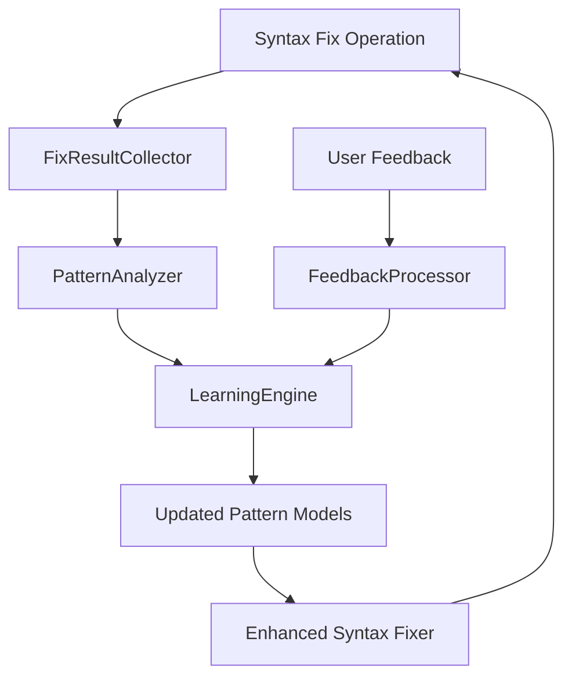
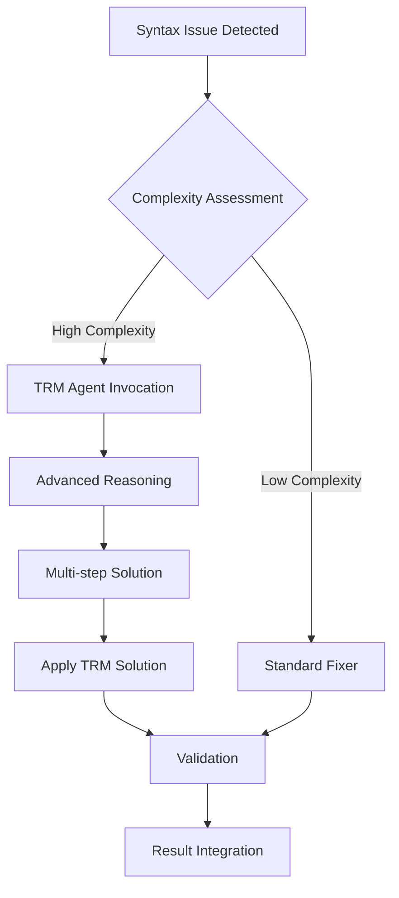
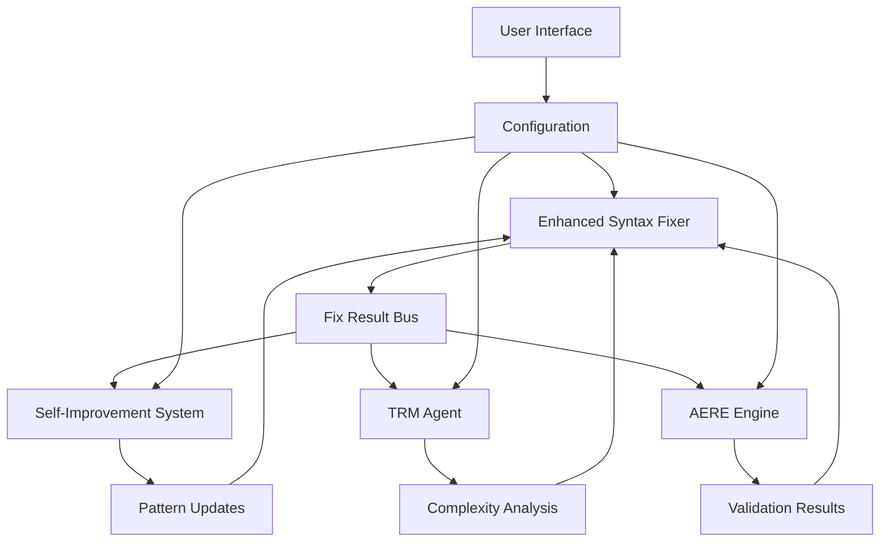

# Phase 2 Architecture Design: Syntax Fixer Self-Improvement Feedback Loops and TRM/AERE Integration

## Executive Summary

This document outlines the architecture for Phase 2 enhancements to the NoodleCore Syntax Fixer, focusing on self-improvement feedback loops and integration with TRM (Task Reasoning Manager) and AERE (AI Error Resolution Engine) components. The design maintains full backward compatibility with Phase 1 while adding intelligent learning and advanced problem-solving capabilities.

## 1. Self-Improvement Feedback Loops Architecture

### 1.1 Learning System Design

The self-improvement feedback loops will capture and analyze all syntax fix operations to continuously enhance the system's capabilities.

#### Core Components

1. **FixResultCollector**
   - Captures all syntax fix results (both AI and traditional)
   - Records before/after states, applied fixes, and effectiveness metrics
   - Stores user feedback on fix quality

2. **PatternAnalyzer**
   - Identifies recurring syntax patterns across fixes
   - Analyzes fix success rates by pattern type
   - Detects emerging syntax issues in the codebase

3. **LearningEngine**
   - Updates pattern recognition models based on collected data
   - Improves AI suggestion accuracy over time
   - Adapts to project-specific coding patterns

4. **FeedbackProcessor**
   - Processes user acceptance/rejection of fixes
   - Weights successful patterns higher in future suggestions
   - Identifies context-specific fix preferences

#### Data Flow



### 1.2 Integration with Existing NoodleCoreSelfImprover

The new feedback loops will extend the existing `NoodleCoreSelfImprover` with syntax-specific capabilities:

1. **SyntaxFixLearningModule**
   - Specialized learning module for syntax fix patterns
   - Integrates with existing improvement infrastructure
   - Provides syntax-specific metrics and insights

2. **ContinuousImprovementCycle**
   - Daily/weekly analysis of fix effectiveness
   - Automatic pattern model updates
   - Performance optimization recommendations

### 1.3 Configuration and Control

1. **LearningConfiguration**
   - Configurable learning rate and adaptation speed
   - Privacy controls for code analysis
   - Opt-in/opt-out for different learning levels

2. **FeedbackInterface**
   - User interface for providing fix feedback
   - Visualization of learning progress
   - Control over automatic pattern application

## 2. TRM Integration Architecture

### 2.1 TRM Agent Enhancement

The existing TRM agent will be enhanced with syntax-specific reasoning capabilities:

1. **SyntaxReasoningModule**
   - Specialized reasoning for complex syntax problems
   - Context-aware analysis considering project structure
   - Multi-step problem decomposition for syntax issues

2. **ComplexityDetector**
   - Identifies syntax issues requiring advanced reasoning
   - Triggers TRM involvement based on complexity thresholds
   - Learns from previous TRM interventions

### 2.2 Integration Points

1. **Automatic TRM Invocation**
   - Triggered when:
     - Traditional fixer fails to resolve issues
     - AI confidence score below threshold (configurable, default 0.7)
     - Multiple conflicting syntax patterns detected
     - User explicitly requests advanced analysis

2. **TRM-Syntax Fixer Interface**
   - Standardized communication protocol
   - Context passing (file content, error history, project context)
   - Result integration back into syntax fixer workflow

### 2.3 TRM Workflow Integration



## 3. AERE Integration Architecture

### 3.1 AERE Components for Syntax Analysis

The AERE engine will be extended with syntax-specific analysis capabilities:

1. **SyntaxErrorAnalyzer**
   - Specialized error classification for syntax issues
   - Root cause analysis for syntax problems
   - Impact assessment on code functionality

2. **ResolutionGenerator**
   - Generates multiple resolution approaches
   - Ranks solutions by confidence and safety
   - Provides step-by-step resolution plans

3. **ValidationEngine**
   - Pre-application validation of proposed fixes
   - Risk assessment for each resolution
   - Rollback planning for failed fixes

### 3.2 AERE Integration Workflow

1. **Analysis Phase**
   - Deep syntax structure analysis
   - Context-aware error categorization
   - Historical pattern matching

2. **Execution Phase**
   - Controlled application of resolutions
   - Progress tracking and intermediate validation
   - Rollback capabilities

3. **Reporting Phase**
   - Detailed fix effectiveness reports
   - Learning data extraction
   - Improvement recommendations

### 3.3 AERE Guardrails

1. **SafetyConstraints**
   - Prevents destructive syntax changes
   - Validates against coding standards
   - Project-specific rule enforcement

2. **QualityGates**
   - Minimum confidence thresholds for auto-application
   - User confirmation requirements for risky changes
   - Rollback triggers for validation failures

## 4. Data Flow Architecture

### 4.1 Component Communication



### 4.2 Data Persistence

1. **LearningDatabase**
   - Persistent storage for learned patterns
   - Fix effectiveness metrics
   - User preference profiles

2. **ConfigurationStore**
   - User settings and preferences
   - Component integration settings
   - Performance tuning parameters

### 4.3 Performance Optimization

1. **Intelligent Caching**
   - Multi-level caching for patterns and results
   - Cache invalidation strategies
   - Memory usage optimization

2. **Async Processing**
   - Non-blocking TRM and AERE operations
   - Progress reporting for long-running operations
   - Cancellation capabilities

## 5. Implementation Roadmap

### 5.1 Phase 2.1: Core Infrastructure (Weeks 1-2)

1. **Enhanced FixResultCollector**
   - Extend existing fix result collection
   - Add learning data capture
   - Integrate with current workflow

2. **PatternAnalyzer Foundation**
   - Basic pattern detection algorithms
   - Integration with existing syntax fixer
   - Initial pattern classification system

3. **TRM Interface Layer**
   - Define communication protocols
   - Implement basic TRM invocation
   - Result integration mechanisms

### 5.2 Phase 2.2: Learning System (Weeks 3-4)

1. **LearningEngine Implementation**
   - Machine learning model integration
   - Pattern update algorithms
   - Performance optimization

2. **FeedbackProcessor**
   - User feedback collection system
   - Preference learning algorithms
   - Adaptive weighting system

3. **Self-Improvement Integration**
   - Extend NoodleCoreSelfImprover
   - Syntax-specific learning modules
   - Continuous improvement cycles

### 5.3 Phase 2.3: Advanced Integration (Weeks 5-6)

1. **TRM Enhancement**
   - Complex syntax reasoning capabilities
   - Advanced problem decomposition
   - Context-aware solution generation

2. **AERE Integration**
   - Syntax error analysis components
   - Resolution generation system
   - Validation and guardrails

3. **Performance Optimization**
   - Advanced caching strategies
   - Async processing implementation
   - Memory and CPU optimization

### 5.4 Phase 2.4: Polish and Testing (Weeks 7-8)

1. **UI/UX Enhancements**
   - Learning progress visualization
   - TRM/AERE status indicators
   - Configuration interfaces

2. **Comprehensive Testing**
   - Unit tests for all components
   - Integration test suite
   - Performance benchmarking

3. **Documentation and Deployment**
   - API documentation updates
   - User guide enhancements
   - Migration documentation

## 6. Dependencies and Integration Points

### 6.1 Existing Dependencies

1. **EnhancedNoodleCoreSyntaxFixer**
   - Core syntax fixing functionality
   - AI agent integration
   - Performance optimization features

2. **NoodleCoreSelfImprover**
   - Base self-improvement infrastructure
   - Monitoring and analysis capabilities
   - Configuration management

3. **TRMAgent**
   - Task reasoning capabilities
   - Complex problem-solving engine
   - Context-aware analysis

4. **AEREngine**
   - Error resolution framework
   - Analysis and validation components
   - Guardrails and safety systems

### 6.2 New Components

1. **SyntaxFixLearningModule**
   - Specialized learning for syntax patterns
   - Integration with existing self-improvement
   - Continuous adaptation capabilities

2. **TRMSyntaxInterface**
   - Specialized TRM integration layer
   - Syntax-specific reasoning enhancement
   - Result translation and integration

3. **AERESyntaxAnalyzer**
   - Syntax-focused error analysis
   - Resolution generation for syntax issues
   - Validation for syntax fixes

## 7. Testing and Validation Strategy

### 7.1 Unit Testing

1. **Component Testing**
   - Individual component test suites
   - Mock-based isolation testing
   - Performance and load testing

2. **Integration Testing**
   - Component interaction testing
   - Data flow validation
   - Error handling verification

### 7.2 System Testing

1. **End-to-End Workflows**
   - Complete syntax fix scenarios
   - TRM/AERE invocation testing
   - Learning system validation

2. **Performance Testing**
   - Large file processing
   - Memory usage optimization
   - Concurrent operation handling

### 7.3 User Acceptance Testing

1. **Usability Testing**
   - Interface usability evaluation
   - Configuration complexity assessment
   - Learning effectiveness measurement

2. **Real-World Validation**
   - Production environment testing
   - User feedback collection
   - Long-term learning validation

## 8. Risk Assessment and Mitigation

### 8.1 Technical Risks

1. **Performance Impact**
   - Risk: Increased processing overhead
   - Mitigation: Intelligent caching and async processing
   - Monitoring: Performance metrics and alerting

2. **Memory Usage**
   - Risk: Increased memory consumption
   - Mitigation: Cache size limits and cleanup strategies
   - Monitoring: Memory usage tracking

3. **Integration Complexity**
   - Risk: Component interaction issues
   - Mitigation: Well-defined interfaces and comprehensive testing
   - Monitoring: Integration health checks

### 8.2 User Experience Risks

1. **Learning Accuracy**
   - Risk: Poor initial learning suggestions
   - Mitigation: Conservative confidence thresholds and user confirmation
   - Monitoring: Success rate tracking and adjustment

2. **System Complexity**
   - Risk: Overwhelming configuration options
   - Mitigation: Sensible defaults and progressive disclosure
   - Monitoring: User feedback and usage analytics

## 9. Configuration and Environment Variables

### 9.1 New Environment Variables

```bash
# Self-Improvement Configuration
NOODLE_SYNTAX_FIXER_LEARNING_ENABLED=true
NOODLE_SYNTAX_FIXER_LEARNING_RATE=0.1
NOODLE_SYNTAX_FIXER_FEEDBACK_COLLECTION=true

# TRM Integration Configuration
NOODLE_SYNTAX_FIXER_TRM_ENABLED=true
NOODLE_SYNTAX_FIXER_TRM_THRESHOLD=0.7
NOODLE_SYNTAX_FIXER_TRM_AUTO_INVOKE=true

# AERE Integration Configuration
NOODLE_SYNTAX_FIXER_AERE_ENABLED=true
NOODLE_SYNTAX_FIXER_AERE_VALIDATION=all
NOODLE_SYNTAX_FIXER_AERE_GUARDRAILS=true

# Performance Configuration
NOODLE_SYNTAX_FIXER_CACHE_SIZE=1000
NOODLE_SYNTAX_FIXER_ASYNC_ENABLED=true
NOODLE_SYNTAX_FIXER_MAX_CONCURRENT=3
```

### 9.2 Configuration Structure

```json
{
  "self_improvement": {
    "learning_enabled": true,
    "learning_rate": 0.1,
    "feedback_collection": true,
    "pattern_retention_days": 30,
    "min_confidence_for_learning": 0.8
  },
  "trm_integration": {
    "enabled": true,
    "complexity_threshold": 0.7,
    "auto_invoke": true,
    "max_reasoning_time": 30,
    "context_analysis_depth": 3
  },
  "aere_integration": {
    "enabled": true,
    "validation_level": "all",
    "guardrails_enabled": true,
    "risk_tolerance": "medium",
    "auto_apply_confidence": 0.9
  },
  "performance": {
    "cache_size": 1000,
    "async_enabled": true,
    "max_concurrent_operations": 3,
    "memory_limit_mb": 512
  }
}
```

## 10. Backward Compatibility

### 10.1 API Compatibility

1. **Existing Method Preservation**
   - All current EnhancedNoodleCoreSyntaxFixer methods remain unchanged
   - New functionality added through optional parameters
   - Default behavior maintains Phase 1 functionality

2. **Configuration Compatibility**
   - Existing environment variables continue to work
   - New features disabled by default
   - Gradual enablement through configuration

### 10.2 Migration Path

1. **Phase 1 Compatibility Mode**
   - Run without new features enabled
   - Validate existing functionality
   - Gradual feature enablement

2. **Progressive Enhancement**
   - Enable features incrementally
   - Monitor performance impact
   - Rollback capabilities

## Conclusion

This Phase 2 architecture design provides a comprehensive framework for intelligent syntax fixing with self-improvement capabilities while maintaining full backward compatibility with Phase 1. The integration of TRM and AERE components brings advanced reasoning and validation capabilities to the syntax fixing process, creating a continuously learning and adapting system that improves over time.

The modular design allows for incremental implementation, comprehensive testing, and controlled deployment, ensuring robust and reliable enhancement to the existing NoodleCore syntax fixing infrastructure.
