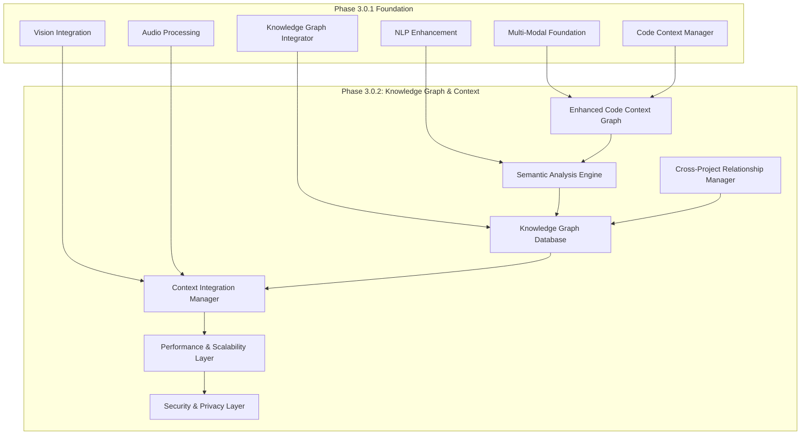
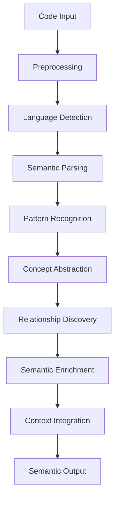
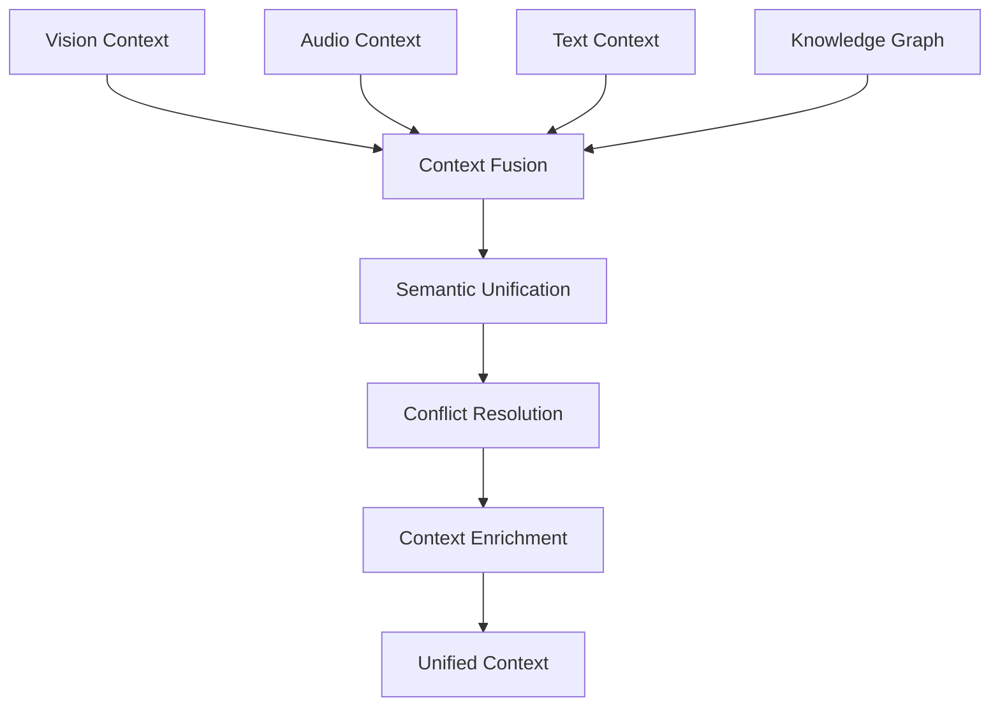
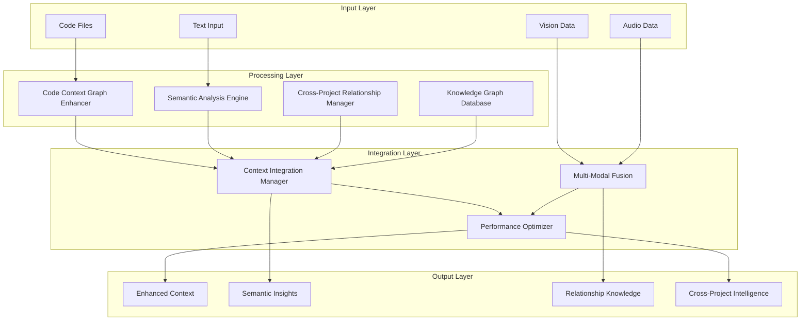

# Phase 3.0.2: Knowledge Graph & Context Architecture Design

## Executive Summary

Phase 3.0.2: Knowledge Graph & Context represents a significant evolution in NoodleCore's AI capabilities, introducing advanced knowledge representation and context management that builds upon the solid foundation established in Phase 3.0.1 (Multi-Modal Foundation). This architecture enhances the existing KnowledgeGraphIntegrator with sophisticated semantic analysis, cross-project relationship management, and real-time context updates.

The primary focus is on **advanced semantic understanding and knowledge representation** that enables intelligent code context analysis, cross-project knowledge sharing, and seamless integration with the existing multi-modal AI systems.

## Architecture Overview



## 1. Enhanced Code Context Graph Architecture

### 1.1 Core Context Graph Components

#### CodeContextGraphEnhancer

**Purpose**: Extends the existing CodeContextManager with advanced graph-based representation of code context and relationships.

**Key Features**:

- Multi-dimensional code context representation
- Hierarchical relationship mapping
- Temporal context evolution tracking
- Cross-language semantic understanding
- Real-time context updates

**Core Classes**:

```python
class CodeContextGraphEnhancer:
    def __init__(self, config_manager, ml_engine, db_pool):
        self.config_manager = config_manager or MLConfigurationManager()
        self.ml_engine = ml_engine
        self.db_pool = db_pool
        self.graph = nx.MultiDiGraph()  # Enhanced multi-dimensional graph
        self.context_cache = ContextCache()
        self.semantic_analyzer = SemanticAnalysisEngine(config_manager, ml_engine)
        
    def build_context_graph(self, project_id: str, file_paths: List[str]) -> ContextGraphResult:
        """Build comprehensive context graph for project."""
        pass
        
    def update_context实时(self, changes: List[CodeChange]) -> UpdateResult:
        """Update context graph in real-time based on code changes."""
        pass
        
    def query_context(self, query: ContextQuery) -> ContextQueryResult:
        """Query context graph with advanced semantic understanding."""
        pass
```

#### ContextGraphSchema

**Enhanced Data Structure**:

```python
@dataclass
class ContextNode:
    """Enhanced context node with multi-dimensional properties."""
    node_id: str
    node_type: ContextType
    name: str
    semantic_signature: List[float]  # Embedding vector
    temporal_metadata: Dict[str, Any]  # Change history, versions
    cross_references: List[str]  # References to other projects
    language_patterns: Dict[str, Any]  # Language-specific patterns
    complexity_metrics: Dict[str, float]  # Cyclomatic complexity, etc.
    usage_statistics: Dict[str, Any]  # Access patterns, frequency
    created_at: datetime
    updated_at: datetime
    metadata: Dict[str, Any]

@dataclass
class ContextEdge:
    """Enhanced relationship edge with semantic weights."""
    edge_id: str
    source_id: str
    target_id: str
    edge_type: EdgeType
    semantic_strength: float  # Semantic relationship strength
    temporal_weight: float   # Time-based relationship weight
    usage_frequency: float  # How often this relationship is used
    confidence_score: float  # Confidence in relationship validity
    properties: Dict[str, Any]
    created_at: datetime
    metadata: Dict[str, Any]
```

### 1.2 Advanced Context Analysis

#### Multi-Dimensional Context Analysis

**Semantic Layer Analysis**:

- Code structure understanding
- Design pattern recognition
- Architectural style detection
- Dependency relationship mapping
- Cross-language semantic equivalence

**Temporal Context Tracking**:

- Code evolution history
- Change impact analysis
- Context relevance decay
- Version relationship mapping

**Usage Pattern Analysis**:

- Developer interaction patterns
- Code access frequency
- Modification patterns
- Collaboration relationships

## 2. Semantic Analysis Engine Architecture

### 2.1 Core Semantic Components

#### SemanticAnalysisEngine

**Purpose**: Provides deep semantic understanding of code relationships, patterns, and cross-project equivalences.

**Key Features**:

- Multi-language semantic parsing
- Cross-project pattern recognition
- Semantic similarity computation
- Concept abstraction and mapping
- Intent-based relationship discovery

**Core Classes**:

```python
class SemanticAnalysisEngine:
    def __init__(self, config_manager, ml_engine):
        self.config_manager = config_manager
        self.ml_engine = ml_engine
        self.semantic_models = SemanticModelRegistry()
        self.pattern_recognizer = CodePatternRecognizer()
        self.cross_project_analyzer = CrossProjectAnalyzer()
        
    def analyze_semantic_relationships(self, code_elements: List[CodeElement]) -> SemanticAnalysisResult:
        """Analyze deep semantic relationships between code elements."""
        pass
        
    def discover_conceptual_patterns(self, context_graph: ContextGraph) -> PatternDiscoveryResult:
        """Discover abstract patterns and concepts in code context."""
        pass
        
    def compute_semantic_similarity(self, element1: CodeElement, element2: CodeElement) -> float:
        """Compute semantic similarity between code elements."""
        pass
```

#### Semantic Model Registry

**Multi-Language Semantic Models**:

- Language-specific semantic parsers
- Cross-language translation models
- Concept abstraction frameworks
- Pattern recognition models
- Semantic embedding generators

**Semantic Analysis Pipeline**:



### 2.2 Cross-Language Semantic Understanding

#### Language-Agnostic Representation

**Universal Semantic Concepts**:

- Design patterns (Singleton, Factory, Observer, etc.)
- Architectural patterns (MVC, Microservices, etc.)
- Data structures (List, Map, Tree, etc.)
- Algorithms (Sorting, Searching, etc.)
- Programming paradigms (OOP, Functional, etc.)

**Cross-Language Mapping**:

```python
class CrossLanguageMapper:
    def map_concept(self, concept: str, source_lang: str, target_lang: str) -> str:
        """Map programming concepts across languages."""
        pass
        
    def find_equivalent_patterns(self, pattern: Pattern, languages: List[str]) -> List[Pattern]:
        """Find equivalent patterns across multiple languages."""
        pass
        
    def translate_semantic_structure(self, structure: CodeStructure, target_lang: str) -> CodeStructure:
        """Translate semantic structure to target language."""
        pass
```

## 3. Cross-Project Relationship Manager Architecture

### 3.1 Project Relationship Management

#### CrossProjectRelationshipManager

**Purpose**: Manages relationships and knowledge sharing between different projects within the Noodle ecosystem.

**Key Features**:

- Inter-project dependency tracking
- Shared component identification
- Cross-project pattern matching
- Knowledge transfer facilitation
- Project relationship visualization

**Core Classes**:

```python
class CrossProjectRelationshipManager:
    def __init__(self, config_manager, db_pool):
        self.config_manager = config_manager
        self.db_pool = db_pool
        self.project_graph = nx.DiGraph()
        self.relationship_analyzer = ProjectRelationshipAnalyzer()
        self.knowledge_transfer = KnowledgeTransferEngine()
        
    def establish_project_relationship(self, project1_id: str, project2_id: str, 
                                 relationship_type: ProjectRelationshipType) -> str:
        """Establish relationship between projects."""
        pass
        
    def discover_shared_components(self, projects: List[str]) -> List[SharedComponent]:
        """Discover components shared across projects."""
        pass
        
    def facilitate_knowledge_transfer(self, source_project: str, target_project: str,
                                knowledge_type: KnowledgeType) -> TransferResult:
        """Facilitate knowledge transfer between projects."""
        pass
```

#### Project Relationship Types

**Relationship Categories**:

- **Dependency Relationships**: Direct/indirect dependencies
- **Shared Components**: Common libraries, utilities, patterns
- **Architectural Similarities**: Similar design patterns, structures
- **Domain Relationships**: Projects in same problem domain
- **Temporal Relationships**: Evolutionary connections, versioning

### 3.2 Knowledge Transfer Framework

#### KnowledgeTransferEngine

**Purpose**: Enables intelligent transfer of knowledge between related projects.

**Transfer Types**:

- **Pattern Transfer**: Design patterns, architectural approaches
- **Solution Transfer**: Proven solutions to common problems
- **Component Transfer**: Reusable components, utilities
- **Best Practice Transfer**: Coding standards, conventions

**Transfer Mechanisms**:

```python
class KnowledgeTransferEngine:
    def identify_transferable_knowledge(self, source_project: str, target_project: str) -> List[TransferableKnowledge]:
        """Identify knowledge that can be transferred between projects."""
        pass
        
    def adapt_knowledge_for_context(self, knowledge: TransferableKnowledge, 
                                 target_context: ProjectContext) -> AdaptedKnowledge:
        """Adapt knowledge for specific project context."""
        pass
        
    def validate_transfer_applicability(self, knowledge: AdaptedKnowledge, 
                                  target_project: str) -> ValidationResult:
        """Validate if transferred knowledge applies to target project."""
        pass
```

## 4. Knowledge Graph Database Architecture

### 4.1 Enhanced Database Schema

#### KnowledgeGraphDatabase

**Purpose**: Provides optimized storage and querying of complex knowledge graphs with multi-dimensional relationships.

**Key Features**:

- Multi-dimensional graph storage
- Semantic indexing and search
- Temporal relationship tracking
- Cross-project relationship management
- Real-time query optimization

**Database Schema**:

```sql
-- Enhanced nodes table
CREATE TABLE knowledge_graph_nodes_enhanced (
    node_id TEXT PRIMARY KEY,
    node_type TEXT NOT NULL,
    name TEXT NOT NULL,
    semantic_signature BLOB,  -- Vector embedding
    temporal_metadata TEXT,  -- JSON for temporal data
    cross_references TEXT,  -- JSON for cross-project refs
    language_patterns TEXT,  -- JSON for language patterns
    complexity_metrics TEXT,  -- JSON for complexity data
    usage_statistics TEXT,  -- JSON for usage patterns
    created_at TIMESTAMP NOT NULL,
    updated_at TIMESTAMP NOT NULL,
    metadata TEXT
);

-- Enhanced edges table
CREATE TABLE knowledge_graph_edges_enhanced (
    edge_id TEXT PRIMARY KEY,
    source_id TEXT NOT NULL,
    target_id TEXT NOT NULL,
    edge_type TEXT NOT NULL,
    semantic_strength REAL NOT NULL,
    temporal_weight REAL NOT NULL,
    usage_frequency REAL NOT NULL,
    confidence_score REAL NOT NULL,
    properties TEXT,
    created_at TIMESTAMP NOT NULL,
    metadata TEXT,
    FOREIGN KEY (source_id) REFERENCES knowledge_graph_nodes_enhanced(node_id),
    FOREIGN KEY (target_id) REFERENCES knowledge_graph_nodes_enhanced(node_id)
);

-- Cross-project relationships table
CREATE TABLE cross_project_relationships (
    relationship_id TEXT PRIMARY KEY,
    source_project_id TEXT NOT NULL,
    target_project_id TEXT NOT NULL,
    relationship_type TEXT NOT NULL,
    strength REAL NOT NULL,
    metadata TEXT,
    created_at TIMESTAMP NOT NULL,
    updated_at TIMESTAMP NOT NULL
);

-- Semantic indexes for performance
CREATE INDEX idx_nodes_semantic ON knowledge_graph_nodes_enhanced USING semantic_signature;
CREATE INDEX idx_edges_strength ON knowledge_graph_edges_enhanced(semantic_strength, temporal_weight);
CREATE INDEX idx_projects_relationship ON cross_project_relationships(source_project_id, target_project_id);
```

### 4.2 Query Optimization Engine

#### GraphQueryOptimizer

**Purpose**: Optimizes knowledge graph queries for real-time performance.

**Optimization Strategies**:

- **Semantic Indexing**: Vector similarity indexes
- **Path Precomputation**: Common query paths
- **Caching Strategy**: Multi-level caching
- **Query Rewriting**: Semantic query optimization
- **Parallel Processing**: Distributed query execution

**Query Types**:

```python
class GraphQueryOptimizer:
    def optimize_semantic_search(self, query: SemanticSearchQuery) -> OptimizedQuery:
        """Optimize semantic search queries."""
        pass
        
    def optimize_path_finding(self, query: PathQuery) -> OptimizedQuery:
        """Optimize path-finding queries."""
        pass
        
    def optimize_relationship_query(self, query: RelationshipQuery) -> OptimizedQuery:
        """Optimize relationship queries."""
        pass
```

## 5. Context Integration Manager Architecture

### 5.1 Unified Context Integration

#### ContextIntegrationManager

**Purpose**: Provides unified integration between knowledge graph, multi-modal components, and existing Noodle systems.

**Key Features**:

- Multi-modal context fusion
- Real-time context synchronization
- Cross-component coordination
- Context conflict resolution
- Adaptive context selection

**Core Classes**:

```python
class ContextIntegrationManager:
    def __init__(self, config_manager, ml_engine, db_pool):
        self.config_manager = config_manager
        self.ml_engine = ml_engine
        self.db_pool = db_pool
        
        # Component integrators
        self.knowledge_graph_integrator = KnowledgeGraphIntegrator(config_manager, ml_engine, db_pool)
        self.code_context_enhancer = CodeContextGraphEnhancer(config_manager, ml_engine, db_pool)
        self.semantic_analyzer = SemanticAnalysisEngine(config_manager, ml_engine)
        self.cross_project_manager = CrossProjectRelationshipManager(config_manager, db_pool)
        
        # Multi-modal integration
        self.vision_integrator = VisionIntegrationManager()
        self.audio_integrator = AudioIntegrationManager()
        self.nlp_integrator = NLPIntegrationManager()
        
    def integrate_multimodal_context(self, inputs: MultimodalInput) -> IntegratedContext:
        """Integrate context from multiple modalities."""
        pass
        
    def synchronize_context_updates(self, updates: List[ContextUpdate]) -> SyncResult:
        """Synchronize context updates across all components."""
        pass
        
    def resolve_context_conflicts(self, conflicts: List[ContextConflict]) -> ResolutionResult:
        """Resolve conflicts between different context sources."""
        pass
```

### 5.2 Multi-Modal Context Fusion

#### ContextFusionEngine

**Purpose**: Fuses context information from vision, audio, and text modalities into unified understanding.

**Fusion Strategies**:

- **Semantic Fusion**: Concept-level integration
- **Temporal Fusion**: Time-based correlation
- **Confidence Fusion**: Weighted confidence combination
- **Cross-Modal Validation**: Consistency checking

**Fusion Pipeline**:



## 6. Performance and Scalability Architecture

### 6.1 Performance Optimization Layer

#### PerformanceOptimizer

**Purpose**: Ensures high-performance operation for large-scale knowledge graphs and real-time context updates.

**Key Features**:

- Distributed graph processing
- Intelligent caching strategies
- Query optimization
- Resource management
- Performance monitoring

**Performance Strategies**:

```python
class PerformanceOptimizer:
    def __init__(self):
        self.cache_manager = DistributedCacheManager()
        self.query_optimizer = GraphQueryOptimizer()
        self.resource_manager = ResourceManager()
        self.performance_monitor = PerformanceMonitor()
        
    def optimize_graph_operations(self, operations: List[GraphOperation]) -> OptimizedOperations:
        """Optimize graph operations for performance."""
        pass
        
    def manage_cache_strategy(self, access_patterns: List[AccessPattern]) -> CacheStrategy:
        """Manage intelligent caching based on access patterns."""
        pass
        
    def scale_resources_dynamically(self, load_metrics: LoadMetrics) -> ScalingDecision:
        """Dynamically scale resources based on load."""
        pass
```

### 6.2 Scalability Framework

#### Horizontal Scaling

**Multi-Node Graph Distribution**:

- Graph partitioning strategies
- Distributed query processing
- Cross-node synchronization
- Load balancing
- Fault tolerance

**Vertical Scaling**:

- Memory optimization
- CPU utilization
- GPU acceleration for semantic operations
- Storage scaling

## 7. Security and Privacy Architecture

### 7.1 Security Framework

#### KnowledgeGraphSecurityManager

**Purpose**: Ensures security and privacy of knowledge graph data and operations.

**Key Features**:

- Access control and permissions
- Data encryption and protection
- Audit logging and compliance
- Privacy-preserving operations
- Secure cross-project sharing

**Security Components**:

```python
class KnowledgeGraphSecurityManager:
    def __init__(self, config_manager):
        self.config_manager = config_manager
        self.access_controller = AccessController()
        self.encryption_manager = EncryptionManager()
        self.audit_logger = AuditLogger()
        self.privacy_manager = PrivacyManager()
        
    def enforce_access_control(self, user_id: str, resource: str, operation: str) -> bool:
        """Enforce access control for knowledge graph operations."""
        pass
        
    def encrypt_sensitive_data(self, data: SensitiveData) -> EncryptedData:
        """Encrypt sensitive knowledge graph data."""
        pass
        
    def audit_knowledge_operations(self, operation: KnowledgeOperation) -> AuditRecord:
        """Audit all knowledge graph operations."""
        pass
```

### 7.2 Privacy Protection

#### PrivacyPreservingOperations

**Privacy Techniques**:

- Data anonymization
- Differential privacy
- Secure multi-party computation
- Privacy-preserving sharing
- GDPR compliance

## 8. Integration with Existing Multi-Modal Components

### 8.1 Vision Integration

#### VisionContextEnhancer

**Purpose**: Enhances vision analysis with knowledge graph context for improved understanding.

**Integration Points**:

```python
class VisionContextEnhancer:
    def __init__(self, vision_manager, knowledge_graph):
        self.vision_manager = vision_manager
        self.knowledge_graph = knowledge_graph
        
    def enhance_vision_with_context(self, vision_data: VisionData) -> EnhancedVisionResult:
        """Enhance vision analysis with knowledge graph context."""
        pass
        
    def extract_code_from_vision(self, enhanced_vision: EnhancedVisionResult) -> CodeExtractionResult:
        """Extract code elements from enhanced vision analysis."""
        pass
```

### 8.2 Audio Integration

#### AudioContextEnhancer

**Purpose**: Enhances audio processing with knowledge graph context for improved understanding.

**Integration Points**:

```python
class AudioContextEnhancer:
    def __init__(self, audio_manager, knowledge_graph):
        self.audio_manager = audio_manager
        self.knowledge_graph = knowledge_graph
        
    def enhance_audio_with_context(self, audio_data: AudioData) -> EnhancedAudioResult:
        """Enhance audio analysis with knowledge graph context."""
        pass
        
    def extract_commands_from_audio(self, enhanced_audio: EnhancedAudioResult) -> CommandExtractionResult:
        """Extract commands from enhanced audio analysis."""
        pass
```

### 8.3 NLP Integration

#### NLPContextEnhancer

**Purpose**: Enhances NLP processing with knowledge graph context for improved understanding.

**Integration Points**:

```python
class NLPContextEnhancer:
    def __init__(self, nlp_manager, knowledge_graph):
        self.nlp_manager = nlp_manager
        self.knowledge_graph = knowledge_graph
        
    def enhance_nlp_with_context(self, nlp_data: NLPData) -> EnhancedNLPResult:
        """Enhance NLP analysis with knowledge graph context."""
        pass
        
    def generate_context_aware_responses(self, enhanced_nlp: EnhancedNLPResult) -> ResponseGenerationResult:
        """Generate responses with full context awareness."""
        pass
```

## 9. API Interfaces and Methods

### 9.1 Core API Interfaces

#### Knowledge Graph API

**Primary Interface**:

```python
class KnowledgeGraphAPI:
    def __init__(self, context_integration_manager):
        self.context_manager = context_integration_manager
        
    # Node operations
    def create_node(self, node: ContextNode) -> str:
        """Create new node in knowledge graph."""
        pass
        
    def update_node(self, node_id: str, updates: Dict[str, Any]) -> bool:
        """Update existing node in knowledge graph."""
        pass
        
    def delete_node(self, node_id: str) -> bool:
        """Delete node from knowledge graph."""
        pass
        
    # Edge operations
    def create_edge(self, edge: ContextEdge) -> str:
        """Create new edge in knowledge graph."""
        pass
        
    def update_edge(self, edge_id: str, updates: Dict[str, Any]) -> bool:
        """Update existing edge in knowledge graph."""
        pass
        
    # Query operations
    def semantic_search(self, query: SemanticSearchQuery) -> SemanticSearchResult:
        """Perform semantic search on knowledge graph."""
        pass
        
    def find_similar_nodes(self, node_id: str, similarity_threshold: float) -> List[ContextNode]:
        """Find nodes similar to given node."""
        pass
        
    def get_context_path(self, source_id: str, target_id: str) -> List[ContextNode]:
        """Get path between two nodes in context graph."""
        pass
```

#### Context Management API

**Context Operations**:

```python
class ContextManagementAPI:
    def __init__(self, context_integration_manager):
        self.context_manager = context_integration_manager
        
    def build_project_context(self, project_id: str, files: List[str]) -> ContextBuildResult:
        """Build comprehensive context for project."""
        pass
        
    def update_context实时(self, project_id: str, changes: List[CodeChange]) -> UpdateResult:
        """Update project context in real-time."""
        pass
        
    def get_relevant_context(self, query: ContextQuery) -> ContextResult:
        """Get relevant context for query."""
        pass
        
    def export_context(self, project_id: str, format: str) -> ExportResult:
        """Export project context in specified format."""
        pass
```

### 9.2 REST API Endpoints

**HTTP API Specification**:

```yaml
# Knowledge Graph Endpoints
POST /api/v3/knowledge-graph/nodes
GET /api/v3/knowledge-graph/nodes/{node_id}
PUT /api/v3/knowledge-graph/nodes/{node_id}
DELETE /api/v3/knowledge-graph/nodes/{node_id}

POST /api/v3/knowledge-graph/edges
GET /api/v3/knowledge-graph/edges/{edge_id}
PUT /api/v3/knowledge-graph/edges/{edge_id}
DELETE /api/v3/knowledge-graph/edges/{edge_id}

POST /api/v3/knowledge-graph/query/semantic
POST /api/v3/knowledge-graph/query/similar
POST /api/v3/knowledge-graph/query/path

# Context Management Endpoints
POST /api/v3/context/build
PUT /api/v3/context/update
POST /api/v3/context/query
GET /api/v3/context/export/{project_id}

# Cross-Project Endpoints
POST /api/v3/cross-project/relationships
GET /api/v3/cross-project/relationships/{project_id}
POST /api/v3/cross-project/knowledge-transfer
GET /api/v3/cross-project/shared-components
```

## 10. Implementation Guidelines and Data Flow

### 10.1 Data Flow Architecture



### 10.2 Implementation Phases

#### Phase 1: Foundation Enhancement (Weeks 1-4)

**Week 1-2: Core Infrastructure**

- Implement enhanced CodeContextGraphEnhancer
- Extend KnowledgeGraphIntegrator with semantic capabilities
- Create SemanticAnalysisEngine foundation
- Implement basic cross-project relationship tracking

**Week 3-4: Database and Performance**

- Implement enhanced database schema
- Create query optimization engine
- Implement performance monitoring
- Add caching strategies

#### Phase 2: Advanced Features (Weeks 5-8)

**Week 5-6: Semantic Enhancement**

- Complete semantic analysis engine
- Implement cross-language semantic understanding
- Add pattern recognition capabilities
- Create concept abstraction framework

**Week 7-8: Cross-Project Integration**

- Implement CrossProjectRelationshipManager
- Create knowledge transfer framework
- Add cross-project component discovery
- Implement relationship visualization

#### Phase 3: Integration and Optimization (Weeks 9-12)

**Week 9-10: Multi-Modal Integration**

- Integrate with vision, audio, and NLP components
- Implement context fusion engine
- Create unified context API
- Add conflict resolution mechanisms

**Week 11-12: Performance and Security**

- Optimize for large-scale deployments
- Implement security and privacy features
- Add comprehensive monitoring
- Complete documentation and testing

## 11. Configuration and Environment Variables

### 11.1 Knowledge Graph Configuration

```bash
# Enhanced Knowledge Graph
NOODLE_KG_ENHANCED_ENABLED=true
NOODLE_KG_SEMANTIC_ANALYSIS_ENABLED=true
NOODLE_KG_CROSS_PROJECT_ENABLED=true
NOODLE_KG_REAL_TIME_UPDATES=true

# Database Configuration
NOODLE_KG_DB_MAX_NODES=1000000
NOODLE_KG_DB_MAX_EDGES=5000000
NOODLE_KG_DB_CACHE_SIZE=10000
NOODLE_KG_DB_INDEX_STRATEGY=semantic

# Performance Configuration
NOODLE_KG_PERFORMANCE_MONITORING=true
NOODLE_KG_DISTRIBUTED_PROCESSING=true
NOODLE_KG_QUERY_TIMEOUT=30000
NOODLE_KG_MAX_CONCURRENT_QUERIES=100

# Semantic Analysis Configuration
NOODLE_KG_SEMANTIC_MODEL=text-embedding-ada-002
NOODLE_KG_SIMILARITY_THRESHOLD=0.7
NOODLE_KG_PATTERN_RECOGNITION_ENABLED=true
NOODLE_KG_CROSS_LANGUAGE_MAPPING=true
```

### 11.2 Security Configuration

```bash
# Security Configuration
NOODLE_KG_ENCRYPTION_ENABLED=true
NOODLE_KG_ACCESS_CONTROL_ENABLED=true
NOODLE_KG_AUDIT_LOGGING=true
NOODLE_KG_PRIVACY_PRESERVATION=true

# Cross-Project Security
NOODLE_KG_CROSS_PROJECT_SHARING_ENABLED=true
NOODLE_KG_SHARING_PERMISSION_MODEL=role_based
NOODLE_KG_DATA_ANONYMIZATION=true
NOODLE_KG_GDPR_COMPLIANCE=true
```

## 12. Success Metrics and KPIs

### 12.1 Technical Metrics

**Performance Metrics**:

- Query response time (< 100ms for simple queries, < 500ms for complex queries)
- Graph update latency (< 50ms for local updates, < 200ms for distributed)
- Semantic similarity accuracy (> 90%)
- Cross-project relationship accuracy (> 85%)

**Scalability Metrics**:

- Maximum graph size supported (> 1M nodes, > 5M edges)
- Concurrent query handling (> 1000 queries/second)
- Real-time update throughput (> 1000 updates/second)
- Memory efficiency (< 2GB for 1M node graph)

### 12.2 User Experience Metrics

**Context Quality Metrics**:

- Context relevance score (> 80%)
- Multi-modal fusion accuracy (> 85%)
- Cross-project knowledge transfer success rate (> 75%)
- Semantic understanding accuracy (> 90%)

**Integration Metrics**:

- Multi-modal component integration success (> 95%)
- API response consistency (> 99%)
- Cross-platform compatibility (> 90%)
- Developer satisfaction score (> 4.0/5.0)

## 13. Conclusion

Phase 3.0.2: Knowledge Graph & Context represents a comprehensive evolution of NoodleCore's AI capabilities, building upon the solid foundation of Phase 3.0.1 to provide advanced semantic understanding, cross-project knowledge sharing, and real-time context management.

The architecture emphasizes:

1. **Enhanced Semantic Understanding**: Deep analysis of code relationships and patterns across languages
2. **Cross-Project Intelligence**: Intelligent knowledge sharing and transfer between projects
3. **Real-Time Performance**: Optimized for large-scale knowledge graphs and instant updates
4. **Multi-Modal Integration**: Seamless fusion of vision, audio, and text context
5. **Scalability by Design**: Built to handle enterprise-scale codebases and knowledge
6. **Security and Privacy**: Comprehensive protection of sensitive knowledge and operations

The modular design ensures seamless integration with existing NoodleCore systems while providing extensibility for future enhancements. The phased implementation approach allows for gradual rollout and validation of capabilities.

This architecture positions NoodleCore as a leader in intelligent code context management and knowledge representation, providing developers with unprecedented understanding of their codebases and the relationships between different projects.
