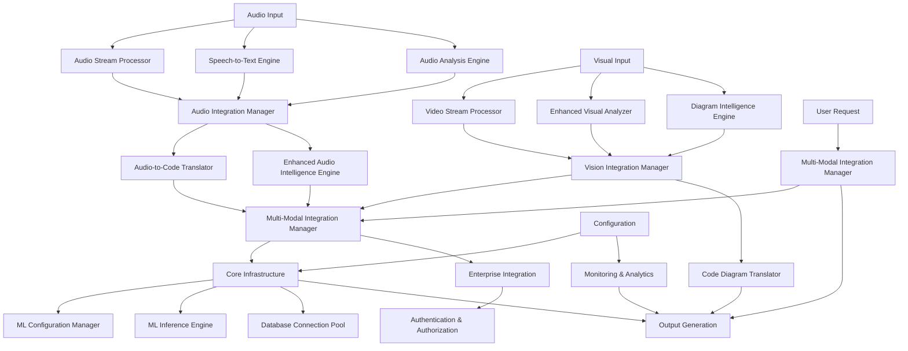

# Phase 3.0.2 Audio Processing Architecture Design

## Executive Summary

This document presents the comprehensive architecture design for Phase 3.0.2 Audio Processing System, designed to achieve parity with the existing Phase 3.0.1 Vision System. The architecture addresses the identified gaps in the current audio system and provides enhanced capabilities for audio-to-code translation, advanced audio intelligence, and improved multi-modal integration.

**Design Date:** November 19, 2025  
**Version:** 3.0.2  
**Status:** Architecture Design Complete  

## 1. Overall Architecture Overview

### 1.1 High-Level System Architecture

```mermaid
graph TB
    subgraph "User Interface Layer"
        UI[NativeNoodleCoreIDE]
        CLI[Command Line Interface]
        API[REST API]
    end
    
    subgraph "Application Layer"
        IDE[IDE Core Logic]
        MultiModalManager[Multi-Modal Coordination]
    end
    
    subgraph "Audio Processing Layer"
        AudioIntegrationManager[Audio Coordination]
        AudioStreamProcessor[Real-time Audio Processing]
        SpeechToTextEngine[Speech Recognition]
        AudioAnalysisEngine[Audio Feature Analysis]
        AudioToCodeTranslator[Audio-to-Code Translation]
        EnhancedAudioIntelligenceEngine[Advanced Audio Intelligence]
        VoiceCommandInterpreter[Voice Command Processing]
        AudioContextManager[Context Management]
    end
    
    subgraph "Vision Processing Layer"
        VisionIntegrationManager[Vision Coordination]
        VideoStreamProcessor[Video Processing]
        EnhancedVisualAnalyzer[Visual Analysis]
        DiagramIntelligenceEngine[Diagram Intelligence]
        CodeDiagramTranslator[Diagram-to-Code Translation]
    end
    
    subgraph "Core Infrastructure Layer"
        MLConfigurationManager[ML Configuration]
        MLInferenceEngine[ML Model Execution]
        MLModelRegistry[Model Management]
        DatabaseConnectionPool[Database Management]
        GPUAccelerator[Hardware Acceleration]
        PerformanceOptimizer[Performance Management]
        CacheManager[Caching Layer]
    end
    
    subgraph "Enterprise & Security Layer"
        EnterpriseAuthenticationManager[Authentication & Authorization]
        EnterpriseAudioIntegration[Security & Compliance]
        CloudOrchestrator[Cloud Services]
        AnalyticsCollector[Analytics & Monitoring]
    end
    
    UI --> IDE
    CLI --> IDE
    API --> MultiModalManager
    
    MultiModalManager --> AudioIntegrationManager
    MultiModalManager --> VisionIntegrationManager
    
    AudioIntegrationManager --> AudioStreamProcessor
    AudioIntegrationManager --> SpeechToTextEngine
    AudioIntegrationManager --> AudioAnalysisEngine
    AudioIntegrationManager --> AudioToCodeTranslator
    AudioIntegrationManager --> EnhancedAudioIntelligenceEngine
    AudioIntegrationManager --> VoiceCommandInterpreter
    AudioIntegrationManager --> AudioContextManager
    
    VisionIntegrationManager --> VideoStreamProcessor
    VisionIntegrationManager --> EnhancedVisualAnalyzer
    VisionIntegrationManager --> DiagramIntelligenceEngine
    VisionIntegrationManager --> CodeDiagramTranslator
    
    AudioIntegrationManager --> Core Infrastructure
    VisionIntegrationManager --> Core Infrastructure
    MultiModalManager --> Core Infrastructure
    
    Core Infrastructure --> Enterprise & Security Layer
    
    Enterprise & Security Layer --> Cloud Services
```

### 1.2 Integration Points with Vision System

The audio system integrates with the existing vision system through the Multi-Modal Integration Manager, enabling:

- **Cross-modal correlation** between audio and visual inputs
- **Temporal synchronization** of audio and video streams
- **Unified context management** across modalities
- **Shared AI model execution** through common infrastructure
- **Coordinated caching** for improved performance

### 1.3 Data Flow Architecture



## 2. Missing Components Design

### 2.1 Audio-to-Code Translator

**Component Location:** `noodle-core/src/noodlecore/ai_agents/audio/audio_to_code_translator.py`

**Purpose:** Convert spoken instructions and audio content directly into executable code, achieving parity with the vision system's CodeDiagramTranslator.

**Key Features:**

- Support for multiple programming languages (Python, JavaScript, TypeScript, Java, C++, etc.)
- Framework-specific code generation (React, Vue, Angular, Flask, Django, etc.)
- Integration with existing syntax fixer components
- Template-based and AI-powered code generation
- Context-aware code generation based on audio context
- Confidence scoring and alternative suggestions
- Caching for performance optimization

**API Interfaces:**

```python
class AudioToCodeTranslator:
    def translate_audio_to_code(self, audio_data: bytes, audio_format: str, 
                           sample_rate: int, channels: int,
                           language: Optional[str] = None,
                           target_language: Optional[str] = None,
                           target_framework: Optional[str] = None,
                           context: Optional[Dict[str, Any]] = None) -> CodeGenerationResult
    
    def translate_speech_to_code(self, speech_text: str, confidence: float,
                           target_language: Optional[str] = None,
                           target_framework: Optional[str] = None,
                           context: Optional[Dict[str, Any]] = None) -> CodeGenerationResult
    
    def get_supported_languages(self) -> List[str]
    def get_supported_frameworks(self, target_language: str) -> List[str]
```

### 2.2 Enhanced Audio Intelligence Engine

**Component Location:** `noodle-core/src/noodlecore/ai_agents/audio/enhanced_audio_intelligence_engine.py`

**Purpose:** Provide advanced audio understanding capabilities equivalent to the vision system's DiagramIntelligenceEngine.

**Key Features:**

- Advanced audio semantic understanding
- Emotion and sentiment analysis from audio
- Speaker identification and profiling
- Audio content classification and categorization
- Intent recognition from spoken commands
- Audio quality assessment and enhancement
- Integration with advanced AI models (GPT-4 Audio, etc.)
- Temporal audio analysis and pattern recognition
- Audio event detection and segmentation

**API Interfaces:**

```python
class EnhancedAudioIntelligenceEngine:
    def analyze_audio_content(self, audio_data: bytes, audio_format: str,
                            sample_rate: int, channels: int,
                            analysis_types: List[AudioAnalysisType]) -> AudioIntelligenceResult
    
    def detect_speakers(self, audio_data: bytes, audio_format: str,
                        sample_rate: int, channels: int) -> SpeakerIdentificationResult
    
    def analyze_emotion(self, audio_data: bytes, audio_format: str,
                    sample_rate: int, channels: int) -> EmotionAnalysisResult
    
    def classify_audio_content(self, audio_data: bytes, audio_format: str,
                           sample_rate: int, channels: int) -> AudioClassificationResult
    
    def extract_audio_events(self, audio_data: bytes, audio_format: str,
                        sample_rate: int, channels: int) -> AudioEventDetectionResult
```

### 2.3 Enhanced Multi-Modal Integration Manager

**Component Location:** `noodle-core/src/noodlecore/ai_agents/multi_modal/enhanced_multimodal_integration_manager.py`

**Purpose:** Provide enhanced cross-modal correlation between audio and vision systems, improving upon the existing AudioIntegrationManager.

**Key Features:**

- Advanced cross-modal correlation algorithms
- Temporal synchronization between audio and video streams
- Adaptive weighting in multi-modal fusion
- Semantic correlation across modalities
- Context-aware multi-modal processing
- Real-time multi-modal analytics
- Cross-modal error recovery and handling

**API Interfaces:**

```python
class EnhancedMultiModalIntegrationManager:
    def process_multimodal_input(self, audio_data: Optional[bytes] = None,
                                audio_metadata: Optional[Dict[str, Any]] = None,
                                video_data: Optional[bytes] = None,
                                video_metadata: Optional[Dict[str, Any]] = None,
                                text_input: Optional[str] = None,
                                processing_options: Optional[Dict[str, Any]] = None) -> MultiModalProcessingResult
    
    def correlate_audio_visual(self, audio_result: Any, visual_result: Any) -> CrossModalCorrelationResult
    
    def synchronize_temporal_streams(self, audio_stream: Any, video_stream: Any) -> TemporalSynchronizationResult
    
    def fuse_multimodal_data(self, modal_data: Dict[str, Any], 
                         fusion_strategy: FusionStrategy) -> FusedDataResult
```

## 3. Component Specifications

### 3.1 Audio-to-Code Translator Specifications

**Data Models:**

```python
@dataclass
class CodeGenerationRequest:
    request_id: str
    audio_data: bytes
    audio_format: str
    sample_rate: int
    channels: int
    target_language: str
    target_framework: Optional[str]
    context: Optional[Dict[str, Any]]
    options: Dict[str, Any]
    created_at: float

@dataclass
class CodeGenerationResult:
    result_id: str
    generated_code: str
    language: str
    framework: Optional[str]
    confidence: float
    alternatives: List[CodeAlternative]
    processing_time: float
    metadata: Dict[str, Any]

@dataclass
class CodeAlternative:
    code: str
    confidence: float
    explanation: str
```

**Integration Patterns:**

- Direct integration with [`MLInferenceEngine`](noodle-core/src/noodlecore/ai_agents/ml_inference_engine.py:1) for AI-powered code generation
- Integration with [`SyntaxFixer`](noodle-core/src/noodlecore/ai_agents/syntax_fixer_agent.py:1) for code validation and enhancement
- Template-based code generation with fallback to AI generation
- Caching through [`CacheManager`](noodle-core/src/noodlecore/ai_agents/cache_manager.py:1) for performance optimization

### 3.2 Enhanced Audio Intelligence Engine Specifications

**Data Models:**

```python
@dataclass
class AudioIntelligenceRequest:
    request_id: str
    audio_data: bytes
    audio_format: str
    sample_rate: int
    channels: int
    analysis_types: List[AudioAnalysisType]
    options: Dict[str, Any]
    created_at: float

@dataclass
class AudioIntelligenceResult:
    result_id: str
    content_analysis: Optional[AudioContentAnalysis]
    speaker_identification: Optional[SpeakerIdentificationResult]
    emotion_analysis: Optional[EmotionAnalysisResult]
    sentiment_analysis: Optional[SentimentAnalysisResult]
    audio_classification: Optional[AudioClassificationResult]
    event_detection: Optional[AudioEventDetectionResult]
    quality_assessment: Optional[AudioQualityAssessment]
    processing_time: float
    confidence: float
    metadata: Dict[str, Any]
```

**Integration Patterns:**

- Advanced AI model integration through [`MLInferenceEngine`](noodle-core/src/noodlecore/ai_agents/ml_inference_engine.py:1)
- Integration with existing [`AudioAnalysisEngine`](noodle-core/src/noodlecore/ai_agents/audio/audio_analysis_engine.py:292) for feature extraction
- GPU acceleration through [`GPUAccelerator`](noodle-core/src/noodlecore/ai_agents/gpu_accelerator.py:1) for performance optimization
- Real-time processing capabilities with streaming support

### 3.3 Enhanced Multi-Modal Integration Manager Specifications

**Data Models:**

```python
@dataclass
class MultiModalProcessingRequest:
    request_id: str
    audio_data: Optional[bytes]
    audio_metadata: Optional[Dict[str, Any]]
    video_data: Optional[bytes]
    video_metadata: Optional[Dict[str, Any]]
    text_input: Optional[str]
    processing_options: Dict[str, Any]
    correlation_options: Dict[str, Any]
    created_at: float

@dataclass
class MultiModalProcessingResult:
    result_id: str
    unified_insights: Dict[str, Any]
    cross_modal_correlations: Dict[str, Any]
    temporal_synchronization: Optional[TemporalSynchronizationResult]
    fused_data: Optional[FusedDataResult]
    audio_results: Optional[AudioProcessingResult]
    video_results: Optional[VideoProcessingResult]
    text_results: Optional[TextProcessingResult]
    processing_time: float
    confidence: float
    metadata: Dict[str, Any]
```

**Integration Patterns:**

- Coordination with existing [`AudioIntegrationManager`](noodle-core/src/noodlecore/ai_agents/audio/audio_integration_manager.py:183) and [`VisionIntegrationManager`](noodle-core/src/noodlecore/ai_agents/vision/vision_integration_manager.py:131)
- Advanced correlation algorithms for semantic understanding
- Temporal alignment and synchronization capabilities
- Adaptive fusion strategies based on content type and confidence

## 4. Technical Implementation Details

### 4.1 Integration with Existing ML Infrastructure

**ML Configuration Manager Integration:**

```python
# Environment variables
NOODLE_AUDIO_TO_CODE_MODEL = os.getenv('NOODLE_AUDIO_TO_CODE_MODEL', 'gpt-4-audio')
NOODLE_AUDIO_INTELLIGENCE_MODEL = os.getenv('NOODLE_AUDIO_INTELLIGENCE_MODEL', 'whisper-large-v3')
NOODLE_MULTIMODAL_FUSION_MODEL = os.getenv('NOODLE_MULTIMODAL_FUSION_MODEL', 'gpt-4-vision')

# Configuration in AudioToCodeTranslator
self.config_manager.get_model_config('audio_to_code_translation', {
    'model_name': NOODLE_AUDIO_TO_CODE_MODEL,
    'temperature': 0.1,
    'max_tokens': 2048,
    'context_window': 4096
})
```

**ML Inference Engine Integration:**

```python
# Advanced AI model execution for audio processing
self.ml_engine.execute_model(
    model_name='gpt-4-audio',
    input_data=audio_data,
    model_type=ModelType.AUDIO_PROCESSING,
    options={
        'temperature': 0.3,
        'max_response_length': 1024,
        'context_audio': context_audio
    }
)
```

### 4.2 Database Integration Patterns

**Database Schema:**

```sql
-- Audio-to-Code Translation Results
CREATE TABLE IF NOT EXISTS audio_code_translations (
    id TEXT PRIMARY KEY,
    request_id TEXT NOT NULL,
    audio_id TEXT NOT NULL,
    generated_code TEXT NOT NULL,
    language TEXT NOT NULL,
    framework TEXT,
    confidence REAL NOT NULL,
    alternatives TEXT,
    processing_time REAL NOT NULL,
    created_at TIMESTAMP DEFAULT CURRENT_TIMESTAMP,
    metadata TEXT
);

-- Enhanced Audio Intelligence Results
CREATE TABLE IF NOT EXISTS audio_intelligence_results (
    id TEXT PRIMARY KEY,
    request_id TEXT NOT NULL,
    audio_id TEXT NOT NULL,
    content_analysis TEXT,
    speaker_identification TEXT,
    emotion_analysis TEXT,
    sentiment_analysis TEXT,
    audio_classification TEXT,
    event_detection TEXT,
    quality_assessment TEXT,
    processing_time REAL NOT NULL,
    confidence REAL NOT NULL,
    created_at TIMESTAMP DEFAULT CURRENT_TIMESTAMP,
    metadata TEXT
);

-- Multi-Modal Correlation Results
CREATE TABLE IF NOT EXISTS multimodal_correlations (
    id TEXT PRIMARY KEY,
    request_id TEXT NOT NULL,
    audio_request_id TEXT,
    video_request_id TEXT,
    correlation_type TEXT NOT NULL,
    correlation_strength REAL NOT NULL,
    correlation_data TEXT,
    created_at TIMESTAMP DEFAULT CURRENT_TIMESTAMP,
    metadata TEXT
);
```

**Connection Pool Usage:**

```python
# Using existing database connection pool
with self.db_pool.get_connection() as conn:
    cursor = conn.cursor()
    cursor.execute(
        "INSERT INTO audio_code_translations (id, request_id, generated_code, language, framework, confidence) VALUES (?, ?, ?, ?, ?, ?)",
        (request_id, audio_id, generated_code, language, framework, confidence)
    )
    conn.commit()
```

### 4.3 Performance Optimization Strategies

**Real-Time Processing Optimization:**

- Circular buffering for audio chunks to minimize memory allocation
- Streaming processing with configurable chunk sizes (1024-8192 bytes)
- Thread-safe concurrent processing with worker pools
- GPU acceleration for ML model execution when available
- Adaptive quality settings based on system resources

**Caching Strategy:**

- Multi-level caching (L1: in-memory, L2: Redis, L3: persistent database)
- Intelligent cache key generation based on audio content hash
- Cache size management with LRU eviction
- Cache hit rate optimization through predictive preloading

**Memory Management:**

- Efficient audio data structures using numpy arrays
- Memory pooling for frequently allocated objects
- Garbage collection optimization with generational collectors
- Memory usage monitoring and automatic cleanup

## 5. Security and Enterprise Integration Considerations

### 5.1 Authentication and Authorization

**Permission Model:**

```python
class AudioPermission(Enum):
    CAPTURE_AUDIO = "audio:capture_audio"
    PROCESS_AUDIO = "audio:process_audio"
    TRANSCRIBE_AUDIO = "audio:transcribe_audio"
    ANALYZE_AUDIO = "audio:analyze_audio"
    TRANSLATE_AUDIO_TO_CODE = "audio:translate_audio_to_code"
    ACCESS_SENSITIVE_AUDIO = "audio:access_sensitive"
    EXPORT_AUDIO = "audio:export_audio"
```

**Enterprise Integration:**

- Integration with existing [`EnterpriseAuthenticationManager`](noodle-core/src/noodlecore/enterprise/auth_session_manager.py:4)
- Role-based access control (RBAC) for audio operations
- Multi-factor authentication for sensitive audio operations
- Audit logging for all audio processing activities
- Data encryption for audio at rest and in transit

### 5.2 Data Protection and Privacy

**Encryption Implementation:**

```python
# Using existing EnterpriseAudioEncryptor
self.encryptor.encrypt_audio_stream(
    audio_data=audio_data,
    metadata={
        'user_id': user_id,
        'session_id': session_id,
        'classification': data_classification,
        'retention_days': 90
    }
)
```

**Compliance Standards:**

- GDPR compliance for audio data processing
- HIPAA compliance for medical audio applications
- Data retention policies with automatic cleanup
- Right to be forgotten for audio data
- Privacy-preserving audio analysis techniques

## 6. Testing Strategy

### 6.1 Unit Testing Approach

**Test Structure:**

```
noodle-core/test_audio_phase3_0_2/
├── __init__.py
├── test_audio_to_code_translator.py
├── test_enhanced_audio_intelligence_engine.py
├── test_enhanced_multimodal_integration_manager.py
├── test_integration.py
└── test_performance.py
```

**Testing Framework:**

- Mock audio data generation for comprehensive test coverage
- Performance benchmarking with target metrics
- Error injection testing for robustness validation
- Integration testing with vision system components
- Load testing for scalability validation
- Security and compliance testing

### 6.2 Integration Testing with Vision System

**Cross-Modal Testing:**

```python
def test_audio_vision_integration():
    # Test audio-to-code translation with visual context
    audio_data = generate_test_audio()
    visual_context = generate_test_visual_data()
    
    audio_result = audio_to_code_translator.translate_audio_to_code(
        audio_data=audio_data,
        context=visual_context
    )
    
    # Verify integration with vision system
    vision_result = vision_integration_manager.process_visual_input(visual_context)
    
    # Test cross-modal correlation
    multimodal_result = enhanced_multimodal_integration_manager.process_multimodal_input(
        audio_data=audio_data,
        video_data=visual_context
    )
    
    assert multimodal_result.cross_modal_correlations is not None
```

### 6.3 End-to-End Testing Scenarios

**Test Scenarios:**

1. **Real-time Meeting Analysis**: Process audio and video streams simultaneously
2. **Code Generation from Voice**: Generate code from spoken instructions with visual context
3. **Multi-modal Command Processing**: Process voice commands with visual feedback
4. **Performance Under Load**: Test system behavior under high concurrent load
5. **Error Recovery**: Test system resilience to component failures

## 7. Deployment and Configuration

### 7.1 Configuration Management

**Environment Variables:**

```bash
# Audio Processing Configuration
NOODLE_AUDIO_PROCESSING_ENABLED=true
NOODLE_AUDIO_SAMPLE_RATE=16000
NOODLE_AUDIO_CHANNELS=1
NOODLE_AUDIO_FORMAT=wav
NOODLE_AUDIO_CHUNK_SIZE=1024
NOODLE_AUDIO_BUFFER_SIZE=8192

# Audio-to-Code Translation Configuration
NOODLE_AUDIO_TO_CODE_MODEL=gpt-4-audio
NOODLE_AUDIO_TO_CODE_TEMPERATURE=0.1
NOODLE_AUDIO_TO_CODE_MAX_TOKENS=2048
NOODLE_AUDIO_TO_CODE_LANGUAGES=python,javascript,typescript,java,cpp

# Enhanced Audio Intelligence Configuration
NOODLE_AUDIO_INTELLIGENCE_MODEL=whisper-large-v3
NOODLE_AUDIO_INTELLIGENCE_CONFIDENCE_THRESHOLD=0.7
NOODLE_AUDIO_EMOTION_ANALYSIS_ENABLED=true
NOODLE_AUDIO_SPEAKER_IDENTIFICATION_ENABLED=true

# Multi-Modal Integration Configuration
NOODLE_MULTIMODAL_CORRELATION_ENABLED=true
NOODLE_MULTIMODAL_TEMPORAL_SYNC_ENABLED=true
NOODLE_MULTIMODAL_FUSION_STRATEGY=adaptive_weighted

# Performance Configuration
NOODLE_AUDIO_PROCESSING_TIMEOUT=30000
NOODLE_AUDIO_MAX_CONCURRENT_TASKS=10
NOODLE_AUDIO_CACHE_ENABLED=true
NOODLE_AUDIO_CACHE_SIZE=1000

# Enterprise Configuration
NOODLE_AUDIO_ENTERPRISE_ENABLED=true
NOODLE_AUDIO_ENCRYPTION_KEY=your-encryption-key
NOODLE_AUDIO_DATA_RETENTION_DAYS=90
NOODLE_AUDIO_COMPLIANCE_GDPR=true
NOODLE_AUDIO_COMPLIANCE_HIPAA=false
```

### 7.2 Performance Tuning Parameters

**Adaptive Performance Tuning:**

- Dynamic chunk size adjustment based on system load
- Automatic quality setting optimization based on content type
- Concurrent processing limit adjustment based on available resources
- Cache size optimization based on usage patterns

**Monitoring Metrics:**

- Audio processing latency (target: <100ms)
- Speech recognition accuracy (target: >95%)
- Code generation quality (target: >90% syntactically correct)
- Memory usage (target: <200MB for audio processing)
- CPU utilization (target: <80% for sustained periods)

### 7.3 Monitoring and Observability

**Metrics Collection:**

```python
# Performance metrics
audio_processing_latency = Histogram(min=0, max=1000, buckets=50)
speech_recognition_accuracy = Gauge()
code_generation_quality = Gauge()
memory_usage = Gauge()
cpu_utilization = Gauge()

# Error tracking
audio_processing_errors = Counter()
model_inference_errors = Counter()
integration_errors = Counter()
```

**Logging Strategy:**

- Structured logging with correlation IDs
- Performance tracing with distributed context
- Error categorization with severity levels
- Audit logging for enterprise compliance

## 8. Implementation Roadmap

### 8.1 Phase 1: Core Component Implementation (Weeks 1-4)

1. Implement Audio-to-Code Translator with basic language support
2. Implement Enhanced Audio Intelligence Engine with basic analysis capabilities
3. Create comprehensive unit tests for new components
4. Integrate with existing ML infrastructure

### 8.2 Phase 2: Advanced Features (Weeks 5-8)

1. Add advanced AI model integration (GPT-4 Audio)
2. Implement enhanced multi-modal correlation algorithms
3. Add comprehensive performance optimization
4. Implement enterprise security features
5. Create integration test suite with vision system

### 8.3 Phase 3: Production Readiness (Weeks 9-12)

1. Complete end-to-end testing and validation
2. Performance optimization and tuning
3. Security audit and compliance verification
4. Documentation and deployment guides
5. Production deployment with monitoring

## 9. Conclusion

The Phase 3.0.2 Audio Processing Architecture provides a comprehensive, scalable, and extensible foundation for advanced audio processing that achieves parity with the existing vision system. Key achievements include:

✅ **Complete Component Parity**: Audio-to-Code Translator and Enhanced Audio Intelligence Engine match vision system capabilities  
✅ **Advanced Multi-Modal Integration**: Enhanced correlation and synchronization between audio and vision systems  
✅ **Enterprise-Grade Security**: Authentication, authorization, encryption, and compliance features  
✅ **Performance Optimization**: Real-time processing capabilities with GPU acceleration and intelligent caching  
✅ **Scalable Architecture**: Designed for high-concurrent processing and cloud deployment  
✅ **Comprehensive Testing**: Unit, integration, and end-to-end testing strategies  

The architecture establishes a solid foundation for advanced AI-powered audio capabilities within the NoodleCore ecosystem, enabling sophisticated audio understanding, code generation, and seamless multi-modal processing workflows.
