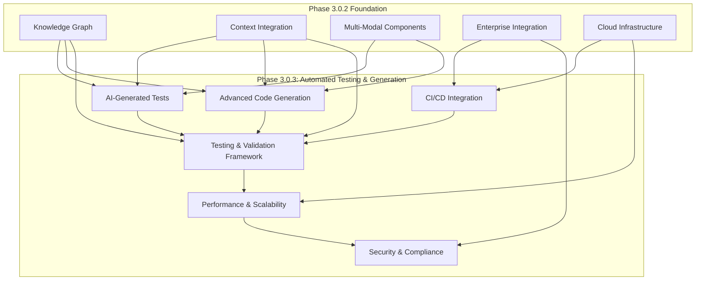
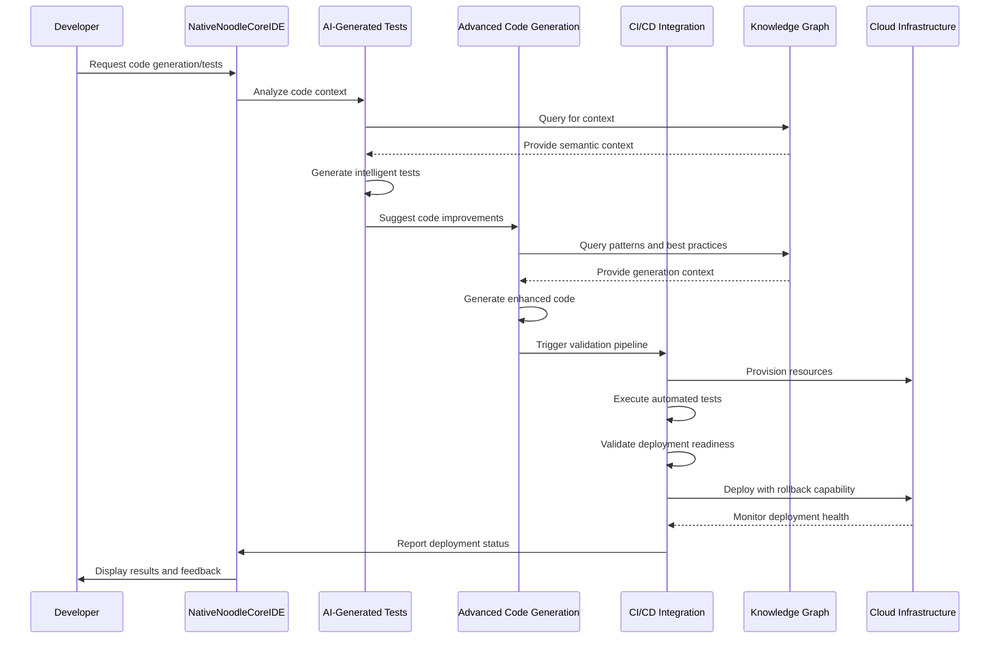
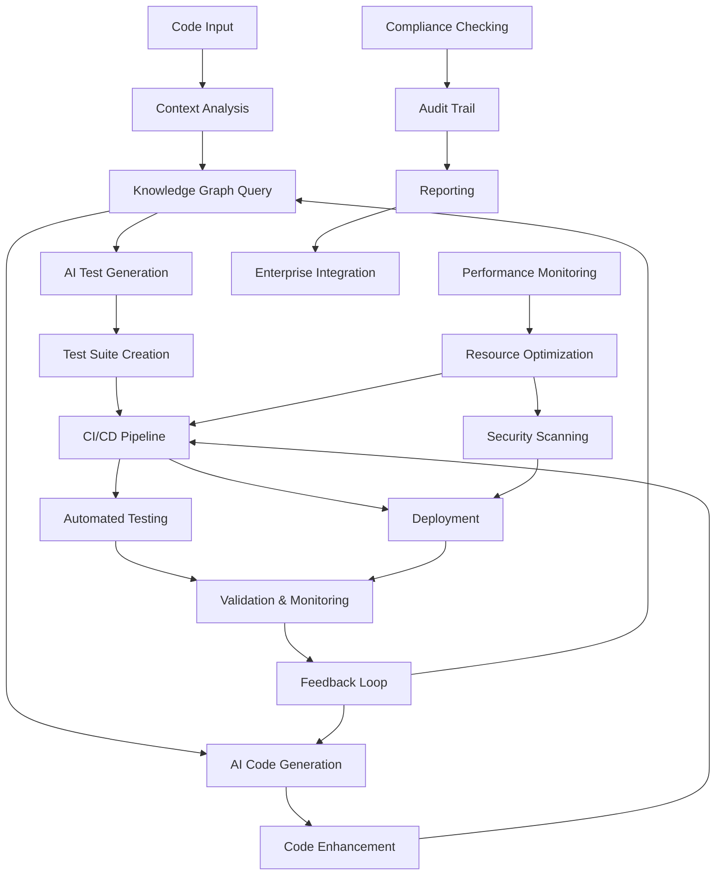

# Phase 3.0.3: Automated Testing & Generation Architecture Design

## Executive Summary

Phase 3.0.3: Automated Testing & Generation represents the culmination of NoodleCore's AI-native development experience, building upon the solid foundation established in Phase 3.0.2 (Knowledge Graph & Context) and integrating with the multi-modal capabilities from Phase 3.0.1. This phase introduces comprehensive AI-driven testing and code generation capabilities that transform how developers create, test, and maintain code.

The primary focus is on **intelligent automation of the entire development lifecycle** from test generation through deployment, with seamless integration with existing NoodleCore components while maintaining enterprise-grade security and performance standards.

## Architecture Overview



## 1. AI-Generated Tests Architecture

### 1.1 Enhanced TestingAgent Integration

#### Core Components

**AITestGenerationEngine**

- Extends existing [`TestingAgent`](noodle-core/src/noodlecore/ai_agents/testing_agent.py:11) with advanced AI capabilities
- Implements intelligent test generation based on code analysis and knowledge graph context
- Supports multiple test types: unit, integration, end-to-end, performance, security
- Integrates with Knowledge Graph for context-aware test generation

**TestContextAnalyzer**

- Analyzes code structure, dependencies, and execution patterns
- Identifies test coverage gaps and critical paths
- Generates test scenarios based on code complexity and business logic
- Leverages existing [`CodeContextGraphEnhancer`](noodle-core/src/noodlecore/ai_agents/knowledge_graph/__init__.py:10)

**TestTemplateGenerator**

- Creates language-specific test templates
- Adapts templates based on project patterns and frameworks
- Supports pytest, unittest, jest, mocha, and other testing frameworks
- Maintains consistency across generated tests

#### Key Features

1. **Intelligent Test Generation**
   - AI-driven test case creation based on code analysis
   - Context-aware generation using Knowledge Graph insights
   - Multi-language support with framework-specific optimizations
   - Automatic test data generation and mocking strategies

2. **Coverage Analysis & Optimization**
   - Real-time coverage tracking and gap identification
   - Intelligent test prioritization based on code criticality
   - Automated test suite optimization and deduplication
   - Integration with existing performance monitoring

3. **Adaptive Test Strategies**
   - Dynamic test strategy selection based on code characteristics
   - Learning from previous test executions and results
   - Evolution of test patterns based on project growth
   - Cross-project test knowledge sharing

#### Integration Points

- Extends existing [`TestingAgent`](noodle-core/src/noodlecore/ai_agents/testing_agent.py:11) class
- Integrates with [`CodeContextGraphEnhancer`](noodle-core/src/noodlecore/ai_agents/knowledge_graph/__init__.py:10) for context
- Connects to [`MLInferenceEngine`](noodle-core/src/noodlecore/ai_agents/ml_inference_engine.py:1) for AI predictions
- Uses existing database patterns through [`DatabaseConnectionPool`](noodle-core/src/noodlecore/database/connection_pool.py:1)

### 1.2 Test Type Specializations

#### Unit Test Generation

**UnitTestGenerator**

```python
class UnitTestGenerator:
    def __init__(self, ml_engine: MLInferenceEngine, knowledge_graph: CodeContextGraphEnhancer):
        self.ml_engine = ml_engine
        self.knowledge_graph = knowledge_graph
        
    async def generate_unit_tests(self, file_path: str, target_functions: List[str] = None) -> List[GeneratedTest]:
        # Generate comprehensive unit tests with AI assistance
        pass
```

- Function-level test generation with edge case coverage
- Mock and fixture generation based on dependencies
- Parameterized test creation for comprehensive coverage
- Integration with existing testing frameworks (pytest, unittest)

#### Integration Test Generation

**IntegrationTestGenerator**

- Service and API integration test generation
- Database and external system mocking strategies
- End-to-end workflow testing capabilities
- Multi-service orchestration testing

#### Performance Test Generation

**PerformanceTestGenerator**

- Load testing scenario generation
- Memory and CPU profiling test creation
- Benchmark and baseline comparison tests
- Scalability and stress test patterns

#### Security Test Generation

**SecurityTestGenerator**

- Vulnerability scanning test generation
- Authentication and authorization test patterns
- Data privacy and compliance testing
- Injection and attack vector testing

## 2. Advanced Code Generation Architecture

### 2.1 Enhanced AIRefactoringEngine Integration

#### Core Components

**AdvancedCodeGenerator**

- Extends existing [`AIRefactoringEngine`](noodle-core/src/noodlecore/ai_agents/ai_refactoring_engine.py:134) with generation capabilities
- Implements AI-driven code generation from natural language and visual inputs
- Supports multiple generation types: boilerplate, refactoring, enhancement, optimization
- Integrates with Knowledge Graph for pattern-based generation

**CodeGenerationOrchestrator**

```python
class CodeGenerationOrchestrator:
    def __init__(self, refactoring_engine: AIRefactoringEngine, 
                 knowledge_graph: CodeContextGraphEnhancer,
                 ml_engine: MLInferenceEngine):
        self.refactoring_engine = refactoring_engine
        self.knowledge_graph = knowledge_graph
        self.ml_engine = ml_engine
        
    async def generate_code(self, request: CodeGenerationRequest) -> CodeGenerationResult:
        # Orchestrate complex code generation workflows
        pass
```

**PatternBasedGenerator**

- Leverages existing refactoring patterns from [`AIRefactoringEngine`](noodle-core/src/noodlecore/ai_agents/ai_refactoring_engine.py:744)
- Enhances with new generation patterns for complete component creation
- Template-based and generative approaches
- Cross-language pattern adaptation

#### Key Features

1. **Context-Aware Generation**
   - Knowledge Graph integration for project-specific generation
   - Multi-modal input support (text, vision, audio)
   - Learning from existing codebase patterns and styles
   - Adaptive generation based on project architecture

2. **Quality Assurance & Validation**
   - Real-time syntax and semantic validation
   - Code quality assessment during generation
   - Security vulnerability scanning in generated code
   - Performance optimization suggestions

3. **Component & Module Generation**
   - Complete component generation with dependencies
   - Microservice and API endpoint creation
   - Database schema and migration generation
   - Frontend component generation with state management

### 2.2 Generation Type Specializations

#### Boilerplate Generation

**BoilerplateGenerator**

- Project and file template generation
- Configuration and setup file creation
- Scaffold generation for different project types
- Integration with build systems and package managers

#### Refactoring Enhancement

**EnhancedRefactoringEngine**

- Builds upon existing refactoring capabilities
- AI-suggested refactoring with context awareness
- Automated refactoring application with validation
- Rollback and recovery mechanisms

#### Enhancement Generation

**CodeEnhancer**

- Performance optimization generation
- Security enhancement suggestions and implementation
- Code modernization and upgrade patterns
- Documentation and comment generation

#### Optimization Generation

**CodeOptimizer**

- Algorithm and data structure optimization
- Resource usage optimization
- Parallel processing and async pattern generation
- Memory and performance bottleneck resolution

## 3. CI/CD Integration Architecture

### 3.1 CloudOrchestrator Enhancement

#### Core Components

**CICDOrchestrator**

- Extends existing [`CloudOrchestrator`](noodle-core/src/noodlecore/cloud/cloud_orchestrator.py:156) with CI/CD capabilities
- Implements automated testing pipelines with AI validation
- Supports multiple deployment strategies with intelligent rollback
- Integrates with existing cloud infrastructure for scalable testing

**AutomatedPipelineManager**

```python
class AutomatedPipelineManager:
    def __init__(self, cloud_orchestrator: CloudOrchestrator,
                 test_generator: AITestGenerationEngine,
                 code_generator: AdvancedCodeGenerator):
        self.cloud_orchestrator = cloud_orchestrator
        self.test_generator = test_generator
        self.code_generator = code_generator
        
    async def create_pipeline(self, config: PipelineConfig) -> PipelineResult:
        # Create automated CI/CD pipelines with AI validation
        pass
```

**DeploymentValidator**

- Pre-deployment validation with AI-generated tests
- Automated rollback triggers on test failures
- Performance and security validation before deployment
- Integration with existing deployment strategies

#### Key Features

1. **Automated Testing Pipelines**
   - AI-driven test execution and validation
   - Parallel test processing with workload balancing
   - Automated test result analysis and reporting
   - Integration with existing deployment strategies

2. **Continuous Integration**
   - Real-time code integration with testing
   - Automated merge and conflict resolution
   - Branch and environment management
   - Integration with version control systems

3. **Continuous Deployment**
   - Blue-green, canary, and rolling deployments
   - AI-based deployment risk assessment
   - Automated rollback and recovery mechanisms
   - Performance monitoring and alerting

### 3.2 Pipeline Strategies

#### Blue-Green Deployment

**BlueGreenPipeline**

- Builds upon existing blue-green deployment in [`CloudOrchestrator`](noodle-core/src/noodlecore/cloud/cloud_orchestrator.py:851)
- Adds AI validation for both environments
- Automated traffic switching based on test results
- Rollback automation with data consistency

#### Canary Deployment

**CanaryPipeline**

- Gradual deployment with AI-based monitoring
- Automated analysis of canary vs. stable performance
- Progressive rollout or rollback based on metrics
- A/B testing integration for feature validation

#### Rolling Deployment

**RollingPipeline**

- Batch-based deployment with health validation
- Automated scaling and load balancing
- Integration with existing auto-scaling capabilities
- Zero-downtime deployment strategies

## 4. Testing and Validation Framework

### 4.1 AERE Integration

#### Core Components

**AutomatedTestValidator**

- Integrates with existing AERE (Automated Error Resolution Engine)
- Provides comprehensive test validation and error detection
- Automated error resolution suggestions
- Learning from validation patterns and results

**QualityAssessmentEngine**

```python
class QualityAssessmentEngine:
    def __init__(self, aere_engine, code_analyzer, performance_monitor):
        self.aere_engine = aere_engine
        self.code_analyzer = code_analyzer
        self.performance_monitor = performance_monitor
        
    async def assess_quality(self, code: str, tests: List[GeneratedTest]) -> QualityAssessment:
        # Comprehensive quality assessment with AI assistance
        pass
```

**RegressionTestManager**

- Automated regression test selection and execution
- Impact analysis for code changes
- Test suite optimization based on change patterns
- Intelligent test prioritization and scheduling

#### Key Features

1. **Automated Test Validation**
   - AI-driven test result analysis and validation
   - Automated test failure diagnosis and resolution
   - Integration with existing AERE system
   - Continuous improvement of test quality

2. **Quality Control**
   - Code quality assessment with multiple metrics
   - Automated quality gate enforcement
   - Integration with existing code quality tools
   - Trend analysis and quality improvement tracking

3. **Regression Testing**
   - Intelligent regression test selection
   - Change impact analysis and prediction
   - Automated test suite optimization
   - Cross-project regression knowledge sharing

### 4.2 Validation Strategies

#### Static Analysis Validation

**StaticAnalysisValidator**

- Code structure and dependency validation
- Security vulnerability scanning
- Performance anti-pattern detection
- Integration with existing analysis tools

#### Dynamic Analysis Validation

**DynamicAnalysisValidator**

- Runtime behavior validation
- Performance profiling and monitoring
- Memory and resource usage validation
- Integration with existing monitoring systems

#### Compliance Validation

**ComplianceValidator**

- Security and regulatory compliance checking
- Data privacy and protection validation
- Industry standard compliance verification
- Integration with existing enterprise compliance systems

## 5. Integration with Existing Systems

### 5.1 Knowledge Graph & Context Integration

#### Integration Points

**ContextAwareGeneration**

- Leverages [`CodeContextGraphEnhancer`](noodle-core/src/noodlecore/ai_agents/knowledge_graph/__init__.py:10) for context
- Semantic analysis for intelligent test and code generation
- Cross-project knowledge sharing and learning
- Pattern recognition and adaptation

**MultiModalContextIntegration**

- Integrates with Phase 3.0.1 multi-modal components
- Vision-based UI testing and code generation
- Audio-based command and workflow testing
- Natural language processing for test and generation requests

### 5.2 Multi-Modal Components Integration

#### Vision Integration

**VisionTestGenerator**

- UI screenshot testing generation
- Visual regression test creation
- Diagram-to-code test translation
- Integration with existing [`VisionIntegrationManager`](noodle-core/src/noodlecore/ai_agents/vision/vision_integration_manager.py:1)

#### Audio Integration

**AudioTestGenerator**

- Voice command testing generation
- Audio response validation
- Accessibility testing with audio inputs
- Integration with existing audio processing components

#### NLP Integration

**NLPTestGenerator**

- Natural language test case generation
- Requirement-to-test translation
- Documentation and comment analysis
- Integration with existing NLP components

### 5.3 Enterprise Integration

#### Authentication Integration

**EnterpriseTestAuth**

- Integrates with existing enterprise authentication
- Role-based test execution permissions
- Audit trail for test generation and execution
- Integration with LDAP, OAuth, and SAML providers

#### Cloud Integration

**CloudTestIntegration**

- Leverages existing [`CloudOrchestrator`](noodle-core/src/noodlecore/cloud/cloud_orchestrator.py:156) for test deployment
- Cloud resource provisioning for testing
- Distributed test execution across cloud environments
- Integration with existing cloud infrastructure

## 6. Performance and Scalability Architecture

### 6.1 Distributed Test Processing

#### Core Components

**DistributedTestProcessor**

```python
class DistributedTestProcessor:
    def __init__(self, cloud_orchestrator: CloudOrchestrator,
                 performance_monitor: PerformanceMonitor):
        self.cloud_orchestrator = cloud_orchestrator
        self.performance_monitor = performance_monitor
        
    async def process_distributed_tests(self, test_suite: TestSuite) -> DistributedTestResult:
        # Process tests across distributed infrastructure
        pass
```

**WorkloadBalancer**

- Intelligent test distribution across available resources
- Dynamic resource allocation based on test requirements
- Load balancing for optimal test execution
- Integration with existing auto-scaling capabilities

#### Key Features

1. **Scalable Test Execution**
   - Distributed test processing across multiple nodes
   - Dynamic resource allocation and scaling
   - Parallel test execution with dependency management
   - Integration with existing cloud infrastructure

2. **Resource Management**
   - Intelligent resource provisioning for testing
   - Cost optimization through resource sharing
   - Automated cleanup and resource deallocation
   - Performance monitoring and alerting

3. **Caching and Optimization**
   - Test result caching for faster feedback
   - Intelligent test selection based on historical data
   - Optimization of test execution order
   - Integration with existing caching systems

### 6.2 Performance Monitoring

#### TestPerformanceMonitor

- Real-time test execution monitoring
- Performance bottleneck detection and resolution
- Resource usage optimization
- Integration with existing [`PerformanceMonitor`](noodle-core/src/noodlecore/ai_agents/performance_monitor.py:1)

#### ScalabilityMetrics

- Test execution scalability metrics
- Resource utilization tracking
- Cost analysis for test operations
- Performance trend analysis and prediction

## 7. Security and Compliance Architecture

### 7.1 Secure Code Generation

#### Core Components

**SecureCodeGenerator**

```python
class SecureCodeGenerator:
    def __init__(self, vulnerability_scanner, compliance_checker):
        self.vulnerability_scanner = vulnerability_scanner
        self.compliance_checker = compliance_checker
        
    async def generate_secure_code(self, request: CodeGenerationRequest) -> SecureCodeResult:
        # Generate code with security and compliance validation
        pass
```

**VulnerabilityScanner**

- Real-time vulnerability scanning in generated code
- Security pattern recognition and flagging
- Automated vulnerability resolution suggestions
- Integration with existing security tools

#### Key Features

1. **Security-First Generation**
   - Automated vulnerability scanning in generated code
   - Security pattern recognition and prevention
   - Compliance-aware code generation
   - Integration with existing security infrastructure

2. **Access Control**
   - Role-based permissions for test generation
   - Secure access to test execution and results
   - Audit trail for all operations
   - Integration with existing enterprise authentication

3. **Data Protection**
   - Sensitive data protection during generation
   - Privacy-preserving test data generation
   - Secure storage and transmission of test artifacts
   - Compliance with data protection regulations

### 7.2 Compliance Framework

#### ComplianceValidator

- Automated compliance checking for generated code and tests
- Industry standard validation (SOC2, ISO27001, etc.)
- Custom compliance rule integration
- Reporting and audit trail generation

#### AuditTrailManager

- Comprehensive audit logging for all operations
- Immutable audit trail with cryptographic protection
- Compliance reporting and analysis
- Integration with existing enterprise audit systems

## 8. Implementation Blueprint

### 8.1 Phase 1: Foundation (Weeks 1-4)

**Week 1-2: Core Infrastructure**

- Implement enhanced TestingAgent with AI capabilities
- Extend AIRefactoringEngine for code generation
- Create integration interfaces with Knowledge Graph
- Implement basic CI/CD pipeline automation

**Week 3-4: Basic Integration**

- Integrate with existing Knowledge Graph components
- Connect to multi-modal capabilities
- Implement basic security and compliance features
- Create initial performance monitoring

### 8.2 Phase 2: Advanced Features (Weeks 5-8)

**Week 5-6: Advanced Processing**

- Implement distributed test processing
- Add advanced code generation capabilities
- Enhance CI/CD pipelines with AI validation
- Implement comprehensive security scanning

**Week 7-8: Intelligence Features**

- Add learning and adaptation capabilities
- Implement predictive test generation
- Enhance performance optimization
- Add advanced compliance validation

### 8.3 Phase 3: Optimization & Polish (Weeks 9-12)

**Week 9-10: Performance Optimization**

- Optimize distributed processing performance
- Implement advanced caching strategies
- Add comprehensive monitoring and alerting
- Optimize resource utilization

**Week 11-12: Integration & Testing**

- Complete integration testing
- Performance benchmarking and optimization
- Documentation and training materials
- Production readiness validation

### 8.4 Success Metrics

**Technical Metrics**

- Test generation accuracy (> 90% relevant tests)
- Code generation quality (> 85% syntactically correct)
- CI/CD pipeline efficiency (> 95% automated)
- Distributed processing performance (< 5s for average test suite)

**User Experience Metrics**

- Developer productivity improvement (> 40% faster development)
- Test coverage improvement (> 25% increase)
- Deployment frequency improvement (> 50% more frequent)
- Error reduction (> 60% fewer production issues)

**Integration Metrics**

- Successful integration with existing components
- Enterprise authentication compatibility
- Cloud deployment success rate
- Multi-modal component utilization

## 9. Configuration and Environment Variables

### 9.1 AI-Generated Tests Configuration

```bash
# Core functionality
NOODLE_AI_TESTS_ENABLED=true
NOODLE_AI_TESTS_MAX_GENERATED=100
NOODLE_AI_TESTS_CONFIDENCE_THRESHOLD=0.8
NOODLE_AI_TESTS_COVERAGE_TARGET=80
NOODLE_AI_TESTS_LEARNING_ENABLED=true

# Performance tuning
NOODLE_AI_TESTS_CACHE_SIZE=1000
NOODLE_AI_TESTS_PARALLEL_WORKERS=10
NOODLE_AI_TESTS_TIMEOUT=300
NOODLE_AI_TESTS_RETRY_ATTEMPTS=3

# Framework integration
NOODLE_AI_TESTS_PYTEST_ENABLED=true
NOODLE_AI_TESTS_JEST_ENABLED=true
NOODLE_AI_TESTS_MOCHA_ENABLED=true
NOODLE_AI_TESTS_CUSTOM_FRAMEWORKS=""
```

### 9.2 Advanced Code Generation Configuration

```bash
# Core functionality
NOODLE_CODE_GENERATION_ENABLED=true
NOODLE_CODE_GENERATION_MAX_SUGGESTIONS=50
NOODLE_CODE_GENERATION_CONFIDENCE_THRESHOLD=0.7
NOODLE_CODE_GENERATION_AUTO_APPLY=false
NOODLE_CODE_GENERATION_VALIDATION_ENABLED=true

# Generation types
NOODLE_CODE_GENERATION_BOILERPLATE_ENABLED=true
NOODLE_CODE_GENERATION_REFACTORING_ENABLED=true
NOODLE_CODE_GENERATION_ENHANCEMENT_ENABLED=true
NOODLE_CODE_GENERATION_OPTIMIZATION_ENABLED=true

# Quality assurance
NOODLE_CODE_GENERATION_QUALITY_CHECK=true
NOODLE_CODE_GENERATION_SECURITY_SCAN=true
NOODLE_CODE_GENERATION_PERFORMANCE_ANALYSIS=true
```

### 9.3 CI/CD Integration Configuration

```bash
# Pipeline automation
NOODLE_CICD_ENABLED=true
NOODLE_CICD_AUTO_DEPLOYMENT=false
NOODLE_CICD_ROLLBACK_ENABLED=true
NOODLE_CICD_PARALLEL_PIPELINES=5
NOODLE_CICD_APPROVAL_REQUIRED=false

# Deployment strategies
NOODLE_CICD_BLUE_GREEN_ENABLED=true
NOODLE_CICD_CANARY_ENABLED=true
NOODLE_CICD_ROLLING_ENABLED=true
NOODLE_CICD_AB_TESTING_ENABLED=true

# Validation and testing
NOODLE_CICD_PRE_DEPLOY_TESTS=true
NOODLE_CICD_POST_DEPLOY_TESTS=true
NOODLE_CICD_PERFORMANCE_TESTS=true
NOODLE_CICD_SECURITY_TESTS=true
```

### 9.4 Performance and Scalability Configuration

```bash
# Distributed processing
NOODLE_DISTRIBUTED_TESTS_ENABLED=true
NOODLE_DISTRIBUTED_MAX_NODES=20
NOODLE_DISTRIBUTED_WORKLOAD_BALANCING=true
NOODLE_DISTRIBUTED_RESOURCE_SHARING=true

# Performance optimization
NOODLE_PERFORMANCE_CACHE_ENABLED=true
NOODLE_PERFORMANCE_CACHE_SIZE=10000
NOODLE_PERFORMANCE_OPTIMIZATION=true
NOODLE_PERFORMANCE_MONITORING=true

# Resource management
NOODLE_RESOURCE_AUTO_PROVISIONING=true
NOODLE_RESOURCE_AUTO_SCALING=true
NOODLE_RESOURCE_COST_OPTIMIZATION=true
```

### 9.5 Security and Compliance Configuration

```bash
# Security features
NOODLE_SECURITY_SCAN_ENABLED=true
NOODLE_SECURITY_VULNERABILITY_CHECK=true
NOODLE_SECURITY_COMPLIANCE_CHECK=true
NOODLE_SECURITY_AUDIT_TRAIL=true

# Access control
NOODLE_ACCESS_CONTROL_ENABLED=true
NOODLE_ACCESS_ROLE_BASED=true
NOODLE_ACCESS_MIN_PERMISSIONS=true

# Data protection
NOODLE_DATA_PROTECTION_ENABLED=true
NOODLE_DATA_ENCRYPTION_ENABLED=true
NOODLE_DATA_PRIVACY_ENABLED=true
NOODLE_DATA_ANONYMIZATION=true
```

## 10. Component Interaction Flow



## 11. Data Flow Architecture



## 12. Technology Stack

### 12.1 Core Technologies

- **AI/ML**: Existing ML infrastructure with enhanced models
- **Database**: Existing database patterns with new test/generation tables
- **Cloud**: Existing cloud infrastructure with CI/CD enhancements
- **Security**: Existing enterprise security with new scanning capabilities
- **Monitoring**: Existing performance monitoring with new metrics

### 12.2 Frameworks and Libraries

- **Testing**: pytest, unittest, jest, mocha, custom framework adapters
- **Generation**: Template engines, AST processors, code formatters
- **CI/CD**: Existing pipeline tools with AI validation
- **Security**: Vulnerability scanners, compliance checkers, audit tools

### 12.3 Integration Patterns

- **API**: RESTful APIs following existing patterns (0.0.0.0:8080, UUID v4)
- **Events**: Existing event systems with new test/generation events
- **Configuration**: NOODLE_ prefixed environment variables
- **Database**: Pooled connections with new schemas and tables

## 13. Migration Strategy

### 13.1 From Existing Systems

**TestingAgent Migration**

- Gradual enhancement of existing [`TestingAgent`](noodle-core/src/noodlecore/ai_agents/testing_agent.py:11)
- Backward compatibility with existing test patterns
- Migration path for existing test suites
- Feature flagging for gradual rollout

**AIRefactoringEngine Migration**

- Extension of existing [`AIRefactoringEngine`](noodle-core/src/noodlecore/ai_agents/ai_refactoring_engine.py:134)
- Addition of generation capabilities while preserving refactoring
- Migration of existing refactoring patterns and knowledge
- Compatibility with existing refactoring workflows

### 13.2 Data Migration

**Test Knowledge Migration**

- Export existing test knowledge and patterns
- Import into enhanced knowledge graph structure
- Transformation of test data to new formats
- Validation of migrated test suites

**Generation Knowledge Migration**

- Export existing refactoring patterns and knowledge
- Enhancement with new generation patterns
- Integration with knowledge graph for context
- Learning from historical generation data

## 14. Best Practices and Guidelines

### 14.1 Development Guidelines

- Follow existing NoodleCore patterns and conventions
- Use NOODLE_ prefixed environment variables
- Integrate with existing database and API patterns
- Maintain compatibility with existing enterprise systems
- Follow security-first development practices

### 14.2 Testing Guidelines

- Comprehensive test coverage for all new components
- Integration testing with existing NoodleCore systems
- Performance testing at scale
- Security testing for all new capabilities
- Automated regression testing

### 14.3 Deployment Guidelines

- Gradual rollout with feature flags
- Blue-green deployment strategies
- Comprehensive monitoring and alerting
- Automated rollback capabilities
- Integration with existing cloud infrastructure

## 15. Conclusion

Phase 3.0.3: Automated Testing & Generation represents a transformative evolution of NoodleCore's AI-native development experience. By building upon the solid foundation of Phase 3.0.2 (Knowledge Graph & Context) and integrating with the multi-modal capabilities from Phase 3.0.1, this phase delivers comprehensive AI-driven testing and code generation capabilities that significantly enhance developer productivity and code quality.

The architecture emphasizes:

- **Intelligent Automation**: AI-driven test generation and code enhancement
- **Enterprise Integration**: Seamless integration with existing authentication, cloud, and compliance systems
- **Performance at Scale**: Distributed processing with intelligent resource management
- **Security First**: Comprehensive security scanning and compliance validation
- **Developer Experience**: Intuitive interfaces with real-time feedback and learning

This architecture positions NoodleCore as a leader in AI-native development environments, providing developers with unprecedented tools for creating, testing, and maintaining high-quality code through intelligent automation and context-aware generation.
