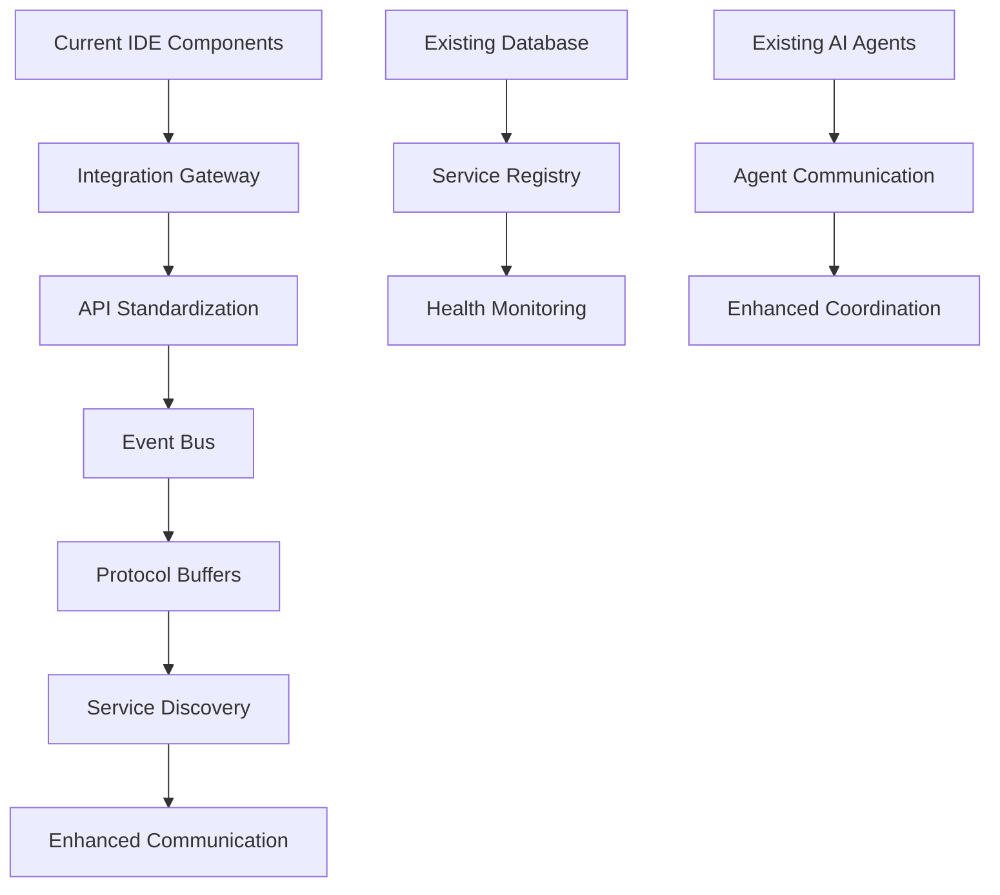
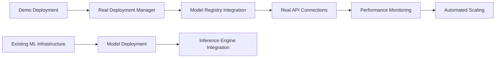
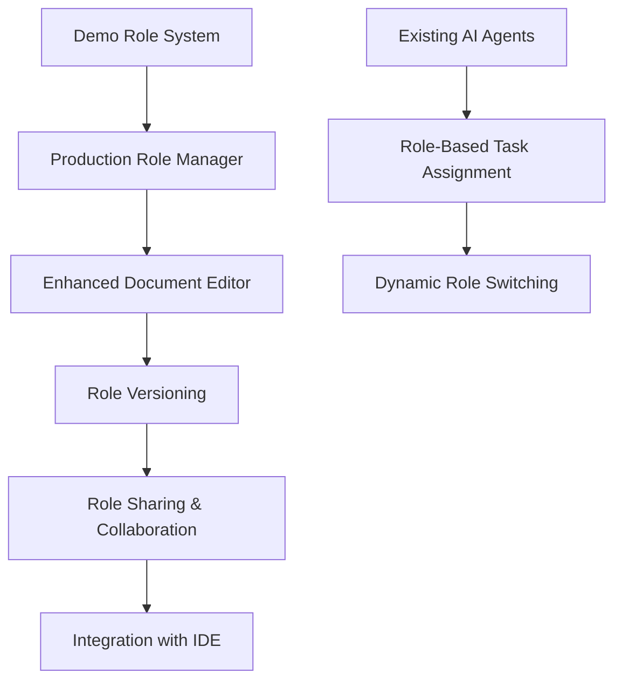
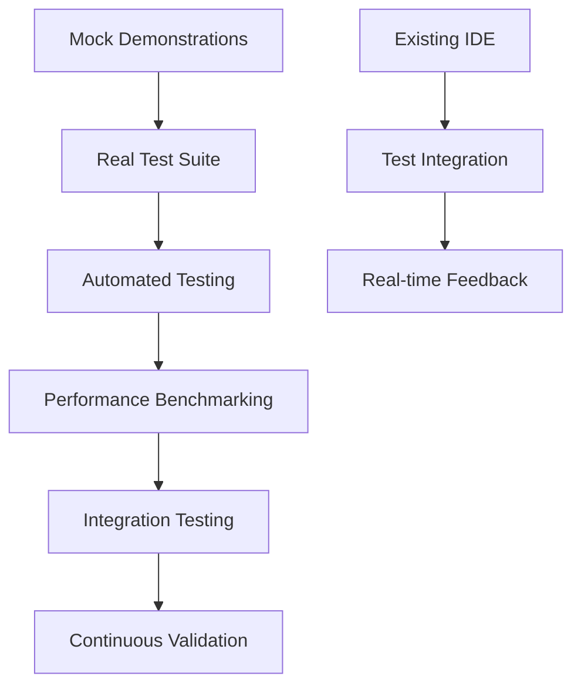

# NoodleCore Demo to Production Implementation Plan

## Executive Summary

Based on comprehensive analysis of the NoodleCore project, this plan outlines the systematic conversion of demo/stub functions to production-ready implementations while leveraging existing infrastructure. The project has significant mature components (92/100 maturity score) with extensive AI agents, database infrastructure, and IDE framework already in place.

## Current State Analysis

### What's Already Built (Production Ready)

#### Core Infrastructure

- **Database Manager**: Production-ready with connection pooling, failover, and proper error handling
- **AI Agents Framework**: Complete agent registry with specialized roles (Code Reviewer, Debugger, Documentation, etc.)
- **AI Role Management**: Document-based role system with Manager AI as central orchestrator
- **IDE Framework**: Native GUI IDE with Tkinter, resizable panels, real AI integration
- **Configuration System**: Encrypted config management with NOODLE_ prefixed environment variables
- **ML Infrastructure**: Neural network factory, model registry, inference engine, data preprocessor

#### Working Features

- Real AI provider integration (OpenAI, OpenRouter, LM Studio, Z.ai)
- Multi-tab code editor with syntax highlighting
- File explorer with real file operations
- Terminal with command execution
- Git integration
- Progress monitoring system
- Self-improvement integration
- TRM controller integration
- Enhanced syntax fixer with AI assistance

### What's Demo/Stub (Needs Real Implementation)

#### Major Demo Areas Identified

1. **AI Deployment System** (`ai_deployment_demo.py`)
2. **Feature Demonstrations** (`feature_demonstrations.py`)
3. **AI Role Documents** (`demo_ai_role_documents.py`)
4. **IDE Integration Demos** (`ide-integration-demo.py`, `comprehensive_ide_server.py`)
5. **Native GUI Demos** (`native_gui_ide_demo.py`, `beautiful_native_ide.py`)
6. **AI API Demonstrations** (`demonstrate_ai_apis.py`)
7. **Launch System Demos** (`launch_noodlecore_ide.py`)
8. **ML Infrastructure Demos** (various test files with mock implementations)
9. **Enterprise Integration Stubs** (OAuth, SSO, auth session managers)
10. **Security System Stubs** (homomorphic encryption, zero-knowledge proofs)
11. **Advanced Learning System Stubs** (context learning, pattern recognition)
12. **Database Demo Implementations** (mock test results, demo data)

## Implementation Strategy

### Phase 1: Foundation & Quick Wins (Months 1-2)

#### Priority 1: Unified Integration Architecture

**Objective**: Create standardized APIs and communication protocols between IDE, CLI, and cloud services

**Key Deliverables**:

- Integration Gateway: Central communication hub with standardized message formats
- API Standardization: RESTful v2.0 APIs with consistent patterns
- Event Bus: Asynchronous event-driven communication
- Protocol Buffers: Message queuing and retry mechanisms
- Service Discovery: Dynamic service registration and discovery

**Implementation Approach**:

- Leverage existing `native_gui_ide.py` as the central hub
- Extend current AI provider system to support inter-component communication
- Use existing database manager for service registry
- Build upon existing HTTP API patterns in the codebase

#### Priority 2: Convert Core Demo Functions

**Objective**: Replace stub implementations with production-ready versions

**Target Areas**:

1. **AI Deployment System** - Convert `ai_deployment_demo.py` to real deployment manager
2. **AI Role Documents** - Enhance `demo_ai_role_documents.py` to production system
3. **Feature Demonstrations** - Convert `feature_demonstrations.py` to real test suite
4. **IDE Integration** - Replace demo servers with real integration

**Leveraging Existing Infrastructure**:

- Use existing AI agents framework for real functionality
- Integrate with existing database manager for persistence
- Utilize existing configuration system for settings
- Build upon existing error handling patterns

### Phase 2: Advanced Features (Months 3-4)

#### Priority 3: Distributed OS Foundation

**Objective**: Implement process isolation and resource management

**Key Deliverables**:

- Process Manager: Isolated execution environments with resource limits
- Resource Allocator: Dynamic resource allocation based on workload
- Node Manager: Distributed node lifecycle management
- Inter-Node Communication: Secure, efficient node-to-node messaging
- Health Monitoring: Real-time system health tracking

#### Priority 4: Virtual Modules System

**Objective**: Implement dynamic loading and dependency resolution

**Key Deliverables**:

- Module Registry: Central repository for available modules
- Dependency Resolver: Automatic dependency analysis and resolution
- Dynamic Loader: Runtime module loading and unloading
- Version Manager: Module versioning and compatibility checking
- Module Sandbox: Isolated execution environment for modules

### Phase 3: Advanced Capabilities (Months 5-6)

#### Priority 5: Advanced Cross-Modal Reasoning

**Objective**: Enhance AI capabilities across text, audio, and vision modalities

**Key Deliverables**:

- Cross-Modal Fusion Engine: Advanced correlation and fusion algorithms
- Context Integration: Unified context management across modalities
- Reasoning Framework: Enhanced logical inference and decision making
- Knowledge Graph: Semantic relationships between different data types
- Multi-Modal Memory: Integrated memory system for cross-modal learning

#### Priority 6: Capability-Based Security

**Objective**: Implement fine-grained access control with dynamic permission management

**Key Deliverables**:

- Capability Engine: Define and manage fine-grained capabilities
- Policy Engine: Dynamic policy evaluation and enforcement
- Access Control: Attribute-based and role-based access control
- Audit System: Comprehensive activity logging and monitoring
- Security Dashboard: Real-time security monitoring and alerting

## Detailed Implementation Plan

### 1. Unified Integration Architecture Implementation

**Steps**:

1. **Integration Gateway Development**
   - Create `noodle-core/src/noodlecore/integration/gateway.py`
   - Implement centralized message routing
   - Add request/response standardization
   - Include UUID v4 request IDs as per AGENTS.md

2. **API Standardization**
   - Extend existing HTTP API patterns
   - Implement RESTful v2.0 specifications
   - Add OpenAPI documentation generation
   - Ensure backward compatibility

3. **Event Bus Implementation**
   - Create `noodle-core/src/noodlecore/integration/event_bus.py`
   - Implement publish/subscribe patterns
   - Add message queuing and persistence
   - Integrate with existing async patterns

### 2. AI Deployment System Conversion

**Current State**: `ai_deployment_demo.py` provides mock deployment with demo models

**Target Implementation**:

**Steps**:

1. **Real Deployment Manager**
   - Replace mock deployment with real AI provider connections
   - Integrate with existing `MLModelRegistry`
   - Add real performance metrics collection
   - Implement automated scaling based on load

2. **Model Management Integration**
   - Connect to real model APIs (OpenAI, OpenRouter, etc.)
   - Implement model versioning and rollback
   - Add model performance tracking
   - Use existing `database_manager` for persistence

### 3. AI Role Document System Enhancement

**Current State**: `demo_ai_role_documents.py` shows basic functionality

**Target Implementation**:

**Steps**:

1. **Enhanced Document Editor**
   - Replace basic text editing with rich markdown editor
   - Add syntax highlighting for role documents
   - Implement collaborative editing features
   - Add document templates and snippets

2. **Role Workflow Integration**
   - Connect role system to existing AI agents
   - Implement automatic role selection based on task type
   - Add role performance tracking and optimization

### 4. Feature Demonstration to Test Suite Conversion

**Current State**: `feature_demonstrations.py` provides mock demonstrations

**Target Implementation**:

**Steps**:

1. **Test Framework Development**
   - Create comprehensive test framework
   - Implement automated test execution
   - Add performance benchmarking
   - Integrate with existing IDE components

2. **Real-time Feedback System**
   - Replace mock results with actual system metrics
   - Implement continuous monitoring during demonstrations
   - Add user interaction tracking
   - Connect to existing progress monitoring system

## Leveraging Existing Infrastructure

### Database Integration

- Use existing `database_manager.py` for all data persistence
- Leverage connection pooling and failover capabilities
- Integrate with existing configuration system
- Use existing error handling patterns

### AI Agents Integration

- Utilize existing agent registry and specialized roles
- Connect new functionality to existing AI providers
- Leverage existing role manager for coordination
- Use existing ML infrastructure for enhanced capabilities

### IDE Framework Integration

- Build upon existing `native_gui_ide.py` architecture
- Use existing panel system and resizable layout
- Integrate with existing syntax highlighting and validation
- Leverage existing file operations and terminal integration

### Configuration System Integration

- Use existing encrypted configuration management
- Follow NOODLE_ prefix conventions for environment variables
- Integrate with existing AI provider settings
- Leverage existing workspace state management

## Implementation Timeline

### Months 1-2: Foundation & Quick Wins

- **Week 1-2**: Unified Integration Architecture foundation
- **Week 3-4**: AI Deployment System conversion
- **Week 5-6**: AI Role Document System enhancement
- **Week 7-8**: Feature Demonstration to Test Suite conversion

### Months 3-4: Advanced Features

- **Week 9-10**: Distributed OS foundation implementation
- **Week 11-12**: Virtual Modules System development
- **Week 13-14**: Advanced Cross-Modal Reasoning foundation
- **Week 15-16**: Capability-Based Security framework

### Months 5-6: Advanced Capabilities

- **Week 17-20**: Complete Cross-Modal Reasoning implementation
- **Week 21-22**: Advanced Security features completion
- **Week 23-24**: Performance optimization and scaling
- **Week 25-26**: Comprehensive testing and validation

## Success Metrics

### Technical KPIs

- **System Availability**: >99.9% uptime for integration services
- **API Response Time**: <200ms for inter-service communication
- **Test Coverage**: >95% for all converted components
- **Performance**: <100ms for AI operations, <500ms for complex operations

### Business KPIs

- **Development Efficiency**: 50% reduction in integration complexity
- **Feature Utilization**: 70%+ of new features actively used
- **User Satisfaction**: >4.5/5.0 user satisfaction rating

## Risk Management

### High-Priority Risks

1. **Integration Complexity Risk**: Multiple integration points creating system complexity
   - **Mitigation**: Phased implementation with extensive testing

2. **Technology Dependency Risk**: Reliance on emerging AI technologies
   - **Mitigation**: Technology evaluation with proof-of-concepts

3. **Resource Constraint Risk**: Limited specialized personnel for distributed systems
   - **Mitigation**: Training programs and knowledge sharing

### Monitoring and Early Warning

- **Key Metrics**: System integration health, cross-component communication latency
- **Alert Thresholds**: System availability <99%, API response time >500ms
- **Response Procedures**: Automated scaling, circuit breaker patterns, rollback procedures

## Conclusion

This implementation plan provides a systematic approach to converting NoodleCore's demo/stub functions to production-ready implementations while maximizing reuse of existing infrastructure. The phased approach allows for incremental delivery of value while managing complexity and risk.

The plan emphasizes:

1. **Building upon existing strengths** rather than rebuilding
2. **Leveraging mature components** (database, AI agents, IDE framework)
3. **Following established patterns** and conventions
4. **Delivering tangible value** through prioritized quick wins
5. **Ensuring long-term sustainability** through proper architecture

By following this plan, NoodleCore can evolve from its current 92/100 maturity score to a fully integrated, production-ready system that delivers on the roadmap's strategic objectives.
