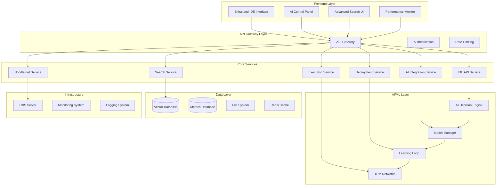
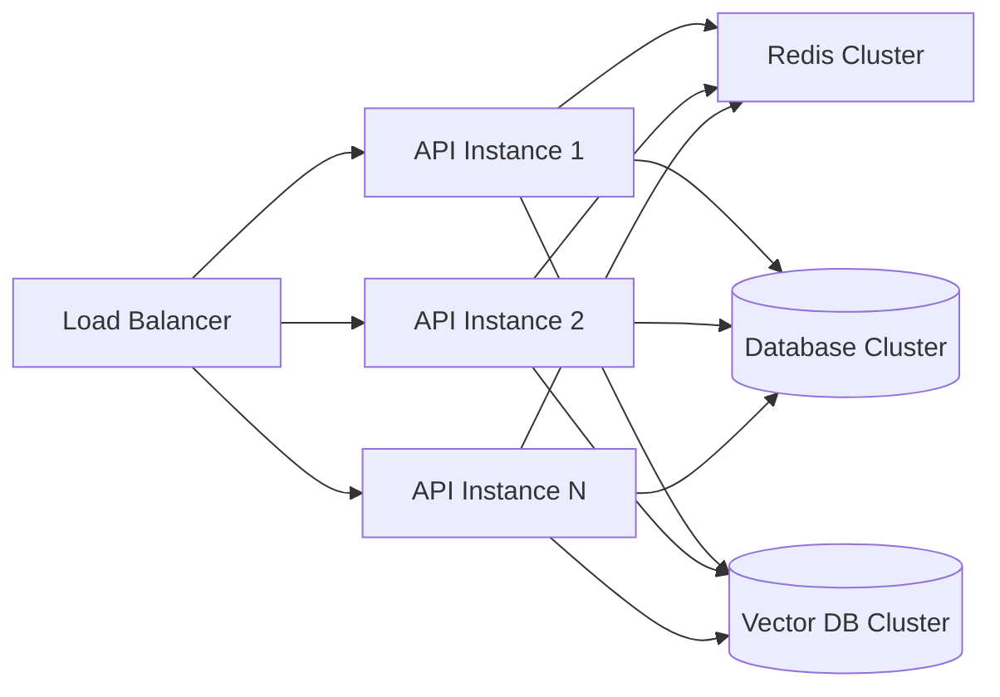

# NoodleCore IDE Advanced Features: Architectural Analysis & Implementation Plan

*Date: 2025-10-31*  
*Version: 1.0*  
*Status: Analysis Complete - Ready for Implementation*

## Executive Summary

This document provides a comprehensive analysis of the current NoodleCore IDE infrastructure and presents a detailed architectural design for implementing advanced features including AI integration, self-learning systems, advanced file search, script execution, Noodle-net integration, and AI deployment management.

### Current State Overview

The NoodleCore IDE currently has a solid foundation with an enhanced API server, basic IDE endpoints, self-improvement capabilities, and CLI management tools. However, the frontend interface (enhanced-ide.html) is empty and several advanced features require implementation.

### Target State Vision

Transform the current basic IDE into a fully-featured, AI-powered development environment with intelligent code analysis, self-learning optimization, advanced search capabilities, seamless Noodle-net integration, and comprehensive AI model management.

---

## 1. Current Infrastructure Analysis

### 1.1 Existing Components

#### Enhanced API Server (`server_enhanced.py`)

- **Status**: ✅ Fully Implemented
- **Features**:
  - HTTP server on port 8080 (NoodleCore standard)
  - Zero-configuration request interception
  - Host header inspection for noodle domain detection
  - IDE content serving capabilities
  - DNS server integration
  - Comprehensive error handling with 4-digit error codes
  - UUID v4 request tracking
  - Performance monitoring and constraints enforcement

#### Existing API Endpoints

```
✅ /api/v1/health - System health check
✅ /api/v1/execute - Code execution (basic)
✅ /api/v1/runtime/status - Runtime monitoring
✅ /api/v1/versions - Version information
✅ /api/v1/database/status - Database status
✅ /api/v1/dns/status - DNS server status
✅ /api/v1/interception/status - Interception status
✅ /api/v1/ide/files/save - File save operations
✅ /api/v1/ide/code/execute - IDE code execution
```

#### Self-Improvement System

- **Status**: ✅ Core Components Implemented
- **Components**:
  - AI Decision Engine with TRM neural networks
  - Model Management with versioning and A/B testing
  - Learning Loop Integration with automated cycles
  - Performance monitoring and feedback collection
  - Adaptive optimization engine

#### CLI Management System

- **Status**: ✅ Comprehensive Implementation
- **Features**:
  - System status and health monitoring
  - Configuration management
  - Manual trigger capabilities
  - Performance reporting
  - Integration with existing tools

### 1.2 Current Capabilities

#### Working Features

- Web-based IDE interface accessible via zero-configuration interception
- Basic file operations (save/load) through API
- Code execution with Python and Noodle language simulation
- Real-time performance monitoring
- AI-driven optimization decisions
- Automated learning cycles
- Comprehensive CLI management
- DNS server integration

#### Missing/Gap Analysis

- ❌ Enhanced-ide.html is empty (no actual IDE interface)
- ❌ No advanced file search functionality
- ❌ No Noodle-net integration endpoints
- ❌ Limited AI deployment features in IDE
- ❌ No code analysis suggestions in UI
- ❌ No capability-triggering mechanisms in IDE

---

## 2. Target State Architecture

### 2.1 Advanced Features Overview

#### AI Integration for Code Analysis and Suggestions

- **Scope**: Real-time code analysis, intelligent suggestions, optimization recommendations
- **Dependencies**: Existing AI Decision Engine, Model Management
- **Implementation**: API endpoints + frontend integration

#### Self-Learning System with Capability Triggering

- **Scope**: Automatic optimization triggering, performance-based improvements
- **Dependencies**: Learning Loop Integration, Performance Monitoring
- **Implementation**: Backend automation + UI indicators

#### Advanced File Search Functionality

- **Scope**: Intelligent file search, content search, semantic search
- **Dependencies**: Vector database integration, indexing system
- **Implementation**: Search API + frontend search interface

#### Python/NoodleCore Script Execution and Improvement

- **Scope**: Enhanced execution environment, optimization suggestions, performance tracking
- **Dependencies**: Existing execution engine, AI optimization
- **Implementation**: Extended execution API + improvement UI

#### Noodle-net Integration

- **Scope**: Network-aware features, distributed execution, collaboration
- **Dependencies**: Network components, DNS system
- **Implementation**: Network API + collaboration UI

#### AI Deployment and Management Features

- **Scope**: Model lifecycle management, A/B testing, performance monitoring
- **Dependencies**: Existing Model Management, Learning Loop
- **Implementation**: Management API + dashboard UI

### 2.2 Component Architecture



---

## 3. Technical Architecture Design

### 3.1 API Extension Architecture

#### New API Endpoints Design

```python
# AI Integration Endpoints
POST   /api/v1/ai/analyze/code          # Code analysis request
GET    /api/v1/ai/suggestions/{file_id} # Get AI suggestions
POST   /api/v1/ai/optimize/{file_id}    # Trigger optimization
GET    /api/v1/ai/models/status         # AI model status

# Advanced Search Endpoints
GET    /api/v1/search/files             # File search
GET    /api/v1/search/content           # Content search
GET    /api/v1/search/semantic          # Semantic search
POST   /api/v1/search/index             # Index management

# Enhanced Execution Endpoints
POST   /api/v1/execute/enhanced         # Enhanced code execution
GET    /api/v1/execution/{id}/status    # Execution status
POST   /api/v1/execution/{id}/optimize  # Optimize execution
GET    /api/v1/execution/history        # Execution history

# Noodle-net Integration Endpoints
GET    /api/v1/noodlenet/status         # Network status
POST   /api/v1/noodlenet/collaborate    # Start collaboration
GET    /api/v1/noodlenet/nodes          # Network nodes
POST   /api/v1/noodlenet/deploy         # Deploy to network

# AI Deployment Management Endpoints
GET    /api/v1/deployment/models        # Model deployments
POST   /api/v1/deployment/models        # Deploy new model
GET    /api/v1/deployment/tests         # A/B test status
POST   /api/v1/deployment/tests         # Create A/B test
GET    /api/v1/deployment/metrics       # Deployment metrics
```

#### API Response Standards

All new endpoints will follow the existing NoodleCore standards:

- UUID v4 request IDs
- Standardized success/error responses
- 4-digit error codes
- Performance metrics included
- Request timeout constraints (30 seconds)

### 3.2 Frontend Architecture

#### Enhanced IDE Interface Structure

```html
<!-- Main IDE Layout -->
<div id="ide-container">
    <!-- File Explorer with Advanced Search -->
    <div id="file-explorer">
        <div id="search-bar">
            <input type="text" id="advanced-search" placeholder="Search files, content, or concepts...">
            <div id="search-filters">
                <select id="search-type">
                    <option value="filename">File Name</option>
                    <option value="content">Content</option>
                    <option value="semantic">Semantic</option>
                </select>
            </div>
        </div>
        <div id="file-tree"></div>
    </div>
    
    <!-- Code Editor with AI Integration -->
    <div id="editor-container">
        <div id="ai-suggestions-panel"></div>
        <div id="monaco-editor"></div>
        <div id="execution-results"></div>
    </div>
    
    <!-- AI Control Panel -->
    <div id="ai-panel">
        <div id="ai-status"></div>
        <div id="learning-indicators"></div>
        <div id="optimization-controls"></div>
        <div id="model-management"></div>
    </div>
    
    <!-- Performance Monitor -->
    <div id="performance-monitor">
        <div id="metrics-chart"></div>
        <div id="improvement-suggestions"></div>
    </div>
    
    <!-- Noodle-net Integration -->
    <div id="noodlenet-panel">
        <div id="network-status"></div>
        <div id="collaboration-tools"></div>
        <div id="distributed-execution"></div>
    </div>
</div>
```

#### JavaScript Architecture

```javascript
// Core IDE classes
class EnhancedIDE {
    constructor() {
        this.aiEngine = new AIIntegrationEngine();
        this.searchEngine = new AdvancedSearchEngine();
        this.executionEngine = new EnhancedExecutionEngine();
        this.noodlenetClient = new NoodleNetClient();
        this.deploymentManager = new DeploymentManager();
    }
    
    async initialize() {
        await this.loadConfiguration();
        await this.initializeAI();
        await this.setupEventListeners();
        await this.startMonitoring();
    }
}

class AIIntegrationEngine {
    async analyzeCode(code, fileId) {
        const response = await fetch('/api/v1/ai/analyze/code', {
            method: 'POST',
            headers: { 'Content-Type': 'application/json' },
            body: JSON.stringify({ code, fileId })
        });
        return await response.json();
    }
    
    async getSuggestions(fileId) {
        const response = await fetch(`/api/v1/ai/suggestions/${fileId}`);
        return await response.json();
    }
}

class AdvancedSearchEngine {
    async search(query, type, filters) {
        const response = await fetch('/api/v1/search/files', {
            method: 'GET',
            headers: { 'Content-Type': 'application/json' },
            body: JSON.stringify({ query, type, filters })
        });
        return await response.json();
    }
}
```

### 3.3 Database and Storage Architecture

#### Data Models

```python
# File Index Model
class FileIndex:
    file_id: str
    file_path: str
    content_hash: str
    semantic_vector: List[float]
    metadata: Dict[str, Any]
    created_at: datetime
    updated_at: datetime

# AI Suggestion Model
class AISuggestion:
    suggestion_id: str
    file_id: str
    suggestion_type: str
    content: str
    confidence: float
    context: Dict[str, Any]
    status: str  # pending, accepted, rejected
    created_at: datetime

# Execution History Model
class ExecutionHistory:
    execution_id: str
    file_id: str
    execution_time: float
    memory_usage: float
    cpu_usage: float
    output: str
    optimization_applied: bool
    created_at: datetime

# Model Deployment Model
class ModelDeployment:
    deployment_id: str
    model_id: str
    model_type: ModelType
    version: str
    status: DeploymentStatus
    performance_before: Dict[str, float]
    performance_after: Dict[str, float]
    ab_test_config: Dict[str, Any]
    created_at: datetime
```

#### Vector Database Integration

```python
class VectorSearchManager:
    def __init__(self):
        self.vector_db = VectorDatabase()
        self.embedding_model = EmbeddingModel()
    
    async def index_file(self, file_path: str, content: str):
        """Index file content for semantic search."""
        embedding = await self.embedding_model.embed(content)
        
        file_index = FileIndex(
            file_id=hashlib.md5(file_path.encode()).hexdigest(),
            file_path=file_path,
            content_hash=hashlib.sha256(content.encode()).hexdigest(),
            semantic_vector=embedding.tolist(),
            metadata={'file_size': len(content)},
            created_at=datetime.utcnow()
        )
        
        await self.vector_db.upsert(file_index)
    
    async def semantic_search(self, query: str, limit: int = 10):
        """Perform semantic search across indexed files."""
        query_embedding = await self.embedding_model.embed(query)
        results = await self.vector_db.search(query_embedding, limit)
        return results
```

---

## 4. Implementation Dependencies

### 4.1 Critical Path Dependencies

#### Phase 1: Foundation (Weeks 1-2)

```
Enhanced-ide.html Frontend ← Immediate Priority
├── Basic IDE layout and Monaco Editor integration
├── File explorer with basic functionality
├── Code editor with syntax highlighting
└── Connection to existing API endpoints
```

#### Phase 2: AI Integration (Weeks 3-4)

```
AI Analysis API ← Depends on Phase 1
├── AI code analysis endpoints
├── Suggestion management system
├── Real-time analysis interface
└── Integration with existing AI Decision Engine
```

#### Phase 3: Advanced Search (Weeks 5-6)

```
Vector Database ← Independent
├── File indexing system
├── Content search API
├── Semantic search implementation
└── Search UI integration
```

#### Phase 4: Enhanced Execution (Weeks 7-8)

```
Execution Enhancement ← Depends on Phase 1
├── Enhanced execution API
├── Performance tracking
├── Optimization suggestions
└── Execution history UI
```

#### Phase 5: Noodle-net Integration (Weeks 9-10)

```
Network Services ← Depends on Phase 1
├── Noodle-net API endpoints
├── Collaboration features
├── Distributed execution
└── Network status UI
```

#### Phase 6: AI Deployment Management (Weeks 11-12)

```
Model Management UI ← Depends on Phase 2
├── Model deployment dashboard
├── A/B testing interface
├── Performance monitoring
└── Learning loop visualization
```

### 4.2 Technology Stack Requirements

#### Frontend Technologies

- **Monaco Editor**: Code editing (existing)
- **Chart.js**: Performance visualizations
- **WebSocket**: Real-time updates
- **Bootstrap/CSS**: UI components
- **JavaScript ES6+**: Modern JavaScript features

#### Backend Technologies

- **FastAPI**: Enhanced API framework (upgrade from Flask)
- **Redis**: Caching and real-time data
- **PostgreSQL**: Primary database for metadata
- **FAISS/Pinecone**: Vector database for semantic search
- **WebSocket**: Real-time communication

#### AI/ML Technologies

- **scikit-learn**: Machine learning components
- **transformers**: NLP models for code analysis
- **numpy/pandas**: Data processing
- **TensorFlow/PyTorch**: Deep learning models (for TRM networks)

#### Infrastructure

- **Docker**: Containerization
- **Kubernetes**: Orchestration
- **Prometheus/Grafana**: Monitoring
- **ELK Stack**: Logging

---

## 5. Implementation Priorities

### 5.1 High Priority (Immediate - Week 1)

#### 1. Enhanced IDE Frontend

**Priority**: 🔴 Critical
**Effort**: 2-3 days
**Dependencies**: None (can start immediately)
**Deliverables**:

- Functional enhanced-ide.html with Monaco Editor
- Basic file operations UI
- Connection to existing API endpoints
- Responsive design for mobile devices

#### 2. Missing Dependencies Resolution

**Priority**: 🔴 Critical
**Effort**: 1 day
**Dependencies**: None
**Deliverables**:

- Fix missing utility modules (ast_helpers, code_generator, database_manager)
- Implement stub database components
- Add proper error handling for missing dependencies

### 5.2 Medium Priority (Week 2-4)

#### 3. AI Integration API

**Priority**: 🟡 High
**Effort**: 3-4 days
**Dependencies**: Enhanced IDE Frontend
**Deliverables**:

- Code analysis endpoints
- Suggestion management system
- AI status monitoring
- Real-time analysis updates

#### 4. Advanced Search System

**Priority**: 🟡 High
**Effort**: 4-5 days
**Dependencies**: Vector database setup
**Deliverables**:

- File indexing system
- Content search API
- Semantic search implementation
- Search UI integration

### 5.3 Low Priority (Week 5-8)

#### 5. Enhanced Execution Environment

**Priority**: 🟢 Medium
**Effort**: 3-4 days
**Dependencies**: AI Integration API
**Deliverables**:

- Enhanced execution API
- Performance tracking
- Optimization suggestions
- Execution history UI

#### 6. Noodle-net Integration

**Priority**: 🟢 Medium
**Effort**: 4-5 days
**Dependencies**: Enhanced IDE Frontend
**Deliverables**:

- Noodle-net API endpoints
- Collaboration features
- Distributed execution
- Network status UI

### 5.4 Future Enhancements (Week 9-12)

#### 7. AI Deployment Management

**Priority**: 🔵 Low
**Effort**: 5-6 days
**Dependencies**: AI Integration API
**Deliverables**:

- Model deployment dashboard
- A/B testing interface
- Performance monitoring
- Learning loop visualization

---

## 6. Performance and Scalability Considerations

### 6.1 Performance Requirements

- **API Response Time**: < 500ms (NoodleCore standard)
- **File Search Response**: < 1 second for basic search, < 3 seconds for semantic search
- **Code Analysis**: < 2 seconds for real-time suggestions
- **UI Responsiveness**: < 100ms for user interactions
- **Concurrent Users**: Support 100+ simultaneous IDE users

### 6.2 Scalability Architecture



### 6.3 Resource Requirements

#### Development Environment

- **CPU**: 4+ cores recommended
- **RAM**: 8GB+ recommended
- **Storage**: SSD recommended for fast file operations
- **Network**: High-speed internet for AI model downloads

#### Production Environment

- **CPU**: 8+ cores recommended
- **RAM**: 16GB+ recommended
- **Storage**: 100GB+ SSD for databases and models
- **Network**: High-bandwidth for vector database operations

---

## 7. Security Considerations

### 7.1 Security Requirements

- **Input Validation**: All user inputs must be validated and sanitized
- **Authentication**: Implement JWT-based authentication for API access
- **Authorization**: Role-based access control for different features
- **Data Encryption**: Encrypt sensitive data at rest and in transit
- **Audit Logging**: Log all user actions and system changes

### 7.2 Security Implementation

```python
# Security Middleware
class SecurityMiddleware:
    def __init__(self):
        self.rate_limiter = RateLimiter()
        self.auth_validator = AuthValidator()
        self.input_sanitizer = InputSanitizer()
    
    async def validate_request(self, request):
        # Rate limiting
        if not await self.rate_limiter.allow_request(request.client_ip):
            raise RateLimitExceeded()
        
        # Authentication
        if not await self.auth_validator.validate_token(request.headers.get('Authorization')):
            raise AuthenticationError()
        
        # Input sanitization
        sanitized_data = await self.input_sanitizer.sanitize(request.data)
        return sanitized_data
```

---

## 8. Testing Strategy

### 8.1 Testing Levels

#### Unit Testing

- API endpoint testing
- AI component testing
- Search functionality testing
- Database operation testing

#### Integration Testing

- End-to-end IDE workflows
- AI analysis pipeline testing
- Search and execution integration
- Noodle-net communication testing

#### Performance Testing

- Load testing for API endpoints
- Stress testing for concurrent users
- Vector search performance testing
- Real-time feature latency testing

#### Security Testing

- Input validation testing
- Authentication/authorization testing
- Rate limiting testing
- Data encryption verification

### 8.2 Testing Implementation

```python
# Test Structure
class TestSuite:
    def test_ai_integration(self):
        """Test AI code analysis integration."""
        # Test API endpoints
        # Test real-time suggestions
        # Test performance monitoring
        
    def test_advanced_search(self):
        """Test advanced search functionality."""
        # Test file indexing
        # Test semantic search
        # Test search performance
        
    def test_enhanced_execution(self):
        """Test enhanced execution environment."""
        # Test code execution
        # Test performance tracking
        # Test optimization suggestions
```

---

## 9. Deployment Architecture

### 9.1 Container Strategy

```dockerfile
# Multi-stage Dockerfile
FROM python:3.9-slim as builder
WORKDIR /app
COPY requirements.txt .
RUN pip install --user -r requirements.txt

FROM python:3.9-slim
WORKDIR /app
COPY --from=builder /root/.local /root/.local
COPY . .
EXPOSE 8080
CMD ["python", "-m", "noodlecore.api.server_enhanced"]
```

### 9.2 Kubernetes Deployment

```yaml
apiVersion: apps/v1
kind: Deployment
metadata:
  name: noodle-ide
spec:
  replicas: 3
  selector:
    matchLabels:
      app: noodle-ide
  template:
    metadata:
      labels:
        app: noodle-ide
    spec:
      containers:
      - name: noodle-ide
        image: noodle-core:latest
        ports:
        - containerPort: 8080
        env:
        - name: NOODLE_ENV
          value: "production"
        - name: NOODLE_DEBUG
          value: "0"
```

### 9.3 CI/CD Pipeline

```yaml
# GitHub Actions workflow
name: Deploy NoodleCore IDE
on:
  push:
    branches: [main]
jobs:
  test:
    runs-on: ubuntu-latest
    steps:
    - uses: actions/checkout@v2
    - name: Run tests
      run: |
        pip install -r requirements.txt
        pytest tests/
  build:
    needs: test
    runs-on: ubuntu-latest
    steps:
    - uses: actions/checkout@v2
    - name: Build Docker image
      run: docker build -t noodle-core:${{ github.sha }} .
  deploy:
    needs: build
    runs-on: ubuntu-latest
    steps:
    - name: Deploy to Kubernetes
      run: |
        kubectl set image deployment/noodle-ide noodle-ide=noodle-core:${{ github.sha }}
```

---

## 10. Success Metrics and Monitoring

### 10.1 Key Performance Indicators (KPIs)

#### User Experience Metrics

- **IDE Response Time**: Average API response time < 500ms
- **Search Performance**: Search results displayed < 1 second
- **Code Analysis Latency**: Real-time suggestions < 2 seconds
- **User Satisfaction**: > 90% positive feedback on UI/UX

#### System Performance Metrics

- **API Throughput**: > 1000 requests/minute sustained
- **Vector Search Accuracy**: > 95% relevant results
- **AI Model Accuracy**: > 85% suggestion acceptance rate
- **System Uptime**: > 99.9% availability

#### Development Metrics

- **Code Quality**: > 80% test coverage
- **Security Score**: Zero critical vulnerabilities
- **Performance Score**: Lighthouse score > 90
- **Accessibility Score**: WCAG 2.1 AA compliance

### 10.2 Monitoring Dashboard

```python
class MonitoringDashboard:
    def __init__(self):
        self.metrics_collector = MetricsCollector()
        self.alert_manager = AlertManager()
    
    def get_ide_metrics(self):
        return {
            'api_response_times': self.metrics_collector.get_api_timings(),
            'search_performance': self.metrics_collector.get_search_metrics(),
            'ai_analysis_latency': self.metrics_collector.get_ai_metrics(),
            'user_activity': self.metrics_collector.get_user_metrics(),
            'error_rates': self.metrics_collector.get_error_rates()
        }
    
    def check_system_health(self):
        health_status = {
            'api_server': self.check_api_health(),
            'database': self.check_db_health(),
            'vector_search': self.check_vector_search_health(),
            'ai_models': self.check_ai_model_health()
        }
        return health_status
```

---

## 11. Risk Assessment and Mitigation

### 11.1 Technical Risks

#### Risk: Vector Database Performance

**Impact**: High
**Probability**: Medium
**Mitigation**:

- Implement caching layer for frequent searches
- Use FAISS for high-performance vector operations
- Add search result pagination

#### Risk: AI Model Integration Complexity

**Impact**: Medium
**Probability**: Medium
**Mitigation**:

- Start with simple rule-based suggestions
- Gradually integrate ML models
- Implement fallback mechanisms

#### Risk: Real-time Features Scalability

**Impact**: High
**Probability**: Low
**Mitigation**:

- Use WebSocket connection pooling
- Implement message queuing for high-load scenarios
- Add connection limits and rate limiting

### 11.2 Operational Risks

#### Risk: Missing Dependencies

**Impact**: Medium
**Probability**: High
**Mitigation**:

- Create comprehensive dependency management
- Implement graceful degradation
- Add detailed error reporting

#### Risk: Performance Degradation

**Impact**: High
**Probability**: Medium
**Mitigation**:

- Implement comprehensive monitoring
- Add performance alerts
- Create auto-scaling mechanisms

---

## 12. Conclusion and Next Steps

### 12.1 Implementation Roadmap Summary

The implementation will follow a phased approach over 12 weeks:

1. **Weeks 1-2**: Foundation (Enhanced IDE Frontend)
2. **Weeks 3-4**: AI Integration (Code Analysis & Suggestions)
3. **Weeks 5-6**: Advanced Search (Vector Database & Semantic Search)
4. **Weeks 7-8**: Enhanced Execution (Performance Tracking & Optimization)
5. **Weeks 9-10**: Noodle-net Integration (Collaboration & Distribution)
6. **Weeks 11-12**: AI Deployment Management (Models & Monitoring)

### 12.2 Immediate Actions Required

1. **Create Enhanced-ide.html**: Implement the basic IDE interface with Monaco Editor
2. **Fix Missing Dependencies**: Resolve utility module dependencies
3. **Setup Vector Database**: Choose and implement vector database solution
4. **Define AI Integration APIs**: Design and implement AI analysis endpoints

### 12.3 Success Criteria

The implementation will be considered successful when:

- ✅ Enhanced IDE interface is fully functional
- ✅ AI-powered code analysis provides real-time suggestions
- ✅ Advanced search delivers relevant results in < 1 second
- ✅ Self-learning system automatically optimizes performance
- ✅ Noodle-net integration enables collaboration features
- ✅ AI deployment management provides full model lifecycle control

### 12.4 Long-term Vision

Upon completion, the NoodleCore IDE will transform from a basic web-based editor into a sophisticated, AI-powered development environment that continuously learns and adapts to user needs, providing intelligent code analysis, automated optimization, and seamless collaboration capabilities.

The architectural foundation established will support future enhancements including:

- Advanced AI model integration
- Multi-language support expansion
- Cloud-based collaboration features
- Integration with external development tools
- Mobile application support

This implementation plan provides a clear roadmap for transforming the current NoodleCore IDE into a cutting-edge development platform that leverages AI, machine learning, and advanced networking capabilities to provide an unparalleled coding experience.
