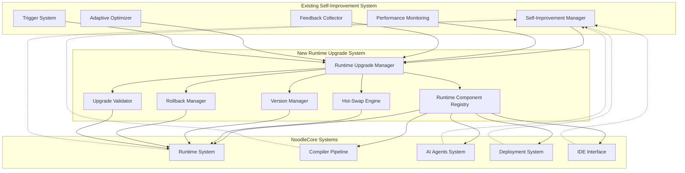
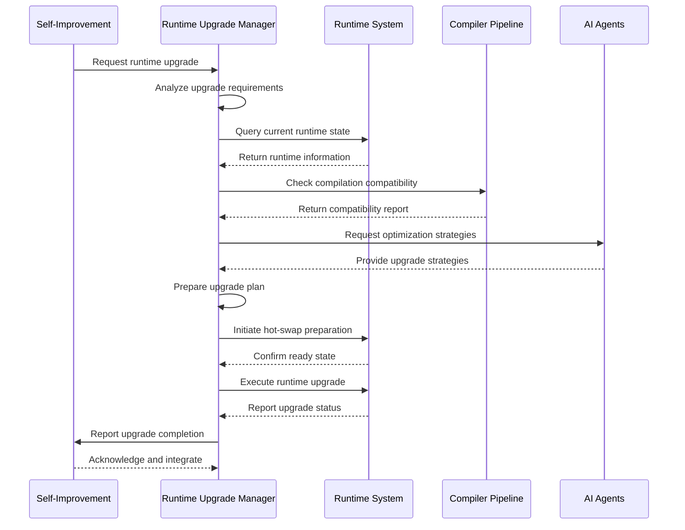

# NoodleCore Runtime Upgrade Integration Plan

## Executive Summary

This document outlines a comprehensive architectural design for extending the NoodleCore self-improvement system to handle runtime upgrades. The design leverages the existing self-improvement infrastructure while adding sophisticated runtime upgrade capabilities with hot-swapping, intelligent rollback, and seamless integration with current NoodleCore systems.

## 1. Architecture Overview

### High-Level Design

The runtime upgrade system integrates with the existing self-improvement system as a specialized subsystem that extends the current capabilities with runtime-specific upgrade functionality. The architecture maintains compatibility with existing NoodleCore conventions while providing advanced runtime upgrade capabilities.

### System Components Integration



### Data Flow Architecture



## 2. Component Design

### New Components for Runtime Upgrade Capabilities

#### 2.1 Runtime Upgrade Manager (RUM)

**Location**: `noodle-core/src/noodlecore/self_improvement/runtime_upgrade_manager.py`

**Purpose**: Central coordination for all runtime upgrade operations, integrating with the existing self-improvement system.

**Key Classes**:

- `RuntimeUpgradeManager`: Main coordinator class
- `UpgradeRequest`: Data structure for upgrade requests
- `UpgradePlan`: Structured plan for upgrade execution
- `UpgradeResult`: Results and metrics from upgrade operations

**Key Methods**:

- `request_upgrade(component_name, target_version, strategy)`: Initiate upgrade process
- `analyze_upgrade_feasibility(component, version)`: Assess upgrade viability
- `execute_upgrade_plan(plan)`: Execute prepared upgrade plan
- `validate_upgrade_integrity(result)`: Verify upgrade success

#### 2.2 Runtime Component Registry (RC)

**Location**: `noodle-core/src/noodlecore/self_improvement/runtime_component_registry.py`

**Purpose**: Registry and discovery of runtime components available for upgrade.

**Key Classes**:

- `RuntimeComponentRegistry`: Registry of upgradeable components
- `ComponentDescriptor`: Metadata for runtime components
- `ComponentDependency`: Dependency management for components

**Key Methods**:

- `register_component(descriptor)`: Add new component to registry
- `discover_components()`: Find available upgradeable components
- `resolve_dependencies(component)`: Analyze component dependencies
- `get_upgrade_path(component, from_version, to_version)`: Calculate upgrade path

#### 2.3 Hot-Swap Engine (HS)

**Location**: `noodle-core/src/noodlecore/self_improvement/hot_swap_engine.py`

**Purpose**: Enable hot-swapping of runtime components without system restart.

**Key Classes**:

- `HotSwapEngine`: Core hot-swapping functionality
- `SwapOperation`: Atomic swap operation definition
- `SwapContext`: Context for swap operations
- `ComponentSnapshot`: State snapshot for rollback

**Key Methods**:

- `prepare_swap(component, new_version)`: Prepare component for hot-swapping
- `execute_swap(operation)`: Execute atomic component swap
- `validate_swap_integrity()`: Verify swap success
- `create_snapshot(component)`: Create state snapshot

#### 2.4 Version Manager (VM)

**Location**: `noodle-core/src/noodlecore/self_improvement/version_manager.py`

**Purpose**: Manage versioning and compatibility of runtime components.

**Key Classes**:

- `VersionManager`: Version tracking and compatibility
- `SemanticVersion`: Semantic version operations
- `CompatibilityMatrix`: Version compatibility tracking
- `VersionConstraint`: Version constraint definitions

**Key Methods**:

- `parse_version(version_string)`: Parse version strings
- `check_compatibility(v1, v2)`: Check version compatibility
- `get_upgrade_path(current, target)`: Calculate upgrade path
- `validate_constraints(version, constraints)`: Validate version constraints

#### 2.5 Rollback Manager (RB)

**Location**: `noodle-core/src/noodlecore/self_improvement/rollback_manager.py`

**Purpose**: Intelligent rollback capabilities for failed upgrades.

**Key Classes**:

- `RollbackManager`: Rollback coordination
- `RollbackPlan`: Structured rollback plan
- `RollbackPoint`: Saved rollback state
- `RollbackStrategy`: Strategy for rollback execution

**Key Methods**:

- `create_rollback_point(upgrade_result)`: Create rollback point before upgrade
- `execute_rollback(rollback_point)`: Execute rollback operation
- `validate_rollback_integrity()`: Verify rollback success
- `cleanup_rollback_data(point)`: Cleanup rollback data

#### 2.6 Upgrade Validator (UV)

**Location**: `noodle-core/src/noodlecore/self_improvement/upgrade_validator.py`

**Purpose**: Comprehensive validation of runtime upgrades.

**Key Classes**:

- `UpgradeValidator`: Validation coordination
- `ValidationRule`: Specific validation rule
- `ValidationResult`: Rule validation result
- `ValidationSuite`: Collection of validation rules

**Key Methods**:

- `validate_upgrade_plan(plan)`: Validate upgrade plan
- `validate_component_compatibility(component, version)`: Check component compatibility
- `validate_system_constraints(upgrade)`: Check system-level constraints
- `generate_validation_report(results)`: Create validation report

### Extensions to Existing Self-Improvement Components

#### 2.7 Self-Improvement Manager Extensions

**Modifications to `SelfImprovementManager`**:

- Add runtime upgrade coordination
- Integrate with existing adaptive optimizer
- Extend performance monitoring for upgrade metrics
- Add upgrade-specific safety monitoring

**New Integration Points**:

- `RuntimeUpgradeManager` as specialized optimizer
- Upgrade metrics in performance monitoring
- Upgrade triggers in trigger system
- Upgrade recommendations in feedback system

#### 2.8 Adaptive Optimizer Extensions

**Modifications to `AdaptiveOptimizer`**:

- Add runtime-specific optimization strategies
- Integrate with hot-swap engine
- Add upgrade path optimization
- Extend component state management

**New Optimization Strategies**:

- `RUNTIME_UPGRADE_STRATEGY`: Optimize runtime upgrade paths
- `HOT_SWAP_OPTIMIZATION`: Optimize hot-swap operations
- `VERSION_TRANSITION_STRATEGY`: Optimize version transitions

#### 2.9 Performance Monitoring Extensions

**Modifications to `PerformanceMonitoringSystem`**:

- Add runtime upgrade performance tracking
- Monitor hot-swap operation metrics
- Track rollback performance
- Monitor upgrade success rates

**New Metrics**:

- Runtime upgrade execution time
- Hot-swap operation duration
- Rollback success rate
- Component version tracking

## 3. Implementation Strategy

### 3.1 Phased Approach

**Phase 1: Foundation (Week 1-2)**

- Implement core runtime upgrade manager
- Create component registry system
- Develop basic hot-swap engine
- Establish version management

**Phase 2: Integration (Week 3-4)**

- Integrate with existing self-improvement system
- Connect with compiler pipeline
- Link with AI agents system
- Implement safety mechanisms

**Phase 3: Advanced Features (Week 5-6)**

- Advanced hot-swapping capabilities
- Intelligent rollback mechanisms
- Comprehensive validation system
- Performance optimization

**Phase 4: Testing & Refinement (Week 7-8)**

- Comprehensive testing suite
- Performance optimization
- Documentation completion
- Production deployment

### 3.2 Priority Order

1. **Runtime Upgrade Manager**: Central coordination component
2. **Component Registry**: Discovery and management
3. **Version Manager**: Version compatibility
4. **Hot-Swap Engine**: Core upgrade mechanism
5. **Rollback Manager**: Safety and recovery
6. **Upgrade Validator**: Quality assurance
7. **Self-Improvement Integration**: System integration
8. **Performance Monitoring Extensions**: Metrics and tracking
9. **Compiler Pipeline Integration**: Build system integration
10. **AI Agents Integration**: Intelligence integration

### 3.3 Risk Mitigation Strategies

**Technical Risks**:

- Component incompatibility during upgrade
- Hot-swap operation failures
- Performance degradation during upgrades
- Rollback operation failures

**Mitigation Approaches**:

- Comprehensive pre-upgrade validation
- Atomic upgrade operations with rollback capability
- Performance monitoring during upgrades
- Gradual rollout with quick rollback
- Extensive testing in isolated environment
- Backup and snapshot mechanisms

## 4. Technical Specifications

### 4.1 Key Classes and Interfaces

#### RuntimeUpgradeManager

```python
class RuntimeUpgradeManager:
    """Main coordinator for runtime upgrade operations."""
    
    def __init__(self, self_improvement_manager: SelfImprovementManager):
        """Initialize runtime upgrade manager."""
        self.self_improvement_manager = self_improvement_manager
        self.component_registry = RuntimeComponentRegistry()
        self.hot_swap_engine = HotSwapEngine()
        self.version_manager = VersionManager()
        self.rollback_manager = RollbackManager()
        self.upgrade_validator = UpgradeValidator()
    
    async def request_upgrade(self, 
                         component_name: str, 
                         target_version: str, 
                         strategy: UpgradeStrategy = UpgradeStrategy.GRADUAL) -> UpgradeResult:
        """Request and execute runtime upgrade."""
        pass
    
    def analyze_upgrade_feasibility(self, 
                                 component: str, 
                                 target_version: str) -> FeasibilityResult:
        """Analyze if upgrade is feasible."""
        pass
```

#### HotSwapEngine

```python
class HotSwapEngine:
    """Engine for hot-swapping runtime components."""
    
    def prepare_swap(self, component: str, new_version: str) -> SwapContext:
        """Prepare component for hot-swapping."""
        pass
    
    async def execute_swap(self, swap_context: SwapContext) -> SwapResult:
        """Execute atomic component swap."""
        pass
    
    def validate_swap_integrity(self, swap_result: SwapResult) -> bool:
        """Validate swap operation integrity."""
        pass
```

#### RuntimeComponentRegistry

```python
class RuntimeComponentRegistry:
    """Registry for runtime components available for upgrade."""
    
    def register_component(self, descriptor: ComponentDescriptor) -> bool:
        """Register a runtime component."""
        pass
    
    def discover_components(self) -> List[ComponentDescriptor]:
        """Discover available upgradeable components."""
        pass
    
    def get_upgrade_path(self, component: str, from_version: str, to_version: str) -> UpgradePath:
        """Calculate upgrade path for component."""
        pass
```

### 4.2 Configuration Requirements

#### Environment Variables

```bash
NOODLE_RUNTIME_UPGRADE_ENABLED=1          # Enable runtime upgrades
NOODLE_HOT_SWAP_ENABLED=1               # Enable hot-swapping
NOODLE_UPGRADE_TIMEOUT=300                # Upgrade timeout in seconds
NOODLE_ROLLBACK_ENABLED=1                # Enable rollback capability
NOODLE_UPGRADE_VALIDATION_LEVEL=strict   # Validation level (strict, normal, permissive)
NOODLE_GRADUAL_ROLLOUT_PERCENTAGE=10  # Gradual rollout percentage
```

#### Configuration Structure

```json
{
  "runtime_upgrade": {
    "enabled": true,
    "hot_swap": {
      "enabled": true,
      "max_concurrent_swaps": 3,
      "swap_timeout": 30
    },
    "rollback": {
      "enabled": true,
      "max_rollback_points": 10,
      "rollback_retention_days": 30
    },
    "validation": {
      "level": "strict",
      "pre_upgrade_checks": true,
      "post_upgrade_validation": true
    },
    "components": {
      "registry_path": "runtime_components",
      "auto_discovery": true,
      "dependency_resolution": true
    }
  }
}
```

### 4.3 Data Structures and Models

#### UpgradeRequest

```python
@dataclass
class UpgradeRequest:
    """Runtime upgrade request."""
    request_id: str
    component_name: str
    current_version: str
    target_version: str
    strategy: UpgradeStrategy
    parameters: Dict[str, Any]
    constraints: List[str]
    metadata: Dict[str, Any]
```

#### UpgradeResult

```python
@dataclass
class UpgradeResult:
    """Result of runtime upgrade operation."""
    request_id: str
    success: bool
    component_name: str
    from_version: str
    to_version: str
    execution_time: float
    operations: List[UpgradeOperation]
    rollback_point: Optional[RollbackPoint]
    metrics: Dict[str, Any]
    error_message: Optional[str]
```

#### ComponentDescriptor

```python
@dataclass
class ComponentDescriptor:
    """Descriptor for runtime component."""
    name: str
    version: str
    description: str
    dependencies: List[str]
    upgrade_path: List[str]
    hot_swappable: bool
    compatibility_matrix: Dict[str, List[str]]
    metadata: Dict[str, Any]
```

## 5. Integration with Existing Systems

### 5.1 Enhanced Runtime System Integration

**Integration Points**:

- Component discovery and registration
- Hot-swap operation coordination
- Performance monitoring integration
- Version management integration

**Integration Methods**:

```python
# In ModernRuntime class
def integrate_runtime_upgrades(self):
    """Integrate runtime upgrade capabilities."""
    self.upgrade_manager = RuntimeUpgradeManager(self)
    self.upgrade_manager.initialize()
    
def prepare_for_upgrade(self, component_name: str):
    """Prepare runtime component for upgrade."""
    return self.upgrade_manager.prepare_upgrade(component_name)
```

### 5.2 Compiler Pipeline Integration

**Integration Points**:

- Compilation compatibility checking
- Bytecode upgrade coordination
- Build system integration

**Integration Methods**:

```python
# In CompilerPipeline class
def validate_runtime_compatibility(self, component_name: str, target_version: str) -> bool:
    """Validate runtime component compatibility."""
    return self.runtime_upgrader.check_compatibility(component_name, target_version)

def upgrade_runtime_bytecode(self, bytecode: bytes, target_version: str) -> bytes:
    """Upgrade runtime bytecode to target version."""
    return self.runtime_upgrader.upgrade_bytecode(bytecode, target_version)
```

### 5.3 AI Agents System Integration

**Integration Points**:

- Upgrade strategy optimization
- Component analysis and recommendation
- Learning from upgrade operations

**Integration Methods**:

```python
# In existing AI agent coordination
def analyze_upgrade_opportunities(self, system_state: Dict[str, Any]) -> List[UpgradeRecommendation]:
    """Analyze system for upgrade opportunities."""
    return self.ai_agents.analyze_for_upgrades(system_state)

def learn_from_upgrade(self, upgrade_result: UpgradeResult):
    """Learn from upgrade operation results."""
    return self.ai_agents.learn_upgrade_result(upgrade_result)
```

### 5.4 Deployment System Integration

**Integration Points**:

- Gradual rollout coordination
- Upgrade deployment management
- Rollback deployment coordination

**Integration Methods**:

```python
# In UnifiedDeploymentManager class
async def deploy_runtime_upgrade(self, upgrade_request: UpgradeRequest) -> DeploymentResponse:
    """Deploy runtime upgrade using deployment system."""
    return await self.deployment_system.deploy_upgrade(upgrade_request)

async def rollback_runtime_upgrade(self, rollback_request: RollbackRequest) -> DeploymentResponse:
    """Rollback runtime upgrade using deployment system."""
    return await self.deployment_system.rollback_upgrade(rollback_request)
```

## 6. Safety and Reliability Measures

### 6.1 Rollback Mechanisms

**Automatic Rollback Triggers**:

- Performance degradation beyond threshold
- Error rate exceeding limits
- Component incompatibility detected
- User manual rollback request

**Rollback Process**:

1. Detect rollback condition
2. Create rollback plan
3. Execute rollback operations
4. Validate rollback success
5. Update system state

### 6.2 Validation Procedures

**Pre-Upgrade Validation**:

- Component compatibility checking
- System resource verification
- Dependency resolution validation
- Performance impact assessment

**Post-Upgrade Validation**:

- Component functionality verification
- Performance benchmarking
- Integration testing
- Stability monitoring

### 6.3 Error Handling Strategies

**Error Categories**:

- Compatibility errors
- Hot-swap failures
- Version conflicts
- Resource constraints
- Network failures

**Handling Approaches**:

- Immediate rollback on critical errors
- Retry mechanisms for transient failures
- Graceful degradation for non-critical errors
- Comprehensive error reporting and logging

## 7. Implementation Roadmap

### 7.1 Development Phases

**Phase 1: Core Infrastructure (Weeks 1-2)**

- Implement RuntimeUpgradeManager
- Create RuntimeComponentRegistry
- Develop VersionManager
- Basic HotSwapEngine

**Phase 2: Integration Layer (Weeks 3-4)**

- Integrate with SelfImprovementManager
- Connect with existing systems
- Implement safety mechanisms
- Add validation framework

**Phase 3: Advanced Features (Weeks 5-6)**

- Advanced hot-swapping capabilities
- Intelligent rollback mechanisms
- Performance optimization
- Comprehensive testing

**Phase 4: Production Readiness (Weeks 7-8)**

- Performance testing and optimization
- Documentation completion
- Security review
- Production deployment

### 7.2 Testing Strategy

**Unit Testing**:

- Component-specific tests
- Integration tests
- Performance benchmarks
- Error injection tests

**Integration Testing**:

- End-to-end upgrade flows
- System compatibility tests
- Performance impact tests
- Rollback procedure tests

**Performance Testing**:

- Hot-swap operation timing
- Upgrade performance benchmarks
- System stability under load
- Resource usage monitoring

## 8. Conclusion

This comprehensive integration plan extends the NoodleCore self-improvement system with sophisticated runtime upgrade capabilities while maintaining compatibility with existing architecture. The design provides:

- **Hot-swapping capabilities** for zero-downtime upgrades
- **Intelligent rollback mechanisms** for reliable recovery
- **Comprehensive validation** for upgrade safety
- **Seamless integration** with existing NoodleCore systems
- **Phased implementation** for manageable development
- **Robust error handling** for production reliability

The architecture leverages existing NoodleCore conventions and infrastructure while adding advanced runtime upgrade functionality that enables the system to evolve and improve continuously with minimal disruption.
