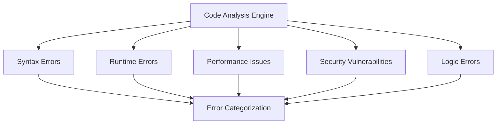

# AI-Driven Error Resolution for Self-Improvement System

## Overview

This document outlines the enhanced error handling and resolution mechanisms for the NoodleCore Self-Improvement system, leveraging external AI providers to automatically detect, analyze, and resolve code errors.

## Current Limitations

The current self-improvement system has limited error resolution capabilities:

1. **Basic Error Detection**: Only detects performance issues (CPU/memory thresholds)
2. **Manual Resolution Required**: Users must manually approve/reject improvements
3. **No Code Analysis**: Lacks syntax error detection and automated fixing
4. **Limited AI Integration**: External AI not fully utilized for error resolution

## Enhanced Error Resolution Architecture

### 1. Error Detection Layer



#### Error Types

- **Syntax Errors**: Missing imports, typos, invalid syntax
- **Runtime Errors**: Exceptions during execution, null references
- **Performance Issues**: Memory leaks, inefficient algorithms, slow operations
- **Security Vulnerabilities**: SQL injection risks, hardcoded credentials
- **Logic Errors**: Incorrect conditionals, infinite loops, off-by-one errors

### 2. AI-Driven Analysis Pipeline

```python
# filepath: noodle-core/src/noodlecore/desktop/ide/ai_error_analyzer.py
class AIErrorAnalyzer:
    def __init__(self, ai_provider, role_manager):
        self.ai_provider = ai_provider
        self.role_manager = role_manager
    
    async def analyze_code_errors(self, file_path, content):
        """Analyze code for errors using AI."""
        # Get appropriate AI role for error analysis
        error_analyzer_role = self.role_manager.get_role_by_name("Code Analyzer")
        
        messages = [
            {
                "role": "system",
                "content": error_analyzer_role.system_prompt
            },
            {
                "role": "user", 
                "content": f"Analyze this code for errors:\n\n{content}\n\nIdentify syntax errors, runtime issues, performance problems, and security vulnerabilities."
            }
        ]
        
        response = await self.ai_provider.chat_completion(messages)
        return self._parse_error_response(response)
    
    def _parse_error_response(self, ai_response):
        """Parse AI response into structured error data."""
        # Extract specific errors with line numbers and suggested fixes
        pass
```

### 3. Automated Resolution Engine

```python
# filepath: noodle-core/src/noodlecore/desktop/ide/ai_error_resolver.py
class AIErrorResolver:
    def __init__(self, ai_provider, code_editor):
        self.ai_provider = ai_provider
        self.code_editor = code_editor
    
    async def resolve_error(self, error_data):
        """Automatically resolve detected errors."""
        resolution_role = self.role_manager.get_role_by_name("Code Fixer")
        
        messages = [
            {
                "role": "system",
                "content": resolution_role.system_prompt
            },
            {
                "role": "user",
                "content": f"Fix this error: {error_data['description']}\n\nFile: {error_data['file_path']}\nLine: {error_data['line_number']}\n\nProvide corrected code with explanation."
            }
        ]
        
        response = await self.ai_provider.chat_completion(messages)
        return self._apply_resolution(response, error_data)
    
    def _apply_resolution(self, ai_response, error_data):
        """Apply AI-suggested fix to code."""
        fixed_code = self._extract_fix_from_response(ai_response)
        
        # Create backup before applying changes
        self._create_backup(error_data['file_path'])
        
        # Apply fix with validation
        if self._validate_fix(fixed_code):
            self.code_editor.apply_change(error_data['file_path'], fixed_code)
            return True
        return False
```

### 4. Integration with Self-Improvement System

```python
# filepath: noodle-core/src/noodlecore/desktop/ide/enhanced_self_improvement_integration.py
class EnhancedSelfImprovementIntegration(SelfImprovementIntegration):
    def __init__(self, ide_instance=None):
        super().__init__(ide_instance)
        self.error_analyzer = AIErrorAnalyzer(self.ai_provider, self.role_manager)
        self.error_resolver = AIErrorResolver(self.ai_provider, ide_instance)
    
    async def _check_for_errors(self):
        """Enhanced error checking with AI analysis."""
        current_file = self.ide_instance.current_file
        
        if not current_file:
            return
        
        try:
            content = self.ide_instance.get_file_content(current_file)
            errors = await self.error_analyzer.analyze_code_errors(current_file, content)
            
            for error in errors:
                # Auto-resolve critical errors based on confidence
                if error['severity'] == 'critical' and error['confidence'] > 0.8:
                    success = await self.error_resolver.resolve_error(error)
                    if success:
                        self._log_resolution(error, 'auto_resolved')
                    else:
                        self._create_improvement_suggestion(error)
                else:
                    self._create_improvement_suggestion(error)
        
        except Exception as e:
            logger.error(f"Error in enhanced error checking: {e}")
```

## Implementation Requirements

### 1. Configuration Enhancements

```json
{
    "error_resolution": {
        "auto_fix_critical": true,
        "confidence_threshold": 0.8,
        "max_auto_fixes_per_session": 5,
        "require_user_approval": false,
        "create_backups": true,
        "validate_fixes": true
    },
    "error_categories": {
        "syntax": {"enabled": true, "auto_fix": true},
        "runtime": {"enabled": true, "auto_fix": false},
        "performance": {"enabled": true, "auto_fix": true},
        "security": {"enabled": true, "auto_fix": false},
        "logic": {"enabled": true, "auto_fix": false}
    }
}
```

### 2. AI Role Requirements

**Code Analyzer Role**:

- Expert in static code analysis
- Knowledge of common Python/NoodleCore patterns
- Ability to identify security vulnerabilities
- Proficiency in performance optimization

**Code Fixer Role**:

- Expert in code correction and debugging
- Knowledge of best practices and design patterns
- Ability to explain complex fixes
- Proficiency in multiple programming languages

### 3. Integration Points

1. **IDE Integration**: Hook into existing code editor for real-time analysis
2. **AI Provider Integration**: Use existing OpenAI/OpenRouter/LM Studio connections
3. **Self-Improvement Integration**: Feed error resolutions into improvement cycle
4. **Backup System**: Automatic backups before applying fixes
5. **Validation System**: Verify fixes don't break functionality

## Benefits

1. **Proactive Error Detection**: Catch errors before they cause issues
2. **Automated Resolution**: Fix common errors without user intervention
3. **Learning Capability**: Improve error detection over time
4. **Reduced Manual Work**: Developers spend less time on debugging
5. **Code Quality**: Consistent application of best practices

## Implementation Steps

1. Create AI error analyzer module
2. Create AI error resolver module  
3. Enhance self-improvement integration
4. Update configuration schema
5. Add UI controls for error resolution settings
6. Implement backup and validation systems
7. Add comprehensive error logging
8. Create tests for error resolution functionality

## Success Metrics

- Error detection accuracy
- Resolution success rate
- Time to detection and resolution
- User satisfaction with automated fixes
- Reduction in manual debugging time
