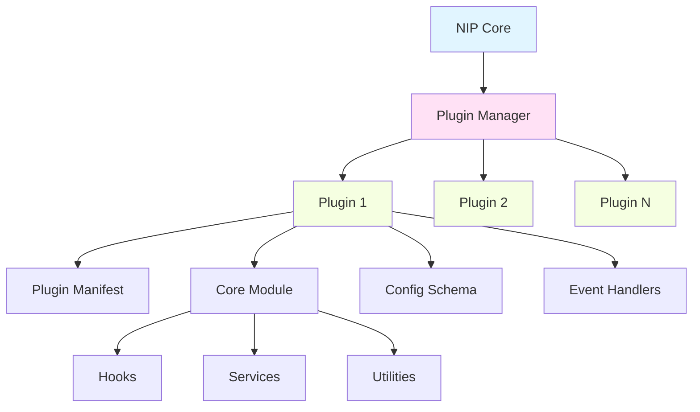
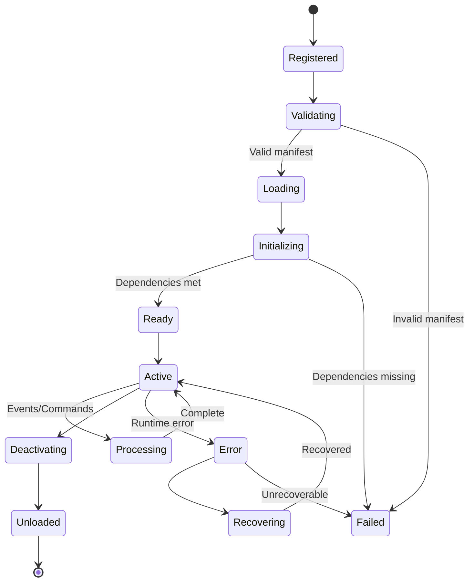
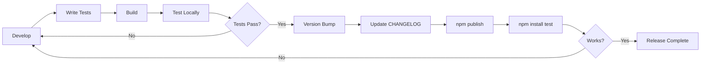

# 🧩 Tutorial 01: Custom Plugins & Extensions for NIP v3.0.0

## Overview

This tutorial teaches you how to create, test, and publish custom plugins for the Noodle Integration Platform (NIP) v3.0.0. Plugins extend NIP's core functionality by adding new integrations, data processors, or custom workflows.

## Learning Objectives

By the end of this tutorial, you will be able to:

- Understand NIP's plugin architecture and lifecycle
- Create a fully functional plugin from scratch using TypeScript
- Implement advanced features like configuration, event handling, and dependencies
- Write comprehensive tests for your plugins
- Publish and distribute plugins to the NIP community

**Estimated Time:** 30-45 minutes

## Prerequisites

Before starting this tutorial, ensure you have:

- Node.js 18+ and npm installed
- Basic knowledge of TypeScript
- NIP v3.0.0 installed (`npm install -g @noodle/cli`)
- A code editor (VS Code recommended)
- Git for version control

Verify your installation:

```bash
nip --version
# Expected output: 3.0.0
```

---

## Part 1: Understanding Plugin Architecture

### What is a NIP Plugin?

A NIP plugin is a self-contained module that extends the platform's capabilities. Plugins can:

- Integrate with third-party APIs and services
- Transform and process data
- Add custom commands and workflows
- Provide new authentication methods
- Extend the NIP CLI with new commands

### Plugin Architecture

NIP plugins follow a modular architecture with clear separation of concerns:



### Plugin Lifecycle

Understanding the plugin lifecycle is crucial for building robust plugins:



### Plugin Manifest

Every plugin requires a `nip.yaml` manifest file:

```yaml
name: my-first-plugin
version: 1.0.0
description: A sample plugin for NIP v3.0.0
author: Your Name <you@example.com>
license: MIT

# Core plugin settings
main: dist/index.js
types: dist/index.d.ts

# Minimum NIP version required
nipVersion: ">=3.0.0"

# Plugin dependencies
dependencies:
  - name: @noodle/core
    version: ">=3.0.0"

# Configuration schema
config:
  apiKey:
    type: string
    required: true
    description: API key for external service
  timeout:
    type: number
    default: 5000
    description: Request timeout in milliseconds

# Event hooks
hooks:
  onInit: initializePlugin
  onConfigChange: handleConfigChange
  onShutdown: cleanupPlugin

# Commands provided by this plugin
commands:
  - name: my-command
    description: Execute my custom command
    handler: executeCommand
    options:
      - name: verbose
        alias: v
        type: boolean
        description: Enable verbose output
```

---

## Part 2: Creating Your First Plugin

### Step 1: Initialize the Plugin Project

Create a new directory and initialize the project:

```bash
mkdir nip-my-first-plugin
cd nip-my-first-plugin

# Initialize npm project
npm init -y

# Install dependencies
npm install --save-dev typescript @types/node
npm install --save @noodle/core

# Initialize TypeScript
npx tsc --init
```

### Step 2: Configure TypeScript

Update `tsconfig.json`:

```json
{
  "compilerOptions": {
    "target": "ES2022",
    "module": "ESNext",
    "lib": ["ES2022"],
    "moduleResolution": "node",
    "outDir": "./dist",
    "rootDir": "./src",
    "declaration": true,
    "declarationMap": true,
    "sourceMap": true,
    "strict": true,
    "esModuleInterop": true,
    "skipLibCheck": true,
    "forceConsistentCasingInFileNames": true
  },
  "include": ["src/**/*"],
  "exclude": ["node_modules", "dist"]
}
```

### Step 3: Create the Plugin Manifest

Create `nip.yaml`:

```yaml
name: my-first-plugin
version: 1.0.0
description: My first NIP plugin - demonstrates core concepts
author: Your Name <you@example.com>
license: MIT

main: dist/index.js
types: dist/index.d.ts

nipVersion: ">=3.0.0"

dependencies:
  - name: @noodle/core
    version: ">=3.0.0"

config:
  greeting:
    type: string
    default: "Hello"
    description: Default greeting message
  maxRetries:
    type: number
    default: 3
    description: Maximum number of retry attempts

hooks:
  onInit: initializePlugin
  onShutdown: cleanupPlugin

commands:
  - name: greet
    description: Greet the user
    handler: greetCommand
    options:
      - name: name
        type: string
        required: true
        description: Name to greet
      - name: enthusiastic
        alias: e
        type: boolean
        description: Add enthusiasm to the greeting
```

### Step 4: Create the Plugin Entry Point

Create `src/index.ts`:

```typescript
import { Plugin, PluginContext, CommandHandler, HookHandler } from '@noodle/core';

// Plugin state
let pluginContext: PluginContext | null = null;
let config: any = null;

/**
 * Initialize the plugin
 */
export const initializePlugin: HookHandler = async (context: PluginContext) => {
  pluginContext = context;
  config = context.config;
  
  context.logger.info('My First Plugin initialized!');
  context.logger.info(`Configuration: ${JSON.stringify(config)}`);
};

/**
 * Cleanup on shutdown
 */
export const cleanupPlugin: HookHandler = async (context: PluginContext) => {
  context.logger.info('My First Plugin is shutting down...');
  
  // Cleanup resources
  pluginContext = null;
  config = null;
};

/**
 * Greet command handler
 */
export const greetCommand: CommandHandler = async (args, context) => {
  const name = args.name as string;
  const enthusiastic = args.enthusiastic as boolean || false;
  
  const greeting = config?.greeting || 'Hello';
  let message = `${greeting}, ${name}!`;
  
  if (enthusiastic) {
    message += ' 🎉 Welcome to NIP!';
  }
  
  context.logger.info(`Greeting sent to: ${name}`);
  
  return {
    success: true,
    data: {
      message,
      timestamp: new Date().toISOString()
    }
  };
};

// Export plugin metadata
export const plugin: Plugin = {
  name: 'my-first-plugin',
  version: '1.0.0',
  initialize: initializePlugin,
  shutdown: cleanupPlugin
};

export default plugin;
```

### Step 5: Build and Test

Add build scripts to `package.json`:

```json
{
  "scripts": {
    "build": "tsc",
    "dev": "tsc --watch",
    "test": "nip test",
    "prepublishOnly": "npm run build"
  }
}
```

Build the plugin:

```bash
npm run build
```

The compiled output will be in the `dist/` directory.

---

## Part 3: Advanced Plugin Features

### Configuration Management

Plugins often need complex configuration. Here's how to handle it properly:

```typescript
import { z } from 'zod';

// Define configuration schema
const ConfigSchema = z.object({
  apiKey: z.string().min(1),
  apiEndpoint: z.string().url(),
  timeout: z.number().min(100).max(60000).default(5000),
  retries: z.number().min(0).max(10).default(3),
  cacheEnabled: z.boolean().default(true),
  cacheTTL: z.number().default(3600),
});

export type PluginConfig = z.infer<typeof ConfigSchema>;

/**
 * Validate configuration on plugin initialization
 */
export const initializePlugin: HookHandler = async (context: PluginContext) => {
  try {
    // Validate configuration against schema
    const validatedConfig = ConfigSchema.parse(context.config);
    
    context.logger.info('Configuration validated successfully');
    context.logger.debug(`API Endpoint: ${validatedConfig.apiEndpoint}`);
    
    // Store validated config
    context.state.set('config', validatedConfig);
    
  } catch (error) {
    if (error instanceof z.ZodError) {
      context.logger.error('Configuration validation failed:');
      error.errors.forEach(err => {
        context.logger.error(`  - ${err.path.join('.')}: ${err.message}`);
      });
    }
    throw error;
  }
};
```

### Event Handling

Plugins can listen to and emit events:

```typescript
import { EventBus } from '@noodle/core';

/**
 * Setup event listeners
 */
export const initializePlugin: HookHandler = async (context: PluginContext) => {
  const eventBus = context.events;
  
  // Listen to system events
  eventBus.on('nip.config.changed', async (newConfig) => {
    context.logger.info('Configuration changed, reloading...');
    await reloadConfiguration(context, newConfig);
  });
  
  eventBus.on('nip.user.authenticated', async (user) => {
    context.logger.info(`User authenticated: ${user.id}`);
    await handleUserLogin(context, user);
  });
  
  // Listen to custom plugin events
  eventBus.on('my-plugin.data.received', async (data) => {
    await processData(context, data);
  });
  
  // Emit custom events
  eventBus.emit('my-plugin.ready', {
    timestamp: Date.now(),
    version: '1.0.0'
  });
};

/**
 * Handle configuration changes dynamically
 */
async function reloadConfiguration(context: PluginContext, newConfig: any) {
  try {
    const validatedConfig = ConfigSchema.parse(newConfig);
    context.state.set('config', validatedConfig);
    context.logger.info('Configuration reloaded successfully');
  } catch (error) {
    context.logger.error('Failed to reload configuration:', error);
  }
}
```

### Error Handling

Implement robust error handling:

```typescript
import { PluginError, ErrorCode } from '@noodle/core';

/**
 * Custom error types
 */
export class AuthenticationError extends PluginError {
  constructor(message: string, details?: any) {
    super(ErrorCode.AUTHENTICATION_FAILED, message, details);
    this.name = 'AuthenticationError';
  }
}

export class RateLimitError extends PluginError {
  constructor(message: string, retryAfter?: number) {
    super(ErrorCode.RATE_LIMIT_EXCEEDED, message, { retryAfter });
    this.name = 'RateLimitError';
  }
}

/**
 * Error handling wrapper
 */
export async function withErrorHandling<T>(
  context: PluginContext,
  operation: string,
  fn: () => Promise<T>
): Promise<T> {
  try {
    return await fn();
  } catch (error) {
    context.logger.error(`Error during ${operation}:`, error);
    
    if (error instanceof PluginError) {
      throw error;
    }
    
    // Wrap unknown errors
    throw new PluginError(
      ErrorCode.UNKNOWN_ERROR,
      `Unexpected error during ${operation}`,
      { originalError: error }
    );
  }
}

/**
 * Usage example
 */
export const executeCommand: CommandHandler = async (args, context) => {
  return withErrorHandling(context, 'execute command', async () => {
    const config = context.state.get('config') as PluginConfig;
    
    if (!config.apiKey) {
      throw new AuthenticationError('API key is missing');
    }
    
    // Perform operation
    const result = await fetchData(config);
    
    return {
      success: true,
      data: result
    };
  });
};
```

### Dependency Management

Handle plugin dependencies:

```typescript
/**
 * Check dependencies on initialization
 */
export const initializePlugin: HookHandler = async (context: PluginContext) => {
  const requiredPlugins = ['@noodle/database', '@noodle/cache'];
  
  for (const pluginName of requiredPlugins) {
    if (!context.hasPlugin(pluginName)) {
      throw new PluginError(
        ErrorCode.DEPENDENCY_MISSING,
        `Required plugin "${pluginName}" is not installed`,
        { requiredPlugin: pluginName }
      );
    }
  }
  
  // Access dependent plugins
  const database = context.getPlugin('@noodle/database');
  const cache = context.getPlugin('@noodle/cache');
  
  context.state.set('database', database);
  context.state.set('cache', cache);
  
  context.logger.info('All dependencies resolved');
};
```

---

## Part 4: Testing Plugins

### Unit Testing with Jest

Install testing dependencies:

```bash
npm install --save-dev jest @types/jest ts-jest @noodle/testing
```

Create `jest.config.js`:

```javascript
module.exports = {
  preset: 'ts-jest',
  testEnvironment: 'node',
  roots: ['<rootDir>/src'],
  testMatch: ['**/__tests__/**/*.ts', '**/?(*.)+(spec|test).ts'],
  collectCoverageFrom: [
    'src/**/*.ts',
    '!src/**/*.d.ts',
    '!src/**/__tests__/**'
  ]
};
```

Create test file `src/__tests__/plugin.test.ts`:

```typescript
import { PluginContext, createMockContext } from '@noodle/testing';
import { initializePlugin, greetCommand, cleanupPlugin } from '../index';

describe('My First Plugin', () => {
  let context: PluginContext;
  
  beforeEach(() => {
    // Create mock context
    context = createMockContext({
      config: {
        greeting: 'Hello',
        maxRetries: 3
      }
    });
  });
  
  afterEach(async () => {
    if (context) {
      await cleanupPlugin(context);
    }
  });
  
  describe('initializePlugin', () => {
    it('should initialize successfully with valid config', async () => {
      await expect(initializePlugin(context)).resolves.not.toThrow();
      expect(context.logger.info).toHaveBeenCalledWith(
        expect.stringContaining('initialized')
      );
    });
    
    it('should handle missing config gracefully', async () => {
      const emptyContext = createMockContext({ config: {} });
      await expect(initializePlugin(emptyContext)).resolves.not.toThrow();
    });
  });
  
  describe('greetCommand', () => {
    it('should greet user with provided name', async () => {
      const result = await greetCommand(
        { name: 'Alice' },
        context
      );
      
      expect(result.success).toBe(true);
      expect(result.data.message).toContain('Alice');
    });
    
    it('should add enthusiasm when flag is set', async () => {
      const result = await greetCommand(
        { name: 'Bob', enthusiastic: true },
        context
      );
      
      expect(result.data.message).toContain('🎉');
    });
    
    it('should return error when name is missing', async () => {
      const result = await greetCommand({}, context);
      
      expect(result.success).toBe(false);
      expect(result.error).toBeDefined();
    });
  });
  
  describe('cleanupPlugin', () => {
    it('should cleanup resources on shutdown', async () => {
      await initializePlugin(context);
      await expect(cleanupPlugin(context)).resolves.not.toThrow();
      expect(context.logger.info).toHaveBeenCalledWith(
        expect.stringContaining('shutting down')
      );
    });
  });
});
```

Run tests:

```bash
npm test
```

### Integration Testing

Create integration tests:

```typescript
import { NIP, createTestNIP } from '@noodle/testing';

describe('Plugin Integration Tests', () => {
  let nip: NIP;
  
  beforeAll(async () => {
    nip = await createTestNIP({
      plugins: ['my-first-plugin']
    });
  });
  
  afterAll(async () => {
    await nip.shutdown();
  });
  
  it('should register plugin successfully', () => {
    const plugin = nip.getPlugin('my-first-plugin');
    expect(plugin).toBeDefined();
    expect(plugin.name).toBe('my-first-plugin');
  });
  
  it('should execute plugin command', async () => {
    const result = await nip.executeCommand('greet', {
      name: 'Integration Test'
    });
    
    expect(result.success).toBe(true);
    expect(result.data.message).toContain('Integration Test');
  });
});
```

### Test Coverage

Generate coverage report:

```bash
npm test -- --coverage
```

Aim for >80% code coverage before publishing.

---

## Part 5: Publishing Plugins

### Pre-Publishing Checklist

- [ ] All tests passing
- [ ] Code coverage >80%
- [ ] Documentation complete
- [ ] README.md with examples
- [ ] LICENSE file included
- [ ] CHANGELOG.md maintained
- [ ] Version number updated
- [ ] Security audit passed (`npm audit`)

### Publishing to npm

1. **Build the plugin**:

```bash
npm run build
```

2. **Publish to npm**:

```bash
npm publish --access public
```

3. **Verify installation**:

```bash
npm install -g my-first-plugin
nip plugin list
```

### Creating a Plugin Package Structure

```
my-first-plugin/
├── src/
│   ├── index.ts
│   ├── commands/
│   │   └── greet.ts
│   ├── services/
│   │   └── api.ts
│   └── __tests__/
│       └── plugin.test.ts
├── dist/
│   ├── index.js
│   ├── index.d.ts
│   └── ...
├── package.json
├── tsconfig.json
├── nip.yaml
├── README.md
├── LICENSE
└── CHANGELOG.md
```

### Publishing Workflow



---

## Exercises

### Exercise 1: Add a Configuration Validation Hook

**Task**: Extend the plugin to validate configuration when it changes, not just on initialization.

**Requirements**:
- Add an `onConfigChange` hook to the manifest
- Implement validation logic in a new handler
- Test the validation by changing configuration at runtime

**Hints**:
- Use the `handleConfigChange` function
- Leverage the Zod schema from Part 3
- Emit events when validation fails

---

### Exercise 2: Create a Data Processing Service

**Task**: Create a service that fetches data from an external API and processes it.

**Requirements**:
- Create a new file `src/services/dataProcessor.ts`
- Implement retry logic with exponential backoff
- Cache results using the cache plugin
- Handle rate limiting errors

**Starter Code**:

```typescript
// src/services/dataProcessor.ts
export class DataProcessor {
  async fetchData(url: string): Promise<any> {
    // TODO: Implement with retries and caching
  }
  
  private async retryWithBackoff(fn: () => Promise<any>, maxRetries: number): Promise<any> {
    // TODO: Implement exponential backoff
  }
}
```

---

### Exercise 3: Create a Multi-Step Command

**Task**: Create a command that performs multiple operations and provides progress updates.

**Requirements**:
- Create a command called `process-data`
- Accept a file path as input
- Read the file, transform the data, and output to a new file
- Emit progress events at each step
- Support cancellation

**Manifest Addition**:

```yaml
commands:
  - name: process-data
    description: Process data from a file
    handler: processCommand
    options:
      - name: input
        type: string
        required: true
        description: Input file path
      - name: output
        type: string
        required: true
        description: Output file path
```

---

## Solutions

### Solution 1: Configuration Validation Hook

```yaml
# Add to nip.yaml
hooks:
  onInit: initializePlugin
  onConfigChange: handleConfigChange
  onShutdown: cleanupPlugin
```

```typescript
// Add to src/index.ts
export const handleConfigChange: HookHandler = async (
  newConfig: any,
  context: PluginContext
) => {
  context.logger.info('Configuration change detected, validating...');
  
  try {
    const validatedConfig = ConfigSchema.parse(newConfig);
    context.state.set('config', validatedConfig);
    
    context.logger.info('New configuration validated and applied');
    context.events.emit('my-plugin.config.updated', validatedConfig);
    
  } catch (error) {
    if (error instanceof z.ZodError) {
      context.logger.error('Invalid configuration:');
      error.errors.forEach(err => {
        context.logger.error(`  ${err.path.join('.')}: ${err.message}`);
      });
    }
    
    context.events.emit('my-plugin.config.failed', { error });
    throw new PluginError(
      ErrorCode.CONFIGURATION_INVALID,
      'Configuration validation failed',
      { errors: error.errors }
    );
  }
};
```

---

### Solution 2: Data Processing Service

```typescript
// src/services/dataProcessor.ts
import { PluginContext } from '@noodle/core';

export class DataProcessor {
  constructor(private context: PluginContext) {}
  
  async fetchData(url: string): Promise<any> {
    const cache = this.context.state.get('cache');
    const config = this.context.state.get('config');
    
    // Check cache first
    if (config.cacheEnabled) {
      const cached = await cache.get(url);
      if (cached) {
        this.context.logger.debug('Cache hit for:', url);
        return JSON.parse(cached);
      }
    }
    
    // Fetch with retries
    const data = await this.retryWithBackoff(
      async () => {
        const response = await fetch(url, {
          headers: {
            'Authorization': `Bearer ${config.apiKey}`
          },
          signal: AbortSignal.timeout(config.timeout)
        });
        
        if (response.status === 429) {
          const retryAfter = response.headers.get('Retry-After');
          throw new RateLimitError(
            'Rate limit exceeded',
            retryAfter ? parseInt(retryAfter) : undefined
          );
        }
        
        if (!response.ok) {
          throw new PluginError(
            ErrorCode.API_ERROR,
            `API request failed: ${response.statusText}`
          );
        }
        
        return response.json();
      },
      config.retries
    );
    
    // Cache the result
    if (config.cacheEnabled) {
      await cache.set(url, JSON.stringify(data), {
        ttl: config.cacheTTL
      });
    }
    
    return data;
  }
  
  private async retryWithBackoff<T>(
    fn: () => Promise<T>,
    maxRetries: number
  ): Promise<T> {
    let lastError: Error;
    
    for (let attempt = 0; attempt <= maxRetries; attempt++) {
      try {
        return await fn();
      } catch (error) {
        lastError = error as Error;
        
        // Don't retry on certain errors
        if (error instanceof AuthenticationError) {
          throw error;
        }
        
        if (attempt < maxRetries) {
          const delay = Math.pow(2, attempt) * 1000; // Exponential backoff
          this.context.logger.info(`Retry ${attempt + 1}/${maxRetries} after ${delay}ms`);
          await new Promise(resolve => setTimeout(resolve, delay));
        }
      }
    }
    
    throw lastError!;
  }
}
```

---

### Solution 3: Multi-Step Command

```typescript
// Add to src/index.ts
import { readFile, writeFile } from 'fs/promises';
import { Transform } from 'stream';
import { pipeline } from 'stream/promises';

export const processCommand: CommandHandler = async (args, context) => {
  const inputPath = args.input as string;
  const outputPath = args.output as string;
  let isCancelled = false;
  
  // Setup cancellation handler
  const onCancel = () => {
    isCancelled = true;
    context.logger.warn('Processing cancelled by user');
  };
  
  context.events.on('process.cancel', onCancel);
  
  try {
    // Step 1: Read input file
    context.logger.info('Step 1: Reading input file...');
    context.events.emit('process.progress', {
      step: 1,
      total: 4,
      message: 'Reading input file'
    });
    
    const inputContent = await readFile(inputPath, 'utf-8');
    
    if (isCancelled) {
      throw new PluginError(ErrorCode.CANCELLED, 'Processing was cancelled');
    }
    
    // Step 2: Transform data
    context.logger.info('Step 2: Transforming data...');
    context.events.emit('process.progress', {
      step: 2,
      total: 4,
      message: 'Transforming data'
    });
    
    const transformed = await transformData(inputContent);
    
    if (isCancelled) {
      throw new PluginError(ErrorCode.CANCELLED, 'Processing was cancelled');
    }
    
    // Step 3: Validate output
    context.logger.info('Step 3: Validating output...');
    context.events.emit('process.progress', {
      step: 3,
      total: 4,
      message: 'Validating output'
    });
    
    validateOutput(transformed);
    
    if (isCancelled) {
      throw new PluginError(ErrorCode.CANCELLED, 'Processing was cancelled');
    }
    
    // Step 4: Write output file
    context.logger.info('Step 4: Writing output file...');
    context.events.emit('process.progress', {
      step: 4,
      total: 4,
      message: 'Writing output file'
    });
    
    await writeFile(outputPath, transformed, 'utf-8');
    
    context.events.emit('process.progress', {
      step: 4,
      total: 4,
      message: 'Complete',
      done: true
    });
    
    return {
      success: true,
      data: {
        inputPath,
        outputPath,
        bytesProcessed: transformed.length
      }
    };
    
  } finally {
    context.events.off('process.cancel', onCancel);
  }
};

async function transformData(content: string): Promise<string> {
  // Example transformation: uppercase and remove extra whitespace
  return content
    .split('\n')
    .map(line => line.trim().toUpperCase())
    .filter(line => line.length > 0)
    .join('\n');
}

function validateOutput(content: string): void {
  if (content.length === 0) {
    throw new PluginError(
      ErrorCode.VALIDATION_FAILED,
      'Output is empty'
    );
  }
}
```

---

## Summary & Key Takeaways

### What You Learned

✅ **Plugin Architecture**: NIP plugins use a modular architecture with clear lifecycle stages
✅ **Manifest Configuration**: The `nip.yaml` file defines plugin metadata, hooks, and commands
✅ **TypeScript Development**: Build type-safe plugins with modern TypeScript
✅ **Error Handling**: Implement robust error handling with custom error types
✅ **Event System**: Use events for loose coupling between components
✅ **Testing Strategy**: Write comprehensive unit and integration tests
✅ **Publishing Workflow**: Follow best practices for publishing to npm

### Best Practices

- **Always validate configuration** using schemas (Zod recommended)
- **Use dependency injection** through the plugin context
- **Handle errors gracefully** with specific error types
- **Write tests first** (TDD) for better code quality
- **Document your code** with JSDoc comments
- **Version your plugin** following semantic versioning
- **Keep plugins focused** on a single responsibility
- **Use caching** to improve performance
- **Implement retries** for external API calls
- **Log important events** for debugging

### Next Steps

- Explore [Tutorial 02: Advanced Data Pipelines](../02-data-pipelines/README.md)
- Read the [Plugin API Reference](https://docs.noodle.dev/plugins/api)
- Join the [NIP Community Discord](https://discord.gg/noodle)
- Browse [Community Plugins](https://github.com/nip-plugins/awesome)

### Resources

- [NIP Documentation](https://docs.noodle.dev)
- [Plugin Examples](https://github.com/nip-plugins/examples)
- [API Reference](https://docs.noodle.dev/api)
- [Contributing Guide](https://github.com/noodle/nip/blob/main/CONTRIBUTING.md)

---

**Congratulations!** 🎉 You've completed Tutorial 01 and are ready to build powerful plugins for NIP v3.0.0. Happy coding!

---

*Last Updated: January 2026 | NIP Version: 3.0.0*
