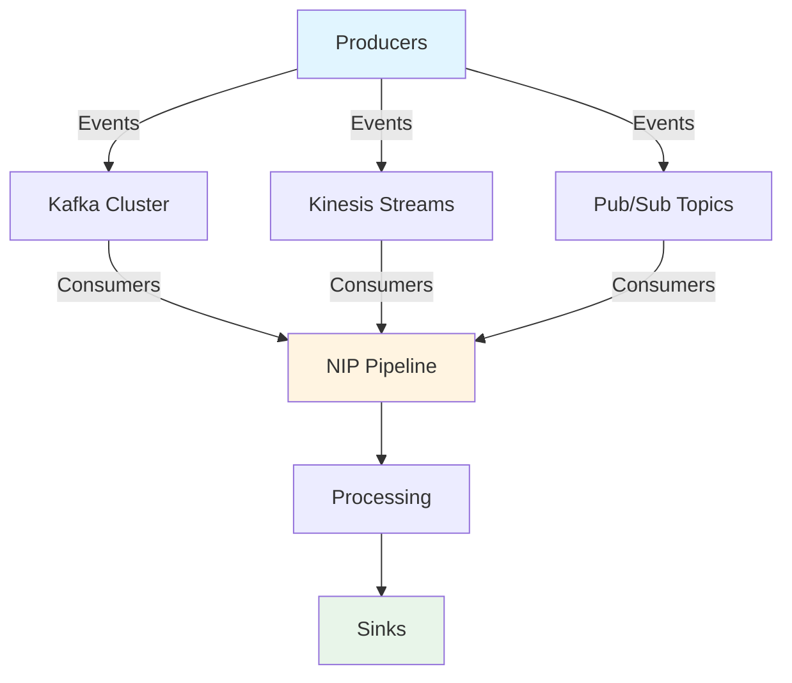

# 🌊 Tutorial 07: Real-Time Streaming with NIP v3.0.0

> **Advanced Tutorial** - Build event-driven, streaming architectures with NIP

## 📚 Table of Contents

- [Introduction](#introduction)
- [Streaming Architectures](#streaming-architectures)
- [Event-Driven NIP](#event-driven-nip)
- [Real-Time Processing](#real-time-processing)
- [Backpressure Handling](#backpressure-handling)
- [Stream Processing](#stream-processing)
- [Window Operations](#window-operations)
- [Exactly-Once Semantics](#exactly-once-semantics)
- [Monitoring Streaming Pipelines](#monitoring-streaming-pipelines)
- [Practical Exercises](#practical-exercises)
- [Best Practices](#best-practices)

---

## Introduction

Real-time streaming enables processing data as it arrives, rather than in batches. This tutorial covers building event-driven streaming pipelines with NIP v3.0.0, handling backpressure, implementing window operations, and ensuring exactly-once semantics.

### Learning Objectives

- Understand streaming architectures (Kafka, Kinesis, Pub/Sub)
- Build event-driven NIP pipelines
- Implement real-time processing patterns
- Handle backpressure effectively
- Apply window operations for stream aggregation
- Ensure exactly-once processing guarantees
- Monitor and debug streaming pipelines

### Prerequisites

- Completed Tutorials 01-06
- Understanding of NIP basics
- Familiarity with async/await patterns
- Basic knowledge of message queues

---

## Streaming Architectures

### Overview

Streaming architectures enable continuous data flow from producers to consumers with low latency. Common platforms include:

#### Apache Kafka
- Distributed event streaming platform
- High throughput, low latency
- Durable log storage
- Partition-based parallelism

#### AWS Kinesis
- Fully managed streaming service
- Auto-scaling shards
- Integration with AWS ecosystem
- 24-hour data retention (configurable)

#### Google Pub/Sub
- Globally distributed messaging
- Push and pull delivery
- Built-in retry mechanisms
- Integration with GCP services

### Architecture Comparison



### Setting Up Kafka Locally

```python
# docker-compose.yml for local Kafka
version: '3'
services:
  zookeeper:
    image: confluentinc/cp-zookeeper:7.4.0
    environment:
      ZOOKEEPER_CLIENT_PORT: 2181
    ports:
      - "2181:2181"

  kafka:
    image: confluentinc/cp-kafka:7.4.0
    depends_on:
      - zookeeper
    ports:
      - "9092:9092"
    environment:
      KAFKA_BROKER_ID: 1
      KAFKA_ZOOKEEPER_CONNECT: zookeeper:2181
      KAFKA_ADVERTISED_LISTENERS: PLAINTEXT://localhost:9092
      KAFKA_OFFSETS_TOPIC_REPLICATION_FACTOR: 1
```

```bash
# Start Kafka
docker-compose up -d

# Create a topic
docker exec -it kafka kafka-topics --create \
  --topic nip-events \
  --bootstrap-server localhost:9092 \
  --partitions 3 \
  --replication-factor 1
```

---

## Event-Driven NIP

### Basic Event Consumer

Create a Kafka consumer with NIP:

```python
from nip import Pipeline, Consumer, Producer
from nip.streaming import KafkaSource, KafkaSink
from nip.events import Event
import asyncio
import json
from dataclasses import dataclass
from datetime import datetime

@dataclass
class UserEvent(Event):
    user_id: str
    event_type: str
    timestamp: datetime
    properties: dict

# Create streaming pipeline
pipeline = Pipeline(name="user_events_streaming")

# Kafka source configuration
kafka_source = KafkaSource(
    bootstrap_servers="localhost:9092",
    topic="user-events",
    group_id="nip-consumer-group",
    auto_offset_reset="latest"
)

# Consumer processor
@pipeline.consumer(source=kafka_source)
async def process_user_event(event: UserEvent) -> UserEvent:
    """Process incoming user events"""
    print(f"Processing {event.event_type} for user {event.user_id}")
    
    # Enrich event
    event.properties['processed_at'] = datetime.now().isoformat()
    event.properties['processing_node'] = 'nip-worker-1'
    
    return event

# Kafka sink configuration
kafka_sink = KafkaSink(
    bootstrap_servers="localhost:9092",
    topic="processed-events"
)

# Producer
@pipeline.producer(sink=kafka_sink)
async def emit_processed_event(event: UserEvent) -> None:
    """Emit processed events to downstream topic"""
    await kafka_sink.emit(event)

# Run pipeline
async def main():
    await pipeline.start()
    print("Event-driven NIP pipeline started")
    
    # Keep running
    try:
        await asyncio.Event().wait()
    except KeyboardInterrupt:
        await pipeline.stop()

if __name__ == "__main__":
    asyncio.run(main())
```

### Multi-Stream Processing

Process multiple event streams simultaneously:

```python
from nip.streaming import MultiStreamProcessor
from typing import Dict, List

# Define multiple sources
sources = {
    'user_events': KafkaSource(
        bootstrap_servers="localhost:9092",
        topic="user-events",
        group_id="multi-consumer"
    ),
    'system_events': KafkaSource(
        bootstrap_servers="localhost:9092",
        topic="system-events",
        group_id="multi-consumer"
    ),
    'metrics': KafkaSource(
        bootstrap_servers="localhost:9092",
        topic="metrics",
        group_id="multi-consumer"
    )
}

# Multi-stream processor
processor = MultiStreamProcessor(name="multi_stream_processor")

@processor.handler(stream='user_events')
async def handle_user_event(event: UserEvent):
    """Handle user events"""
    print(f"User event: {event.event_type}")
    # User-specific logic
    return event

@processor.handler(stream='system_events')
async def handle_system_event(event: Event):
    """Handle system events"""
    print(f"System event: {event.type}")
    # System-specific logic
    return event

@processor.handler(stream='metrics')
async def handle_metrics(event: Event):
    """Handle metrics"""
    print(f"Metric: {event.data}")
    # Metrics processing
    return event

# Aggregation across streams
@processor.aggregator(sources=['user_events', 'system_events'])
async def aggregate_events(events: Dict[str, List[Event]]) -> dict:
    """Aggregate events from multiple streams"""
    user_count = len(events.get('user_events', []))
    system_count = len(events.get('system_events', []))
    
    return {
        'timestamp': datetime.now().isoformat(),
        'user_events': user_count,
        'system_events': system_count,
        'total': user_count + system_count
    }

async def main():
    await processor.start(sources)
    print("Multi-stream processor started")
    
    try:
        await asyncio.Event().wait()
    except KeyboardInterrupt:
        await processor.stop()

if __name__ == "__main__":
    asyncio.run(main())
```

---

## Real-Time Processing

### Stream Processing Patterns

#### Pattern 1: Filter and Transform

```python
from nip.streaming import StreamProcessor

processor = StreamProcessor(name="filter_transform")

@processor.filter
def is_high_priority(event: UserEvent) -> bool:
    """Filter high-priority events"""
    return event.properties.get('priority', 0) >= 5

@processor.transform
def enrich_event(event: UserEvent) -> UserEvent:
    """Transform and enrich event"""
    event.properties['enriched'] = True
    event.properties['enriched_at'] = datetime.now().isoformat()
    return event

@processor.sink
async def save_to_database(event: UserEvent):
    """Save processed event"""
    print(f"Saving: {event.event_type}")
    # Database save logic

async def main():
    await processor.start(source=kafka_source)
    try:
        await asyncio.Event().wait()
    except KeyboardInterrupt:
        await processor.stop()
```

#### Pattern 2: Split and Route

```python
from nip.streaming import StreamRouter

router = StreamRouter(name="event_router")

@router.route(condition=lambda e: e.event_type == 'purchase')
async def handle_purchase(event: UserEvent):
    """Handle purchase events"""
    print(f"Processing purchase: {event.user_id}")
    # Purchase-specific logic

@router.route(condition=lambda e: e.event_type == 'signup')
async def handle_signup(event: UserEvent):
    """Handle signup events"""
    print(f"Processing signup: {event.user_id}")
    # Signup-specific logic

@router.default
async def handle_default(event: UserEvent):
    """Handle all other events"""
    print(f"Processing generic event: {event.event_type}")
    # Generic logic
```

#### Pattern 3: Join Streams

```python
from nip.streaming import StreamJoiner

# Join user events with user profile data
joiner = StreamJoiner(
    name="user_profile_joiner",
    join_key="user_id",
    merge_strategy="latest"  # or "all", "window"
)

@joiner.left_stream(source=KafkaSource(
    bootstrap_servers="localhost:9092",
    topic="user-events",
    group_id="joiner-left"
))

@joiner.right_stream(source=KafkaSource(
    bootstrap_servers="localhost:9092",
    topic="user-profiles",
    group_id="joiner-right"
))

@joiner.handler
async def handle_joined_event(left: UserEvent, right: dict) -> dict:
    """Handle joined event with profile data"""
    return {
        'event': left.__dict__,
        'profile': right,
        'joined_at': datetime.now().isoformat()
    }

async def main():
    await joiner.start()
    try:
        await asyncio.Event().wait()
    except KeyboardInterrupt:
        await joiner.stop()
```

---

## Backpressure Handling

### Understanding Backpressure

Backpressure occurs when producers generate data faster than consumers can process it. Without proper handling, this leads to:
- Memory exhaustion
- Increased latency
- System crashes

### Backpressure Strategies

```python
from nip.streaming import BackpressureStrategy
from nip.streaming.throttling import (
    RateLimiter,
    BufferManager,
    DynamicThrottler
)

# Strategy 1: Rate Limiting
rate_limiter = RateLimiter(
    max_rate=1000,  # events per second
    burst_size=100
)

@rate_limiter.throttle
async def process_event(event: Event):
    """Process with rate limiting"""
    # Processing logic
    pass

# Strategy 2: Bounded Buffer
buffer_manager = BufferManager(
    max_size=10000,
    overflow_strategy='drop_oldest'  # or 'drop_newest', 'block'
)

processor = StreamProcessor(
    name="buffered_processor",
    buffer_manager=buffer_manager
)

# Strategy 3: Dynamic Throttling
dynamic_throttler = DynamicThrottler(
    initial_rate=100,
    max_rate=1000,
    min_rate=10,
    adjustment_factor=1.1,  # 10% adjustment
    metric='processing_time'  # or 'queue_size', 'memory_usage'
)

@dynamic_throttler.throttle
async def process_with_dynamic_throttle(event: Event):
    """Process with dynamic rate adjustment"""
    start_time = time.time()
    
    # Process event
    result = await process_event(event)
    
    # Record processing time
    processing_time = time.time() - start_time
    dynamic_throttler.record_metric(processing_time)
    
    return result
```

### Implementing Backpressure in NIP

```python
from nip.streaming import BufferedPipeline

pipeline = BufferedPipeline(
    name="backpressure_pipeline",
    buffer_size=5000,
    backpressure_strategy=BackpressureStrategy.DROP_OLDEST,
    alert_threshold=4000  # Alert when buffer is 80% full
)

@pipeline.consumer(source=kafka_source)
async def process_with_backpressure(event: Event):
    """Process with automatic backpressure handling"""
    try:
        # Process event
        result = await expensive_operation(event)
        return result
    except Exception as e:
        print(f"Error processing event: {e}")
        # Error handling
        return None

@pipeline.alert_handler
async def handle_buffer_alert(level: float):
    """Handle backpressure alerts"""
    if level > 0.9:
        print(f"CRITICAL: Buffer at {level*100}% capacity")
        # Trigger scaling or alerting
    elif level > 0.7:
        print(f"WARNING: Buffer at {level*100}% capacity")
        # Log warning

async def main():
    await pipeline.start()
    
    # Monitor backpressure
    while True:
        stats = await pipeline.get_buffer_stats()
        print(f"Buffer: {stats['size']}/{stats['capacity']} "
              f"({stats['utilization']*100:.1f}%)")
        
        await asyncio.sleep(5)

if __name__ == "__main__":
    asyncio.run(main())
```

---

## Stream Processing

### Stateful Stream Processing

```python
from nip.streaming import StatefulProcessor
from typing import Dict

# Stateful aggregation
processor = StatefulProcessor(
    name="aggregation_processor",
    state_store="redis",  # or "memory", "cassandra"
    state_ttl=3600  # 1 hour
)

@processor.aggregate(key_func=lambda e: e.user_id)
async def aggregate_user_events(
    user_id: str,
    events: list[UserEvent],
    state: dict
) -> dict:
    """Aggregate events per user"""
    # Calculate aggregates
    event_count = len(events)
    event_types = [e.event_type for e in events]
    
    # Update state
    state['last_seen'] = datetime.now().isoformat()
    state['total_events'] = state.get('total_events', 0) + event_count
    state['event_types'] = list(set(
        state.get('event_types', []) + event_types
    ))
    
    return {
        'user_id': user_id,
        'recent_events': event_count,
        'total_events': state['total_events'],
        'event_types': state['event_types'],
        'last_seen': state['last_seen']
    }

# Stateful sessionization
@processor.sessionize(
    session_timeout=1800,  # 30 minutes
    key_func=lambda e: e.user_id
)
async def process_session(
    user_id: str,
    session_events: list[UserEvent],
    session_id: str
) -> dict:
    """Process user sessions"""
    session_start = min(e.timestamp for e in session_events)
    session_end = max(e.timestamp for e in session_events)
    duration = (session_end - session_start).total_seconds()
    
    return {
        'session_id': session_id,
        'user_id': user_id,
        'start_time': session_start.isoformat(),
        'end_time': session_end.isoformat(),
        'duration_seconds': duration,
        'event_count': len(session_events),
        'event_types': list(set(e.event_type for e in session_events))
    }
```

### Complex Event Processing (CEP)

```python
from nip.streaming.cep import PatternDetector

# Define event patterns
detector = PatternDetector(name="pattern_detector")

# Pattern: Failed login attempts
@detector.pattern(name="failed_login_sequence")
def failed_login_pattern():
    """Detect multiple failed logins followed by success"""
    return (
        PatternDetector.match(
            event_type='login_attempt',
            condition=lambda e: e.properties.get('success') is False
        ) &
        PatternDetector.repeat(
            times=3,
            within_seconds=300  # 5 minutes
        ) &
        PatternDetector.match(
            event_type='login_attempt',
            condition=lambda e: e.properties.get('success') is True
        )
    )

# Pattern: Shopping cart abandonment
@detector.pattern(name="cart_abandonment")
def cart_abandonment_pattern():
    """Detect abandoned shopping carts"""
    return (
        PatternDetector.match(event_type='add_to_cart') &
        PatternDetector.match(event_type='view_checkout') &
        PatternDetector.not_followed_by(
            event_type='purchase',
            within_seconds=3600  # 1 hour
        )
    )

# Pattern handler
@detector.handler(pattern='failed_login_sequence')
async def handle_failed_login_sequence(events: list[Event]):
    """Handle detected failed login sequence"""
    user_id = events[0].user_id
    print(f"ALERT: Multiple failed logins for user {user_id}")
    
    # Trigger security response
    await send_security_alert(
        user_id=user_id,
        attempts=len(events),
        events=events
    )
```

---

## Window Operations

### Window Types

```python
from nip.streaming.windows import (
    TumblingWindow,
    SlidingWindow,
    SessionWindow,
    GlobalWindow
)

# Tumbling Window (fixed-size, non-overlapping)
tumbling = TumblingWindow(
    size_seconds=60,  # 1 minute
    emit_early=False
)

@tumbling.process(key_func=lambda e: e.user_id)
async def tumbling_aggregate(
    user_id: str,
    window_events: list[Event]
) -> dict:
    """Aggregate events in 1-minute tumbling windows"""
    return {
        'user_id': user_id,
        'window_start': window_events[0].timestamp,
        'event_count': len(window_events),
        'window_type': 'tumbling'
    }

# Sliding Window (fixed-size, overlapping)
sliding = SlidingWindow(
    size_seconds=300,  # 5 minutes
    slide_seconds=60,  # Advance every 1 minute
    emit_early=False
)

@sliding.process(key_func=lambda e: e.user_id)
async def sliding_aggregate(
    user_id: str,
    window_events: list[Event]
) -> dict:
    """Aggregate events in sliding windows"""
    return {
        'user_id': user_id,
        'window_size': '5min',
        'slide_interval': '1min',
        'event_count': len(window_events),
        'unique_event_types': len(set(e.event_type for e in window_events))
    }

# Session Window (dynamic based on activity gaps)
session = SessionWindow(
    gap_seconds=1800  # 30 minutes of inactivity closes session
)

@session.process(key_func=lambda e: e.user_id)
async def session_aggregate(
    user_id: str,
    session_events: list[Event],
    session_metadata: dict
) -> dict:
    """Aggregate events in activity sessions"""
    start_time = min(e.timestamp for e in session_events)
    end_time = max(e.timestamp for e in session_events)
    
    return {
        'user_id': user_id,
        'session_id': session_metadata['session_id'],
        'duration_seconds': (end_time - start_time).total_seconds(),
        'event_count': len(session_events),
        'session_start': start_time.isoformat(),
        'session_end': end_time.isoformat()
    }
```

### Window Aggregations

```python
from nip.streaming.windows import WindowAggregator

# Multiple aggregations
aggregator = WindowAggregator(
    window=TumblingWindow(size_seconds=60),
    key_func=lambda e: e.user_id
)

@aggregator.aggregate(name='count')
def count_events(events: list[Event]) -> int:
    """Count events in window"""
    return len(events)

@aggregator.aggregate(name='sum')
def sum_revenue(events: list[Event]) -> float:
    """Sum revenue from purchase events"""
    purchases = [e for e in events if e.event_type == 'purchase']
    return sum(e.properties.get('amount', 0) for e in purchases)

@aggregator.aggregate(name='avg')
def avg_session_duration(events: list[Event]) -> float:
    """Average session duration"""
    durations = [
        e.properties.get('duration', 0) 
        for e in events 
        if 'duration' in e.properties
    ]
    return sum(durations) / len(durations) if durations else 0

@aggregator.aggregate(name='unique')
def count_unique_users(events: list[Event]) -> int:
    """Count unique users"""
    return len(set(e.user_id for e in events))

@aggregator.aggregate(name='top_n')
def top_event_types(events: list[Event], n: int = 5) -> list:
    """Top N event types"""
    from collections import Counter
    types = [e.event_type for e in events]
    return Counter(types).most_common(n)

# Combined result
@aggregator.combined
async def emit_window_aggregates(
    key: str,
    window_start: datetime,
    window_end: datetime,
    aggregates: dict
) -> dict:
    """Emit combined window aggregates"""
    return {
        'user_id': key,
        'window_start': window_start.isoformat(),
        'window_end': window_end.isoformat(),
        'count': aggregates['count'],
        'revenue': aggregates['sum'],
        'avg_duration': aggregates['avg'],
        'unique_users': aggregates['unique'],
        'top_events': aggregates['top_n']
    }

async def main():
    await aggregator.start(source=kafka_source)
    
    try:
        await asyncio.Event().wait()
    except KeyboardInterrupt:
        await aggregator.stop()
```

---

## Exactly-Once Semantics

### Understanding Processing Guarantees

- **At-most-once**: Events may be lost but never duplicated
- **At-least-once**: Events may be duplicated but never lost
- **Exactly-once**: Each event processed exactly once (ideal but complex)

### Implementing Exactly-Once with NIP

```python
from nip.streaming.guarantees import (
    IdempotentProcessor,
    TransactionalProcessor
)
from nip.streaming.checkpointing import CheckpointManager

# Strategy 1: Idempotent Operations
processor = IdempotentProcessor(
    name="idempotent_processor",
    id_key="event_id"  # Unique identifier for deduplication
)

@processor.idempotent_operation
async def save_to_database(event: Event):
    """Idempotent database write"""
    # Use UPSERT or check existence
    await db.execute("""
        INSERT INTO events (id, data, updated_at)
        VALUES ($1, $2, NOW())
        ON CONFLICT (id) DO UPDATE
        SET data = EXCLUDED.data, updated_at = NOW()
    """, event.id, json.dumps(event.__dict__))

# Strategy 2: Checkpointing
checkpoint_manager = CheckpointManager(
    storage="redis",  # or "postgres", "cassandra"
    checkpoint_interval=1000,  # Checkpoint every 1000 events
    checkpoint_timeout=30  # Seconds
)

@checkpoint_manager.checkpointed
async def process_with_checkpoint(event: Event):
    """Process with checkpoint tracking"""
    result = await expensive_processing(event)
    return result

# Strategy 3: Transactional Processing
transactional_processor = TransactionalProcessor(
    name="transactional_processor",
    sources=[kafka_source],
    sinks=[kafka_sink, database_sink],
    isolation_level="read_committed"
)

@transactional_processor.transactional
async def process_transactional(event: Event):
    """Process event transactionally"""
    async with transactional_processor.transaction() as tx:
        # All operations in this block are atomic
        
        # Process event
        result = await process_event(event)
        
        # Write to database
        await tx.database.execute(
            "INSERT INTO results VALUES ($1, $2)",
            event.id, result
        )
        
        # Emit to output topic
        await tx.kafka.emit(result)
        
        # Commit transaction (all or nothing)
        await tx.commit()

# Strategy 4: Event Sourcing
from nip.streaming.sourcing import EventStore

event_store = EventStore(
    storage="postgres",
    aggregate_name="user_session"
)

@event_store.replay
async def rebuild_session_state(
    user_id: str,
    from_version: int = 0
) -> dict:
    """Rebuild state from event log"""
    events = await event_store.get_events(
        aggregate_id=user_id,
        from_version=from_version
    )
    
    state = {'user_id': user_id, 'events': []}
    for event in events:
        state = apply_event(state, event)
    
    return state

def apply_event(state: dict, event: Event) -> dict:
    """Apply event to state"""
    state['events'].append(event.__dict__)
    # Additional state mutations
    return state
```

---

## Monitoring Streaming Pipelines

### Metrics Collection

```python
from nip.streaming.monitoring import (
    MetricsCollector,
    PipelineMonitor,
    AlertManager
)

# Collect pipeline metrics
collector = MetricsCollector(
    name="pipeline_metrics",
    export_interval=10,  # Seconds
    exporters=["prometheus", "statsd"]
)

# Custom metrics
@collector.counter("events_processed")
async def count_events(event: Event):
    """Count processed events"""
    return 1

@collector.gauge("processing_latency_ms")
async def measure_latency(event: Event) -> float:
    """Measure processing latency"""
    event_time = event.timestamp
    now = datetime.now()
    latency_ms = (now - event_time).total_seconds() * 1000
    return latency_ms

@collector.histogram("event_size_bytes")
async def measure_event_size(event: Event) -> int:
    """Measure event size"""
    return len(json.dumps(event.__dict__))

@collector.timer("processing_time")
async def time_processing(event: Event):
    """Time processing operation"""
    start = time.time()
    await process_event(event)
    elapsed = time.time() - start
    return elapsed

# Pipeline health monitoring
monitor = PipelineMonitor(
    name="pipeline_monitor",
    check_interval=30  # Seconds
)

@monitor.health_check
async def check_consumer_lag() -> bool:
    """Check consumer lag"""
    lag = await kafka_source.get_consumer_lag()
    return lag < 1000  # Alert if lag > 1000

@monitor.health_check
async def check_error_rate() -> bool:
    """Check error rate"""
    stats = await collector.get_statistics()
    error_rate = stats.get('error_rate', 0)
    return error_rate < 0.01  # Alert if error rate > 1%

@monitor.health_check
async def check_buffer_utilization() -> bool:
    """Check buffer utilization"""
    util = await pipeline.get_buffer_utilization()
    return util < 0.8  # Alert if buffer > 80% full

# Alert management
alert_manager = AlertManager(
    name="streaming_alerts",
    channels=["slack", "email", "pagerduty"]
)

@alert_manager.alert(
    condition=check_consumer_lag,
    severity="warning",
    message="Consumer lag exceeded threshold"
)
async def alert_on_lag():
    """Alert on high consumer lag"""
    pass

@alert_manager.alert(
    condition=check_error_rate,
    severity="critical",
    message="Error rate exceeded threshold"
)
async def alert_on_errors():
    """Alert on high error rate"""
    pass

# Dashboard integration
@monitor.dashboard(title="Streaming Pipeline Metrics")
async def dashboard_metrics():
    """Generate dashboard metrics"""
    stats = await collector.get_statistics()
    health = await monitor.get_health_status()
    
    return {
        'throughput': stats['events_per_second'],
        'latency_p50': stats['latency_ms']['p50'],
        'latency_p99': stats['latency_ms']['p99'],
        'error_rate': stats['error_rate'],
        'consumer_lag': health['consumer_lag'],
        'buffer_utilization': health['buffer_utilization'],
        'status': health['overall']
    }

async def main():
    # Start all monitoring components
    await asyncio.gather(
        collector.start(),
        monitor.start(),
        alert_manager.start()
    )
    
    print("Monitoring started")
    
    try:
        await asyncio.Event().wait()
    except KeyboardInterrupt:
        await asyncio.gather(
            collector.stop(),
            monitor.stop(),
            alert_manager.stop()
        )
```

### Distributed Tracing

```python
from nip.streaming.tracing import TracingManager

tracing = TracingManager(
    service_name="nip-streaming-pipeline",
    sampler_type="probabilistic",
    sampler_rate=0.1  # Trace 10% of events
)

@tracing.trace(span_name="process_event")
async def traced_process(event: Event):
    """Process event with distributed tracing"""
    
    # Create child span for specific operation
    with tracing.span("validate_event"):
        await validate_event(event)
    
    with tracing.span("enrich_event"):
        enriched = await enrich_event(event)
    
    with tracing.span("persist_event"):
        await persist_event(enriched)
    
    return enriched

# Trace propagation across services
@tracing.propagate
async def emit_traced(event: Event):
    """Emit event with trace context"""
    # Trace headers automatically added to event metadata
    await kafka_sink.emit(event)
```

---

## Practical Exercises

### Exercise 1: Build a Real-Time Analytics Pipeline

**Objective**: Create a pipeline that processes user events and produces real-time analytics.

**Requirements**:
1. Consume events from Kafka topic `user-events`
2. Filter out bot traffic (user_id starts with 'bot_')
3. Aggregate metrics per user in 5-minute windows
4. Calculate: event count, unique event types, total value
5. Emit results to `analytics-output` topic
6. Implement backpressure handling
7. Add monitoring for latency and throughput

**Starter Code**:

```python
from nip import Pipeline
from nip.streaming import KafkaSource, KafkaSink
from nip.streaming.windows import TumblingWindow
import asyncio

# TODO: Implement the pipeline
pipeline = Pipeline(name="analytics_pipeline")

# Your implementation here

if __name__ == "__main__":
    asyncio.run(main())
```

**Expected Output**:
```json
{
  "user_id": "user123",
  "window_start": "2026-01-17T17:00:00Z",
  "window_end": "2026-01-17T17:05:00Z",
  "event_count": 47,
  "unique_event_types": 8,
  "total_value": 1250.00
}
```

### Exercise 2: Implement Sessionization with Timeout

**Objective**: Create a sessionization processor that groups events into user sessions.

**Requirements**:
1. Session timeout: 30 minutes of inactivity
2. For each session, calculate:
   - Session duration
   - Event count
   - First and last event type
   - User journey (sequence of event types)
3. Emit session events when sessions close
4. Handle late-arriving events (events within 5 minutes of session close)
5. Implement exactly-once semantics

### Exercise 3: Build a Fraud Detection System

**Objective**: Create real-time fraud detection using pattern matching.

**Requirements**:
1. Detect these fraud patterns:
   - 3+ failed payment attempts in 5 minutes
   - Payments from 3+ different countries in 1 hour
   - Unusual spending spike (>10x average)
2. Alert on detected patterns
3. Store alerts in database
4. Implement alert throttling (max 1 alert per user per hour)
5. Add monitoring for false positive rate

---

## Best Practices

### 1. Stream Design

**DO**:
- Design events to be immutable and idempotent
- Include unique identifiers for deduplication
- Use schema validation (JSON Schema, Avro, Protobuf)
- Keep events small and focused
- Use event versioning

**DON'T**:
- Include sensitive data in event payloads
- Create tightly coupled event schemas
- Ignore event ordering requirements
- Forget about backward compatibility

### 2. Backpressure Management

**DO**:
- Monitor queue depths and processing times
- Implement rate limiting at multiple levels
- Use bounded buffers with overflow strategies
- Scale consumers based on load
- Alert on backpressure conditions

**DON'T**:
- Assume infinite buffer capacity
- Ignore memory constraints
- Drop events without logging
- Let backpressure cascade upstream

### 3. Window Operations

**DO**:
- Choose appropriate window types for use cases
- Handle late-arriving events (watermarks)
- Consider time zones and clock skew
- Monitor window processing lag
- Test window edge cases

**DON'T**:
- Use large windows without considering memory
- Forget about event time vs processing time
- Ignore window boundary conditions
- Overuse sliding windows (resource intensive)

### 4. Exactly-Once Processing

**DO**:
- Use idempotent operations where possible
- Implement proper checkpointing
- Test failure scenarios
- Monitor processing guarantees
- Use transactions when available

**DON'T**:
- Assume at-least-once is sufficient
- Forget about downstream idempotency
- Ignore offset management
- Skip failure testing

### 5. Monitoring and Observability

**DO**:
- Monitor end-to-end latency
- Track consumer lag
- Alert on anomalies
- Use distributed tracing
- Log important events
- Create dashboards

**DON'T**:
- Only monitor throughput
- Ignore error rates
- Forget about resource utilization
- Skip alert testing

### 6. Performance Optimization

**DO**:
- Batch operations when possible
- Use connection pooling
- Optimize serialization
- Profile hot paths
- Consider asynchronous processing
- Cache frequently accessed data

**DON'T**:
- Prematurely optimize
- Ignore serialization overhead
- Create unnecessary copies
- Block event loops
- Forget about backpressure

### 7. Testing

**DO**:
- Write unit tests for processors
- Test with realistic data volumes
- Simulate failures
- Test backpressure handling
- Validate exactly-once semantics
- Use integration tests

**DON'T**:
- Only test with small datasets
- Skip failure scenarios
- Ignore performance testing
- Forget about chaos testing

---

## Summary

This tutorial covered building real-time streaming pipelines with NIP v3.0.0:

✅ **Streaming Architectures**: Kafka, Kinesis, Pub/Sub
✅ **Event-Driven NIP**: Multi-stream processing, joining, routing
✅ **Real-Time Processing**: Filter, transform, split patterns
✅ **Backpressure Handling**: Rate limiting, buffering, dynamic throttling
✅ **Stream Processing**: Stateful processing, CEP patterns
✅ **Window Operations**: Tumbling, sliding, session windows
✅ **Exactly-Once Semantics**: Idempotency, checkpointing, transactions
✅ **Monitoring**: Metrics, health checks, distributed tracing

### Next Steps

- Complete the practical exercises
- Explore advanced patterns in Tutorial 08
- Review production deployment guide
- Join the NIP community

### Additional Resources

- [Apache Kafka Documentation](https://kafka.apache.org/documentation/)
- [Stream Processing Patterns](https://www.oreilly.com/library/view/stream-processing-with/9781491983847/)
- [NIP Streaming API Reference](https://noodle.ai/docs/streaming)
- [Monitoring Best Practices](https://www.prometheus.io/docs/practices/)

---

**Tutorial Complete!** 🎉

You've learned how to build production-ready streaming pipelines with NIP. Ready to handle real-time data at scale?
